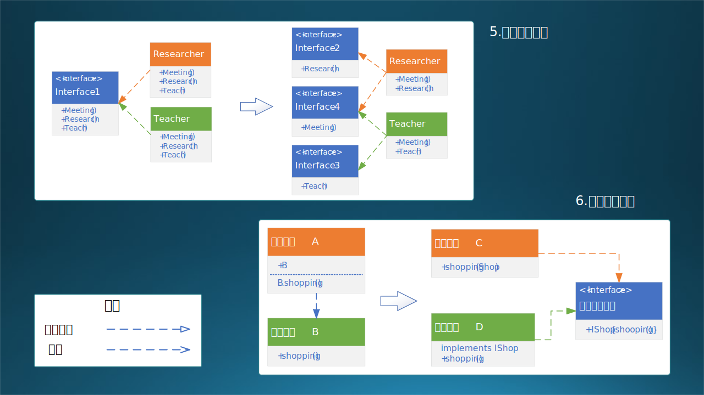

## 14.2 设计原则与实例

### 14.2.1 七大设计原则

本节的内容是软件领域著名的七大设计原则$^{[2]}$，是原有的 SOLID 法则再加上合成复用原则形成的。表 14-1 是对这七个原则的概览。

表 14-1 七大设计原则概览
|序号|原则|说明|目的|场合|级别|
|-|-|-|-|-|-|-|
|1|单一职责原则|一个类只提供一组类似的功能|高内聚|设计一个新类|类内|
|2|开放封闭原则|扩展新功能时，不修改原有的代码|可扩展|扩展一个旧类|类扩展|
|3|里氏替换原则|继承要合规，不要重写父类的方法|安全|继承已有的类|父子类间|
|4|最少知识原则|只与关系密切的类通信，不越界|低耦合|设计对象调用|兄弟类间|
|5|接口隔离原则|接口只提供充分必要的功能定义|高内聚|设计接口方法|类间接口|
|6|依赖倒置原则|针对接口编程，不要对实现编程|低耦合|设计层间调用|层间接口|
|7|合成复用原则|复用时先考虑组合/聚合，再考虑继承|低耦合|重用已有功能|模块复用|

不熟悉这七个原则的读者可以先忽略这张表，先看下面的细节，弄明白每个原则的细节后回过头来再看此表。和大多数读者一样，笔者最初也认为它们的顺序纯粹是因为它们的首字母恰巧可以组合成 SOLID 这个单词而排列的。但经过一番研究后，发现它们描述的场合与级别“恰巧”是按照软设计中从小到大的规模来排序的，如表 14-1 的最后两列所示。

注意这七大设计原则和常说的二十三种设计模式$^{[3]}$是有区别的，前者是原则，后者是具体实践，在实现阶段使用。

#### 1. 单一职责原则

SRP - Single Responsibility Principle。罗伯特·马丁于 2003 年在《敏捷软件开发：原则、模式和实践》一书中提出的。

- 原始定义
  单一职责原则规定一个类应该有且仅有一个引起它变化的原因，否则类应该被拆分。

- 核心思想
  一个类只负责一项职责。设计简单，控制类的粒度大小，将对象解耦，提高其内聚性。

- 实现方法
  发现类的不同职责并将其分离，再封装到不同的类或模块中。而发现类的多重职责需要设计人员具有较强的分析设计能力和相关的重构经验。比如，“奔跑”和“飞翔”，一个是哺乳动物的行为，一个是鸟类的行为，当然要分到两个类中。但是后来发现，像鹤类这种大型鸟类，飞翔之前要靠奔跑来助理，而鸵鸟只会奔跑，不会飞翔。

- 设计举例
  智能手机在工业界是一个非常成功的例子，小巧、通用、功能强大。但是在软件界，它却是一个被经常拿出来鞭挞的例子。

  图 14-3 上图，左侧是手机的现状：它除了有基本的内存、硬盘、CPU、屏幕、电池等零件外，还具有一大堆的功能：基本的如充电、上网、电话，音频录制和音乐播放，视频录制和播放、文本阅读、玩游戏，等等。这在软件设计上就违背了单一职责原则。

  但是，手机这种设备本来就不是单一功能的（如照相机、摄影机、录音机等专业）设备，所以也可以说它实现了电话接口、视频接口、声音接口、应用软件接口，而这些接口的职责都是单一的。从软件上来说，就可以设计成图 14-3 上图右侧的模型。


图 14-3 单一职责原则和开放封闭原则的 UML 类图


#### 2. 开放封闭原则

OCP - Open Closed Principle。勃兰特·梅耶在 1988 年的《面向对象软件构造》一书中提出。

- 原始定义
  软件实体应该对扩展开放，对修改关闭。

- 核心思想
  当应用的需求改变时，在不修改软件实体的源代码或者二进制代码的前提下，可以扩展模块的功能，使其满足新的需求。

- 实现方法
  通过接口或抽象类或虚方法为软件实体定义一个相对稳定的抽象层，而将相同的可变因素封装在不同的的具体实现（子）类中。

- 设计举例
  有两个运算符 +,-，现在要新增加乘法，如何不改变原有代码？

如图 14-3 下图所示。其要点为：
- 定义父类 Operator 表示通用运算符。
   其中：
   - 定义两个运算变量 number_A 和 number_B，可供子类使用。
   - 定义一个虚方法 Compute()，实现虚拟运算。
- 定义子类，包括：
   - 加法 AddOperator，在 Compute() 中实现加法。
   - 减法 SubOperator，在 Compute() 中实现减法。
- 定义一个简单工厂类 OperatorFactory，输入运算符类型，调用 createOperator(运算符类型) 方法来创建运算符。
- 新增加一个乘法或者任何其它运算符：
   - 增加 NewOperator 类文件；
   - 实现自己的 Compute() 方法；
   - 在 OperatorFactory 中注册此新运算符，即可完成调用新运算符进行运算的功能。

注意，在 OperatorFactory 中增加对新运算符的识别，并非修改，而是扩展。如此一来，对原有的 Operator 父类和子类可以不做任何修改。

#### 3. 里氏替换原则

LSP - Liskov Subtitution Principle。里斯科夫女士在 1988 年的面向对象技术高峰会议上提出。

- 原始定义
  继承必须确保超类所拥有的性质在子类中仍然成立。

- 核心思想
  不要破坏继承体系。它阐述了有关继承的一些原则，也就是什么时候应该使用继承，什么时候不应该使用继承，以及其中蕴含的原理。是继承复用的基础，它反映了基类与子类之间的关系，是对开闭原则的补充，是对实现抽象化的具体步骤的规范。

- 实现方法
  子类可以扩展父类的功能，但不能改变父类原有的功能。

- 设计举例
  这个原则比较简单，直白地说就是子承父业，父亲会的那些手艺，儿子都会并且不能走样儿。

```java
class A {  // A 是父类
    public int func1(int a, int b) {  // 有一个功能 func1 可以完成加法运算
        return a + b;
    }
}
class B extends A {  // B 继承 A
    public int func1(int a, int b) {  // 改写了父类的 func1，错误！
        return a * b;  // 改为完成乘法运算
    }
    public int func2(int a, int b) {  // 增加了属于子类自己的 func2，正确！
        return a * b;  // 完成乘法运算
    }
}
```
上面的代码中：
- A 类有一个功能 func1，在子类 B 中被修改了，这是错误的做法。
- 正确的做法是子类实现自己的 func2 来扩充功能。当需要多态继承时，父类设置为抽象类（abstract func1），不实现任何功能即可在子类中任意覆盖。

有一个著名的生物学上的例子也经常被软件界拿出来说事儿：鸟儿都会飞，企鹅不会飞，但是企鹅是鸟儿。所以在软件上要把“飞翔”设计为一种能力（接口）而不是行为属性，这样企鹅依然可以继承自鸟儿，但是不实现“飞翔”接口即可。

#### 4. 最少知识原则

LoD - Law of Demeter。伊恩·荷兰于 1987 年美国东北大学的一个名为 Demeter 的研究项目中提出。Demeter 是拉丁语，特指古希腊的德墨忒尔女神，没有其它含义，所以翻译成“迪米特”应该是国内某位学者第一次引入这个名词时的个人意见。

- 原始定义
  只与你的直接朋友交谈，不和陌生人谈话。

- 核心思想
  降低耦合度。迪米特法则要求限制软件实体之间通信的宽度和深度，其目的是降低类之间的耦合度，提高模块的相对独立性。

- 实现方法
  如果两个软件实体无须直接通信，那么就不应当发生直接的相互调用，可以通过第三方转发该调用。

- 设计举例
  在下述代码中，类 A 中的 b1,b2,b3 都是 A 的“朋友”，可以直接通信。但是最后一行有效代码中，b3 通过 c1 调用了 C 的方法 func1，这是违反本原则的，但是可以通过 b3.func2() 来间接实现这一目的。当然，如果把 func1 设置为 private 也可以解决这个问题。
  如果 A 和 C 的关系很密切，可以直接在 A 中定义 C 为属性，这样就可以摆脱 B。这里并没有一个明确的指导方针，需要在实际应用场景中考虑是否这样做。

```java
class C {  // 对象 C
    public void func1() {...}
}
class B { // 对象 B
    C c1 = new C();  // c1 是 B 的属性
    void func2() {
        c1.func1();
    }
}
class A {  // 对象 A
    B b1 = new B();  // b1 是 A 的属性
    void func3(B b2) {...}  // b2 是 A 的 func3 方法的参数
    void func4() {
        B b3 = new B();     // 在 A 的 func4 方法中创建了 b3
        b3.func2();         // 可以通过调用 B 的 func2 来间接到达调用 C 的 func1 的目的
        b3.c1.func1();      // 错误！直接调用 C 的 func1 违反了最少知识原则
    }
}
```

#### 5. 接口隔离原则

Interface Segregation Principle。罗伯特·马丁在 90 年代提出的。

- 原始定义
  - 客户端不应该被迫依赖于它不使用的方法。
  - 一个类对另一个类的依赖应该建立在最小的接口上。

- 核心思想
  接口设计要精简。接口隔离原则是为了约束接口、降低类对接口的依赖性，提高类的内聚性、降低它们之间的耦合性，体现了封装的思想。

- 实现方法
  要为各个类建立它们需要的专用接口，而不要试图去建立一个很庞大的接口供所有依赖它的类去调用，避免接口臃肿。

- 设计举例
  假设大学老师（Professor）有三个职责：教学，科研，开会，于是我们有图 14-4 上图左侧的 Interface 1 接口。
  假设老师 A 只负责教学和开会，而老师 B 只负责科研和开会，但是他们必须都要实现 Interface 1 中的三个接口方法，属于多余的依赖。
  
  如何让老师 A 不必关心科研（research 方法），老师 B 不必关心教学（teach 方法）呢？见图 14-4 上图右侧：设计 3 个分离的接口，Interface 2 只定义 Research 方法，Interface 3 只定义 Meeting 方法，Interface 4 只定义 Teach 方法。如此一来，普通老师可以只管讲课不管科研，而专职研究员可以只管科研不管讲课，不强迫，不依赖。但是显然这是一个理想主义的设计，现在的大学老师两个职责都要履行。
  
  本例中为了说明问题，在 2,3,4 三个接口中，每个接口中只有一个方法，实际上可以有好几个方法，比如：接口 2 中有一个方法（搞科研），接口 3 中有二个方法（教学，当班主任），接口 4 中有三个方法（开会，做报告，带研究生），那么 Researcher 类继承自接口 2,4，将要实现 4 个方法（搞科研，开会，做报告，带研究生）；Teacher 类继承自接口 3,4，将要实现 5 个方法（教学，当班主任，开会，做报告，带研究生）。
  




图 14-4 接口隔离原则和依赖倒置原则的 UML 类图


#### 6. 依赖倒置原则

DIP - Dependence Inversion Principle。罗伯特·马丁 1996 年在 C++ Report 上发表的文章。

- 原始定义
  高层模块不应该依赖底层模块，两者都应该依赖其抽象；抽象不应该依赖细节，细节应该依赖抽象。

- 核心思想
  面向接口编程。在软件设计中，细节具有多变性，而抽象层则相对稳定，因此以抽象为基础搭建起来的架构要比以细节为基础搭建起来的架构要稳定得多。

- 实现方法
  要面向接口编程，不要面向实现编程。降低类间耦合，提高系统稳定性，减少并行开发（高层模块和低层模块）引起的风险。

- 设计举例
  如图 14-4 下图左侧所示：高层模块 A（假设是顾客）依赖底层模块 B（假设是商店），相当于顾客对这个商店产生了强依赖，换个商店买东西都不适应。在软件层面，如果商店的 shopping 方法换成了 online_shopping，则顾客也需要改变代码来调用新的方法，这在软件设计中是个灾难，在现实中也是一种需要适应的行为习惯转变。

  在图 14-4 下图右侧，先定义一个中间接口 IShop，有一个 shopping 方法。在低层模块 D（商店）中实现这个接口中的 shopping 方法，在高层模块 C（顾客）中只要把商店 Shop 带入 shopping 方法中，即可实现在任意商店具有同样的购物体验。在软件层面，只要新商店实现相同的接口，不要任何修改即可购物。既，高层和低层模块都依赖抽象接口。
  
#### 7. 合成复用原则

CRP - Composite Reuse Principle。也叫做聚合组合（Composition/Aggregation）。实际上 Composite 应该翻译成“组合”而不是“合成”。

- 原始定义
  软件复用时，尽量先使用组合/聚合关系来实现，其次才考虑使用继承关系来实现。

- 核心思想
  少认领爸爸，多依靠兄弟。

- 实现方法
  通过将已有的对象纳入新对象中，作为新对象的成员对象来实现的，新对象可以调用已有对象的功能，从而达到复用。

- 设计举例
  我们又要把手机拿出来说事儿了。图 14-3 中，真实情况是，手机并没有实现各个接口，而是把一些现成的元器件拿过来组装在一起，就可以完成各个功能。继承父类或者实现接口，都是一件比较繁重的工作，而把现有的模块拿过来直接调用，是成本低风险小速度快的最好方法。这就是组合复用。

```java
class P {  // 对象 P
    public void func1() {...}
}
class A {  // 对象 A
    P p = new P();  // P 作为成员对象，符合本原则
    void func2() {...}  // 实现自己独有的的方法
}
class B extends P {  // 对象 B 继承自 P，不符合本原则

    void func2() {...}  // 扩展子类独有的方法
}
```
在上述代码中，类 A 直接把 P 作为成员对象，符合本原则；类 B 继承自 P，以扩展方式实现 func2，不符合本原则。

在实际使用中要看具体情况：比如在开放封闭原则中计算符的例子，就应该使用第二种方法（继承）；而在手机的例子中，就应该使用第一种方法（组合），因为手机不是照相机的子类，也不是录音机的子类，而只是包含了照相机和录音机的能力，是一个复合体。

### 14.2.2 详细设计过程与实例

如果没有概要设计，是无法进行详细设计的。有一个特例是，在已有系统的上的修补，比如新增加一个功能模块，由于对这个系统非常熟悉了，但是又找不到该系统的原始的概要设计，此时可以直接给出该新增模块的详细设计。

在本章后续几小节中，我们将会用一个实例来介绍详细设计的各种关注点。由于该系统没有概要设计，所以我们将采用**概要设计+详细设计**的混合方式来介绍。

【最佳实践】根据敏捷原则，尽量减少文档数量，只写必要的。所以笔者推荐：
- 当遇到小型系统时，只写稍微概要（粗略）一些的详细设计，而不写概要设计。所谓粗略，就是不必画类和对象图、每个模块的流程图等等。
- 当遇到中型系统时，只写稍微详细（精细）一些的概要设计，而不写详细设计。所谓精细，就是要写一些架构设计方面的内容，也要有一些主要模块的描述，上下兼顾。
- 遇到大系统时，要写架构设计，目的是进行系统分解，然后对于每个子系统按中型系统对待。
- 总之：**详细设计不是必须写，可以用精细一些的概要设计覆盖；必须要写详细设计时，可以写得简单一些。**

在长期的软件工程实践中，笔者还总结出了一种设计方法，是按照不同阶段的职责划分的。如图 14-5 所示。它与架构设计和概要设计中的标准的六视图法的区别是：

- 它更像 RUP 4+1 视图，只不过变成了 2+2+2。
- 没有单独的数据存储设计任务，而是把它归入到逻辑功能视图中。
- 把产品经理的任务规划在内，分开产品经理和架构师的职责。


图 14-5 按阶段和角色划分的任务

这是按照完整的软件工程的顺序来划分的，不同阶段的任务分配给不同的角色，如：产品经理、架构师、技术专家、开发人员、工程人员。整体分成三个部分：

#### 1. 需求部分

黄色的需求部分，由产品经理和架构师负责。

   - 产品经理负责用户视图（User View）部分。
     - 需求调研和需求分析，需要出《需求分析说明书》文档，俗称 PM Spec。
     - 用上下文图来做系统边界刻画。
     - 用例图来做用户行为归纳，也可以用鲁棒图。
   - 架构师负责应用场景视图（Scenario View）部分。
     - 这部分的内容同样写在《需求分析说明书》中。
     - 数据流图用于分析主要业务的数据的生命周期，用数据来串联起用户的数据处理行为，与用例匹配。也可以用 E-R 图。
     - 然后列出功能列表，既数据处理行为。
     - 根据功能列表进行功能归类，发现共用部分的逻辑功能、数据存储。
     - 最后形成子系统划分。

#### 2. 设计部分

绿色的设计部分，根据系统规模，由架构师或技术专家或开发人员负责。

   - 逻辑功能视图（Logic View）完成逻辑功能设计任务。
     - 需要出架构设计文档，可以是独立的《架构设计说明书》，也可以是《概要设计说明书》中的系统结构部分。在本例中是后者。
     - 系统结构描述的是系统的架构方式，阐明设计理念，使用架构图。
     - 逻辑功能设计中，需要分成层次结构设计和模块划分，使用架构图。
     - 然后做数据设计，以便检查逻辑功能的完备性，并为运行过程设计打基础。

   - 运行过程视图（Process View）完成运行过程设计任务。
     - 运行设计可以用于串联起功能和数据，确定系统在运行时的进程线程，并能发现缺失的功能模块，用架构图。
     - 用空间流程（活动图）和时间流程（顺序图）来描述系统运行的诸多细节。
     - 用状态转移图来描述那些具有复杂状态变化的模块、组件。可选。
     - 最后用协作图来确定来确定模块、组件之间的交互接口，并依靠接口设计确定系统的层次关系。

#### 3. 实现部分

青色的实现部分，由软、硬件工程师负责，注重软件的实现和硬件的部署环节。

   - 软件开发视图（Development View）由开发人员（包括技术专家）负责。
     - 针对第一方的，包括开放语言和框架确定，源代码的组织。
     - 针对第三方的，有中间件选择，外部包的使用等等。
     - 如果甲方需要二次开发，还要设计二次开发的 SDK/API。
   - 物理部署视图（Physical View）由工程师负责，与架构师及技术专家共同协商。
     - 首先要进行硬件选型，根据业务需求确定各种服务器的数量。
     - 其次是网络结构设计，安全性是第一要素。
     - 然后确定操作系统、第三方组件的按照配置。
     - 最后确定软件部分的每个编译出来的可执行程序的具体部署位置。
     - 当然还要给出满足可靠性、可伸缩性的设计。


在后面的章节中，将会按照上述顺序采用概要设计+详细设计的混合设计方式，依次是：

（1）用例分析（14.3）
（2）数据流图（14.4）
（3）功能设计（14.5）
（4）数据设计（14.6）
（5）运行设计（14.7）
（6）状态设计（14.8）
（7）接口设计（14.9）
（8）实现设计（14.10）

最开始的两个小节会复习一下需求分析的内容，以便和后面的系统设计形成完整的上下文。这个实际案例并不复杂，规模偏小，复杂度中等，正好可以用于讲解，而且是现代软件工程中常见的 AI 模型落地的应用。

读者可能会觉得奇怪，为什么一共 8 个步骤，与图 14-5 的 2+2+2 的模式不匹配？可以把上述列表做如下划分：

一、需求部分

（1）用例分析（14.3）
（2）数据流图（14.4）

二、设计部分

（3）功能设计（14.5）
（4）数据设计（14.6）
（5）运行设计（14.7）
（6）状态设计（14.8）
（7）接口设计（14.9）

三、实现部分：

（8）实现设计（14.10）

主要的设计部分包括了 3~7 五个步骤，这也是我们本章的讲解重点。你当然可以把 3,4 合并称为静态逻辑设计，把 5,6,7 合并成为动态运行设计，把 8 拆开成两个小部分叫做开发设计和部署设计，这样就能完全和图 14-5 吻合。只不过设计的力度不同，篇幅也不同，我们没必要搞那种形而上学的东西。
