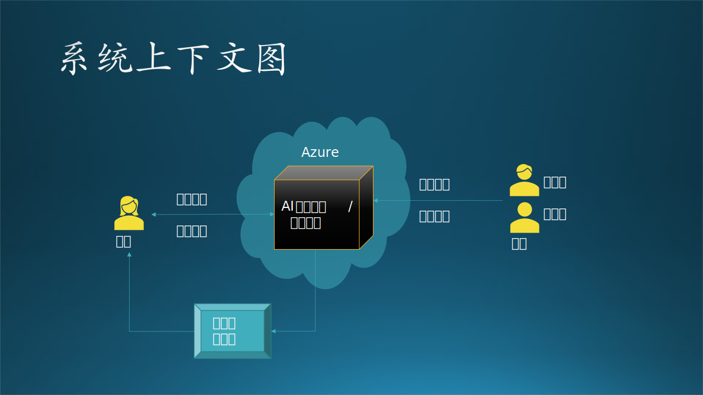

## 14.3 第一步：用例分析

在这一部分中，我们先来复习一下需求分析的基本内容，以便和后面的设计部分无缝连接。我们仍然使用 5.3.2 节中的项目的故事为例，来说明一个完整分析、设计过程。为了方便阅读，我们再重复一下这个故事场景。

另外，请注意下述的过程是按顺序执行的，缺一不可。这有助于开发人员在进行概要设计、详细设计时不会缺失任何一个关键环节。

### 14.3.1 应用场景

这是木头参与的一个真实项目，虽然不怎么大，但是麻雀虽小五脏俱全，服务于客户的系统，无论规模如何，都要全力以赴，谨慎对待。

最初的情况是：

- 某基金客户想使用热门的深度学习来预测 A 股股票行情走向，所以找到了我软请求合作。

- 我软的研究员们深入研究了几个月，根据股票交易历史数据，训练了一系列基于神经网络的深度学习模型。

- 每周一，基金公司都要手工上传上周的交易数据，用微信叫醒熟睡的研究员，研究员去下载交易数据，处理后用模型做预测，然后微信通知基金公司取结果。整个过程基本没有自动化。

- 每过 60 个交易日，基金公司就要求研究员使用最近的历史数据重新训练模型，在历史数据上比较新旧模型的差异，然后切换模型。这个过程也都是手工完成，很繁复。

- 所有模型都是在我软内部的训练平台上训练的，相当于是占用了公司的资源，而非客户端资源。

经过与客户讨论，得到了几条共识，作为需求分析的结果：

- 客户将会在每周一早晨 7:00 上传前一个交易周的股票交易数据。
- 系统会监控客户的上传数据动作，一旦上传结束后，立刻启动预测流程，调用模型库，根据最新交易结果进行预测。
- 得到预测结果后，通过电子邮件通知客户下载。
- 要求在 Azure 上完成存储、处理、预测、输出等一系列过程，然后从 Azure 上下载预测结果。以上过程在 9:00 之前完成，即两个小时之内。
- 要求每 60 个交易日，在 Azure 上用最新数据训练深度神经网络模型，存入模型库中。要求在 48 小时内完成。
- 把上述过程工程化、自动化，省去手工操作的麻烦和误操作。整个系统要求构建在 Azure 平台之上。
- 尽量省钱。因为都是在 Azure 上租赁虚拟机和存储服务。

其中，前三条为功能需求，后四条为肺功能需求，即质量需求或限制条件。

### 14.3.2 系统上下文图

根据应用场景绘制一个系统上下文图，搞清楚系统边界，见图14.3.1。

图 14-6 系统上下文图

从图中可以看到，这是一个独立的 AI 股票训练、推理系统，要求构建在 Azure 上，周边没有任何其它系统交互，只有两种参与者：甲方（客户）、乙方（研究员、工程师）。当然，对于客户来说，分不清研究员和工程师的职责，也没必要知道。

- 甲方（客户）：上传数据文件，下载结果文件。
- 乙方：编写训练代码和预测代码，并控制运行。
- 外部通知系统：因为想避免手工操作，所以股票训练/预测系统结束工作后，应该自动发送通知，渠道可能是电子邮件、短信、微信、自动电话等等。可以后期再确定具体形式。

甲方从股票交易系统中获得原始交易数据，然后手工上传到本系统中。这是一个手工的过程，所以股票交易系统并不是本系统的外部系统。

名词解释：

- 预测（prediction）和推理（inference）是一个概念，都是指在训练完一个机器学习/深度学习模型后，在实际的环境中用真实数据进行正向计算得到分类或拟合结果的过程。

【最佳实践】系统上下文图，是一种结构分析，通常在项目的一开始使用，以确定项目的边界。它表示可能与系统交互的所有外部实体，整个软件系统看起来像一个单一的黑匣子。

### 14.3.3 用例图

用例图主要用来描述角色以及角色与用例之间的连接关系。说明的是谁要使用系统，以及他们使用该系统可以做些什么。一个用例图包含了至少三种元素，有时有四种元素，如表 14-2 所示。

表 14-2 用例图元素

|元素|图例|含义|
|-|-|-|
|参与者（Actor）|一般用人形来表示|人或外部系统|
|用例（Use Case）|用椭圆来表示|表示执行的动作|
|关系（Relationship）|用直线和箭头来表示|表示参与者与用例的关系|
|子系统（subsystem）|方形或其它形状的封闭区域|把若干相关用例组织到一起|

针对三种参与者（甲方、研究员、工程师）绘制用例图。由于此图是给乙方内部看的，所以一定要分清研究员和工程师的职责。见图 14-7。

图 14-7 用例图

根据 14.3.1 节的需求描述，首先把每个参与者（客户、研究员、工程师）的用例图单独画出来，这样可以避免一开始就陷入复杂的逻辑纠缠中。其次，我们还进行了进一步的归类，比如模型管理用例含有 4 个子用例。

读者可能会注意到在需求中并没有模型管理，这是乙方的非功能性需求，在 7.5 节中讲过。因为训练过模型的人都知道，需要很多种参数的组合才能找到一个相对完美的模型，这时如果没有一个模型管理系统，时间长了就会忘记细节，以至于后续不得不浪费时间重复训练模型才能回忆起来。

另外，读者可能还会注意到图 14-7 中的连接线的不同形式，请看表 14-3 中的解释。

表 14-3 四种关系

|关系名称|对象|图例|说明|
|-|-|-|-|
|关联 Association|参与者与 用例之间|实线|参与者使用哪些用例，比如：客户使用“上传文件”和“下载文件”两个用例。|
|泛化 Generalization|参与者之间 或用例之间|实线空心箭头 指向父类|参与者：比如有个实习生帮研究员干活。 用例：比如“训练NN模型”是“模型训练”的一种泛化。|
|包含 Inclusion|用例之间|虚线实心箭头 指向子用例|比如“训练模型”包含“数据处理”、“参数管理”等。|
|扩展 Extension|用例之间|虚线空心箭头 指向父用例|比如“发布模型”时，有可能需要扩展出“修改名称”的用例（未画出）。|

【最佳实践】

用例图是一种静态功能分析，在项目初期使用。

- 刚开始画此用例图时，可以把所有想到的用例（椭圆形）都并列画出，不包含层级关系，比如图 14-7 中，工程师可能就会有 7 个用例；然后根据各个用例的从属关系进一步整理成子用例。
- 各种关系可以在画出完整的用例图后再整理，因为在最开始时实际上分不清泛化和包含的关系的，可以说“模型训练”包含“训练NN模型”和“训练LGB模型”，也可以说是一种泛化。
- 在有些管理系统中，不要把老板画成一个参与者，而是用不同权限级别来实现超级用户权限。

对于用例图中的用例解释如下：

#### 1. 研究员的工作

- 提交代码：在本地写好训练代码后提交到代码库保存。
- 模型训练
   - 数据处理：在训练前对数据进行处理，提取特征值。
   - 参数管理：注意训练新模型时使用已经配好的参数。
   - 保存模型：包括训练过程中的临时保存和整个训练结束后的最终保存。
   - 训练 NN 模型：训练神经网络模型。
   - 训练 LGB 模型：训练 LightGBM 模型。

- 模型管理
   - 查找模型：根据参数或效果查找已经训练好的模型。
   - 添加删除：添加新模型或删除旧模型。
   - 发布模型：把效果最好的模型发布给工程师。
   - 模型评估：在训练一批模型后，评估每个模型的预测准确率。

#### 2. 工程师的工作

- 提交代码：在本地写好预测代码后提交到代码库保存。
- 模型预测
   - 提取模型：提取研究员发布的最新模型。
   - 数据处理：在预测前对数据进行处理，提取特征值。
   - 推理 NN 模型：用神经网络模型做推理。
   - 推理 LGB 模型：用 LightGBM 模型做推理。
   - 发布结果：预测结束之后的数据写入文件并发布到云端存储。

#### 3. 客户的使用

- 上传文件：上传最新一周的股票交易数据文件到云端存储。
- 下载文件：从云端存储下载乙方系统自动发布的结果文件。

【最佳实践】

在用例图绘制过程中，我们可能会发现有用例名称重复的情况，这里有两种情况：

- 不同的参与者在各自的工作范围内完成具有相同名称的动作，但是其实质内容不同，只是名称恰巧相同而已，比如“提交代码”：
   - 对于研究员来说，是写训练部分的代码；
   - 对于工程师来说，是写推理部分的代码。

   所以这样的用例，将来在系统中是不同的模块。

- 不同的参与者执行完成相同任务的用例，名字和内容都一致，比如“数据处理”：
   - 对于研究员来说，在训练前先做数据预处理，提取特征，抛弃无用数据；
   - 对于工程师来说，是在预测前做相同的事，达到相同的目的。
   
   所以这样的用例，将来在系统中会变成一个共用模块。
