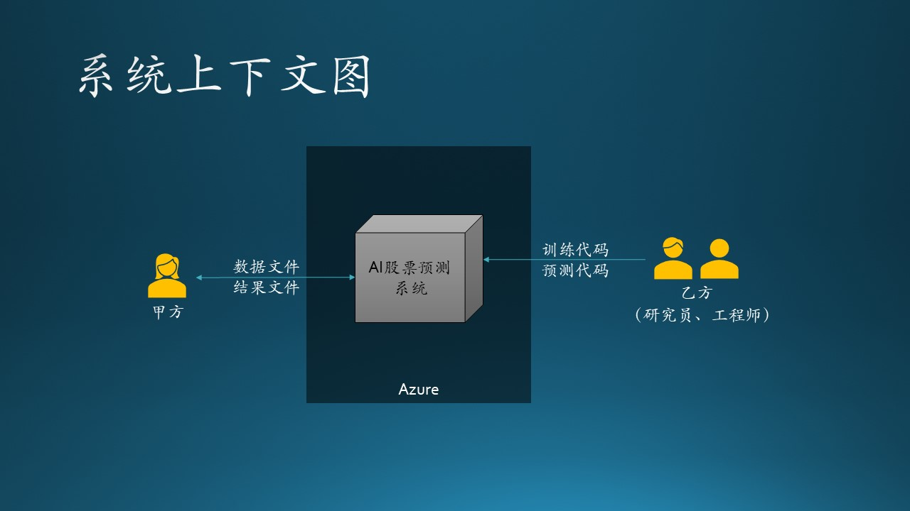
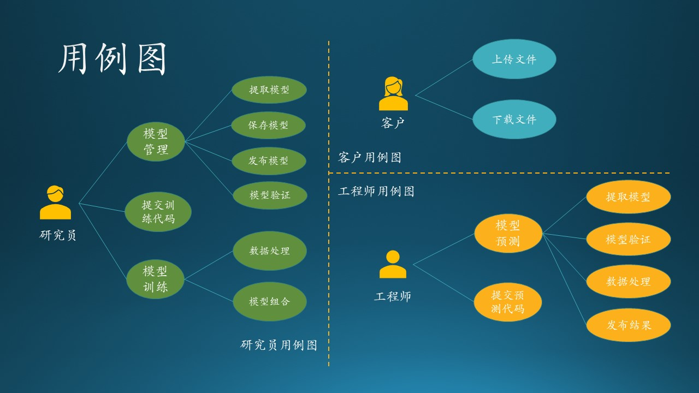
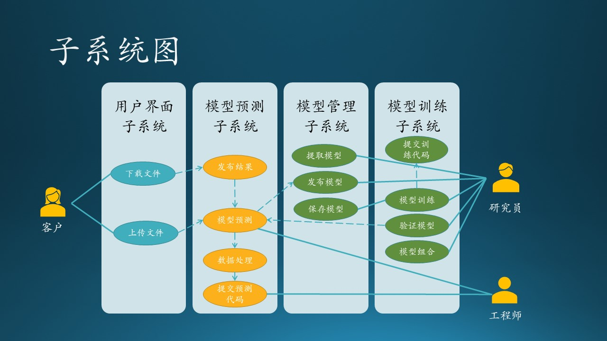
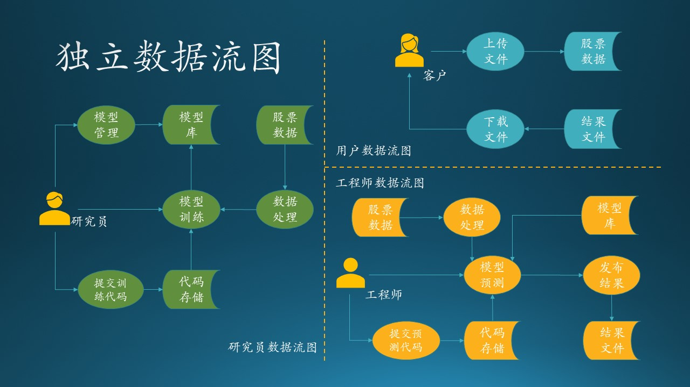
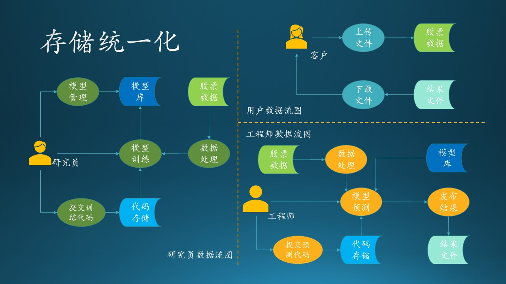
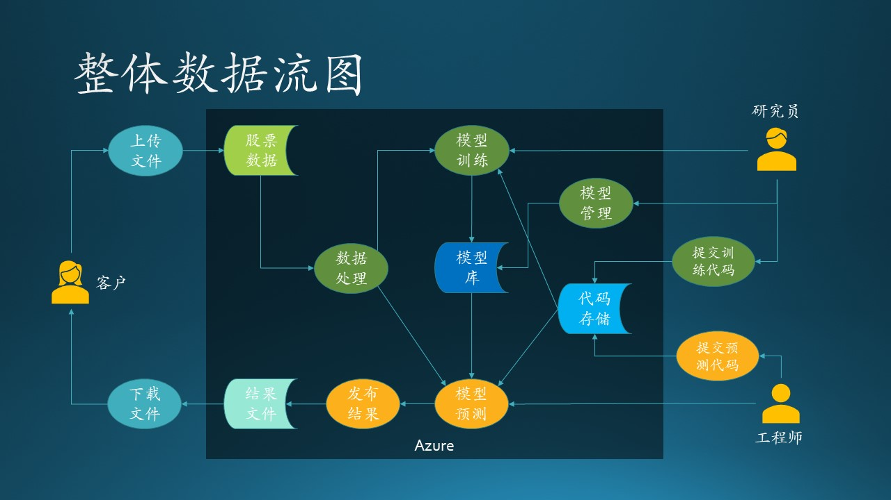

## 14.3 第一步：用例分析与数据流图

在这一部分中，我们先来复习一下需求分析的基本内容，以便和后面的设计部分无缝连接。我们仍然使用 5.3.2 节中的项目的故事为例，来说明一个完整分析、设计过程。为了方便阅读，我们再重复一下这个故事场景。

### 14.3.1 应用场景

这是木头参与的一个真实项目，虽然不怎么大，但是麻雀虽小五脏俱全，服务于客户的系统，无论规模如何，都要全力以赴，谨慎对待。

最初的情况是：

- 某基金客户想使用热门的深度学习来预测 A 股股票行情走向，所以找到了我软请求合作。

- 我软的研究员们深入研究了几个月，根据股票交易历史数据，训练了一系列基于神经网络的深度学习模型。

- 每个交易日，基金公司都要手工上传昨天的交易数据，用微信叫醒熟睡的研究员，研究员去下载交易数据，处理后用模型做预测，然后微信通知基金公司取结果。整个过程基本没有自动化。

- 每过 60 个交易日，基金公司就要求研究员使用最近的历史数据重新训练模型，在历史数据上比较新旧模型的差异，然后切换模型。这个过程也都是手工完成，很繁复。

- 所有模型都是在我软内部的训练平台上训练的，相当于是占用了公司的资源，而非客户端资源。

经过与客户讨论，得到了几条共识，作为需求分析的结果：

1. 客户将会在每个交易日早晨 7:00 上传前一个交易日的股票交易数据。
2. 系统会监控客户的上传数据动作，一旦上传结束后，立刻启动预测流程，调用模型库，根据最新交易结果进行预测。
3. 得到预测结果后，通过电子邮件通知客户下载。
4. 要求在 Azure 上完成存储、处理、预测、输出等一系列过程，然后从 Azure 上下载预测结果。以上过程在 9:00 之前完成，即两个小时之内。
5. 要求每 60 个交易日，在 Azure 上用最新数据训练深度神经网络模型，存入模型库中。要求在 48 小时内完成。
6. 把上述过程工程化、自动化，省去手工操作的麻烦和误操作。整个系统要求构建在 Azure 平台之上。

其中，前三条为功能需求，后三条为质量需求，即限制条件。

### 14.3.2 系统上下文图

先根据应用场景绘制一个系统上下文图，搞清楚系统边界，见图14.3.1。

图 14.3.1 系统上下文图

可以看到，这是一个独立的 AI 股票训练、预测系统，要求构建在 Azure 上，周边没有任何其它系统交互，只有两种参与者：甲方（客户）、乙方（研究员、工程师）。当然，对于客户来说，分不清研究员和工程师的职责，也没必要知道。

- 甲方：上传数据文件，下载结果文件。
- 乙方：编写训练代码和预测代码，并控制运行。

【最佳实践】系统上下文图，通常在项目的早期使用，以确定项目的范围。它表示可能与系统交互的所有外部实体，整个软件系统看起来像一个单一的黑匣子。

### 14.3.3 用例图

其次，针对三种参与者（甲方、研究员、工程师）绘制用例图。由于此图是给乙方内部看的，所以一定要分清研究员和工程师的职责。见图 14.3.2。

图 14.3.2 用例图

我们根据 14.3.1 节的需求描述，把每个参与者（客户、研究员、工程师）的用例图单独画出来，这样可以避免一开始就陷入复杂的逻辑纠缠中。另外，我们还进行了进一步的归类，比如模型管理用例含有 4 个子用例。

【最佳实践】刚开始画此用例图时，可以把所有想到的用例（椭圆形）都并列画出，不包含层级关系，比如图 14.3.2 中，研究员可能就会有7~9个用例；然后根据各个用例的从属关系进一步整理成子用例。如果在此不整理成为层级关系，也可以在绘制子系统/子模块图时再整理。

#### 1. 研究员的工作

1. 提交训练代码：在本地写好训练代码后提交到云端保存。
2. 模型训练
   - 数据处理：在训练前对数据进行处理，提取特征值。
   - 模型组合：在训练后，组合多个模型，提高预测准确率。
3. 模型管理
   - 保存模型：训练好的模型保存到系统中供以后使用。
   - 提取模型：提取以前训练好的模型。
   - 发布模型：把效果最好的模型发布给工程师。
   - 模型验证：验证模型的准确率并与以前的模型比较。

#### 2. 工程师的工作

1. 提交预测代码：在本地写好预测代码后提交到云端保存。
2. 模型预测
   - 提取模型：提取研究员发布的最新模型。
   - 模型验证：验证研究员发布的模型的准确率，并与以前的模型进行比较。
   - 数据处理：在预测前对数据进行处理，提取特征值。
   - 发布结果：预测结束之后的数据写入文件并发布到云端存储。

#### 3. 客户的使用

1. 上传文件：上传最新一周的股票交易数据文件到云端存储。
2. 下载文件：从云端存储下载乙方系统自动发布的结果文件。

【最佳实践】

在用例图绘制过程中，我们可能会发现有用例名称重复的情况，这里有两种情况：

1. 不同的参与者在各自的工作范围内完成具有相同名称的动作，但是其实质内容不同，只是名称恰巧相同而已，比如“模型验证”：
   - 对于研究员来说，是用验证集数据验证模型的准确率，并于以前训练过的模型相比较；
   - 对于工程师来说，是用测试集数据验证模型的准确率，并于上一次发布的模型相比较。

   再比如“提取模型”：
   - 对于研究员来说，是提取模型库中的指定的历史模型。
   - 对于工程师来说，是提取研究员发布的最新模型。

   所以这样的用例，将来在系统中是处于不同的模块中的子模块。

2. 不同的参与者执行完成相同任务的用例，名字和内容都一致，比如“数据处理”：
   - 对于研究员来说，在训练前先做数据预处理，提取特征，抛弃无用数据；
   - 对于工程师来说，是在预测前做相同的事，达到相同的目的。
   
   所以这样的用例，将来在系统中会变成一个共用模块。

### 14.3.4 子系统/模块图

先说明子系统和模块的概念：

- 当系统比较大，分割出来的部分区域功能，可以叫做子系统，内部包含很多模块。
- 当系统比较下，分割出来的部分区域功能，每个区域可以叫做模块，内部包含很多子模块。

在本例中，系统比较小，所以可以叫做模块。

【最佳实践】当面对客户来做说明时，不管系统大小，都按子系统来命名，以体现该系统的重要性，以及乙方对该系统的重要程度。

在有了用例、子用例后，绘制子系统/模块图会变得很容易。如果在用例图中不整理出子用例的话，在这个阶段整理也是可以的。图 14.3.3 显示了用例在子系统中的位置，其中，实线表示用例关系（人与行为的关系），带箭头的虚线表示用例依赖关系（箭头方向表示依赖方向），比如：“发布结果”是要依赖“模型预测”的。

图 14.3.3 子系统/模块图

整个系统的模块划分的分析整理过程的思路如下：

1. 首先，根据研究员和工程师的职责，系统是要肯定有“训练模块”和“预测模块”的。前者可以在任何时间运行，供研究员做试验使用；后者只在用户有新数据上传时才运行。
2. 模型管理模块更多地是为训练模块提供服务，为研究员的试验保存参数和模型等数据。对于预测模块来说，只获取发布的最新模型即可，对于模型管理模块的依赖不是很强烈。但是鉴于模型管理模块的复杂性，不能把它合并到训练模块中。
3. 不能够让客户直接接触到预测模块，要通过数据交换的松散耦合方式来设计，即提供给客户上传和下载的接口，这些都可以归纳到用户界面模块中。这里有一个误区，大家看到“界面”两个字，一般会想到要给客户提供一个“交互式的界面”，其实 REST API 也是一种“界面”。

### 14.3.5 数据流图

本节依然属于需求分析的范畴。

各个参与者的独立数据流图

我们根据 11.1 中的需求描述，把每个参与者（客户、研究员、工程师）的数据流图单独画出来，这样可以避免一开始就陷入复杂的逻辑纠缠中。见图 11.2.1。

图 11.2.1 - 独立数据流图

图 11.2.1 中的各个图例没有按照标准的数据流图图例（见6.8节）绘制，而是使用了更生动的彩色图例。其中：

- 人形图例代表参与者；
- 椭圆形图例代表加工逻辑；
- 铲形图例代表存储；
- 有方向的线代表数据流。

#### 1. 客户数据流图

1. 用户上传数据到云端的数据存储上；
2. 用户得到通知后，下载预测结果文件。

对用户来说比较简单，就是两个动作：上传、下载，后面的一切流程都是透明的。所以，我们需要设计“上传”和“下载”的实现。

#### 2. 研究员数据流图

1. 研究员在自己的计算机上设计模型，并提交训练代码到云端存储；
2. 云端有一个代码存储库，包括模型、代码、初始参数等；
3. 研究员登录到云端服务器，启动模型训练过程；
4. 在训练开始时，需要读取存储在云端的股票历史数据并进行预处理；
5. 训练结束后，把成熟的模型存放到模型库，供后续流程使用。
6. 对模型库进行管理，比如删除一些性能较差的模型。

对研究员来说，“提交训练代码”和“模型训练”是两个主要动作，代码可以在本地计算机上完成实现，与 Azure 交互的是“提交”动作，还要考虑“训练”部署在什么设备上运行，其它的一些辅助存储需要 Azure 上的哪种存储设备。

#### 3. 工程师数据流图

1. 开发完毕后，提交预测代码到云端部署；
2. 启动模型预测过程；
3. 在预测开始前，要读取股票历史数据和最新上传的数据并进行预处理，还要从模型库中读取最新模型；
4. 预测完毕后，输出结果文件。

对于工程师来说，“提交预测代码”和“预测”是两个主要动作，代码可以在本地计算机上完成实现，与 Azure 交互的是“提交”动作，还要考虑“预测”部署在什么设备上运行，其它的一些辅助存储需要 Azure 上的哪种存储设备。

### 14.3.6 存储统一化的数据流图

图 11.2.1 中，表示存储系统的图例，有一些是具有相同名称的，比如：“模型库”、“代码存储”、“结果文件”在不同角色的数据流图中总共各出现了两次，“股票数据”出现了三次。我们不妨用不同的色彩来标记，如图 11.2.2 所示。

图 11.2.2 - 存储统一化的数据流图

也就是说不同的角色之间，是通过这些公共的存储来做数据交换的。这为我们下一步形成整体数据流图做了准备。

这一步不是必须要画彩色图才能实现的，分析人员只要心中记住哪些存储是可以合并的即可。

### 14.3.7 模块统一化的数据流图

在图 11.2.1 中，表示加工逻辑的图例，有一些是具有相同名称的，比如“数据处理”。熟悉 AI 模型训练和预测过程的读者都知道，数据处理在训练和预测时必须保持一致，否则或造成预测结果与模型不匹配。比如：
- 训练过程要求输入三个特征值，那么数据处理就会把数据提取出三个特征值来，在预测时需要同样的三个特征值，而不是两个或者四个；
- 训练过程要求其中一个特征值的值域范围为 $[0,1]$，那么预测前也必须把该特征值做相同的归一化处理。

所以，数据处理模块实际上训练和预测共用的，必须合并为一个。

同存储图例一样，分析人员也要清楚这些加工逻辑是否真的可以在不同子系统之间共用，还是恰巧只是名称相同而已。如果可以共用，就要标记出来；如果不能共用，就重新命名为不同的名称。

### 14.3.8 整体数据流图

下面我们需要把三个独立的数据流图合并成一个完整的数据流图，来发现需要改进的地方。

合并的过程很简单，把 11.2.2 和 11.2.3 小节中整理出来的重复（具有相同名字并且相同颜色）的单元删掉，但是保留连接线。比如“股票数据”单元一共有三个，删掉右侧的两个，然后把“上传文件”连接到左侧的“股票数据”上，再把“数据处理”连接到左侧的“股票数据”上，箭头方向保持不变。

依此类推，去掉所有重名重色的单元后，再调整各个单元的位置，尽量让连接线没有交叉，就变成了图 11.2.3 的样子。当然，由于这是一个拓扑图，所以可能画法不止一种。

图 11.2.3 - 整体数据流图

被合并的存储有：
- 股票数据
- 代码存储
- 模型库
- 结果文件

被合并的加工逻辑有：
- 数据处理

与图 11.2.1 不同的是，这里多了一个深色的矩形区域“Azure”，表明在我们的设计中，该矩形区域内的元素，包括数据、行为、流程，都应该使用 Azure 提供的技术。

