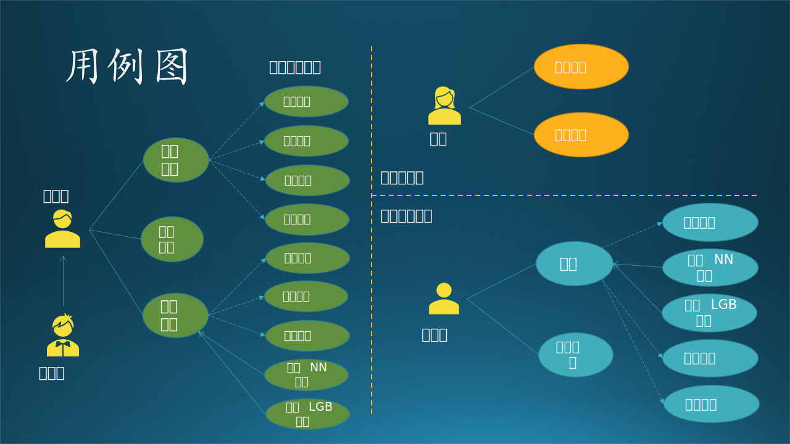

## 14.3 第一步：用例分析与数据流图

在这一部分中，我们先来复习一下需求分析的基本内容，以便和后面的设计部分无缝连接。我们仍然使用 5.3.2 节中的项目的故事为例，来说明一个完整分析、设计过程。为了方便阅读，我们再重复一下这个故事场景。

另外，请注意下述的过程是按顺序执行的，缺一不可。这有助于开发人员在进行概要设计、详细设计时不会缺失任何一个关键环节。

### 14.3.1 应用场景

这是木头参与的一个真实项目，虽然不怎么大，但是麻雀虽小五脏俱全，服务于客户的系统，无论规模如何，都要全力以赴，谨慎对待。

最初的情况是：

- 某基金客户想使用热门的深度学习来预测 A 股股票行情走向，所以找到了我软请求合作。

- 我软的研究员们深入研究了几个月，根据股票交易历史数据，训练了一系列基于神经网络的深度学习模型。

- 每个交易日，基金公司都要手工上传昨天的交易数据，用微信叫醒熟睡的研究员，研究员去下载交易数据，处理后用模型做预测，然后微信通知基金公司取结果。整个过程基本没有自动化。

- 每过 60 个交易日，基金公司就要求研究员使用最近的历史数据重新训练模型，在历史数据上比较新旧模型的差异，然后切换模型。这个过程也都是手工完成，很繁复。

- 所有模型都是在我软内部的训练平台上训练的，相当于是占用了公司的资源，而非客户端资源。

经过与客户讨论，得到了几条共识，作为需求分析的结果：

1. 客户将会在每个交易日早晨 7:00 上传前一个交易日的股票交易数据。
2. 系统会监控客户的上传数据动作，一旦上传结束后，立刻启动预测流程，调用模型库，根据最新交易结果进行预测。
3. 得到预测结果后，通过电子邮件通知客户下载。
4. 要求在 Azure 上完成存储、处理、预测、输出等一系列过程，然后从 Azure 上下载预测结果。以上过程在 9:00 之前完成，即两个小时之内。
5. 要求每 60 个交易日，在 Azure 上用最新数据训练深度神经网络模型，存入模型库中。要求在 48 小时内完成。
6. 把上述过程工程化、自动化，省去手工操作的麻烦和误操作。整个系统要求构建在 Azure 平台之上。

其中，前三条为功能需求，后三条为质量需求，即限制条件。

### 14.3.2 系统上下文图

根据应用场景绘制一个系统上下文图，搞清楚系统边界，见图14.3.1。

图 14.3.1 系统上下文图

可以看到，这是一个独立的 AI 股票训练、预测系统，要求构建在 Azure 上，周边没有任何其它系统交互，只有两种参与者：甲方（客户）、乙方（研究员、工程师）。当然，对于客户来说，分不清研究员和工程师的职责，也没必要知道。

- 甲方（客户）：上传数据文件，下载结果文件。
- 乙方：编写训练代码和预测代码，并控制运行。
- 外部通知系统：因为想避免手工操作，所以股票训练/预测系统结束工作后，应该自动发送通知，渠道可能是电子邮件、短信、微信、自动电话等等。可以后期再确定具体形式。

甲方从股票交易系统中获得原始交易数据，然后手工上传到本系统中。这是一个手工的过程，所以股票交易系统并不是本系统的外部系统。

名词解释：

- 预测（prediction）和推理（inference）是一个概念，都是指在训练完一个机器学习/深度学习模型后，在实际的环境中用真实数据进行正向计算得到分类或拟合结果的过程。

【最佳实践】系统上下文图，通常在项目的早期使用，以确定项目的范围。它表示可能与系统交互的所有外部实体，整个软件系统看起来像一个单一的黑匣子。

### 14.3.3 用例图

用例图主要用来描述角色以及角色与用例之间的连接关系。说明的是谁要使用系统，以及他们使用该系统可以做些什么。一个用例图包含了至少三种元素，有时有四种元素，如表 14.3.1 所示。

表 14.3.1 用例图元素

|元素|图例|含义|
|-|-|-|
|参与者（Actor）|一般用人形来表示|人或外部系统|
|用例（Use Case）|用椭圆来表示|表示执行的动作|
|关系（Relationship）|用直线和箭头来表示|表示参与者与用例的关系|
|子系统（subsystem）|方形或其它形状的封闭区域|把若干相关用例组织到一起|

【最佳实践】如果把用例图和子系统画在一起，很不容易画出一个方形的边界，或者是关系连线有交叉，所以一般可以把而这分开，如图 14.3.2 是用例图，图 14.3.3 是子系统图。

针对三种参与者（甲方、研究员、工程师）绘制用例图。由于此图是给乙方内部看的，所以一定要分清研究员和工程师的职责。见图 14.3.2。

图 14.3.2 用例图

根据 14.3.1 节的需求描述，首先把每个参与者（客户、研究员、工程师）的用例图单独画出来，这样可以避免一开始就陷入复杂的逻辑纠缠中。其次，我们还进行了进一步的归类，比如模型管理用例含有 4 个子用例。

读者可能会注意到在需求中并没有模型管理，这是乙方的非功能性需求，在 7.5 节中讲过。因为训练过模型的人都知道，需要很多种参数的组合才能找到一个相对完美的模型，这时如果没有一个模型管理系统，时间长了就会忘记细节，以至于后续不得不浪费时间重复训练模型才能回忆起来。

另外，读者可能还会注意到图 14.3.2 中的连接线的不同形式，请看表 14.3.2 中的解释。

表 14.3.2 四种关系

|关系名称|对象|图例|说明|
|-|-|-|-|
|关联 Association|参与者与 用例之间|实线|参与者使用哪些用例，比如：客户使用上传文件和下载文件两个用例。|
|泛化 Generalization|参与者之间 或用例之间|实线空心箭头 指向父类|对于参与者，比如有个实习生帮研究员干活。 对于用例，比如训练NN神经网络模型是模型训练的一种泛化。|
|包含 Inclusion|用例之间|虚线实心箭头 指向子用例|比如训练模型包含数据处理、参数管理等。|
|扩展 Extension|用例之间|虚线空心箭头 指向父用例|比如发布模型时，有可能需要扩展出修改名称的用例（未画出）。|

【最佳实践】

1. 刚开始画此用例图时，可以把所有想到的用例（椭圆形）都并列画出，不包含层级关系，比如图 14.3.2 中，工程师可能就会有 7 个用例；然后根据各个用例的从属关系进一步整理成子用例。
2. 各种关系可以在画出完整的用例图后再整理，因为在最开始时实际上分不清泛化和包含的关系的，可以说模型训练包含训练NN模型和训练LGB模型，也可以说是一种泛化。
3. 在有些管理系统中，不要把老板画成一个参与者，而是用不同权限级别来实现超级用户权限。

对于用例图中的用例解释如下：

#### 1. 研究员的工作

1. 提交代码：在本地写好训练代码后提交到代码库保存。
2. 模型训练
   - 数据处理：在训练前对数据进行处理，提取特征值。
   - 参数管理：注意训练新模型时使用已经配好的参数。
   - 保存模型：包括训练过程中的临时保存和整个训练结束后的最终保存。
   - 训练 NN 模型：训练神经网络模型。
   - 训练 LGB 模型：训练 LightGBM 模型。

3. 模型管理
   - 查找模型：根据参数或效果查找已经训练好的模型。
   - 添加删除：添加新模型或删除旧模型。
   - 发布模型：把效果最好的模型发布给工程师。
   - 模型评估：在训练一批模型后，评估每个模型的预测准确率。

#### 2. 工程师的工作

1. 提交代码：在本地写好预测代码后提交到代码库保存。
2. 模型预测
   - 提取模型：提取研究员发布的最新模型。
   - 数据处理：在预测前对数据进行处理，提取特征值。
   - 推理 NN 模型：用神经网络模型做推理。
   - 推理 LGB 模型：用 LightGBM 模型做推理。
   - 发布结果：预测结束之后的数据写入文件并发布到云端存储。

#### 3. 客户的使用

1. 上传文件：上传最新一周的股票交易数据文件到云端存储。
2. 下载文件：从云端存储下载乙方系统自动发布的结果文件。

【最佳实践】

在用例图绘制过程中，我们可能会发现有用例名称重复的情况，这里有两种情况：

1. 不同的参与者在各自的工作范围内完成具有相同名称的动作，但是其实质内容不同，只是名称恰巧相同而已，比如“提交代码”：
   - 对于研究员来说，是写训练部分的代码；
   - 对于工程师来说，是写推理部分的代码。

   所以这样的用例，将来在系统中是不同的模块。

2. 不同的参与者执行完成相同任务的用例，名字和内容都一致，比如“数据处理”：
   - 对于研究员来说，在训练前先做数据预处理，提取特征，抛弃无用数据；
   - 对于工程师来说，是在预测前做相同的事，达到相同的目的。
   
   所以这样的用例，将来在系统中会变成一个共用模块。

### 14.3.4 子系统划分

在 13.1 中讲过子系统和模块的概念，在此再引申一下：

- 当系统比较大，分割出来的部分区域功能，每个区域可以叫做**子系统**，内部包含很多模块。
- 当系统比较小，分割出来的部分区域功能，每个区域可以叫做**模块**，内部包含很多子模块。
- **子模块**的概念很少使用，一般用于内部代码级别的分割与整合，对外是透明的。每个子模块可以是一个功能点，直接对外提供功能调用接口，整体属于一个**模块**。

在本例中比较特殊：

- 用户界面中的功能不多，所以可以叫做模块。
- 模型管理中的功能可多可少，先考虑必要的少数功能，所以也可以叫做模块。
- 模型训练涉及的数据量大、硬件比较多、过程较长、技术含量高，代码也比较复杂，所以可以叫做子系统。
- 模型推理说大不大，说小不小，权衡了一下，还是叫做子系统吧，以体现其重要程度。

【最佳实践】当面对客户来做说明时，不管系统大小，都按子系统来命名，以体现在甲方心中该系统的重要性，以及乙方对该系统的重视程度。

有了基本概念，我们就要做子系统划分了。

图 14.3.3 子系统划分

图 14.3.3 是子系统划分的两种架构：

- 架构 1，用户界面模块只为客户使用，工程师在后台直接操控推理子系统和模型管理模块，研究员在后台直接操训练理子系统和模型管理模块。
- 架构 2，所有参与者都通过用户界面模块访问后端的两个子系统和一个模块，但是设立不同权限：
  - 客户只能通过界面触发推理子系统提供的推理功能；
  - 工程师可以透过界面操作推理子系统和模型管理模块的任何接口；
  - 研究员可以透过界面操作训练子系统和模型管理模块的任何接口。

权衡利弊后，考虑到安全性和代码难度，我们采用了架构 1，工程师和研究员都可以通过专用网络访问后台系统和模块，客户只能通过简单的（但安全的）界面访问推理子系统的指定功能。

整个系统的子系统/模块划分的分析整理过程的思路如下：

1. 首先，根据研究员和工程师的用例图，系统是要肯定有“训练子系统”和“推理子系统”的。前者可以在任何时间运行，供研究员做试验使用；后者只在用户有新数据上传时才运行。
2. 模型管理模块更多地是为训练子系统提供服务，为研究员的试验保存参数和模型等数据。对于推理子系统来说，只获取发布的最新模型即可，对于模型管理模块的依赖不是很强烈。但是鉴于模型管理模块的复杂性，不能把它合并到训练子系统中。
3. 不能够让客户直接接触到推理子系统，要通过数据耦合方式来设计，即提供给客户上传和下载的接口，这些都可以归纳到用户界面模块中。这里有一个误区，大家看到“界面”两个字，一般会想到要给客户提供一个“交互式的界面”，其实 REST API 也是一种“界面”。

### 14.3.5 模块划分

在有了用例图后，绘制子系统图会变得很容易，以避免缺失子系统或主要模块。如果在用例图中不整理出子用例的话，在这个阶段整理也是可以的。

读者可能注意到图 14.3.4 中的模块数量与图 14.3.2 中的用例数量不同，这是因为图 14.3.2 是一个先期的工作，很有可能当时没有组织好思路。而在分解子系统/模块时，经过思考又重新编排，这是一个正常的优化过程。

图 14.3.4 模块划分

### 14.3.6 数据流图

本节依然属于需求分析的范畴，描绘各个参与者的独立数据流图。数据流图（DFD - Data Flow Diagram）是描绘信息流和数据从输入移动到输出的过程中所经受的变换。数据流图从数据传递和加工的角度，以图形的方式刻画数据流从输入到输出的移动变换过程。

我们根据上面的需求描述，把每个参与者（客户、研究员、工程师）的数据流图单独画出来，这样可以避免一开始就陷入复杂的逻辑纠缠中。在图 14.3.4 中，椭圆形的数量与 14.3.4 又不一致，是经过了再一次优化的结果，读者经过仔细比对，可以看出优化的过程。比如：对于研究员角色来说，“保存模型”在图 14.3.4 中存在，但是在图 14.3.5 中被取消，合并到了“模型训练”中，就如同“刷完牙后要漱口”，训练完后肯定要保存。

图 14.3.5 - 独立数据流图

图 14.3.5 中的各个图例没有按照标准的数据流图图例绘制，而是使用了更生动的彩色图例，如表 14.3.3 所示。

表 14.3.3 数据流图元素与图例

|元素|本案图例|标准图例|
|-|-|-|
|外部实体（Entity）| 人形 | 矩形、平行四边形 |
|加工逻辑（Processing）| 椭圆形 | 圆形、六角形 |
|存储（Data）| 铲形图 | 双线、缺口矩形、铲形图 | 
|数据流（Flow）| 有方向的线 |有方向的线|

下面描述每个外部实体所参与的数据流图。

#### 1. 客户数据流图

1. 用户上传数据到云端的数据存储上；
2. 用户得到通知后，下载预测结果文件。

对用户来说比较简单，就是两个动作：上传、下载，后面的一切流程都是透明的。所以，我们需要设计“上传”和“下载”的实现。

#### 2. 研究员数据流图

1. 研究员在自己的计算机上设计模型，并提交训练代码到云端存储；
2. 云端有一个代码存储库，包括模型、代码、初始参数等；
3. 研究员登录到云端服务器，启动模型训练过程；
4. 在训练开始时，需要读取存储在云端的股票历史数据并进行预处理；
5. 训练结束后，把成熟的模型存放到模型库，供后续流程使用。
6. 对模型库进行管理，比如删除一些性能较差的模型，发布最佳模型。

对研究员来说，“提交训练代码”和“模型训练”是两个主要动作，代码可以在本地计算机上完成实现，与 Azure 交互的是“提交”动作，还要考虑“训练”部署在什么设备上运行，其它的一些辅助存储需要 Azure 上的哪种存储设备。

#### 3. 工程师数据流图

1. 开发完毕后，提交预测代码到云端部署；
2. 启动模型预测过程；
3. 在预测开始前，要读取股票历史数据和最新上传的数据并进行预处理，还要从模型库中读取最新模型；
4. 预测完毕后，发布结果文件。

对于工程师来说，“提交预测代码”和“预测”是两个主要动作，代码可以在本地计算机上完成实现，与 Azure 交互的是“提交”动作，还要考虑“预测”部署在什么设备上运行，其它的一些辅助存储需要 Azure 上的哪种存储设备。

### 14.3.7 存储统一化的数据流图

图 14.3.5 中，观察表示数据存储的图例，有一些是具有相同名称的，比如：“模型库”、“代码存储”、“结果文件”在不同角色的数据流图中总共各出现了两次，“股票数据”出现了三次。我们不妨用相同的色彩来标记，如图 14.3.6 所示。

图 14.3.6 - 存储统一化的数据流图

也就是说不同的角色之间，是通过这些公共的存储来做数据交换的。这为我们下一步形成整体数据流图做了准备。

【最佳实践】这一步不是必须要画彩色图才能实现的，分析人员只要心中记住哪些存储是可以合并的即可，但是绘制彩色图可以加快找同类元素的速度。

### 14.3.8 加工统一化的数据流图

在图 14.3.5 中，表示加工逻辑的图例，有一些是具有相同名称的，比如“数据处理”。熟悉 AI 模型训练和预测过程的读者都知道，数据处理在训练和预测时必须保持一致，否则或造成预测结果与模型不匹配。比如：
- 训练过程要求输入三个特征值，那么数据处理就会把数据提取出三个特征值来，在预测时需要同样的三个特征值，而不是两个或者四个；
- 训练过程要求其中一个特征值的值域范围为 $[0,1]$，那么预测前也必须把该特征值做相同的归一化处理。

所以，数据处理模块实际上训练和预测共用的，必须合并为一个。

同存储图例一样，分析人员也要清楚这些加工逻辑是否真的可以在不同子系统之间共用，还是恰巧只是名称相同而已。如果可以共用，就要标记出来；如果不能共用，就重新命名为不同的名称。

### 14.3.9 整体数据流图

根据存储统一化和加工统一化的信息，下面需要把三个独立的数据流图合并成一个完整的数据流图，来发现需要改进的地方。

合并的过程很简单，把 14.3.7 和 14.3.8 小节中整理出来的重复（具有相同名字并且相同颜色）的单元删掉，但是保留连接线。比如“股票数据”单元一共有三个，删掉右侧的两个，然后把“上传文件”连接到左侧的“股票数据”上，再把“数据处理”连接到左侧的“股票数据”上，箭头方向保持不变。

依此类推，去掉所有重名重色的单元后，再调整各个单元的位置，尽量让连接线没有交叉，就变成了图 14.3.7 的样子。当然，由于这是一个拓扑图，所以可能画法不止一种。

图 14.3.7 - 整体数据流图

被合并的存储有：
- 股票数据
- 代码存储
- 模型库
- 结果文件

被合并的加工逻辑有：
- 数据处理

与前面的图不同的是，这里多了一个深色的矩形区域“Azure”，表明在我们的设计中，该矩形区域内的元素，包括数据、行为、流程，都应该使用 Azure 提供的技术。

