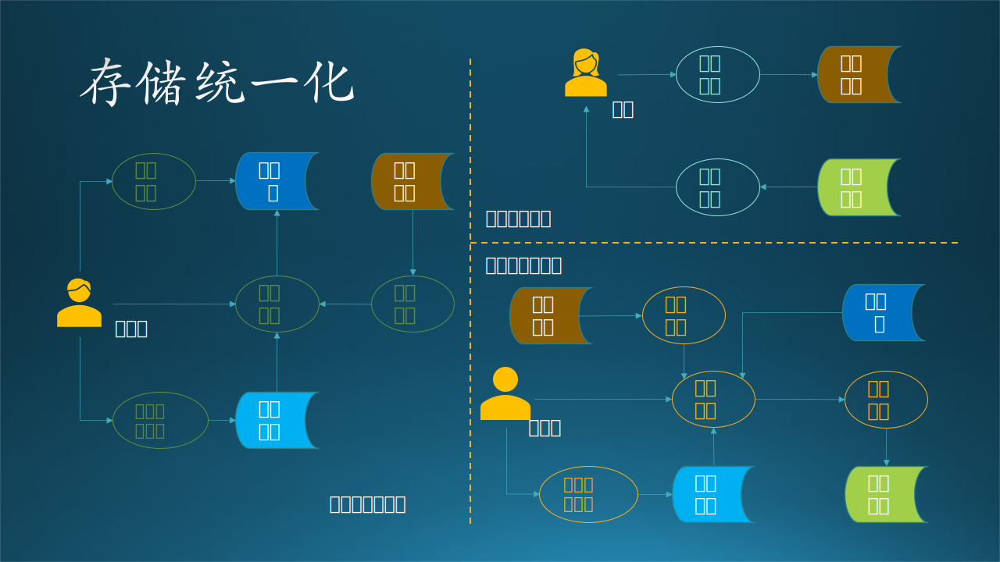
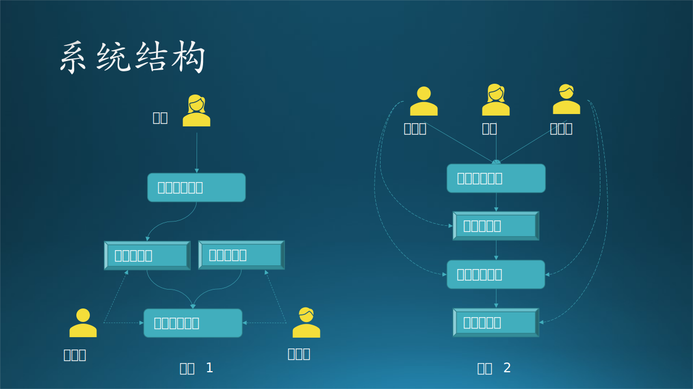
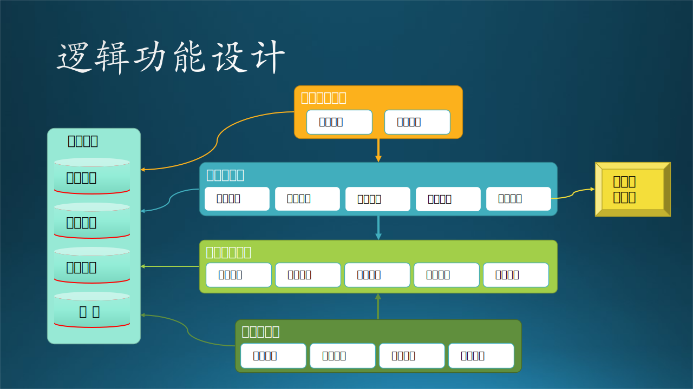
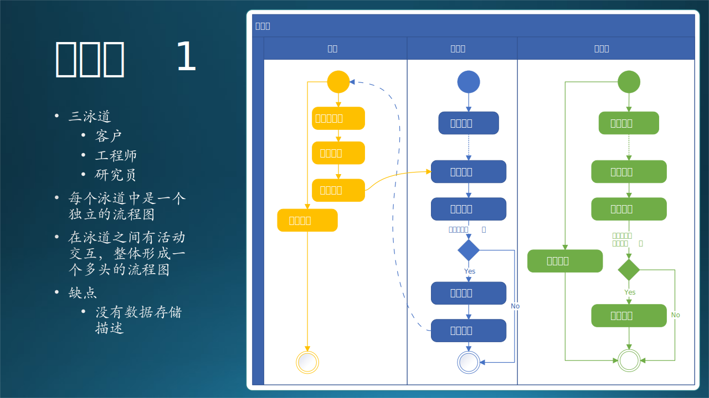

## 14.4 第二步：数据流图

### 14.4.1 子系统与模块划分

在 13.1 中讲过子系统和模块的概念，在此再引申一下：

- 当系统比较大，分割出来的部分区域功能，每个区域可以叫做**子系统**，内部包含很多模块。
- 当系统比较小，分割出来的部分区域功能，每个区域可以叫做**模块**，内部包含很多子模块。
- **子模块**的概念很少使用，一般用于内部代码级别的分割与整合，对外是透明的。每个子模块可以是一个功能点，直接对外提供功能调用接口，整体属于一个**模块**。

在本例中比较特殊：

- “用户界面”中的功能不多，所以可以叫做模块。
- “模型管理”中的功能可多可少，先考虑必要的少数功能，所以也可以叫做模块。
- “模型训练”涉及的数据量大、硬件比较多、过程较长、技术含量高，代码也比较复杂，所以可以叫做子系统。
- “模型推理”说大不大，说小不小，权衡了一下，还是叫做子系统吧，以体现其重要程度。

【最佳实践】当面对客户来做说明时，不管系统大小，都按子系统来命名，以体现在甲方心中该系统的重要性，以及乙方对该系统的重视程度。

有了基本概念，我们就要做子系统与模块划分了。

在有了用例图后，绘制子系统图会变得很容易，以避免缺失子系统或主要模块。如果在用例图中不整理出子用例的话，在这个阶段整理也是可以的。图 14-8 就是整理出来的子系统以及包含的主要模块。

图 14-8 子系统与模块划分

读者可能注意到图 14-8 中的**模块数量**与图 14.3.2 中的**用例数量**不同，这是因为图 14.3.2 是一个先期的工作，很有可能当时没有组织好思路。而在分解子系统/模块时，经过思考又重新编排，这是一个正常的优化过程。比如“提交代码”这个用例就没有被纳入子系统中，因为通过设计者思考，认为它是一种日常的开发行为，可以不放在系统设计中。

【最佳实践】子系统图是一种分类功能分析，对应设计阶段的逻辑功能设计。UML 中有要求把用例图（图 14.3.2）和子系统（图 14-8）画在一起。但是，很不容易画出一个方形的边界，或者是多根关系连线有交叉，不容易看清楚，所以一般可以把这二者分开。

### 14.4.2 数据流图

本节依然属于需求分析的范畴，描绘各个参与者的独立数据流图。数据流图（DFD - Data Flow Diagram）是描绘信息流和数据从输入移动到输出的过程中所经受的变换。数据流图从数据传递和加工的角度，以图形的方式刻画数据流从输入到输出的移动变换过程。

我们根据上面的需求描述，把每个参与者（客户、研究员、工程师）的数据流图单独画出来，这样可以避免一开始就陷入复杂的逻辑纠缠中。在图 14-9 中，椭圆形的数量与 14.4.1 又不一致，是经过了再一次优化的结果。读者经过仔细比对，可以看出优化的过程。比如：对于研究员角色来说，“保存模型”在图 14-8 中存在，但是在图 14-9 中被取消，合并到了“模型训练”中，就如同“刷完牙后要漱口”，训练完后肯定要保存。另外一个原因是篇幅有限，不能再图 14-9 中画出所有用例。

图 14-9 独立数据流图

图 14-9 中的各个图例没有按照标准的数据流图图例绘制，而是使用了更生动的彩色图例，如表 14-4 所示。

表 14-4 数据流图元素与图例

|元素|本案图例|标准图例|规则|
|-|-|-|-|
|外部实体（Entity）| 人形 | 矩形、平行四边形 | 只能连接加工逻辑 |
|加工逻辑（Processing）| 椭圆形 | 圆形、六角形 | 只能连接外部实体和存储 |
|存储（Data）| 铲形图 | 双线、缺口矩形、铲形图 | 只能连接加工逻辑 |
|数据流（Flow）| 有方向的线 |有方向的线|头表示写，尾表示读|

下面描述每个外部实体所参与的数据流图。

#### 1. 客户数据流图

（1）用户上传数据到云端的数据存储上；
（2）用户得到通知后，下载预测结果文件。

对用户来说比较简单，就是两个动作：上传、下载，后面的一切流程都是透明的。所以，我们需要设计“上传”和“下载”的实现。

#### 2. 研究员数据流图

（1）研究员在自己的计算机上设计模型，并提交训练代码到云端存储（未画出）；
（2）研究员登录到云端服务器，读取存储在云端的股票历史数据并进行预处理；
（3）启动模型训练过程；
（4）训练结束后，把成熟的模型存放到模型库，供后续流程使用。
（5）对模型库进行管理，比如删除一些性能较差的模型，发布最佳模型。

对研究员来说，“模型管理”和“模型训练”是两个主要动作。

#### 3. 工程师数据流图

（1）开发完毕后，提交预测代码到云端部署（未画出）；
（2）登录到云端服务器，读取存储在云端的股票历史数据并进行预处理；
（3）数据处理完毕后，从模型库中读取最新模型，启动模型推理过程；
（4）推理完毕后，发布结果文件。

对于工程师来说，“数据处理”和“模型推理”是两个主要动作。

【最佳实践】数据流图是一种动态分析，对应设计阶段的运行过程设计和数据存储设计。每个软件产品都会有数据生成和处理，通过这种方式来串联业务场景。两个加工逻辑之间不能直接连接，否则就是数据缺失或者二者需要合并。

### 14.4.3 “存储统一化”的数据流图

图 14-9 中，读者可以观察表示数据存储的图例，有一些是具有相同名称的，比如：“模型库”、“结果文件”在不同角色的数据流图中总共各出现了两次，“股票数据”出现了三次。我们不妨用相同的色彩来标记，如图 14-10 所示。

图 14-10 存储统一化的数据流图

在图 14.3.5 中，也就是说不同的角色之间，是通过这些公共的存储来做数据交换的。这为我们下一步形成整体数据流图做了准备。

【最佳实践】这一步不是必须的，也不是要画彩色图才能实现的，分析人员只要心中记住哪些存储是可以合并的即可，但是绘制彩色图可以加快归类的速度。

### 14.4.4 “加工统一化”的数据流图

在图 14-10 中，表示加工逻辑的图例有一些是具有相同名称的，比如“数据处理”。熟悉 AI 模型训练和预测过程的读者都知道，数据处理在训练和推理时必须保持一致，否则或造成推理结果与模型不匹配。比如：
- 训练过程要求输入三个特征值，那么数据处理就会把数据提取出三个特征值来，在推理时需要同样的三个特征值，而不是两个或者四个；
- 训练过程要求其中一个特征值的值域范围为 $[0,1]$，那么推理前也必须把该特征值做相同的归一化处理。

所以，数据处理模块实际上训练和推理共用的，必须合并为一个。

同存储图例一样，分析人员也要清楚这些加工逻辑是否真的可以在不同子系统之间共用，还是恰巧只是名称相同而已。如果可以共用，就要标记出来；如果不能共用，就重新命名为不同的名称。

### 14.4.5 整体数据流图

根据存储统一化和加工统一化的信息，下面需要把三个独立的数据流图合并成一个完整的数据流图，来发现需要改进的地方。

合并的过程很简单，把上两个小节中整理出来的重复（具有相同名字并且相同颜色）的单元删掉，但是保留连接线。比如“股票数据”单元一共有三个，删掉右侧的两个，然后把“上传文件”连接到左侧的“股票数据”上，再把“数据处理”连接到左侧的“股票数据”上，箭头方向保持不变。

依此类推，去掉所有重名重色的单元后，再调整各个单元的位置，尽量让连接线没有交叉，就变成了图 14-11 的样子。当然，由于这是一个拓扑图，所以可能画法不止一种。

图 14-11 整体数据流图

被合并的存储有：
- 股票数据
- 代码存储
- 模型库
- 结果文件

被合并的加工逻辑有：
- 数据处理

与前面的图不同的是，这里多了一个深色的矩形区域“Azure”，表明在我们的设计中，该矩形区域内的元素，包括数据、行为、流程，都应该使用 Azure 提供的技术。

