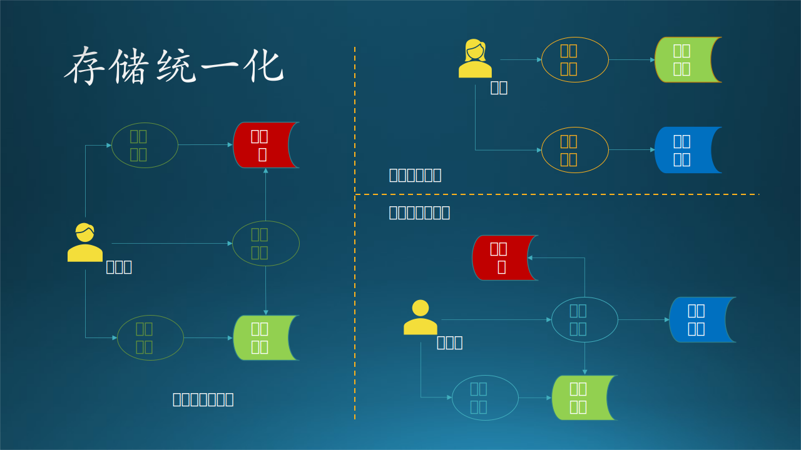
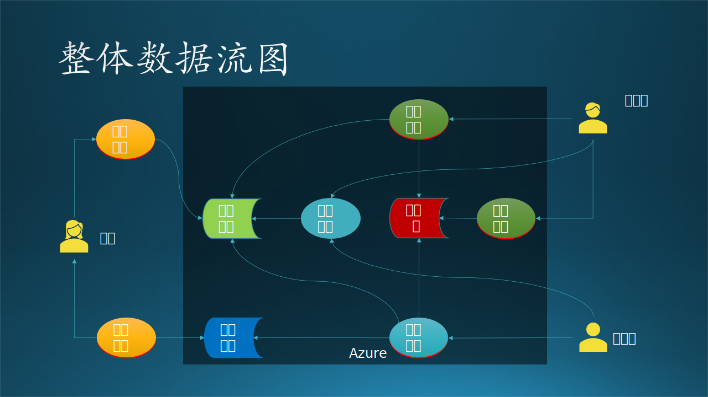
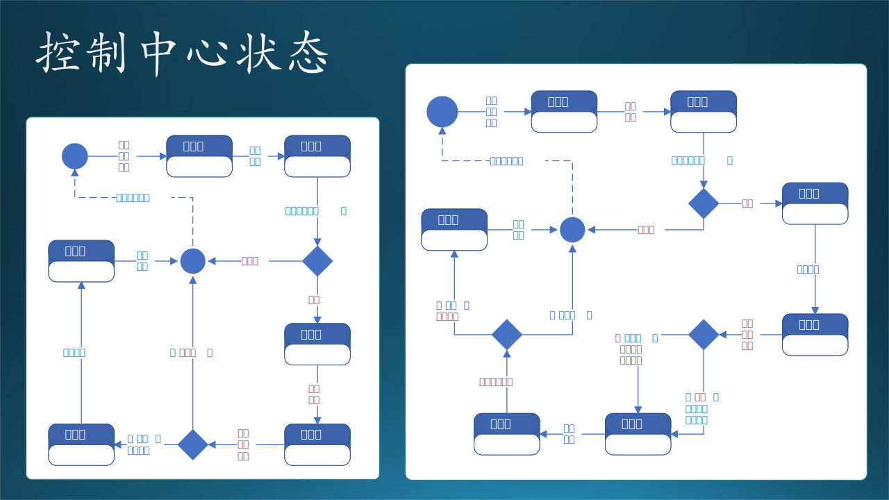

## 14.4 第二步：逻辑功能与接口设计

### 14.4.1 静态功能设计

绘制功能流程图

有了 14.3 节中的数据流图和模块划分的基础，我们不妨在绘制一些流程图，把各种活动串接在一起，形成具体功能，以验证模块划分的正确性。

在图 14.4.1 中，绘制了一张具有三泳道的活动图，单独画三个流程图也是一样的，只不过看不到泳道之间的交互了。活动图本来是用于系统动态设计的，

图 14.4.1 没有数据存储描述的活动图

图 14.4.2 有数据存储的活动图

【最佳实践】

1. 这一步不是必须的，只有在流程较长或逻辑比较复杂时，才有绘制流程图的必要。
2. 把不同角色的业务流程画在各自的泳道中，整体形成活动图，即有了流程图，又能看到不同模块之间的接口。
3. 把数据存储加上，会使得交互细节更清楚，属于一种松散耦合的设计，值得推荐。

### 14.4.1 加工逻辑的潜规则

得到图 14.3.4 的整体数据流图后，就可以进行下一步的设计工作了。注意，在依赖数据流图把需求分析变成系统设计的过程中，有一些“潜规则”：

图 14.4.1 - 加工逻辑的“潜规则”

1. “参与者”到“加工逻辑”之间的连线（有方向），表示有交互式用户界面，或者可执行程序（也可以看作是界面的一种）。有的资料中用鲁棒图来表示。

2. “加工逻辑”到“数据存储”的连线（有方向），表示调用“写入”功能。

3. 两个“加工逻辑” A 与 B 之间的连线，表示 A 调用/通知 B，也可能需要“凭空”设计出来一个主控程序，按顺序调用二者，但是主控程序并不在数据流图内（因为数据流图属于需求分析范畴，而主控程序属于设计范畴）。如图 14.4.1 中的虚线椭圆所示。

4. “数据存储”到“加工逻辑”的连线（有方向），表示调用“读出”功能，但是此时的“加工逻辑”不能凭空运行，需要有调用者，与 3 同。

### 14.4.2 处理加工逻辑

我们把加工逻辑有组织地组合在一起，就会形成子系统/模块的概念。

- 对于大系统来说，每一个加工逻辑会变成一个模块，而完成一组相关功能的模块会组成一个子系统。
- 对于小系统来说，每一个加工逻辑会变成一个子模块，这些子模块会组成一个模块。

图 14.4.2 - 加工逻辑的“潜规则”

#### 客户子系统

对于客户的需求，只有上传、下载两个动作，所以可以设计为两个模块。

在 10.2 节中，我们讲了技术选型的方法，下面的模块设计就是根据技术选型结果做出的：

- 上传文件：由于使用了Azure Blob，又不需要做交互式界面，所以直接使用 AzCopy.exe 即可，在客户机器上用命令行脚本调用；

- 下载文件：AzCopy.exe 同样可以下载文件，也使用命令行脚本调用。

上面两个模块容易理解，但是下面两个模块是怎么回事儿？

- 获得上下文
- 触发通知

我们将在 14.4.4 讲解。

#### 模型训练子系统
  
由于训练模块对计算资源的要求非常高，我们必须把它设计为一个独立的子系统，包含很多子模块，比如：

- 数据预处理
  - 数据读取
  - 数据处理
  - 提取特征值
  - 数据归一化
- 训练
  - 训练代码载入
  - 超参数初始化
  - 启动训练
- 监视训练过程
- 停止训练
- 保存模型
  
上面这些子模块都是顺序调用的，需要设计一个主控模块来负责调用。

#### 模型管理子系统

模型管理作为一个子系统，也包含很多子模块，比如：

- 保存模型
- 提取模型
- 评估模型
- 组合模型
- 删除模型
- 发布模型

上面这些模块是并列的，也需要设计一个主控模块来负责按需调用，可以有界面，也可以是 API 接口。

- 数据处理：这是一个共用模块，被模型训练子系统调用，同时也被模型预测子系统调用。

- 提交训练代码：是一个 Azure 之外的模块，可以使用任何支持深度学习的框架来编写代码，并使用Git提交，不在本系统的设计范围内。

#### 模型预测子系统

工程师主要负责模块预测子系统，由于预测模块对计算资源的要求较高，我们也必须把它设计为一个独立的子系统。包含很多子模块，比如：

- 数据处理
  - 数据读取
  - 数据处理
  - 提取特征值
  - 数据归一化
- 预测
  - 预测代码载入
  - 启动预测
- 监视预测过程
- 停止预测
- 保存结果

上面这些子模块都是顺序调用的，需要设计一个主控模块来负责调用。

- 提交预测代码：是一个 Azure 之外的模块，可以使用任何支持深度学习的框架来编写代码，并使用Git提交，不在本系统的设计范围内。

### 14.4.3 设计触发机制

需求要求我们在用户上传完文件后，立刻触发训练或者预测功能执行。

我们仔细看一下整体数据流图（图11.2.2）：“上传文件”是一个动作，在设计时对应到一个可执行程序或者界面，文件存储到“数据存储”单元后，如何触发“训练”和“预测”的动作发生呢？

激活一个程序，有四种方式：

1. 人工手动启动程序
  
   不适合本场景，因为客户是在周末非工作时段上传文件的，工程师不一定保证能及时响应；而且我们也不能让客户来启动训练和预测过程，那样做风险太大。

2. 定时启动

   不适合本场景，因为不知道用户何时上传数据，如果正上传一半时启动程序，数据不完整，程序就会出错。无论怎样设置定时器，都有可能发生这种情况。

3. 由特殊事件触发
   
   使用块存储时，每次的文件上次都可以触发一次事件。我们是否可以监听这个事件作为触发机制呢？

   对于股票交易来说，如果上周有5个交易日，一共5个文件；如果只有3个交易日，就只有3个文件。所以用户每次上传一个文件，都会触发一次独立的文件变化通知，那么我们如何知道哪个通知是最后一个呢？也许用户上传了3个文件，喝了杯咖啡，然后又上传了2个文件。

   当时木头在做这个设计时，在小组内讨论了多次，其中一个 Dev Lead 认为我们应该在服务器端维护一套完美的逻辑，能够判断出“用户上传文件是否结束了”。但是，木头想来想去都觉得这是不可能完成的任务，总会有意外发生，不可能完美。

   还有一种设计：
   - 在客户端把所有要上传的文件先打包压缩成一个文件，然后把压缩文件上传，这样就只触发一次通知事件。但是这需要在客户端有“压缩”的逻辑代码，或者用一个第三方软件来完成。
   - 传到 Blob 上以后，在使用前需要先解压，在服务器端需要用同样的软件/协议来解压缩，然后再写回 Blob 中，便于以后使用。

   从逻辑上看，复杂很多，遂放弃此设计。

4. 由其它程序调用

   由于 Azure 边界的存在，上传文件行为是在客户端发生的，远在 Azure 之外，它不可能“调用”部署在 Azure 内的“训练”和“预测”模块，它只能“通知”。那么就需要我们再编制一个主控程序来接收“通知”，这样会多出一些工作来。但目前看来，这是我们唯一的解决方案。
   
   考虑到“训练”和“预测”模块的独立性，我们尽量不要改它们的业务逻辑，而是在外面单独增加一个控制中心，来接收来自客户端的“通知”，再做后续处理。即，在用户上传完文件后，由客户端手动或自动发送一个通知给控制中心，以便触发后面的工作流程。“上传”和“通知”两个动作最好在一个事务中完成。

图 14.4.2 - 设计控制中心

图 14.4.2 描述了上面的分析：

1. 上传文件结束后通知“控制中心”，这也避免了客户端程序直接接触到系统的核心功能，需要的话，在控制中心可以做各种保护措施；
2. 控制中心调度，执行训练；
3. 训练完毕后确定是否启用最新模型，如果新模型性能不如旧模型，则依然使用旧模型预测，然后执行预测；
4. 预测结束后通知用户去下载结果文件。

这种中心化的设计在系统设计中是很常见的。其缺点是要多设计、编码、部署出一个控制中心来，优点是业务逻辑非常容易调整，安全隔离，利大于弊。

### 14.4.4 如何实现“通知”

现在我们来解释客户子系统中的“获得上下文”和“触发通知”是什么意思。

如 14.4.3 讲解，如何实现“通知”控制中心呢？用计算机语言如何描述呢？由于客户端是一个极简的批处理文件（batch file），它可以调用 AzCopy.exe 来完成文件传输，当然也可以调用 CURL.exe 可执行程序来触发 Web API/REST API。

在上传文件时，AzCopy.exe 要求指定目标文件夹，我们也需要在 Azure Blob 上维护一个良好有序的目录结构，来存放每周上传的数据。客户端每周都要上传一次数据，带有强烈的时间信号，所以我们设计用时间戳来表示本批次的数据。由于客户端的机器的系统时间很可能设置不准确，所以需要从服务器取一个时间戳来表示上下文，本次上传后面所有的操作都是用这个上下文来串连。

所以：

- 获得上下文：使用 CURL.exe 调用 REST API 获得服务器的时间戳。
- 触发通知：使用 CURL.exe 调用 REST API 来告知控制中心数据传输完毕。

### 14.4.5 控制中心的设计误区

在设计控制中心时，有一个非常常见的误区，见图 14.4.3：

图 14.4.3 - 错误的设计

图中的红色虚线表示不正确的设计：

1. 在控制中心做一个网页提供文件上传功能，然后由控制中心把文件写到数据存储中。

2. 上传文件结束后，不能让客户端模块直接通知/调用模型训练子系统；

3. 模型预测结束后，不能让模型预测子系统直接通知用户。

4. 在下载时同样通过控制中心读取结果文件，再由网页引导下载。

1,4 两个错误是要关于网页的问题；2,3 两个错误的根本指导思想是不能让客户端直接“接触”到内部的子系统，而必须通过控制中心。

这个设计本身肯定是可以工作的，但是为什么在本案中是错误的？以下是木头和实习生讨论的过程：

- 成本问题
   
   开发一个网页是有成本的。
   - 实习生说：很多框架都使得开发网页非常方便，基本上一天搞定。
   - 木头说：开发网页需要引入 Designer 来设计，需要引入 CELA（法务部门）来审查。一旦提供了网页，会引发出客户的很多隐含需求，那么开发周期就没有保证了。如果这个系统的客户数量多的话，可以考虑开发网页，但是目前看来只有一个客户，没必要开发。

- 安全问题
   
   现在的网页一般使用 HTTPS 协议来保证安全性，需要申请域名并架设证书服务，这都需要费用，而在与客户的合同中不包含这部分费用。

   - 实习生说：可以找到免费的证书服务软件的，很多提供开源软件服务的网站都使用它。
   - 木头说：我们不能给客户提供第三方的免费的证书服务软件，这不在合同里；而且还需要定期去更新证书，维护成本增加。

- 断点续传

   当客户的文件较多较大而且网络不稳定时，需要服务器有断点续传功能。

   - 实习生说：断点续传的开源软件很多呀，很多web框架里，大概十几行代码就可以完成了。
   - 木头说：AzCopy.exe可执行文件，实际上已经实现了大数据压缩、断点续传、安全验证等功能，我们没有必要去重复造轮子。它是一个成熟的微软产品，完全可信任。

从以上分析可以看到：

- 实习生关心的就是用开源的框架、服务去实现一个功能，对于实习生来说，凡是开源的都可以使用；

- 而作为工程师的木头，要关心成本、安全、合规、维护、性能等等一堆问题，这也是软件工程的根本所在。对于工程师来说，开源首先意味着可信度低、可靠性差，在没有充分调研之前不能使用。

## 11.7 接口设计

### 11.7.1 接口技术选择

这里的接口指的是子系统之间的接口，而不是具体的编程语言接口，如 Java、C# 中定义的接口。另外，简单的 API 调用也不是我们要讨论的接口，我们主要讨论跨越进程甚至物理机器之间的接口设计问题。

在 11.6 节的交互设计中，我们确定了两个组件（子系统）之间如何交互，现在要设计具体接口，即：

1. 使用什么技术？
2. 传送什么数据？
3. 返回什么结果？

接口技术的选择：

- Web Service
  
  使用SOAP（Simple Object Access Protocol，简单对象访问协议）提供了在各种平台、框架上运行的不同软件之间可以进行互操作的标准方法。

- Web API/REST API
  
  使用 HTTP 协议的 GET、POST、PUT、DELETE 操作封装 JSON 数据作为参数，驱动服务器完成指定任务。

- RPC（Remote Procedure Call，远过程调用）
  
  有很多中间件可以完成 RPC，调用者在本地使用一个简单的 API，透明地通过服务器传递给被调用者完成指定功能。

- 管道
  
  是一种简单的 IPC（进程间通信）机制，可以是单向的或双向的，传送自定义消息，接收方自行解释执行相应功能。

- Message Queue

  消息队列，FIFO先入先出，是一种进程间通信的方式，接收方繁忙或掉线时，消息不会丢失，直到接收方可以重新主动获得消息。

- Socket

  最底层的套接字通讯，自己封装数据包并在发送和接收端解析，完成指定功能并返回给对方。

在本系统中由于有了控制中心的存在，使得不同子系统之间的网状连接变成了与控制中心的星形连接，大大简化了通信成本。由此可见，当系统中存在4个以上的子系统时，一定要使用星形连接来构建。

下面我们逐个设计每个组件需要的外部接口。

### 11.7.2 客户端需要的外部接口

图 11.7.1 - 客户端需要的接口

#### 接口 A1

包括两个方法：

- 获得时间戳
   
   - 方法：GET /api/get_timestamp/
   - 目标：控制中心
   - 返回：\<timestamp\> 时间戳

   客户端每周都要上传一次数据，带有强烈的时间信号，所以我们设计用时间戳来表示本批次的数据，时间戳的格式是“YYYYmmddHHMMSS”，即“年月日时分秒”。

- 通知上传数据完毕

   - 方法：GET /api/start/\<timestamp\>
   - 目标：控制中心
   - 返回：200 OK

   这个方法用 POST 也是可以的，只不过用 GET 可以简化编程，也没有歧义。后面很多方法与此相同。
   
   客户端脚本上传完数据后，直接用 CURL.exe 可执行文件调用该接口，通知控制中心开始后续的工作。至于后续的工作是什么，由控制中心决定。

#### 接口 A2

- 接收邮件
  - 方法：邮件客户端软件
  - 目标：外部邮件系统
  - 返回：邮件内容，内含网页链接

  甲方会收到控制中心发送的邮件通知，然后使用本地的邮件客户端接收邮件。内容是告知甲方上传数据完毕或可以下载预测结果文件。

#### 接口 A3

- 存取 Azure 存储
  - 方法：AzCopy.exe 可执行程序
  - 目标：Azure 存储
  - 返回：成功或失败

  客户端上传、下载数据文件时使用。

#### 接口 B1

包括四个方法：

- 检查训练结果
   - 方法：GET /api/review_training_result/\<timestamp\>
   - 目标：控制中心
   - 返回：HTML 格式网页
  
  这个接口实际上返回一个网页，研究员需要用此网页来检查训练结果的正确性，避免需要登录到 Azure 虚拟机上检查的麻烦。

- 确认训练结果
  - 方法：GET /api/confirm_training_result/\<timestamp\>
  - 目标：控制中心

  在上面的接口方法返回的网页上，有一个按钮，研究员可以点击此按钮调用 REST API 触发本接口，控制中心将接到通知，进行下一步操作（进入下一个状态）。

- 检查预测结果
   - 方法：GET /api/review_inference_result/\<timestamp\>
   - 目标：控制中心
   - 返回：HTML 格式网页
  
  这个接口实际上返回一个网页，研究员需要用此网页来检查训练结果的正确性，避免需要登录到 Azure 虚拟机上检查的麻烦。

- 确认预测结果
  - 方法：GET /api/confirm_inference_result/\<timestamp\>
  - 目标：控制中心
  - 返回：

  在上面的接口方法返回的网页上，有一个按钮，工程师可以点击此按钮调用 REST API 触发本接口，控制中心将接到通知，进行下一步操作（进入下一个状态）。
  
#### 接口 B2

- 接收邮件
  - 方法：邮件客户端软件
  - 目标：外部邮件系统
  - 返回：邮件内容，内含网页链接

  乙方会收到控制中心发送的邮件通知，然后使用本地的邮件客户端接收邮件。内容是告知研究员训练完毕，需要检查训练结果并确认，或者是告知工程师预测完毕，需要检查预测结果并确认。

### 11.7.3 控制中心需要的外部接口

图 11.7.2 - 控制中心需要的外部接口

#### 接口 C1

- 启动预测子系统
  - 方法：使用系统命令行接口调用 ssh 远程登录并执行指定启动代码
  - 目标：预测子系统
  - 返回：停等，直到预测过程结束后返回控制权

  控制中心需要预测子系统暴露出启动接口。

#### 接口 C2

- 启动训练子系统
  - 方法：使用系统命令行接口调用 ssh 远程登录并执行指定启动代码
  - 目标：训练子系统
  - 返回：停等，直到训练过程结束后返回控制权

  控制中心需要训练子系统暴露出启动接口。

#### 接口 C3

- 访问 Azure 存储
  - 方法：得到预测或者训练的文本输出
  - 目标：Azure 存储
  - 返回：得到文本文件内容

  控制中心需要访问 Azure 存储读取指定文本文件内容。

#### 接口 C4

- 发送邮件通知

  - 方法：本地 API 调用（SMTP 协议 Python 支持包）
  - 目标：外部邮件系统
  - 返回：成功或失败

  控制中心需要发送邮件给外部邮件系统。

### 11.7.4 内部子系统需要的外部接口

图 11.6.3 - 训练/预测/管理需要的外部接口

#### 接口 D1

- 访问 Azure 存储
  - 方法：本地 API 调用（安装 Azure 的 Python 支持包）读取或者存储文件
  - 目标：Azure 存储
  - 返回：成功或失败

  预测子系统需要读取 Azure 存储上的数据文件，把预测结果保存到存储。

#### 接口 D2

- 获得最新模型
  - 方法：本地 API 调用（安装 ML-flow 的 Python 支持包）读取最新模型文件
  - 目标：模型管理子系统
  - 返回：成功或失败

  预测子系统从模型管理子系统获得最新发布的模型文件。

#### 接口 E1

- 写入模型
  - 方法：本地 API 调用（安装 ML-flow 的 Python 支持包）写入模型文件
  - 目标：模型管理子系统
  - 返回：成功或失败

  训练子系统把训练好的模型写入模型管理子系统。

#### 接口 E2

- 访问 Azure 存储
  - 方法：本地 API 调用（安装 Azure 的 Python 支持包）读取或者存储文件
  - 目标：Azure 存储
  - 返回：成功或失败

  训练子系统把训练结果写入 Azure 存储上的文本文件。

#### 接口 F1

- 访问 Azure 存储
  - 方法：本地 API 调用（安装 Azure 的 Python 支持包）读取或者存储文件
  - 目标：Azure 存储
  - 返回：成功或失败

  模型管理子系统（ML-flow）需要使用 Azure Blob 作为模型试验存储。

图 11.6.3 - 客户子系统的

