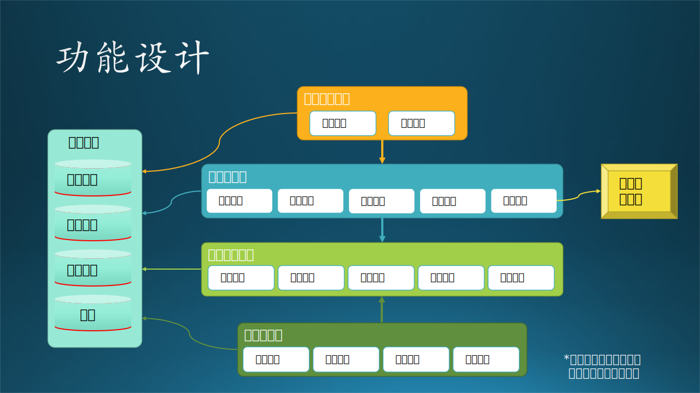

## 14.5 第三步：功能设计

### 14.5.1 系统结构设计

在图 14.4.1 中已经根据需求初步划分好了子系统和模块，所以从这节开始进入设计任务。本小节的标题是“系统结构”而不是“系统架构”，是因为这个系统比较小，但俗话说“麻雀虽小五脏俱全”，这个小系统也是有架构的。

整个系统的的分析整理过程的思路如下：

（1）首先，根据研究员和工程师的用例图，系统是要肯定有“训练子系统”和“推理子系统”的。前者可以在任何时间运行，供研究员做试验使用；后者只在用户有新数据上传时才运行。
（2）模型管理模块更多地是为训练子系统提供服务，为研究员的试验保存参数和模型等数据。对于推理子系统来说，只获取发布的最新模型即可，对于模型管理模块的依赖不是很强烈。但是鉴于模型管理模块的复杂性，不能把它合并到训练子系统中。
（3）不能够让客户直接接触到推理子系统，要通过数据耦合方式来设计，即提供给客户上传和下载的接口，这些都可以归纳到用户界面模块中。这里有一个误区，大家看到“界面”两个字，一般会想到要给客户提供一个“交互式的界面”，其实 REST API 也是一种“界面”。

图 14-12 系统结构设计

图 14-12 是系统结构的两种架构方式：

- 架构 1：
  - 用户界面模块只为客户使用。
  - 工程师在后台直接操控“推理子系统”和“模型管理模块”。
  - 研究员在后台直接操控“训练子系统”和“模型管理模块”。

- 架构 2，所有参与者都通过用户界面模块访问后端的两个子系统和一个模块，但是设立不同权限：
  - 客户只能通过界面触发“推理子系统”提供的推理功能。
  - 工程师可以透过界面操作“推理子系统”和“模型管理”模块的任何接口。
  - 研究员可以透过界面操作“训练子系统”和“模型管理”模块的任何接口。

权衡利弊后，考虑到安全性和代码难度，我们采用了架构 1，工程师和研究员都可以通过专用网络访问后台系统和模块，客户只能通过简单的（但安全的）界面访问推理子系统的指定功能。

### 14.5.2 逻辑功能设计

我们把加工逻辑有组织地组合在一起，就会形成子系统/模块的概念。

- 对于大系统来说，每一个加工逻辑会变成一个模块，而完成一组相关功能的模块会组成一个子系统。
- 对于小系统来说，每一个加工逻辑会变成一个子模块，这些子模块会组成一个模块。

根据 14.4 节中的各种图，以及图 14-12 的架构 1，我们可以很轻松地绘制出该系统的静态功能结构，如图 14-13 所示。

图 14-13 看上去很完美的逻辑功能设计

从该图看，它与图 14.4.1 的差异在于：

- 有层次化关系和依赖关系。
- 连接了存储系统。
- 连接了外部通知系统。

#### 1. 用户界面模块

对于客户的需求，只有上传、下载两个动作，所以可以设计为两个子模块（功能）。

在 11.2 节中，我们讲了技术选型的方法，下面的模块设计就是根据技术选型结果做出的：

- 上传文件：由于使用了Azure Blob，又不需要做交互式界面，所以直接使用 AzCopy.exe 即可，在客户机器上用命令行脚本调用；

- 下载文件：AzCopy.exe 同样可以下载文件，也使用命令行脚本调用。

#### 2. 推理子系统

由于推理模块对计算资源的要求较高，我们也必须把它设计为一个独立的子系统。包含很多模块，比如：

- 提取模型：从模型库中提取训练好的模型。
- 数据处理：如数据复制、数据处理、提取特征值、样本归一化等。
- 模型推理：运行推理过程。
- 保存并发布结果。
- 通知客户下载结果。

上面这些模块都是顺序调用的，需要设计一个主控进程来负责调用。

#### 3. 模型管理模块

模型管理模块包含很多子模块（功能），比如：

- 查找模型：根据名字、日期或其它条件查找模型。
- 添加模型：新训练的模型加入模型库。
- 删除模型：把性能不好的模型删除。
- 评估模型：评估模型的性能。
- 发布模型：给某个模型设置一个发布标记（具有唯一性），供推理子系统提取。

#### 4. 训练子系统
  
由于训练模块对计算资源的要求非常高，我们必须把它设计为一个独立的子系统，包含很多模块，比如：

- 数据预处理：数据读取、数据处理、提取特征值、样本归一化等。
- 参数管理：选取合理的参数组合进行初始化。
- 训练模型：使用 K8S 和 Pytorch 等训练神经网络模型。
- 保存模型：训练好的模型保存通过模型管理模块的接口如模型库。

【最佳实践】初步完成结构和功能设计后，还应该再结合运行时刻的各种情况来重新审视已有的设计是否满足运行要求，并在必要时修改已有设计。因为静态的结构和功能是完备的，比如一个汽车模型再漂亮也有可能跑不起来。
