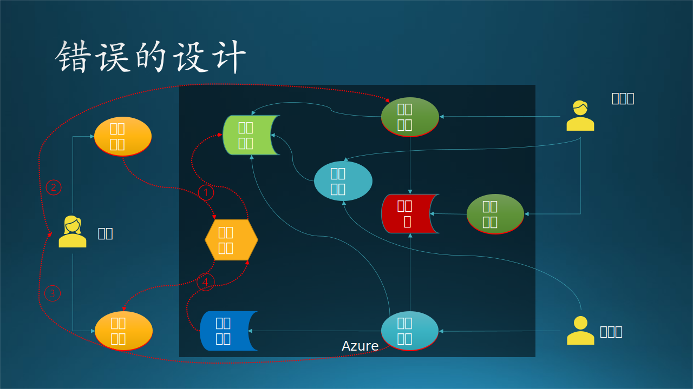
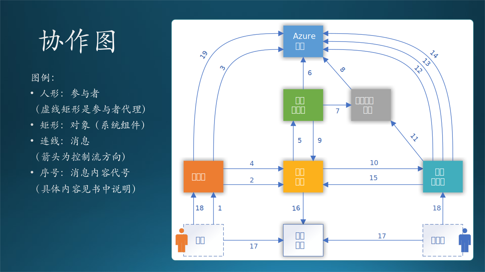
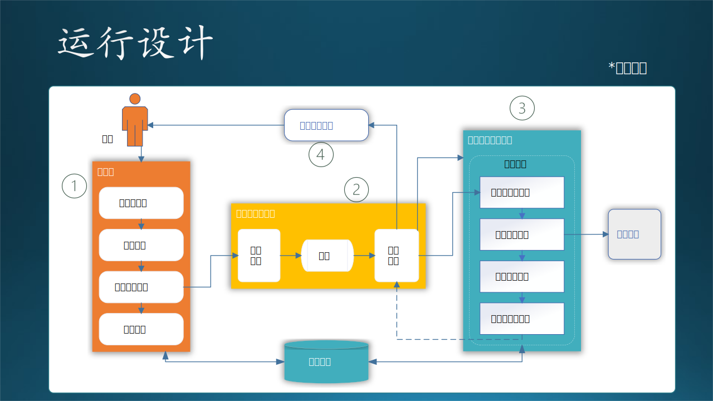

### 14.4.2 处理加工逻辑

我们把加工逻辑有组织地组合在一起，就会形成子系统/模块的概念。

- 对于大系统来说，每一个加工逻辑会变成一个模块，而完成一组相关功能的模块会组成一个子系统。
- 对于小系统来说，每一个加工逻辑会变成一个子模块，这些子模块会组成一个模块。

图 14.4.2 - 加工逻辑的“潜规则”

#### 客户子系统

对于客户的需求，只有上传、下载两个动作，所以可以设计为两个模块。

在 10.2 节中，我们讲了技术选型的方法，下面的模块设计就是根据技术选型结果做出的：

- 上传文件：由于使用了Azure Blob，又不需要做交互式界面，所以直接使用 AzCopy.exe 即可，在客户机器上用命令行脚本调用；

- 下载文件：AzCopy.exe 同样可以下载文件，也使用命令行脚本调用。

上面两个模块容易理解，但是下面两个模块是怎么回事儿？

- 获得上下文
- 触发通知

我们将在 14.4.4 讲解。

#### 模型训练子系统
  
由于训练模块对计算资源的要求非常高，我们必须把它设计为一个独立的子系统，包含很多子模块，比如：

- 数据预处理
  - 数据读取
  - 数据处理
  - 提取特征值
  - 数据归一化
- 训练
  - 训练代码载入
  - 超参数初始化
  - 启动训练
- 监视训练过程
- 停止训练
- 保存模型
  
上面这些子模块都是顺序调用的，需要设计一个主控模块来负责调用。

#### 模型管理子系统

模型管理作为一个子系统，也包含很多子模块，比如：

- 保存模型
- 提取模型
- 评估模型
- 组合模型
- 删除模型
- 发布模型

上面这些模块是并列的，也需要设计一个主控模块来负责按需调用，可以有界面，也可以是 API 接口。

- 数据处理：这是一个共用模块，被模型训练子系统调用，同时也被模型预测子系统调用。

- 提交训练代码：是一个 Azure 之外的模块，可以使用任何支持深度学习的框架来编写代码，并使用Git提交，不在本系统的设计范围内。

#### 模型预测子系统

工程师主要负责模块预测子系统，由于预测模块对计算资源的要求较高，我们也必须把它设计为一个独立的子系统。包含很多子模块，比如：

- 数据处理
  - 数据读取
  - 数据处理
  - 提取特征值
  - 数据归一化
- 预测
  - 预测代码载入
  - 启动预测
- 监视预测过程
- 停止预测
- 保存结果

上面这些子模块都是顺序调用的，需要设计一个主控模块来负责调用。

- 提交预测代码：是一个 Azure 之外的模块，可以使用任何支持深度学习的框架来编写代码，并使用Git提交，不在本系统的设计范围内。

### 14.4.3 设计触发机制

图 14.4.2 - 设计控制中心

图 14.4.2 描述了上面的分析：

1. 上传文件结束后通知“控制中心”，这也避免了客户端程序直接接触到系统的核心功能，需要的话，在控制中心可以做各种保护措施；
2. 控制中心调度，执行训练；
3. 训练完毕后确定是否启用最新模型，如果新模型性能不如旧模型，则依然使用旧模型预测，然后执行预测；
4. 预测结束后通知用户去下载结果文件。

这种中心化的设计在系统设计中是很常见的。其缺点是要多设计、编码、部署出一个控制中心来，优点是业务逻辑非常容易调整，安全隔离，利大于弊。

### 14.4.4 如何实现“通知”

现在我们来解释客户子系统中的“获得上下文”和“触发通知”是什么意思。

如 14.4.3 讲解，如何实现“通知”控制中心呢？用计算机语言如何描述呢？由于客户端是一个极简的批处理文件（batch file），它可以调用 AzCopy.exe 来完成文件传输，当然也可以调用 CURL.exe 可执行程序来触发 Web API/REST API。

在上传文件时，AzCopy.exe 要求指定目标文件夹，我们也需要在 Azure Blob 上维护一个良好有序的目录结构，来存放每周上传的数据。客户端每周都要上传一次数据，带有强烈的时间信号，所以我们设计用时间戳来表示本批次的数据。由于客户端的机器的系统时间很可能设置不准确，所以需要从服务器取一个时间戳来表示上下文，本次上传后面所有的操作都是用这个上下文来串连。

所以：

- 获得上下文：使用 CURL.exe 调用 REST API 获得服务器的时间戳。
- 触发通知：使用 CURL.exe 调用 REST API 来告知控制中心数据传输完毕。

### 14.4.5 控制中心的设计误区

在设计控制中心时，有一个非常常见的误区，见图 14.4.3：

图 14.4.3 - 错误的设计

## 11.7 接口设计

### 11.7.1 接口技术选择

这里的接口指的是子系统之间的接口，而不是具体的编程语言接口，如 Java、C# 中定义的接口。另外，简单的 API 调用也不是我们要讨论的接口，我们主要讨论跨越进程甚至物理机器之间的接口设计问题。

在 11.6 节的交互设计中，我们确定了两个组件（子系统）之间如何交互，现在要设计具体接口，即：

1. 使用什么技术？
2. 传送什么数据？
3. 返回什么结果？

接口技术的选择：

- Web Service
  
  使用SOAP（Simple Object Access Protocol，简单对象访问协议）提供了在各种平台、框架上运行的不同软件之间可以进行互操作的标准方法。

- Web API/REST API
  
  使用 HTTP 协议的 GET、POST、PUT、DELETE 操作封装 JSON 数据作为参数，驱动服务器完成指定任务。

- RPC（Remote Procedure Call，远过程调用）
  
  有很多中间件可以完成 RPC，调用者在本地使用一个简单的 API，透明地通过服务器传递给被调用者完成指定功能。

- 管道
  
  是一种简单的 IPC（进程间通信）机制，可以是单向的或双向的，传送自定义消息，接收方自行解释执行相应功能。

- Message Queue

  消息队列，FIFO先入先出，是一种进程间通信的方式，接收方繁忙或掉线时，消息不会丢失，直到接收方可以重新主动获得消息。

- Socket

  最底层的套接字通讯，自己封装数据包并在发送和接收端解析，完成指定功能并返回给对方。

在本系统中由于有了控制中心的存在，使得不同子系统之间的网状连接变成了与控制中心的星形连接，大大简化了通信成本。由此可见，当系统中存在4个以上的子系统时，一定要使用星形连接来构建。

下面我们逐个设计每个组件需要的外部接口。

### 11.7.2 客户端需要的外部接口

图 11.7.1 - 客户端需要的接口

#### 接口 A1

包括两个方法：

- 获得时间戳
   
   - 方法：GET /api/get_timestamp/
   - 目标：控制中心
   - 返回：\<timestamp\> 时间戳

   客户端每周都要上传一次数据，带有强烈的时间信号，所以我们设计用时间戳来表示本批次的数据，时间戳的格式是“YYYYmmddHHMMSS”，即“年月日时分秒”。

- 通知上传数据完毕

   - 方法：GET /api/start/\<timestamp\>
   - 目标：控制中心
   - 返回：200 OK

   这个方法用 POST 也是可以的，只不过用 GET 可以简化编程，也没有歧义。后面很多方法与此相同。
   
   客户端脚本上传完数据后，直接用 CURL.exe 可执行文件调用该接口，通知控制中心开始后续的工作。至于后续的工作是什么，由控制中心决定。

#### 接口 A2

- 接收邮件
  - 方法：邮件客户端软件
  - 目标：外部邮件系统
  - 返回：邮件内容，内含网页链接

  甲方会收到控制中心发送的邮件通知，然后使用本地的邮件客户端接收邮件。内容是告知甲方上传数据完毕或可以下载预测结果文件。

#### 接口 A3

- 存取 Azure 存储
  - 方法：AzCopy.exe 可执行程序
  - 目标：Azure 存储
  - 返回：成功或失败

  客户端上传、下载数据文件时使用。

#### 接口 B1

包括四个方法：

- 检查训练结果
   - 方法：GET /api/review_training_result/\<timestamp\>
   - 目标：控制中心
   - 返回：HTML 格式网页
  
  这个接口实际上返回一个网页，研究员需要用此网页来检查训练结果的正确性，避免需要登录到 Azure 虚拟机上检查的麻烦。

- 确认训练结果
  - 方法：GET /api/confirm_training_result/\<timestamp\>
  - 目标：控制中心

  在上面的接口方法返回的网页上，有一个按钮，研究员可以点击此按钮调用 REST API 触发本接口，控制中心将接到通知，进行下一步操作（进入下一个状态）。

- 检查预测结果
   - 方法：GET /api/review_inference_result/\<timestamp\>
   - 目标：控制中心
   - 返回：HTML 格式网页
  
  这个接口实际上返回一个网页，研究员需要用此网页来检查训练结果的正确性，避免需要登录到 Azure 虚拟机上检查的麻烦。

- 确认预测结果
  - 方法：GET /api/confirm_inference_result/\<timestamp\>
  - 目标：控制中心
  - 返回：

  在上面的接口方法返回的网页上，有一个按钮，工程师可以点击此按钮调用 REST API 触发本接口，控制中心将接到通知，进行下一步操作（进入下一个状态）。
  
#### 接口 B2

- 接收邮件
  - 方法：邮件客户端软件
  - 目标：外部邮件系统
  - 返回：邮件内容，内含网页链接

  乙方会收到控制中心发送的邮件通知，然后使用本地的邮件客户端接收邮件。内容是告知研究员训练完毕，需要检查训练结果并确认，或者是告知工程师预测完毕，需要检查预测结果并确认。

### 11.7.3 控制中心需要的外部接口

图 11.7.2 - 控制中心需要的外部接口

#### 接口 C1

- 启动预测子系统
  - 方法：使用系统命令行接口调用 ssh 远程登录并执行指定启动代码
  - 目标：预测子系统
  - 返回：停等，直到预测过程结束后返回控制权

  控制中心需要预测子系统暴露出启动接口。

#### 接口 C2

- 启动训练子系统
  - 方法：使用系统命令行接口调用 ssh 远程登录并执行指定启动代码
  - 目标：训练子系统
  - 返回：停等，直到训练过程结束后返回控制权

  控制中心需要训练子系统暴露出启动接口。

#### 接口 C3

- 访问 Azure 存储
  - 方法：得到预测或者训练的文本输出
  - 目标：Azure 存储
  - 返回：得到文本文件内容

  控制中心需要访问 Azure 存储读取指定文本文件内容。

#### 接口 C4

- 发送邮件通知

  - 方法：本地 API 调用（SMTP 协议 Python 支持包）
  - 目标：外部邮件系统
  - 返回：成功或失败

  控制中心需要发送邮件给外部邮件系统。

### 11.7.4 内部子系统需要的外部接口

图 11.6.3 - 训练/预测/管理需要的外部接口

#### 接口 D1

- 访问 Azure 存储
  - 方法：本地 API 调用（安装 Azure 的 Python 支持包）读取或者存储文件
  - 目标：Azure 存储
  - 返回：成功或失败

  预测子系统需要读取 Azure 存储上的数据文件，把预测结果保存到存储。

#### 接口 D2

- 获得最新模型
  - 方法：本地 API 调用（安装 ML-flow 的 Python 支持包）读取最新模型文件
  - 目标：模型管理子系统
  - 返回：成功或失败

  预测子系统从模型管理子系统获得最新发布的模型文件。

#### 接口 E1

- 写入模型
  - 方法：本地 API 调用（安装 ML-flow 的 Python 支持包）写入模型文件
  - 目标：模型管理子系统
  - 返回：成功或失败

  训练子系统把训练好的模型写入模型管理子系统。

#### 接口 E2

- 访问 Azure 存储
  - 方法：本地 API 调用（安装 Azure 的 Python 支持包）读取或者存储文件
  - 目标：Azure 存储
  - 返回：成功或失败

  训练子系统把训练结果写入 Azure 存储上的文本文件。

#### 接口 F1

- 访问 Azure 存储
  - 方法：本地 API 调用（安装 Azure 的 Python 支持包）读取或者存储文件
  - 目标：Azure 存储
  - 返回：成功或失败

  模型管理子系统（ML-flow）需要使用 Azure Blob 作为模型试验存储。

图 11.6.3 - 客户子系统的

## 11.6 交互设计

上一节中得到了控制中心的状态设计，下面我们要设计控制中心、训练子系统、预测子系统、存储服务，还有参与者之间的交互关系，让整个系统能够运转起来。

交互设计是用于描述对象之间的交互关系，可以用两种图来辅助设计，一是协作图，二是顺序图。

### 11.6.1 协作图

协作图描述对象之间的协作关系，进一步弥补了 11.4 节中关于通知/调用的顺序问题。

图 11.6.1 - 协作图

在图 11.6.1 中，以“控制中心”对象（也可以叫做模块、子系统等等）为中心，连接起来周围的几个对象，所有的对象都与控制中心有交互，而对象之间（除了存储）基本没有交互。

为什么存储是个例外呢？因为存储在这里作为一个底层的公共模块，最好是被所有模块直接访问，如果都通过控制中心来访问的话，就太 Heavy 了。除了一种情况：对于存储，你的系统封装了一层业务逻辑，或者存储是一种分布式的，必须通过单点访问。

图 11.6.1 的左侧列出了右侧连接线上的序号所代表的实际交互行为，是按顺序发生的。连线的箭头方向表示交互的发起者到接收者的方向，而不是数据流或信息流的方向。

交互行为有以下几种：

- 人机交互
  
  人操作计算机，可以是键盘、语音、手势等，比如 1，13。

- 本地运行程序
  
  启动一个可执行文件，比如 6。

- 远过程调用
  
  以 TCP/IP 为基础的自定义通信协议，在本例中，使用 ssh 方式登录到其它机器上，然后执行程序。比如 4。

- RESTful API

  通过 RESTful API 调用服务器上的功能。比如 3，11。

- 网页访问
  
  用浏览器与服务器进行交互，执行简单逻辑。比如 9。

- 数据访问
  
  存取数据库、块存储、数据文件等。比如 2，5，7，10，14。

- 邮件通知
  
  通过第三方的电子邮件系统，异步通知对方做下一步动作。比如 8，12。这种方式比较特殊，由于大家对电子邮件方式非常熟悉，所以不做详细说明。在电子邮件内容或附件中，一般包含了下一步动作的指示。

### 11.6.2 顺序图

协作图刻画的是控制流，是一种初级的交互设计，但是还不够细，不能让程序员在实现阶段得到全面的信息。顺序图进一步弥补了这一缺陷。

图 11.6.2 - 顺序图

图 11.6.2 中的六个对象与图 11.6.1 中完全相同，每个对象下方的垂直虚线，表示该对象的作用域，而虚线上的长条表示改对象在系统运行中具有的生命周期（如果没有长条，则表示一直运行）。比如，控制中心是一直运行的，但预测子系统只会运行一小段时间，其他时间关机。

对比协作图中的动作 1 至 3：

1. 客户启动上传文件脚本；
2. 客户端脚本上传文件到存储；
3. 客户端通知控制中心启动预测。

在顺序图中，会有更为详尽的设计描述：

1. 客户启动上传脚本；
2. 上传文件夹内的数据文件；
3. 获得进度反馈，显示在脚本运行界面上（文本方式）；
4. 上传完毕后会返回控制权；
5. 客户端使用 REST API 发送启动预测服务的通知；
6. 控制中心接收，并返回确认；
7. 客户在脚本运行界面上看到确认返回的信息。

可以看到，顺序图会描述交互设计细节，包括以何种方式交互以及返回什么消息。有了顺序图，开发人员就可以开始编写代码了。

### 11.6.3 错误的顺序图设计

面对同样的问题，大家都会有不同的解决方案，没有对错，只是考虑的角度不同。但是有些设计却具有明显的错误。木头曾经把这个问题当作一个课堂练习，让同学们来设计系统，图 11.6.3 是其中一组同学的设计。

图 11.6.3 - 错误的设计

我们来一起分析一下这个设计的错误在哪里。这种图没有用标准的 UML 图例来画，也没有使用正确的工具，这个问题我们暂且不追究。

1. 使用浏览器来上传下载文件
   
   这个问题实际上在 10.2 节中已经讨论过了，做网页存在诸多弊端，如安全性、合规要求、数据断点续传、网页设计开发成本、引发潜在客户需求、部署 Web 服务等等。而它唯一的优点是在客户端不需要部署任何代码，为了这个“优点”，我们要做很多事情，在本项目中是得不偿失的。如果有成百上千的匿名访问客户使用该系统，我们还可以考虑使用浏览器技术。

2. 使用 Azure File 来存储数据文件
   
   这个问题在 10.2 节也讨论过了，文件系统需要装载到服务器才能使用，如果想在远程客户端使用 Azure 中的文件系统，那还需要额外的协议才能做到，还要考虑安全性、效率等等。而 Azure Blob 没有以上这些问题，可以在任何地方访问，作为共享存储的理想选择。

3. 使用 Azure Funtion 来开发控制中心逻辑
   
   Azure Function 是一种无服务（serverless）模式，可以通过一些事件触发机制来处理 HTTP 请求，然后做一些可以快速响应的任务，把结果返回给客户端浏览器。

   但是在图 11.6.3 的设计中，控制中心通过“启动程序”消息来启动预测子系统，预测结束后返回，在图中看，应该是设计了一个同步过程，但是这个预测的过程需要1个多小时，这就违反了 Azure Function 的设计初衷。如果设计成异步模式，“预测结束”这个事件并不能通知到Azure Function上，它只能接收事先定义好的系统事件。

   按前面的分析和设计，控制中心是一个状态机，恐怕用一个处理简单事件的 Azure Function 不能满足要求，而是需要一个完整的自定义系统来支持，比如虚拟机。

4. 启动预测子系统没有给出设计细节
   
   从控制中心启动预测子系统，在该设计中只给出了“启动程序”一条消息，过于笼统，另后续的程序员无法开始编码。预测子系统一定是一个独立的子系统，运行在专有服务器上。如果想启动它，则需要跨越机器操作，方法有很多种，必须要说清楚。

   在本例中，由于预测子系统是一台 Linux 操作系统的虚拟机，所以我们使用了 ssh 的“偷懒”方式，远程登录到该机器上启动程序，然后原地停等，直到预测过程结束后返回。其中，ssh 是用程序调用的。

5. 使用单独的组件来验证结果
   
   该组同学把验证程序作为一个Docker/Container来设计和实现，似乎是想把 Azure 上的相关技术全都使用上，这是没有必要的。“验证结果”功能完全可以作为预测子系统的一部分来提供，在预测完毕后立刻执行，没有必要设计一个单独的组件，增加了设计、实现、部署、维护的复杂性。

6. 人工检查确认结果没有给出设计细节
   
   在预测完毕后，需要工程师来人工检查预测结果并确认，但是该设计中没有指出如何检查，比如：

   - 通过电子邮件内容来检查
   - 远程登录到控制中心来检查
   - 通过一个网页检查
   
   可能性太多了。并且也没有说明如何“确认”，比如：

   - 在命令行输入什么命令？
   - 在界面上点击什么按钮？
   - 在系统中启动什么程序？

总结一下，图 11.6.3 这种粒度的设计，只能用于示意性说明，需要后期更完善的文字辅助来细化设计。最糟糕的情况是，有可能在做原型实现时，忽然发现某个设计在技术上是行不通的。

## 11.5 状态设计

### 11.5.1 控制中心的状态转换

在数据流图中定义了一系列大的流程，在功能设计中划分了模块，但是都没有给出所有的分支和细节，所以我们在这一小节要通过对控制中心的状态转换设计来捋清楚所有细节。绘制传统的流程图也是可以做到这一点的，但是不包含状态名称信息，在后面的文档或者开发过程中，不容易形成共同语言。而且使用流程图做设计，实现时只能用 if...else 来编写代码，当一个对象状态非常复杂时，用 if...else 解决不了问题。

图 11.5.1 - 控制中心状态设计

状态解释如下：

1. 初始状态，手工启动控制中心的程序，进入“已启动”状态；
2. 用户上传数据，完毕后会通知控制中心，进入“已上传”状态；
3. 自动检测数据，如果合格，就启动训练，进入“训练中”状态；如果不合格，就终止；
4. 训练完毕后进入“已训练”状态；
5. 检查训练结果，即新的数据模型是否优于旧的模型，合格的话使用新模型进入预测，不合格的话使用旧模型进入预测；进入“预测中”状态；
6. 预测完毕，进入“已预测”状态；
7. 检查预测结果，如合格就发布结果，进入“已发布”状态；如果不合格，就“终止”；
8. 发布完毕后，进入“终止”状态。

其中，“启动控制中心”和“退出控制中心”都是手动完成的，不需要编码。

控制中心提供 REST API 以便得到外部通知，再对内进行任务调度。图 11.5.1 的各状态之间的转换还算比较规矩（顺序性较强），基本没有乱跳的，所以后续的开发人员在编码实现时，用 if...else 来实现呢，还是用状态机模型来实现呢？这依赖于在业务逻辑中有没有异步或者阻塞情况发生。

比如，“已预测”状态后，会有一个事件（在状态设计中叫做事件，在功能设计中叫做模块）叫做“检查预测结果”，如何检查不是状态设计要关心的问题，在具体运行中，有可能是手工检查（这就需要中断流程，并在控制中心提供一个界面来人工检查预测结果数据），也可能是自动检查（通过一段代码来判断输出结果是否符合要求）。

如果是人工检查的话，那就是一个异步过程：

1. 预测完毕，输出预测结果到文本文件存储；
2. 系统生成一封电子邮件，发送给当事人；这一步已经脱离了本系统的控制。
3. 邮件里面带着一个链接，点击链接将会从控制中心得到一个网页，来浏览预测结果文件的文本内容；
4. 网页最下端有一个“合格”按钮和一个“不合格”按钮，用于通知控制中心，是继续后面的流程，还是就此终断。这一步又把控制权返回给系统。

还有一种设计方式是，当文本文件的内容不多时，可以放到邮件正文或附件中，并在邮件正文中附带一个链接，导航到控制中心的一个简单网页上，再选择“合格”或“不合格”。

### 11.5.2 虚拟机状态设计

由于系统都运行在 Azure 上，而且定制化程度较高，所以我们都使用 Azure 上的虚拟机来搭建控制中心、训练子系统、预测子系统。

由于虚拟机的收费较高，所以要研究清楚虚拟机的收费策略，即：
- 需要申请虚拟机，虚拟机自动启动；
- 虚拟机在“已启动”时，是按时长收费的，不管是否运行了应用程序；
- 虚拟机在“已关闭”时，仍然收费（Azure的这个设计让用户有些不解，并因此忘记释放资源而继续被动付费）；
- 虚拟机在“已释放”后，停止收费，但是“释放”并非“销毁”，里面安装的应用和数据还是可以打开虚拟机后再重新加载继续使用的，不会丢失；
- 虚拟机在删除后，数据全部丢失。

把上面的策略总结成状态转换，如图 11.5.2 所示。

图 11.5.2 - 虚拟机状态设计

### 11.5.3 错误的状态设计

初学者在做状态设计的时候，会出现的一些常见错误如图 11.5.3 所示。

图 11.5.3 - 错误的状态设计

这同样是虚拟机的状态设计，存在三个问题：

1. 状态域不正确
   
   我们可以对比图 11.5.2，就可以发现问题：本图中“启动中”和“已关闭”状态是正确的虚拟机状态域，都是属于硬件和操作系统级别的状态；但是“空闲”和“繁忙”并不是，它们是属于应用软件系统的状态。

2. 状态/事件缺失
   
   和上一个状态域不正确的问题合并，缺失“已启动”、“关闭中”两个状态，实际上“空闲”应该是“已启动”，“繁忙”应该是“关闭中”。因为关闭不是瞬间完成的，如果可以瞬间完成的话，那么事件应该是“掉电”。

3. 状态跳跃不正确

   我们先假设“繁忙”是正确的状态，从“繁忙”跳到“已关闭”的话，会有很多应用数据丢失，所以必须从“繁忙”先跳到“空闲”，把正在执行的任务优雅地停止，保存好状态数据，然后才能关闭。

