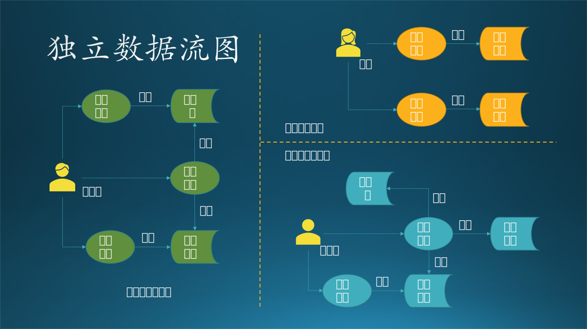
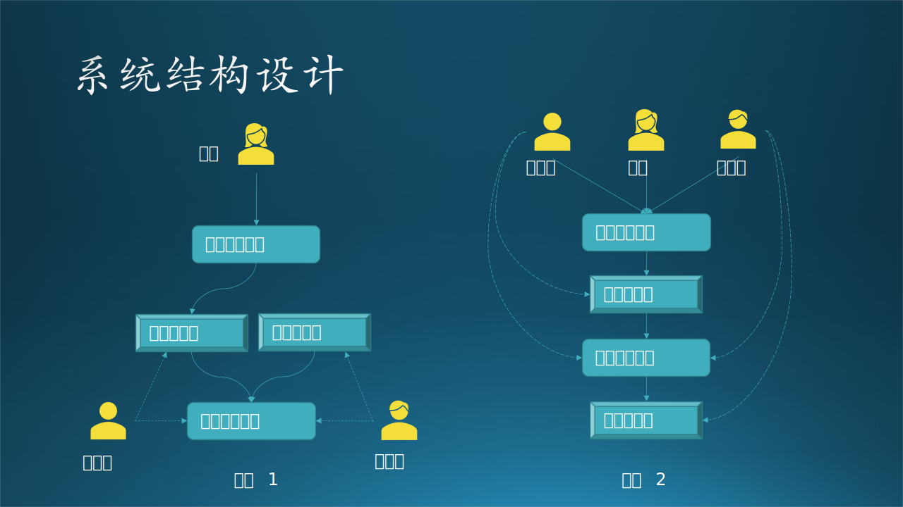
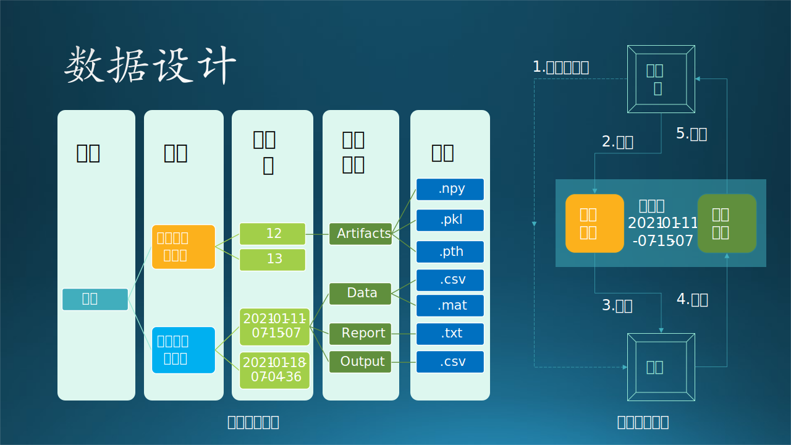

## 14.4 第二步：逻辑功能与运行设计

### 14.4.1 系统结构设计

在图 14.3.3 中已经根据需求初步划分好了子系统和模块，所以从这节开始进入设计任务。本小节的标题是“系统结构”而不是“系统架构”，是因为这个系统比较小，但俗话说“麻雀虽小五脏俱全”，这个小系统也是有架构的。

整个系统的的分析整理过程的思路如下：

1. 首先，根据研究员和工程师的用例图，系统是要肯定有“训练子系统”和“推理子系统”的。前者可以在任何时间运行，供研究员做试验使用；后者只在用户有新数据上传时才运行。
2. 模型管理模块更多地是为训练子系统提供服务，为研究员的试验保存参数和模型等数据。对于推理子系统来说，只获取发布的最新模型即可，对于模型管理模块的依赖不是很强烈。但是鉴于模型管理模块的复杂性，不能把它合并到训练子系统中。
3. 不能够让客户直接接触到推理子系统，要通过数据耦合方式来设计，即提供给客户上传和下载的接口，这些都可以归纳到用户界面模块中。这里有一个误区，大家看到“界面”两个字，一般会想到要给客户提供一个“交互式的界面”，其实 REST API 也是一种“界面”。

如图 14.4.1 所示。

图 14.4.1 系统结构设计

图 14.4.1 是系统结构的两种架构方式：

- 架构 1：
  - 用户界面模块只为客户使用。
  - 工程师在后台直接操控“推理子系统”和“模型管理模块”。
  - 研究员在后台直接操控“训练子系统”和“模型管理模块”。
- 架构 2，所有参与者都通过用户界面模块访问后端的两个子系统和一个模块，但是设立不同权限：
  - 客户只能通过界面触发“推理子系统”提供的推理功能。
  - 工程师可以透过界面操作“推理子系统”和“模型管理”模块的任何接口。
  - 研究员可以透过界面操作“训练子系统”和“模型管理”模块的任何接口。

权衡利弊后，考虑到安全性和代码难度，我们采用了架构 1，工程师和研究员都可以通过专用网络访问后台系统和模块，客户只能通过简单的（但安全的）界面访问推理子系统的指定功能。

### 14.4.2 逻辑功能设计

我们把加工逻辑有组织地组合在一起，就会形成子系统/模块的概念。

- 对于大系统来说，每一个加工逻辑会变成一个模块，而完成一组相关功能的模块会组成一个子系统。
- 对于小系统来说，每一个加工逻辑会变成一个子模块，这些子模块会组成一个模块。

根据 14.3 节中的各种图，以及图 14.4.1 的架构 1，我们可以很轻松地绘制出该系统的静态功能结构，如图 14.4.2 所示。

图 14.4.2 看上去很完美的逻辑功能设计

从该图看，它与图 14.3.3 的差异在于：

1. 有层次化关系。
2. 连接了存储系统。
3. 连接了外部通知系统。
4. 细化了用户界面模块，增加了两个功能：获得上下文，触发推理。

#### 1. 用户界面模块

对于客户的需求，只有上传、下载两个动作，所以可以设计为两个子模块（功能）。

在 11.2 节中，我们讲了技术选型的方法，下面的模块设计就是根据技术选型结果做出的：

- 上传文件：由于使用了Azure Blob，又不需要做交互式界面，所以直接使用 AzCopy.exe 即可，在客户机器上用命令行脚本调用；

- 下载文件：AzCopy.exe 同样可以下载文件，也使用命令行脚本调用。

#### 2. 推理子系统

由于推理模块对计算资源的要求较高，我们也必须把它设计为一个独立的子系统。包含很多模块，比如：

- 提取模型：从模型库中提取训练好的模型。
- 数据处理：如数据复制、数据处理、提取特征值、样本归一化等。
- 模型推理：运行推理过程。
- 保存并发布结果。
- 通知客户下载结果。

上面这些模块都是顺序调用的，需要设计一个主控进程来负责调用。

#### 3. 模型管理模块

模型管理模块包含很多子模块（功能），比如：

- 查找模型：根据名字、日期或其它条件查找模型。
- 添加模型：新训练的模型加入模型库。
- 删除模型：把性能不好的模型删除。
- 评估模型：评估模型的性能。
- 发布模型：给某个模型设置一个发布标记（具有唯一性），供推理子系统提取。

#### 4. 训练子系统
  
由于训练模块对计算资源的要求非常高，我们必须把它设计为一个独立的子系统，包含很多模块，比如：

- 数据预处理：数据读取、数据处理、提取特征值、样本归一化等。
- 参数管理：选取合理的参数组合进行初始化。
- 训练模型：使用 K8S 和 Pytorch 等训练神经网络模型。
- 保存模型：训练好的模型保存通过模型管理模块的接口如模型库。

【最佳实践】初步完成结构和功能设计后，还应该再结合运行时刻的各种情况来重新审视已有的设计是否满足运行要求，并在必要时修改已有设计。因为静态的结构和功能是完备的，比如一个汽车模型再漂亮也有可能跑不起来。

### 14.4.3 空间流程设计

绘制流程图是最佳的考察系统运行时各种情况的手段，如果前面的是静态设计，那么这时动态设计的第一步。有了 14.3 节中的数据流图和模块划分的基础，绘制流程图相对比较容易，可以把各种活动（模块）串接在一起，形成具体功能，以验证模块划分的正确性。

活动图是 UML 用于对系统的动态行为建模的一种常用工具，它描述活动的顺序，展现从一个活动到另一个活动的控制流。活动图在本质上是一种流程图。活动图着重表现从一个活动到另一个活动的控制流，是内部处理驱动的流程。

在图 14.4.3 中，绘制了一张具有三泳道的流程图（实际上应该叫做活动图），单独画三个流程图也是一样的，只不过看不到泳道之间的交互了。不同的泳道中的元素用不同的颜色标记，一目了然。在图的左侧有图例说明，请读者自行阅读，不再赘述。

图 14.4.3 三泳道活动图

每个泳道中是一个独立的流程图，在泳道之间有活动交互，整体形成一个多头的流程图。数据存储包括：股票数据、代码库、模型库、结果文件。

- 客户流程中有两个分支，上传文件和下载文件。其中，上传文件结束后，会调用另外一个泳道的推理流程中的数据处理模块，然后执行推理流程；再通知客户时，又会回到客户流程泳道中，让用户执行下载文件的动作。

- 推理流程中有两个分支，一个是线下写推理代码的部分，另外一个是执行线上推理的部分。

- 训练流程有三个分支，一是在线下模型管理，二是在线下写训练代码，三是在线上进行模型训练的流程。

【最佳实践】

1. 这一步不是必须的，只有在流程较长或逻辑比较复杂时，才有绘制流程图的必要。
2. 把不同角色的业务流程画在各自的泳道中，整体形成活动图，即有了流程图，又能看到不同模块之间的接口。
3. 把数据存储加上，会使得交互细节更清楚，属于一种松散耦合的设计，值得推荐。

这张空间流程设计可以利用泳道很清楚地把位于不同子系统的模块分开，这也就带来一个实际问题：这些模块都是如何被执行的？

### 14.4.4 消息流程的设计

首先，不论是子系统还是模块，都可以对应到一个应用程序上。而激活一个程序有五种方式：

1. 常驻进程。

   即操作系统启动后，目标进程就自动启动，始终处于监听或工作状态。不适合本场景，因为运行推理子系统的计算节点比较贵，平时处于关机状态，只在需要时打开。

2. 人工手动启动程序
  
   不适合本场景。因为客户不能确定在工作时段上传文件，工程师不一定保证能及时响应来启动推理流程；我们也不能让客户来进入后台系统启动推理过程，那样做安全风险太大。

3. 定时启动

   不适合本场景。因为不知道用户何时上传数据，如果正上传一半时启动程序，数据不完整，程序就会出错。无论怎样设置定时器，都有可能发生这种情况。

4. 由特殊事件触发
   
   使用块存储时，每次的文件上次都可以触发一次事件。我们是否可以监听这个事件作为触发机制呢？

   对于股票交易来说，如果上周有5个交易日，一共5个文件；如果只有3个交易日，就只有3个文件。所以用户每次上传一个文件，都会触发一次独立的文件变化通知，那么我们如何知道哪个通知是最后一个呢？也许用户上传了3个文件，喝了杯咖啡，然后又上传了2个文件。

   当时木头在做这个设计时，在小组内讨论了多次，其中一个 Dev Lead 认为我们应该在服务器端维护一套完美的逻辑，能够判断出“用户上传文件是否结束了”。但是，木头想来想去都觉得这是不可能完成的任务，总会有意外发生，不可能完美。

   还有一种设计：
   - 在客户端把所有要上传的文件先打包压缩成一个文件，然后把压缩文件上传，这样就只触发一次通知事件。但是这需要在客户端有“压缩”的逻辑代码，或者用一个第三方软件来完成。
   - 传到 Blob 上以后，在使用前需要先解压，在服务器端需要用同样的软件/协议来解压缩，然后再写回 Blob 中，便于以后使用。

   从逻辑上看，复杂很多，遂放弃此设计。所以，事件触发这条路也走不通。

5. 由其它程序调用

   由于 Azure 边界的存在，上传文件行为是在客户端发生的，远在 Azure 之外，它不可能“调用”部署在 Azure 内的推理模块，它只能“通知”。那么就需要再编制一个**主控程序**来接收“通知”，这样虽然会多出一些代码和设计的工作，但目前看来，这是我们唯一的解决方案。
   
   考虑到“训练”和“推理”子系统的独立性，我们尽量不要改它们现有的逻辑，而是在外面单独增加一个**控制中心**作为主控程序，来接收来自客户端的“通知”，再做后续处理。即，在用户上传完文件后，由客户端发送一个通知给控制中心，以便触发后面的工作流程。“上传”和“通知”两个动作最好在**一个事务中**完成。

位于同一泳道内的模块，都可以被主进程直接调用（即图 14.4.3 中的实线），但是跨泳道时就要使用“通知消息”来做远程触发了（即图 14.4.3 中的点划线）。虽然有成熟的远过程调用（RPC）技术，但是要求安全性较高，还要依赖框架或者独立开发一些辅助代码。而且位于 Azure 内的机器是不允许外部进行远过程调用的，所以必须在 Azure 内建立一个“控制中心”，以 Azure 允许的方式监听来自外部的通知消息，根据消息内容执行内部动作。

【最佳实践】这个“控制中心”，使得系统中又多出来一个模块，这是在静态功能设计时不可能考虑到的，必须在动态运行设计时补上。

由于多出来一个控制中心模块，使得整体流程变得复杂（但却是必须的），所以我们可以用一个更强大的工具——时序图，来做时序流程设计。如果活动图是空间划分，那么时序图就是时间划分。

图 14.4.4 推理流程的时序图

表 14.4.1 是图 14.4.4 中的时序图的图例。

表 14.4.1 时序图图例

|元素|说明|图例|
|-|-|-|
|角色（Actor）|系统角色|人形图标，如“客户”|
|对象（Object）| 参与交互的系统组件 | 矩形中带有文字，如“客户端” |
|生命线（Lifeline）|对象的生存时长 | 对象下方的垂直虚线 |
|控制焦点（Activation）| 对象的活动阶段 | 生命线上很窄的矩形（存储系统和控制中心 一直处于活动状态，所以没有画控制焦点）|
|消息（Message）|对象之间发送的消息 | 同步消息如“开启虚拟机”的实线实心箭头 异步消息如“邮件通知客户”的实线空心箭头 返回消息如“返回确认”的虚线空心箭头|
|自关联消息|对象内部的长过程调用|半闭合方形，如“推理”|

在图 14.4.4 中的各种消息和应答已经写得很清楚了，而且根据从上到下从左到右的顺序阅读，可以形成一个完整的时序流程。可以看到，全程不需要乙方参与，是一个全自动流程。
时序流程设计非常的细致，帮助设计者思考每个消息（动作）如何执行。比如：

1. 启动上传脚本：由客户在客户端上手工启动。
2. 上传文件夹：使用 AzCopy.exe 指定本地的文件夹上传到 Azure 存储上。
3. 发送启动推理服务信号：使用 REST API 向控制中心发送一个消息。
4. 开启虚拟机：发送 Azure 管理命令，开启在当前用户名下的虚拟机。
5. 远程启动推理服务：使用 Linux 系统自带的 ssh 执行远过程调用。
6. 读取存储数据：使用 Azure 的存储 API 读取数据。
7. 把结果写入存储：同 6，读变成写。
8. 控制中心关闭虚拟机：同 4，开启变成关闭。
9. 控制中心发送邮件通知：使用 Python 的邮件 API。这里省去了一个步骤，正常流程应该是发送给外部邮件系统，再由客户去查收。

【最佳实践】在时序图中画每一个消息的时候，都应该有对应的实现手段，如手工运行可执行程序、定时运行、远程执行、调用本地 API、调用 REST API 等等。如果发现有不能实现的地方，需要重新设计。

### 14.4.6 运行过程设计

由于增加了控制中心，所以图 14.4.2 就不准确了，请读者自己尝试把控制中心加到逻辑功能设计中。接下来，我们把控制中心加入运行过程设计中，如图 14.4.5 所示。其中，圆角矩形是进程，小的白色方块是模块，白色方框是计算节点。

图 14.4.5 推理子系统运行过程设计

该图中把所有进程都绘制出来了，但只涉及到推理子系统的运行，关于训练子系统的运行我们另外讲述。在推理子系统中涉及到四个部分：客户节点、控制中心节点、推理节点、外部通知系统。

#### 1. 客户端

在客户节点中开发一个简单的批处理程序，包含三个 cmd 命令，每个命令启动一个进程执行，然后关闭。它们分别是：获得上下文，上传数据，触发推理。新增加的两个模块是怎么回事儿？这就要考虑实际的运行情况了。

- 首先，在需求中有说明，这个系统的推理过程是自动完成的。即，在数据流图中绘制的“工程师”做“数据处理”这个动作，是一个在旧系统中手动的过程，我们需要把它升级为自动的过程。
- 其次，每周一客户都会上传一次数据文件，触发一次推理过程。这些文件和上周的文件如何区分呢？推理结果又如何区别呢？一个很自然的想法就是创建一个唯一的上下文，相当于 SessionID，让它贯穿于系统运行的始终。
- 最后，上传数据结束后，应该自动触发推理，但是系统并不能确定“上传数据结束”这个状态，因为每次上传的数据有很多。所以应该有一个明确的信号来触发推理，至于这个信号是让用户手动发送还是自动发送，可以在后面的设计中考虑。

这就说明一个问题：在有了初步的静态设计结果后，还应该结合动态的运行情况来细化设计。

1. 获得上下文

   在上传文件时，AzCopy.exe 要求指定目标文件夹，我们也需要在 Azure Blob 上维护一个良好有序的目录结构，来存放每周上传的数据。客户端每周都要上传一次数据，带有强烈的时间信号，所以我们设计用时间戳来表示本批次的数据。由于客户端的机器的系统时间很可能设置不准确，所以需要从服务器取一个时间戳来表示上下文，本次上传后面所有的操作都是用这个上下文来串连。

   可以使用 curl.exe 调用 REST API 获得服务器的时间戳，格式为“年月日时分秒”作为 SessionID，上传文件的目标文件夹和结果文件夹都用这个 SessionID 来命名。
   
   为什么不用客户端的系统时间呢？因为不可靠。控制中心一直在 Azure 中运行，时间信息是比较可靠的。

2. 上传数据到 Azure 的存储系统，这里使用了现有的 AzCopy.exe 应用程序，微软官方开发的。
3. 触发推理运行，实际上是使用 curl.exe 向控制中心的虚拟机发送一个 REST API 请求。

下载结果不在此批处理中，而是由客户在搜到邮件后手动执行，也是一个命令行程序。

所以，我们在客户端使用了简单的批处理，并且使用了现有的可运行程序，而无需自己开发，大大降低了开发和维护成本，提高了稳定性。该机器由客户自己提供并维护。

#### 2. 控制中心虚拟机

这种中心化的设计在系统设计中是很常见的。其缺点是要多设计、编码、部署出一个控制中心来，优点是业务逻辑非常容易调整，安全隔离，利大于弊。

该虚拟机处于常开状态，位于 Azure 上。上面运行了两个进程：

1. 监控进程，用于接收 REST API 请求。如果收到了客户机发来的推理请求，就向管道中发送一个“开始推理”的命令。
2. 工作进程，监听管道中的命令，收到“开始推理”命令后，
    2.1 启动推理虚拟机。
    2.2 远程启动推理进程，具体可以用 Linux 上自带的 ssh 命令，然后停等，一直等到推理进程结束后才会返回。

使用管道的好处是让“监控进程”和“工作进程”松散耦合，这样“监控进程”发送完一个命令后，可以立刻去监听下一个命令，相当于是一个异步过程。命令在管道中排队，由“工作进程”同步一一处理。

#### 3. 推理子系统虚拟机

该虚拟机算力很强，价格也较贵，所以平时处于关机状态，由控制中心的虚拟机（价格比较便宜）的工作进程给 Azure 发送命令打开虚拟机。所以其运行过程是：

1. 虚拟机被打开，等待完全可用。
2. 推理进程被远程 ssh 命令启动（同步过程），依次运行以下模块（不是独立进程）：
   2.1 从存储系统中复制数据到本机。
   2.2 从存储系统中提取当前可用的模型。
   2.3 启动推理。
   2.4 结束推理，保存并上传结果到存储系统。
3. ssh 命令结束后返回到控制中心的工作进程。
4. 工作进程发送 Azure 命令关闭虚拟机。
5. 工作进程发送通知给外部通知系统。

全程大概需要 1 个小时。注意此时控制中心虚拟机和推理虚拟机不能断开网络连接，因为 ssh 是一个同步的远过程调用，一旦断网，相当于父进程（工作进程）消失，那么子进程（推理进程）也会被杀掉。由于它们都在 Azure 上，所以这一点可以保证。

#### 4. 外部通知系统

此处我们采用了邮件系统，比较可靠，而且编程难度小，只需要几行发送邮件的代码即可。

工作进程发送的通知中，带有上下文信息，实际上该 SessionID 是全程都传送的。客户收到邮件后，根据上下文信息从指定的存储系统的目录中下载结果文件，同样使用 AzCopy.exe 程序。

### 14.4.7 错误的运行过程设计

木头曾经把这个案例放在课堂上，让实习生们分组去做设计。来我软的实习生实力还是比较强的，起码动手能力较强，每个组都给出了比较完整的设计，都能讲清楚工作原理。但是出现了几个常见的错误。如图 14.4.6 所示，图中的红色虚线表示不正确的设计。

图 14.4.6 错误运行过程设计

主要有 4 点错误：

1. 上传股票数据文件经过控制中心转发

    在控制中心做一个网页提供文件上传功能，然后由控制中心把文件写到数据存储中。

2. 由客户进程直接启动内部子系统

    这种情况是绝对禁止的，内部子系统的接口不能直接暴露在网络上，在客户和子系统之间，必须由控制中心进行转接，以保证其安全性。

3. 模型推理结束后直接通知客户

    不是不可以做，但是需要修改已有的推理逻辑，完成本来不属于推理子系统的任务。这就违背了单一职责的设计原则。

4. 下载文件通过控制中心转发

    在下载时同样通过控制中心读取结果文件，再由网页引导下载。

第 2,3 点已经被否定了，第 1,4 点的设计本身肯定是可以工作的，但是为什么在本案中是错误的？以下是木头和实习生讨论的过程：

- 成本问题
   开发一个网页是有成本的。
   - 实习生说：很多框架都使得开发网页非常方便，基本上一天搞定。
   - 木头说：开发网页需要引入 Designer 来设计，需要引入 CELA（法务部门）来审查。一旦提供了网页，会引发出客户的很多隐含需求，那么开发周期就没有保证了。如果这个系统的客户数量多的话，可以考虑开发网页，但是目前看来只有一个客户，没必要开发。

- 安全问题
   
   现在的网页一般使用 HTTPS 协议来保证安全性，需要申请域名并架设证书服务，这都需要费用，而在与客户的合同中不包含这部分费用。

   - 实习生说：可以找到免费的证书服务软件的，很多提供开源软件服务的网站都使用它。
   - 木头说：我们不能给客户提供第三方的免费的证书服务软件，这不在合同里；而且还需要定期去更新证书，维护成本增加。

- 断点续传

   当客户的文件较多较大而且网络不稳定时，需要服务器有断点续传功能。

   - 实习生说：断点续传的开源软件很多呀，很多 Web 框架里，大概十几行代码就可以完成了。
   - 木头说：AzCopy.exe 可执行文件，实际上已经实现了数据压缩、断点续传、安全验证等功能，我们没有必要去重复造轮子，而且它的速度和稳定性非常好。它是一个成熟的微软产品，完全可信任。

从以上分析可以看到：

- 实习生最喜欢的就是用开源的框架、服务去实现一个功能，对于实习生来说，凡是开源的都可以使用；

- 而作为工程师的木头，要关心成本、安全、合规、维护、性能等等一堆问题，这也是软件工程的根本所在。对于工程师来说，开源首先意味着可信度低、可靠性差，在没有充分调研之前不能使用。

