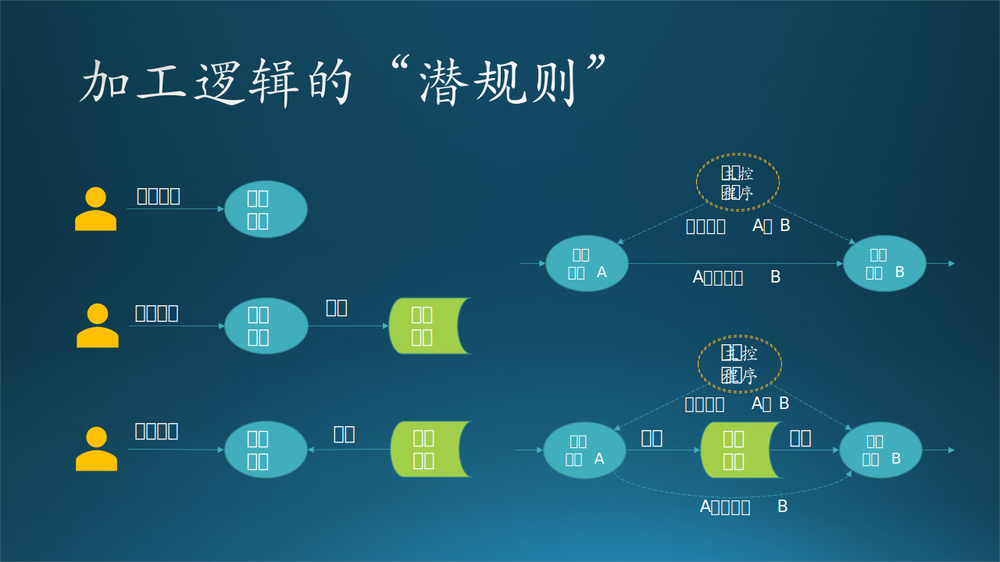

## 14.6 第四步：数据设计

先阐明一个问题：读者可能注意到我们在 14.5 的功能设计后，立刻做数据设计，而不是运行设计，这是为什么呢？

- 对于大、中型系统或者是架构设计、概要设计来说，按照**功能设计$\rightarrow$运行设计$\rightarrow$数据设计**的顺序是没有问题的，因为这种层次的数据设计不需要更多的细节，尤其是很多应用的数据并不多。

- 对于小型系统或者是详细设计来说，已经下沉到了关心数据细节的阶段了，先把与数据相关的设计搞定，才能进行后面的设计，所以采用**功能设计$\rightarrow$数据设计$\rightarrow$运行设计**的顺序。

下面我们针对整体数据流图 14.4.4 中的各个数据存储图例来进行分析设计。

### 14.6.1 存储技术选择

首先要确定存储方式。 

在逻辑功能设计（图 14.5.2）中，我们已经知道了一共有四种类型的数据：股票数据、推理结果、运行日志、模型。现在先来确定这些数据都用什么存储技术。Azure 支持多种存储技术，这就需要做技术选型，这一点我们在 11.2 节中做过详细介绍，最后使用了两种技术：

- 对于股票数据文件、推理结果文件、运行日志文件，直接使用 Azure Blob。
- 对于模型，使用 ML-flow（后面会讲到），它后台使用了 MySql 作为索引，Azure Blob 作为存储。

在旧系统中，研究员们选择了简单的 SFTP 服务，在 Azure 上单独架设了一台服务器，所有数据都存放在硬盘上。直到有一天，忽然发现不能运行了，仔细一检查发现磁盘满了。用 Azure Blob 永远不会发生这种情况，而且还比磁盘便宜很多。

### 14.6.2 数据存储设计

数据文件存储的细节如图 14-14 所示。

图 14-14 数据存储设计

#### 1. 股票数据

客户每周都要进行一次推理，即上传一次股票数据文件，下载一次推理结果文件。如何区分批次呢？最简单的办法就是使用时间戳，而且是使用系统（服务器端）的时间戳，因为客户端的计算机时间可能不准确。

如图 14-14 所示，数据文件存放在以下层级目录下：

（1）创建容器

   在 Azure 登录用户名下创建一个 Azure Storage 容器（Container），这个容器内可以有四种数据类型：Blob（块存储）、File Share（文件共享）、Queues（队列）、Tables（表）。我们应该使用 Blob 类型来保存数据文件。

（2）建立目录

   建立两个目录：模型数据根目录（橙色）、股票数据根目录（蓝色）。建立根目录，为了把股票数据与模型数据分开，因为模型数据不经常变动，而股票数据是周期性的变动。

（3）建立文件夹

   股票数据的文件夹最好直接用时间戳来命名，即用户上传文件时的时间戳，如“2021-01-11-07-15-07”。由于客户是每周上传一次数据，具有时效性。并且股票数据也是按天汇集在一起的，所以我们可以利用这种较强的时间关系，设计出用时间戳为目录名称的存储结构，格式是“YYYYMMDDHHmmSS”。

（4）子文件夹与文件

   股票数据的子文件夹有三个：
   - Data：上传的股票数据文件，一般情况下会有一周五天的 .csv 和 .mat 文件，每天一个。

#### 2. 推理结果

容器、根目录、文件夹与股票数据相同，每周产生一个时间戳做为文件夹名。

子文件夹：
- Output：推理结果文件，客户最后从此目录中下载结果，.csv 格式。

#### 3. 运行日志

容器、根目录、文件夹与股票数据相同，每周产生一个时间戳做为文件夹名。

子文件夹：
- Report：推理过程产生的日志，工程师会根据此文件中的内容来判断预测结果是否正确，.txt 格式。

#### 4. 模型数据

如图 14-14 所示，模型文件存放在以下层级目录下：

（1）容器

   与股票数据的容器相同。

（2）根目录

   模型数据根目录（橙色），建立根目录，为了把股票数据与模型数据分开。

（3）文件夹
   
   从 0 开始累加的整数值，用于存放训练试验数据。
   
   在训练模型时，需要做多次试验，测试各种参数的组合，所以每次都放在一个不重名的目录里即可。ML-flow有一个内置的计数器，初始化一次试验时，会返回一个唯一的整数 ID，比如 12、13 等等依次递加。

（4）子文件夹与文件

   Artifacts子文件夹，存放Pytorch的模型数据文件。
   - .npy：数据文件
   - .pkl：压缩文件
   - .pth：路径信息

（5）数据库设计

模型文件的索引信息放在 MySql 中，基本结构为表 14-5：

表 14-5 模型试验信息

|试验序号|时间戳|文件夹名称|实验结果|模型位置|
|--|--|--|--|--|
|12|2020-12-20 11:34:23|model-12|0.936|（在Azure Blob中的位置）|
|13|2020-12-22 12:47:35|model-13|0.941|（在Azure Blob中的位置）|

### 14.6.3 数据传输设计

在本例中有一个比较特殊的地方，就是有显式的数据传输。在一般的应用系统中，用户产生的数据可能仅限于在网页表单中填写一些文字，然后用 HTTP POST 的方式上传给服务器，或者是在上传语音、图片、视频、文字等文件，在服务器端保存或播放。本例中的数据具有特殊性，系统对上传的数据具有强依赖，以新数据上传为驱动（Data Driven），数据不对的话会导致结果不正确甚至运行失败。

数据传输需要关心三个方面：性能，可靠性，安全性。

由于我们选择了 Azure Blob 存储技术，它提供了丰富的开发接口，所以我们可以使用其 API 进行数据传输。但是，考虑到数据传输都是客户手工操作的，所以有一个更好的选择，就是使用微软开发的 AzCopy.exe 文件作为传输工具。此工具的特点是：多线程传输，可以充分利用网络带宽，以最快的速度上传、下载文件，并且可靠性和安全性都很好。

有一个真实的小故事可以告诉读者 AzCopy.exe 的性能有多好：木头使用 AzCopy.exe 下载批量的股票数据，运行了几秒后，发现网络带宽被占满了，这很正常，但是，不正常的是 CPU 和硬盘 I/O 都占满了，而且下载过程异常慢，中间还有错误提示。木头仔细一看，是 AzCopy.exe 在提示用户检查该机器的硬盘性能，因为它发现写磁盘的速度已经不能满足数据下载速度了。木头忽然想到自己使用的是一块传统磁盘（HDD - Hard Disk Drive），于是停止下载，把目标存储改为另一块固态硬盘（SSD - Solid State Drive），立刻得到了飞一般的速度。这说明 AzCopy.exe 的网络下载速度已经能赶上本地磁盘的读写速度了，货真价实的网络存储技术方案。

因此，可以设计数据传输过程如图 14-14 右侧所示，其流程如下：

（1）客户端通过 REST API 即可获得上下文（即服务器端的时间戳）SessionID。
（2）客户端使用 AzCopy.exe 上传文件，指定本地文件夹，就可以把该文件夹内的一批文件上传到指定的目标文件夹（以SessionID命名）的 Data 目录中。
（3）系统从根据 SessionID 拼接下载地址，调用 API 下载股票数据，并开始推理。
（4）系统把推理结果上传到与 SessionID 相关的 Output 目录中，把运行日志上传到 Report 目录中，都利用 API 完成。
（5）客户从客户端下载推理结果文件。

为什么 3,4 都用 API 完成而不是使用 AzCopy.exe 呢？因为：

- 系统位于 Azure 内部，直接使用 API 的性能不会比 AzCopy.exe 差，而且内部传输的数据量也不大。
- 推理流程是一个独立的进程，如果使用 AzCopy.exe 需要单独开一个子进程来调用此可执行文件，不够优雅。

【最佳实践】如果可以用成熟的技术或者现成的产品解决自己的问题，不要犹豫，优先考虑使用它们，不要重复发明圆形的轮子，除非你需要三角形的轮子。
