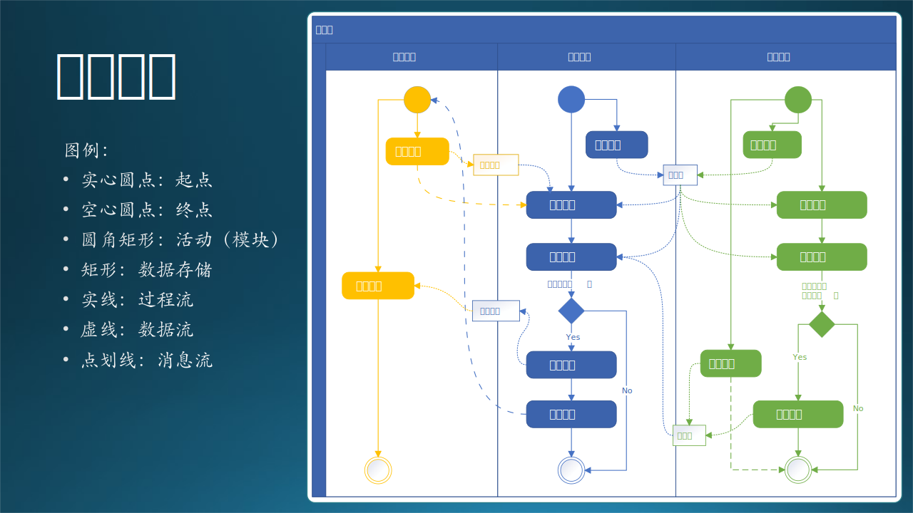

## 14.7 第五步：运行设计

### 14.7.1 空间流程设计

绘制流程图是最佳的考察系统运行时各种情况的手段，如果前面的是静态设计，那么这时动态设计的第一步。有了 14.4 节中的数据流图和模块划分的基础，绘制流程图相对比较容易，可以把各种活动（模块）串接在一起，形成具体功能，以验证模块划分的正确性。

活动图是 UML 用于对系统的动态行为建模的一种常用工具，它描述活动的顺序，展现从一个活动到另一个活动的控制流。活动图在本质上是一种流程图。活动图着重表现从一个活动到另一个活动的控制流，是内部处理驱动的流程。

在图 14-15 中，绘制了一张具有三泳道的流程图（实际上应该叫做活动图），单独画三个流程图也是一样的，只不过看不到泳道之间的交互了。不同的泳道中的元素用不同的颜色标记，一目了然。在图的左侧有图例说明，请读者自行阅读，不再赘述。

图 14-15 三泳道活动图

每个泳道中是一个独立的流程图，在泳道之间有活动交互，整体形成一个多头的流程图。数据存储包括：股票数据、代码库、模型库、结果文件。

- 客户流程中有两个分支，上传文件和下载文件。其中，上传文件结束后，会调用另外一个泳道的推理流程中的数据处理模块，然后执行推理流程；再通知客户时，又会回到客户流程泳道中，让用户执行下载文件的动作。

- 推理流程中有两个分支，一个是线下写推理代码的部分，另外一个是执行线上推理的部分。

- 训练流程有三个分支，一是在线下模型管理，二是在线下写训练代码，三是在线上进行模型训练的流程。

【最佳实践】

- 这一步不是必须的，只有在流程较长或逻辑比较复杂时，才有绘制流程图的必要。
- 把不同角色的业务流程画在各自的泳道中，整体形成活动图，即有了流程图，又能看到不同模块之间的接口。
- 把数据存储加上，会使得交互细节更清楚，属于一种松散耦合的设计，值得推荐。

这张空间流程设计可以利用泳道很清楚地把位于不同子系统的模块分开，这也就带来一个实际问题：这些模块都是如何被执行的？

### 14.7.2 时间流程的设计

首先，不论是子系统还是模块，都可以对应到一个应用程序上。而激活一个程序有五种方式：

（1）常驻进程。

   即操作系统启动后，目标进程就自动启动，始终处于监听或工作状态。不适合本场景，因为运行推理子系统的计算节点比较贵，平时处于关机状态，只在需要时打开。

（2）人工手动启动程序
  
   不适合本场景。因为客户不能确定在工作时段上传文件，工程师不一定保证能及时响应来启动推理流程；我们也不能让客户来进入后台系统启动推理过程，那样做安全风险太大。

（3）定时启动

   不适合本场景。因为不知道用户何时上传数据，如果正上传一半时启动程序，数据不完整，程序就会出错。无论怎样设置定时器，都有可能发生这种情况。

（4）由特殊事件触发
   
   使用块存储时，每次的文件上次都可以触发一次事件。我们是否可以监听这个事件作为触发机制呢？

   对于股票交易来说，如果上周有5个交易日，一共5个文件；如果只有3个交易日，就只有3个文件。所以用户每次上传一个文件，都会触发一次独立的文件变化通知，那么我们如何知道哪个通知是最后一个呢？也许用户上传了3个文件，喝了杯咖啡，然后又上传了2个文件。

   当时木头在做这个设计时，在小组内讨论了多次，其中一个 Dev Lead 认为我们应该在服务器端维护一套完美的逻辑，能够判断出“用户上传文件是否结束了”。但是，木头想来想去都觉得这是不可能完成的任务，总会有意外发生，不可能完美。

   还有一种设计：
   - 在客户端把所有要上传的文件先打包压缩成一个文件，然后把压缩文件上传，这样就只触发一次通知事件。但是这需要在客户端有“压缩”的逻辑代码，或者用一个第三方软件来完成。
   - 传到 Blob 上以后，在使用前需要先解压，在服务器端需要用同样的软件/协议来解压缩，然后再写回 Blob 中，便于以后使用。

   从逻辑上看，复杂很多，遂放弃此设计。所以，事件触发这条路也走不通。

（5）由其它程序调用

   由于 Azure 边界的存在，上传文件行为是在客户端发生的，远在 Azure 之外，它不可能“调用”部署在 Azure 内的推理模块，它只能“通知”。那么就需要再编制一个**主控程序**来接收“通知”，这样虽然会多出一些代码和设计的工作，但目前看来，这是我们唯一的解决方案。
   
   考虑到“训练”和“推理”子系统的独立性，我们尽量不要改它们现有的逻辑，而是在外面单独增加一个**控制中心**作为主控程序，来接收来自客户端的“通知”，再做后续处理。即，在用户上传完文件后，由客户端发送一个通知给控制中心，以便触发后面的工作流程。“上传”和“通知”两个动作最好在**一个事务中**完成。

位于同一泳道内的模块，都可以被主进程直接调用（即图 14-15 中的实线），但是跨泳道时就要使用“通知消息”来做远程触发了（即图 14-15 中的点划线）。虽然有成熟的远过程调用（RPC）技术，但是要求安全性较高，还要依赖框架或者单独开发一些辅助代码。而且位于 Azure 内的机器是不允许外部进行远过程调用的，所以必须在 Azure 内建立一个“控制中心”，以 Azure 允许的方式监听来自外部的通知消息，根据消息内容执行内部动作。

【最佳实践】这个“控制中心”，使得系统中又多出来一个模块，这是在静态功能设计时不可能考虑到的，必须在动态运行设计时补上。

由于多出来一个控制中心模块，使得整体流程变得复杂（但却是必须的），所以我们可以用一个更强大的工具——时序图，来做时序流程设计。活动图和时序图的区别见表 14-6。

表 14-6 活动图和时序图的区别

||活动图|时序图|
|-|-|-|
|类别|流程图|交互图|
|划分依据|空间划分|时间顺序|
|强调顺序|强调模型运行顺序|强调组件交互顺序|
|关注流程|关注运行流程是否完整|关注运行流程是否合理|
|执行方案|不关注如何执行|必须有可执行的技术方案|

图 14-16 推理流程的时序图

表 14-7 是图 14-16 中的时序图的图例。

表 14-7 时序图图例

|元素|说明|图例举例|
|-|-|-|
|角色（Actor）|系统角色|人形图标，如“客户”|
|对象（Object）| 参与交互的系统组件 | 矩形中带有文字，如“客户端” |
|生命线（Lifeline）|对象的生存时长 | 对象下方的垂直虚线 |
|控制焦点（Activation）| 对象的活动阶段 | 生命线上很窄的矩形（存储系统和控制中心 一直处于活动状态，所以没有画控制焦点）|
|消息（Message）|对象之间发送的消息 | 同步消息如“开启虚拟机”的实线实心箭头 异步消息如“邮件通知客户”的实线空心箭头 应答消息如“返回确认”的虚线空心箭头|
|自关联消息|对象内部的长过程调用|半闭合方形带实心箭头，如“推理”|

在图 14-16 中的各种消息和应答已经写得很清楚了，而且根据从上到下从左到右的顺序阅读，可以形成一个完整的时序流程。可以看到，全程不需要乙方参与，是一个全自动流程。
时序流程设计非常的细致，帮助设计者思考每个消息（动作）如何执行。比如：

（1）启动上传脚本：由客户在客户端上手工启动。
（2）上传文件夹：使用 AzCopy.exe 指定本地的文件夹上传到 Azure 存储上。
（3）发送启动推理服务信号：使用 REST API 向控制中心发送一个消息。
（4）开启虚拟机：发送 Azure 管理命令，开启在当前用户名下的虚拟机。
（5）远程启动推理服务：使用 Linux 系统自带的 ssh 执行远过程调用。
（6）读取存储数据：使用 Azure 的存储 API 读取数据。
（7）把结果写入存储：同 6，读变成写。
（8）控制中心关闭虚拟机：同 4，开启变成关闭。
（9）控制中心发送邮件通知：使用 Python 的邮件 API。这里省去了一个步骤，正常流程应该是发送给外部邮件系统，再由客户去查收。

【最佳实践】在时序图中画每一个消息的时候，都应该有对应的实现手段，如手工运行可执行程序、定时运行、远程执行、调用本地 API、调用 REST API 等等。如果发现有不能实现的地方，需要重新设计。

### 14.7.3 运行过程设计

由于增加了控制中心，所以图 14.5.2 就不准确了，请读者自己尝试把控制中心加到逻辑功能设计中。接下来，我们把控制中心加入运行过程设计中，如图 14-17 所示。其中，圆角矩形是进程，小的白色方块是模块，白色方框是计算节点。

图 14-17 推理子系统运行过程设计

该图中把所有进程都绘制出来了，但只涉及到推理子系统的运行，关于训练子系统的运行我们另外讲述。在推理子系统中涉及到四个部分：客户节点、控制中心节点、推理节点、外部通知系统。

#### 1. 客户端

在客户节点中开发一个简单的批处理程序，包含三个 cmd 命令，每个命令启动一个进程执行，然后关闭。它们分别是：获得上下文，上传数据，触发推理。新增加的两个模块是考虑实际的运行情况。

- 首先，在需求中有说明，这个系统的推理过程是自动完成的。即，在数据流图中绘制的“工程师”做“数据处理”这个动作，是一个在旧系统中手动的过程，我们需要把它升级为自动的过程。
- 其次，每周一客户都会上传一次数据文件，触发一次推理过程。在数据设计中创建一个唯一的上下文，相当于 SessionID，让它贯穿于系统运行的始终。
- 最后，上传数据结束后，应该自动触发推理，但是系统并不能确定“上传数据结束”这个状态，所以应该有一个明确的信号来触发推理，至于这个信号是让用户手动发送还是自动发送，可以在后面的设计中考虑。

这就说明一个问题：在有了初步的静态设计结果后，还应该结合动态的运行情况来细化设计。

（1）获得上下文，可以使用 curl.exe 调用控制中心提供的 REST API 获得服务器的时间戳。
（2）上传数据到 Azure 的存储系统，这里使用了现有的 AzCopy.exe 应用程序。
（3）触发推理运行，实际上是使用 curl.exe 向控制中心发送一个 REST API 请求。

下载结果不在此批处理中，而是由客户在收到邮件后手动执行。

所以，我们在客户端使用了简单的批处理，并且使用了现有的可运行程序，而无需自己开发，大大降低了开发和维护成本，提高了稳定性。该机器由客户自己提供并维护。

#### 2. 控制中心虚拟机

这种中心化的设计在系统设计中是很常见的。其缺点是要多设计、编码、部署出一个控制中心来，优点是业务逻辑非常容易调整，安全隔离，利大于弊。

该虚拟机处于常开状态，位于 Azure 上。上面运行了两个进程：

（1）监控进程，用于接收 REST API 请求。如果收到了客户机发来的推理请求，就向管道中发送一个“开始推理”的命令。
（2）工作进程，监听管道中的命令，收到“开始推理”命令后，
（2.1）启动推理虚拟机。
（2.2）远程启动推理进程，具体可以用 Linux 上自带的 ssh 命令，然后停等，一直等到推理进程结束后才会返回。

使用管道的好处是让“监控进程”和“工作进程”松散耦合，这样“监控进程”发送完一个命令后，可以立刻去监听下一个命令，相当于是一个异步过程。命令在管道中排队，由“工作进程”同步一一处理。

关于控制中心的更多详细设计，在后续的小节中还会涉及。

#### 3. 推理子系统虚拟机

该虚拟机算力很强，价格也较贵，所以平时处于关机状态，由控制中心的虚拟机（价格比较便宜）的工作进程给 Azure 发送命令打开虚拟机。所以其运行过程是：

（1）虚拟机被打开，等待完全可用。
（2）推理进程被远程 ssh 命令启动（同步过程），依次运行以下模块（不是独立进程）：
   （2.1）从存储系统中复制数据到本机。
   （2.2）从模型管理模块中提取当前可用的模型。
   （2.3）启动推理。
   （2.4）结束推理，保存并上传结果到存储系统。
（3）ssh 命令结束后返回到控制中心的工作进程。
（4）工作进程发送 Azure 命令关闭虚拟机。
（5）工作进程发送通知给外部通知系统。

全程大概需要 1 个小时。注意此时控制中心虚拟机和推理虚拟机不能断开网络连接，因为 ssh 是一个同步的远过程调用，一旦断网，相当于父进程（工作进程）消失，那么子进程（推理进程）也会被杀掉。由于它们都在 Azure 上，所以这一点可以保证。

#### 4. 外部通知系统

此处我们采用了邮件系统，比较可靠，而且编程难度小，只需要几行发送邮件的代码即可。

工作进程发送的通知中，带有上下文信息，实际上该 SessionID 是全程都传送的。客户收到邮件后，根据上下文信息从指定的存储系统的目录中下载结果文件。
