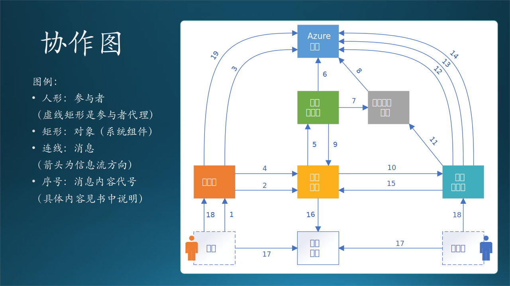
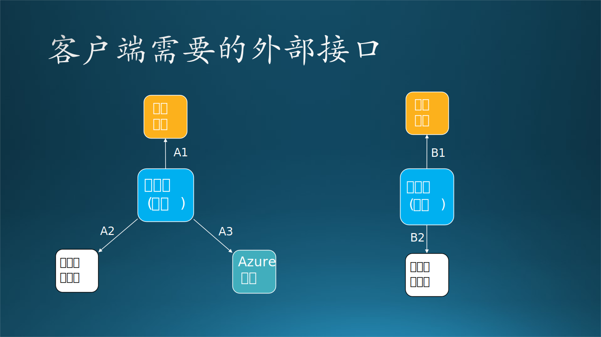
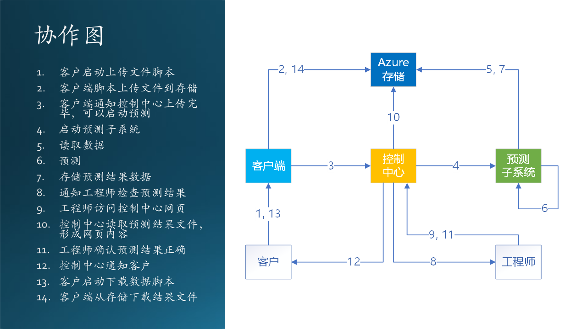

## 14.8 第六步：状态设计

在数据流图中定义了一系列大的流程，在功能设计中划分了模块，但是都没有给出所有的分支和细节，所以我们在这一小节要通过对控制中心的状态转换设计来捋清楚所有细节。绘制传统的流程图也是可以做到这一点的，但是不包含状态名称信息，在后面的文档或者开发过程中，不容易形成共同语言。而且使用流程图做设计，实现时只能用 if...else 来编写代码，当一个对象状态非常复杂时，用 if...else 解决不了问题。

### 14.8.1 虚拟机状态设计

由于系统都运行在 Azure 上，而且定制化程度较高，所以我们都使用 Azure 上的虚拟机来搭建控制中心、训练子系统、推理子系统。

由于虚拟机的收费较高，所以要研究清楚虚拟机的收费策略，即：
- 需要申请虚拟机，虚拟机自动启动；
- 虚拟机在“已启动”时，是按时长收费的，不管是否运行了应用程序；
- 虚拟机在“已关闭”时，仍然收费（Azure的这个设计让用户有些不解，并因此忘记释放资源而继续被动付费）；
- 虚拟机在“已释放”后，停止收费，但是“释放”并非“删除”，里面安装的应用和数据还是可以打开虚拟机后再重新加载继续使用的，不会丢失；
- 虚拟机在删除后，数据全部丢失。

把上面的策略总结成状态转换，如图 14-18 所示。

图 14-18 虚拟机状态设计

左侧表格为状态转移表，分成三部分：

- 左边栏：出发的状态，如“启动中”。
- 上边拦：到达的状态，如“已启动”。
- 中间方格：经历的动作或过程，如“启动完毕”

该表格与右侧上方的图的描述是一致的，在状态较少时，可以用表格描述；而当状态较多时，用图描述。图中的各个元素图例如表 14-8 所示。

表 14-8 状态机图例

|元素|图例|说明|
|-|-|-|
|起点（Start）|圆点|表示初始状态，全图中只有一个|
|终点（End）|带圈圆点|表示终止状态，全图中只有一个|
|状态（State）|圆角矩形|中间状态，如“启动中”|
|动作（Action）|有方向和文字的线|方向表示转移方向，文字表示动作内容，如“关闭电源”|

### 14.8.2 错误的虚拟机状态设计

初学者在做状态设计的时候，会出现的一些常见错误如图 14-18 右侧下图所示。

同样是虚拟机的状态设计，存在三个问题：

（1）状态域不正确
   
   我们可以对比上图，就可以发现问题：本图中“启动中”和“已关闭”状态是正确的虚拟机状态域，都是属于硬件和操作系统级别的状态；但是“空闲”和“繁忙”并不是，它们是属于应用软件系统的状态。

（2）状态/事件缺失
   
   和上一个状态域不正确的问题合并，缺失“已启动”、“关闭中”两个状态，实际上“空闲”应该是“已启动”，“繁忙”应该是“关闭中”。因为关闭不是瞬间完成的，如果可以瞬间完成的话，那么事件应该是“掉电”。

（3）状态跳跃不正确

   我们先假设“繁忙”是正确的状态，从“繁忙”跳到“已关闭”的话，会有很多应用数据丢失，所以必须从“繁忙”先跳到“空闲”，把正在执行的任务优雅地停止，保存好状态数据，然后才能关闭。

【最佳实践】在状态设计中常见的错误就是丢失状态，因为有些状态不是一蹴而就的，需要一个渐变的过程，这就需要有中间状态来做过渡。

### 14.8.3 控制中心的状态设计

图 14-19 控制中心状态设计

在图 14-19 中，我们给出了两组控制中心的状态，左侧是平时只做推理时的状态转换，我们在前面已经讲述过了，不再重复。右侧是需要训练新模型时的状态转换，解释如下：

（1）初始状态，手工启动控制中心的程序，进入“已启动”状态；
（2）用户上传数据，完毕后会通知控制中心，进入“已上传”状态；
（3）自动检测数据，如果合格，就启动训练，进入“训练中”状态；如果不合格，就终止；
（4）训练完毕后进入“已训练”状态；
（5）检查训练结果，即新的数据模型是否优于旧的模型，合格的话使用新模型进入推理，不合格的话使用旧模型进入推理；进入“推理中”状态；
（6）推理完毕，进入“已推理”状态；
（7）检查推理结果，如合格就发布结果，进入“已发布”状态；如果不合格，就“终止”；
（8）发布完毕后，进入“终止”状态。

其中，“启动控制中心”和“退出控制中心”都是手动完成的，不需要编码。

### 14.8.4 错误的控制中心设计

木头曾经把这个案例放在课堂上，让实习生们分组去做设计。来我软的实习生实力还是比较强的，起码动手能力较强，每个组都给出了比较完整的设计，都能讲清楚工作原理。但是出现了几个常见的错误。如图 14-20 所示，图中的红色虚线表示不正确的设计。

图 14-20 错误运行过程设计

#### 1. 主要的 4 点错误

（1）上传股票数据文件经过控制中心转发

在控制中心做一个网页提供文件上传功能，然后由控制中心把文件写到数据存储中。

（2）由客户进程直接启动内部子系统

这种情况是绝对禁止的，内部子系统的接口不能直接暴露在网络上，在客户和子系统之间，必须由控制中心进行转接，以保证其安全性。

（3）模型推理结束后直接通知客户

不是不可以做，但是需要修改已有的推理逻辑，完成本来不属于推理子系统的任务。这就违背了单一职责的设计原则。

（4）下载文件通过控制中心转发

在下载时同样通过控制中心读取结果文件，再由网页引导下载。

第 2,3 点已经被否定了，第 1,4 点的设计本身肯定是可以工作的，但是为什么在本案中是错误的？以下是木头和实习生讨论的过程。

#### 2. 讨论的焦点与过程

- 成本问题
   开发一个网页是有成本的。
   - 实习生说：很多框架都使得开发网页非常方便，基本上一天搞定。
   - 木头说：开发网页需要引入 Designer 来设计，需要引入 CELA（法务部门）来审查。一旦提供了网页，会引发出客户的很多隐含需求，那么开发周期就没有保证了。如果这个系统的客户数量多的话，可以考虑开发网页，但是目前看来只有一个客户，没必要开发。

- 安全问题
   
   现在的网页一般使用 HTTPS 协议来保证安全性，需要申请域名并架设证书服务，这都需要费用，而在与客户的合同中不包含这部分费用。

   - 实习生说：可以找到免费的证书服务软件的，很多提供开源软件服务的网站都使用它。
   - 木头说：我们不能给客户提供第三方的免费的证书服务软件，这不在合同里；而且还需要定期去更新证书，维护成本增加。

- 断点续传

   当客户的文件较多较大而且网络不稳定时，需要服务器有断点续传功能。

   - 实习生说：断点续传的开源软件很多呀，很多 Web 框架里，大概十几行代码就可以完成了。
   - 木头说：AzCopy.exe 可执行文件，实际上已经实现了数据压缩、断点续传、安全验证等功能，我们没有必要去重复造轮子，而且它的速度和稳定性非常好。它是一个成熟的微软产品，完全可信任。

从以上分析可以看到：

- 实习生最喜欢的就是用开源的框架、服务去实现一个功能，对于实习生来说，凡是开源的都可以使用；

- 而作为工程师的木头，要关心成本、安全、合规、维护、性能等等一堆问题，这也是软件工程的根本所在。对于工程师来说，开源首先意味着可信度低、可靠性差，在没有充分调研之前不能使用。

在其它的学生的设计中，存在着另外一些问题：

- 使用 Azure File 来存储数据文件
   
   这个问题在 11.2 节也讨论过了，文件系统需要装载到服务器才能使用，如果想在远程客户端使用 Azure 中的文件系统，那还需要额外的协议才能做到，还要考虑安全性、效率等等。而 Azure Blob 没有以上这些问题，可以在任何地方访问，作为共享存储的理想选择。

- 使用 Azure Funtion 来开发控制中心逻辑
   
   Azure Function 是一种无服务（serverless）模式，可以通过一些事件触发机制来处理 HTTP 请求，然后做一些可以快速响应的任务，把结果返回给客户端浏览器。

   但是在的设计中，控制中心通过“启动程序”消息来启动推理子系统，推理结束后返回，应该是设计了一个同步过程，但是这个推理的过程需要1个多小时，这就违反了 Azure Function 的设计初衷。如果设计成异步模式，“推理结束”这个事件并不能通知到Azure Function上，它只能接收事先定义好的系统事件。

   按前面的分析和设计，控制中心是一个状态机，恐怕用一个处理简单事件的 Azure Function 不能满足要求，而是需要一个完整的自定义系统来支持，比如虚拟机。

- 启动推理子系统没有给出设计细节
   
   从控制中心启动推理子系统，在该设计中只给出了“启动程序”一条消息，过于笼统，另后续的程序员无法开始编码。推理子系统一定是一个独立的子系统，运行在专有服务器上。如果想启动它，则需要跨越机器操作，方法有很多种，必须要说清楚。

   在本例中，由于推理子系统是一台 Linux 操作系统的虚拟机，所以我们使用了 ssh 的“偷懒”方式，远程登录到该机器上启动程序，然后原地停等，直到推理过程结束后返回。其中，ssh 是用程序调用的。

- 使用单独的组件来验证结果
   
   该组同学把验证程序作为一个Docker/Container来设计和实现，似乎是想把 Azure$^{[4]}$ 上的相关技术全都使用上，这是没有必要的。“验证结果”功能完全可以作为推理子系统的一部分来提供，在推理完毕后立刻执行，没有必要设计一个单独的组件，增加了设计、实现、部署、维护的复杂性。

总结一下，这些设计，只能用于示意性说明，需要后期更完善的文字辅助来细化设计。最糟糕的情况是，有可能在做原型实现时，忽然发现某个设计在技术上是行不通的。
