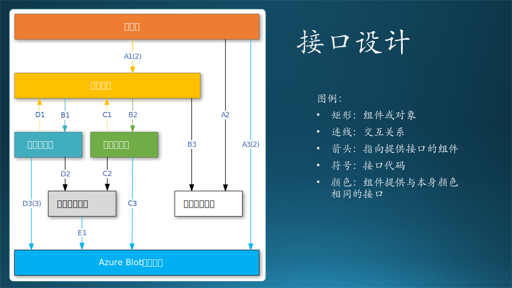

## 14.9 第七步：接口设计

### 14.9.1 交互与接口

#### 1. 交互行为定义

交互行为有以下几种：

- 人机交互
  
  人操作计算机，可以是键盘、语音、手势等，比如 1,11。可以是启动应用程序或者输入信息。

- 远过程调用
  
  以 TCP/IP 为基础的自定义通信协议，在本例中，使用 ssh 方式登录到其它机器上，然后执行程序，比如 4。

- RESTful API

  通过 RESTful API 调用服务器上的功能，比如 3。

- 网页访问
  
  用浏览器与服务器进行交互，执行简单逻辑。本例中没有。

- 数据访问
  
  存取数据库、块存储、数据文件等，比如 2,5,7,12。

- 收发邮件
  
  通过第三方的电子邮件系统，异步通知对方做下一步动作，比如 9,10。这种方式比较特殊，由于大家对电子邮件方式非常熟悉，所以不做详细说明。在电子邮件内容或附件中，一般包含了下一步动作的指示。

#### 2. 接口技术选择

这里的接口指的是子系统之间的接口，具体的编程语言接口（如 Java、C# 中定义的接口）。另外，简单的模块之间互相调用的接口或者 API 调用也不是我们要讨论的接口，我们主要讨论跨越进程甚至物理机器之间的接口设计问题。

在 14.7 节的运行设计中，我们确定了两个组件（子系统）之间如何交互，现在要设计具体接口，即：

- 使用什么技术？
- 传送什么数据？
- 返回什么结果？

接口技术的选择：

- Web Service
  
  使用SOAP（Simple Object Access Protocol，简单对象访问协议）提供了在各种平台、框架上运行的不同软件之间可以进行互操作的标准方法。

- Web API/REST API
  
  使用 HTTP 协议的 GET、POST、PUT、DELETE 操作封装 JSON 数据作为参数，驱动服务器完成指定任务。

- RPC（Remote Procedure Call，远过程调用）
  
  有很多中间件可以完成 RPC，调用者在本地使用一个简单的 API，透明地通过服务器传递给被调用者完成指定功能。

- 管道
  
  是一种简单的 IPC（进程间通信）机制，可以是单向的或双向的，传送自定义消息，接收方自行解释执行相应功能。

- Message Queue

  消息队列，FIFO先入先出，是一种进程间通信的方式，接收方繁忙或掉线时，消息不会丢失，直到接收方可以重新主动获得消息。

- Socket

  最底层的套接字通讯，自己封装数据包并在发送和接收端解析，完成指定功能并返回给对方。

【最佳实践】在本系统中由于有了控制中心的存在，使得不同子系统之间的网状连接变成了与控制中心的星形连接，大大简化了通信成本。由此可见，当系统中存在 4 个以上的子系统时，一定要使用星形连接来构建。

【最佳实践】虽然可以有多种 UML 图可以使用，但是协作图是最直观清晰的工具，设计者可以针对每条线和序号来考虑如何实现这种交互，以便进一步制定接口。

### 14.9.2 系统组件之间的协作

在 14.7 运行设计中，图 14.7.2 和图 14.7.3 已经绘制出了各组件之间的通信过程。但是，时序图关注在消息的时间顺序上，运行设计图关注在进程线程上。因此，这一节需要用一个协作图来理清接口问题。

协作图和时序图一样也是一种交互图，又可以叫做合作图、通信图，它关注对象在参与具体交互时，对象之间如何链接以及传递什么消息。协作图按时间和空间的顺序描述系统元素之间的交互和关系，描述了对象与对象之间的协作/合作关系，侧重说明对象的消息传递，强调发送和接收消息的对象之间的组织结构。协作图的建模结果用于获取对象的职责和接口。

图 14-21 协作图

在图 14-21 中，以“控制中心”对象（也可以叫做模块、子系统等等）为中心，连接起来周围的几个对象，对象之间发送和接收消息。协作图和时序图可以互相转换而不会丢失信息。但是在协作图中，笔者只绘制了必要的消息链，以便设计必要的接口。

比如：序号 5 的交互消息是“客户端通知控制中心上传数据完毕”，使用了 HTTP POST。如果在时序图中，需要返回一个应答，如 200 OK；但是在本协作图中，这个应答其实对后续的协作没有实际意义，所以就没有画出来。

另外，本协作图把训练子系统纳入流程中，假设数据上传完毕后先进行模型训练，然后使用最新模型进行推理。这是在每 60 个交易日时发生的实际应用场景，在图 14-16 的时序图中只描述了平时的推理过程，不包括训练过程。

表 14-9 消息序号的具体含义及接口设计

|序号|含义|接口|参数|返回|接口提供者|
|-|-|-|-|-|-|
|1|客户执行上传脚本|upload.bat|本地目录|界面提示|客户端软件|
|2|获得上下文|curl.exe|HTTP GET /api/获得时间戳|sid 时间戳|控制中心|
|3|数据上传到存储|AzCopy.exe|本地目录+sid|界面提示|*Azure存储|
|4|发送训练通知|curl.exe|HTTP POST /api/启动训练/sid|200 OK|控制中心|
|5|启动训练子系统|API:start_k8s|%vm_count|succeed|*Azure集群|
|6|读取训练数据|API:read_blob|%sid|训练数据|*Azure存储|
|7|保存训练结果模型|API:save_model|%seqID(序号)|succeed|模型管理模块|
|8|保存训练结果模型|API:save_blob|%seqID|succeed|*Azure存储|
|9|通知训练完毕|HTTP POST|/api/训练结束/sid|200 OK|控制中心|
|10|启动推理子系统|SSH|user@ip -i key ./exec.sh sid|停等|推理虚拟机|
|11|提取可用模型地址|API:get_model|%seqID|模型地址|模型管理模块|
|12|提取可用模型|API:read_blob|%seqID|模型数据|*Azure存储|
|13|读取推理数据|API:read_blob|%sid|推理数据|*Azure存储|
|14|保存推理结果和日志|API:save_blob|%sid|succeed|*Azure存储|
|15|返回控制中心|SSH 结束|N/A|停等返回|*Linux OS|
|16|发送邮件通知|API:send_email|%sid|succeed|*邮件服务器|
|17|客户查收邮件|手工接收|N/A|邮件|*邮件客户端|
|18|启动下载脚本|download.bat|%sid|界面提示|客户端软件|
|19|下载推理结果|AzCopy.exe|本地目录+sid|推理结果|*Azure存储|
|如失败|
|17|工程师收到邮件|手工接收|N/A|邮件|*邮件客户端|
|18|登录系统排查|手工处理|N/A|succeed|*AzureVM|

表 14-9 说明了图 14-21 中各序号的消息的具体含义，以及对应的接口设计。最后一列“接口提供者”的含义是在本系统中哪个具体的计算节点提供该接口，比如“控制中心”、“推理虚拟机”、“模型管理模块”。其中，不属于本系统的接口提供者是（换句话说，不需要自己写服务器端代码的，都用 *标记）：

- Azure 存储，实际上是一种服务，它可以脱离任何具体的计算节点而直接提供访问服务，就好比一个计算机上挂了很多巨大的硬盘，而客户只关心如何访问位于这些硬盘上的属于自己的数据并为之付费，而不必为那台计算机付费。
- Linux OS，属于本系统的计算节点，但是 ssh 服务是 Linux 操作系统自身提供的。
- 邮件服务器和邮件客户端，第三方的免费软件。

客户端软件提供人机交互接口，属于本系统的计算节点，在 Azure 之外的客户端计算机上运行。

### 14.9.3 接口拆解与分析

表 14-9 可谓全面了，但是它读写起来都很费劲，读的时候容易乱，写的时候容易遗漏，而且由于表格的限制而不够具体。如何克服这个问题呢？可以用接口拆解的方法，把每个组件所需要的外部接口一一列出来（而不是列出该组件对外提供的接口），这样可以保证接口的充分必要性。

下面我们逐个设计每个组件需要的外部接口。

图 14-22 系统各个组件需要的外部接口

图 14-22 中列出了五个组件的情况，分别是：

- A 客户端模块，需要三个外部接口。
- B 控制中心模块，需要三个外部接口。
- C 训练子系统，需要三个外部接口。
- D 推理子系统，需要三个外部接口。
- E 模型管理模块，需要一个外部接口。

还有两个组件，“外部邮件系统”和“Azure 存储”，它们只提供服务，不需要访问外部接口。

#### A. 客户端所需外部接口

A1 包括两个方法，A2 只有一个方法，A3 包括两个方法。

- A11：获得时间戳
   
   - 方法：GET /api/get_timestamp/
   - 目标：控制中心
   - 返回：\<timestamp\> 时间戳

   客户端每周都要上传一次数据，带有强烈的时间信号，所以我们设计用时间戳来表示本批次的数据，时间戳的格式是“YYYYmmddHHMMSS”，即“年月日时分秒”。

- A12：发送训练通知

   - 方法：GET /api/start_train/\<timestamp\>
   - 目标：控制中心
   - 返回：200 OK

   这个方法用 POST 也是可以的，只不过用 GET 可以简化编程，也没有歧义。后面很多方法与此相同。
   
   客户端脚本上传完数据后，直接用 curl.exe 可执行文件调用该接口，通知控制中心开始后续的工作。至于后续的工作是什么，由控制中心决定。

- A2：接收邮件
  - 方法：邮件客户端软件
  - 目标：外部邮件系统
  - 返回：邮件内容，内含时间戳信息，指出下载地址。

  甲方会收到控制中心发送的邮件通知，然后使用本地的邮件客户端接收邮件。内容是告知甲方上传数据完毕或可以下载预测结果文件。

- A31：保存 Azure 存储服务，上传股票数据文件
  - 方法：AzCopy.exe 可执行程序
  - 目标：Azure 存储服务
  - 返回：成功或失败

  手工运行该程序并指定本地文件所在的目录以及目标 Azure 存储的地址，就可以把本地文件目录内所有的文件上传到 Azure 上。

- A32：读取 Azure 存储服务，下载推理结果文件
  - 方法：AzCopy.exe 可执行程序
  - 目标：Azure 存储服务
  - 返回：成功或失败

  手工运行该程序并指定源 Azure 存储的地址以及本地目录，就可以把 Azure 上的文件下载到本地文件夹内。

#### B. 控制中心所需外部接口

- B1：启动推理子系统
  - 方法：使用系统命令行接口调用 ssh 远程登录并执行指定启动代码。
  - 目标：推理子系统。
  - 返回：停等，直到预测过程结束后返回控制权。

  推理子系统需要提供启动推理运行的接口。

- B2：启动训练子系统
  - 方法：使用系统命令行接口调用 ssh 远程登录并执行指定启动代码。
  - 目标：训练子系统。
  - 返回：停等，直到训练过程结束后返回控制权。

  训练子系统需要提供启动训练运行的接口。

- B3：发送邮件通知

  - 方法：本地 API 调用（SMTP 协议 Python 支持包）。
  - 目标：外部邮件系统。
  - 返回：成功或失败。

  控制中心需要发送邮件给外部邮件系统。

#### C. 训练子系统所需外部接口

- C1：通知控制中心训练结束
  - 方法：HTTP GET /api/train_finished。
  - 目标：控制中心。
  - 返回：成功或失败。

  控制中心需要提供接收训练结束通知的接口。

- C2：保存模型
  - 方法：调用 API 保存模型。
  - 目标：调用模型管理模块。
  - 返回：成功或失败。

  模型管理模块需要提供保存模型的接口。

- C3：访问 Azure 存储服务读取训练数据
  - 方法：本地 API 调用（安装 Azure 的 Python 支持包）读取或者存储文件。
  - 目标：Azure 存储服务。
  - 返回：成功或失败。

  Azure 存储服务需要提供上传文件的接口。

#### D. 推理子系统所需外部接口

- D1：通知控制中心推理结束（严格地说这不算做一个接口）
  - 方法：SSH 进程结束。
  - 目标：控制中心。
  - 返回：成功或失败。

  控制中心需要提供通知接口。

- D2：获得最新模型
  - 方法：本地 API 调用（安装 ML-flow 的 Python 支持包）读取最新模型文件。
  - 目标：模型管理模块。
  - 返回：成功或失败。

  模型管理模块需要提供获取模型的接口。

- D31：访问 Azure 存储服务提取模型
  - 方法：本地 API 调用（安装 Azure 的 Python 支持包）读取文件。
  - 目标：Azure 存储服务。
  - 返回：成功或失败。
  
  Azure 存储服务需要提供上传文件的接口。

- D32：访问 Azure 存储服务读取推理数据
  - 方法：本地 API 调用（安装 Azure 的 Python 支持包）读取文件。
  - 目标：Azure 存储服务。
  - 返回：成功或失败。

  Azure 存储服务需要提供下载文件接口。

- D33：访问 Azure 存储服务保存推理结果和运行日志
  - 方法：本地 API 调用（安装 Azure 的 Python 支持包）存储文件。
  - 目标：Azure 存储服务。
  - 返回：成功或失败。

  Azure 存储服务需要提供上传文件接口。

#### E. 模型管理模块所需外部接口

- E1：访问 Azure 存储服务
  - 方法：本地 API 调用（安装 Azure 的 Python 支持包）存储模型。
  - 目标：Azure 存储服务。
  - 返回：成功或失败。

  Azure 存储服务需要提供上传/下载文件的接口。

【最佳实践】接口设计的最佳方式是从需求方发起，看看都需要哪些外部支持，而不是从服务提供方发起。但是当服务提供方的功能固定时（比如邮件系统和 Azure 存储服务），接口请求方需要在限制条件下做出适应。

### 14.9.4 接口设计

有了 14.9.3 节的接口拆解与分析后，其实接口设计就完成了，这里只不过把这些接口都画在一张图里，便于开发人员阅读和理解。

图 14-23 接口设计

图 14-23 以层次关系的方式画出了接口图，使得整个系统看上去清晰明了，不再是一团浆糊。其实该图和图 14-21 的区别不大，通过调整位置可以互相转换。

从理论上讲，所有的接口线都应该是从上到下的调用关系，如图中的 A1,B1,D2,D3 等等。但是 C1,D1 的出现打乱了这个规律，因为推理子系统和训练子系统在结束自己长时间的运行后，需要主动通知控制中心自己的状态。当然，也可以设计成从控制中心轮询它们二者的状态，但是需要这二者提供查询接口，需要额外的与业务无关的代码。

另外，从图上可以清晰地看到，提供接口服务越多的组件所处的位置越靠下方。比如 Azure Blob 存储子系统，有 7 个箭头指向它（D3 有 3 个调用，A3 有 2 个调用），所以它处于最下方。而请求外部接口越多的组件越靠上方，比如“客户端”，有 5 个出口，位于最上方。

所以，由此可以得到一个有趣的结论：计算一下某个组件访问者的数量与对外请求所需接口的数量的差值，该值越大，该组件的位置就应该越低。比如：

- 客户端：-5，最小，放在最上方。
- Azure Blob 存储服务：7，最大，放在最下方。
- 其它模块：根据调用关系放置，连线箭头最好向下。如果有向上的箭头，可以考虑用别的方式实现，以降低耦合度。比如，C1 和 D1 可以修改为写一个标志位到下方的公共消息队列，再由控制中心去读，就属于数据耦合了，比较松散。

