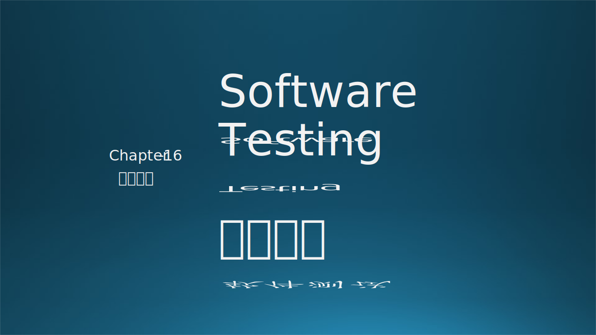
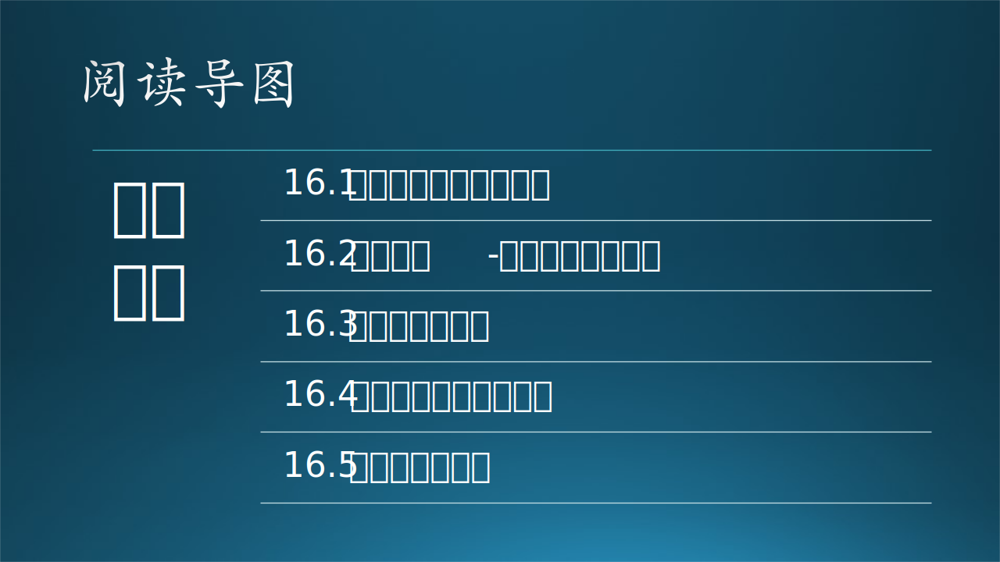

上一部分我们综合探讨了软件开发设计和实现的原则和方法论，然而在软件产品最终交付给用户之前，软件的质量保障（QA，Quality Assurance）和测试（Testing）是不可或缺的环节。缺乏QA和测试的软件世界是灾难性的。1996年6月4日，阿丽亚娜5号运载火箭501在起飞的过程中由于SRI惯性参考系统出现软件故障，在发射不到一分钟内爆炸，“成就”了一场75亿美元的烟花秀；1998年4月20日，比尔盖茨在发布会现场演示Windows 98的即插即用功能时，连接扫描仪后系统崩溃，在无数现场媒体前“展示”了著名的Windows蓝屏。有效的质量保障技术虽然无法清除软件bug，但却可以帮助在更早的阶段发现软件缺陷，Fail fast，从而提升软件的可靠性、稳定性和可用性。

而软件测试是质量保障的核心手段。本章将聚焦于软件测试的应用实践、目标和基本概念，通过实际的工程问题帮助梳理软件测试的脉络，回答以下几个问题：
- 软件测试是什么？
- 测什么，谁来测，怎么测？
- 微软是如何做软件测试的？

### 参考资料

- 《微软的软件测试之道》， Alan Page / Ken Johnston / Bj Rollison著，张奭 / 高博 / 欧琼 / 赵勇译，机械工业出版社
- 《构建之法》，邹欣，人民邮电出版社
- 《致命Bug：软件缺陷的灾难与启示》，金钟河/叶蕾蕾，人民邮电出版社
- 《软件工程：实践者的研究方法》，Roger S.Pressman/Bruce R.Maxim著，郑人杰等译，机械工业出版社
- 《软件测试之困：测试工程化实践之路》，肖利琼，人民邮电出版社
- https://learn.microsoft.com/en-us/shows/Software-Testing-Fundamentals/
- https://www.windowslatest.com/2018/04/25/its-been-20-years-since-windows-98-crashes-live-on-stage-with-bsod/
- https://www.ibm.com/topics/software-testing
- https://en.wikipedia.org/wiki/Software_testing
- https://www.techtarget.com/whatis/definition/software-testing

### TODO list

- 16.1 配图；项目背景：mobile edge testing？
- 本章面向对象：开发人员 or 面试测试人员?

