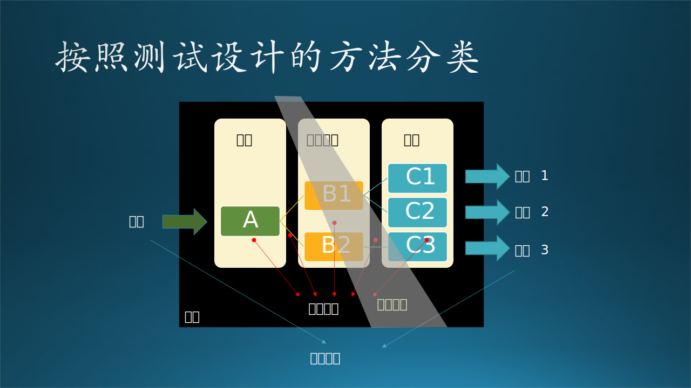

## 什么是软件测试

软件测试似乎并没有所谓的“权威”的定义，说法众多，比较常见的说法是，软件测试是一种实际输出与预期输出之间的审核或者比较的过程。测试的意图是验证软件的行为，进而发现会导致系统失败的问题。结合前文，“测试是为发现错误而执行程序的过程”，提炼两个关于测试的重点：

- 测试过程体现了实际输出与预期输出间的比较。
- 要带着质疑的视角，提供客观、独立的结论，暴露软件实施的风险。

从时间要求上，测试这个过程可以很简短，也可以持续到所有利益相关者都满意为止。

### 以问题为导向

问题是测试的最重要的产出之一，谈及测试我们先全面的认识一下软件的“问题”。我们一般习惯称软件的问题为“Bug”，不同语境下也可以用为“Defect缺陷”、“Exception异常”、“Fault错误”和“Issue问题”等代指，他们分别强调了问题的不同方面或者不同部分。以下是一些由表及里的概念：

| 概念                | 解读                                               |
| ------------------- | -------------------------------------------------- |
| Symptom 症状        | 问题的表征，如崩溃、严重的卡顿                     |
| Issue 问题          | 一般是问题的表象的描述，代表了用户对这个问题的感知 |
| Defect 缺陷         | 可能指逻辑上的疏漏、不足之处和软件设计层面的问题   |
| Exception 异常      | 强调“和预期不符”，不一定是真的问题                 |
| Fault/Error 错误    | 问题在程序层面的表现，如段错误 Segment Fault        |
| Root Cause 根本原因 | 错误的根源，即导致代码错误的根本问题               |

从问题表象到根本原因之间的距离可长可短，一个程序的崩溃、请求的失败，一般首先反映在用户体验上；开发团队可以将问题定位到一段出错的代码中；然而一段代码的错误或异常，可能是由其他代码导致的，比如Out of memory内存溢出（OOM）问题，往往报错的代码只是压倒骆驼的最后一根稻草，问题的根本原因可能隐藏在整体的软件内存管理、资源利用效率和方式上。再发散一点，一个软件问题的根本原因，可能和软件的工程流程、发布流程、团队管理甚至企业文化都有些许联系。

微软内部的产品组会在临近上线前组织“Bug-bash”（打虫子）大会，召集开发团队的所有人，产品、开发、测试，全都来对产品进行“Self-host”自用自测，发现问题就报告出来。这样做有很多好处，一方面，鼓励大家多多用自己开发的软件，增强主人翁精神；另一方面，团队发现问题和解决问题的人坐在一个屋子里、或者处在一个会议中，缩短问题解决的周期，效率很高。

一般用于描述一个问题的报告称为“Bug report”（缺陷报告）。它通常由以下几个主要部分组成，以帮助开发团队定位和修复问题：

1. 标题：  
Bug Report的标题应简明扼要地概括问题，使读者能够快速了解报告的主要内容。

2. 描述（Description）：  
描述部分详细说明了bug的情况，包括以下内容：
    - 测试环境和准备工作：描述进行测试时所用的软件环境、硬件设备、配置等信息，以及为了测试而进行的准备工作。
    - 测试步骤：清晰列出每一步所执行的操作和动作，包括输入的数据、点击的按钮、导航的路径等。
    - 实际发生的结果：记录在执行测试步骤后实际观察到的结果，可能包括错误信息、异常行为、崩溃等现象。
    - 应该发生的结果：根据规范和用户的期望，描述在特定情况下应该发生的预期结果。
3. 附加材料：  
如果有必要，Bug Report可以附带其他补充材料，例如相关联的bug编号、输出文件、日志文件、调用堆栈的列表、截屏等。这些附件或链接有助于进一步的问题分析和复现。
4. 其他字段：  
在Bug Report中还可以包含其他字段，用于提供更多信息，如严重程度（Severity）、功能区域等。这些字段有助于对问题进行分类、评估和优先级排序。

Bug Report是一个重要的工具，它能够帮助测试团队和开发团队之间进行有效的沟通和合作，以及保障软件质量的提升。编写清晰、准确的Bug Report有助于减少问题的误解和漏洞，提高问题解决的效率和质量。

那么，测试是通过怎样的过程和方式把问题挖掘出来的呢？

### 测试的分类：测什么和怎么测

软件测试的被测对象被称为Software Under Test（SUT）。根据具体的测试目的和对被测对象的关注点的不同（在测试什么内容就叫什么测试），测试可以分为如下几类：

1. 功能验证

    - **功能测试**（Function test）：测试软件系统的设计功能是否符合规格要求。
    - **结构测试**（Structure test）：白盒测试中对模块内部结构进行测试，验证代码的逻辑正确性和覆盖率。
    - **冒烟测试** （Smoke test）：冒烟测试的目的是验证软件的核心功能是否正常，以便快速发现关键问题和确保软件稳定性。它主要关注于系统的基本功能和主要路径（Golden Path），而不是详尽地测试每个细节和功能。
    - **可用性测试**（Usability test）：从使用的合理性和方便性等角度进行测试，发现人为因素或使用上的问题。
    - **配置测试**（Configuration test）：测试软硬件系统平台对软件的支持和兼容性。
    - **构建验证测试**（Build Verification Test）：也被称为构建验证或基本验证测试。它被用于验证软件构建（build）的基本稳定性和可用性，简称BVT。
    - **回归测试**（Regression Test）：对一个新的版本，重新运行以往的测试用例，看看新版本和已知的版本相比是否有“退化”（regression）。

2. 性能验证

    - **性能测试**（Performance test）：验证系统是否满足规格中规定的性能要求，如响应时间、吞吐量、处理精度、缓冲区大小、内存占用等。
    - **负载测试**（Load test）：用满负荷长时间测试系统的稳定性（此时性能可以忽略）。
    - **压力测试**（Stress test）：验证系统在超负荷和异常环境下的运行能力和稳定性（此时性能可以忽略）。
    - **可靠性测试**（Reliability test）：评估系统的平均失效时间（MTBF）和故障停机时间（MTTR）。

3. 辅助测试

    - **兼容性测试**（Compatibility test）：测试不同版本间的兼容性，尤其关注文件存储/读取的兼容性，包括向下兼容和交叉兼容。
    - **安全测试**（Security test）：验证系统的安全性，确保系统对于潜在攻击的防护措施有效。
    - **可访问性测试**（Accessibility test）：验证系统对于聋哑人、盲人等特殊用户的易用性和无障碍访问性。
    - **本地化/国际化测试**（Localization test）：主要验证软件在不同地区和语言环境下的本地化和国际化适配性，特别关注界面文字的正确性。

这些测试分类方式有助于测试团队根据不同的测试目标和需求，制定合适的测试策略和执行计划。此外，测试可以按照如下几个方面进行分类：

#### 按照测试设计的方法分类

- **黑盒测试**：通过观察系统的输入和输出，以及对系统功能的期望行为进行测试，不需要了解系统内部的实现细节。黑盒测试在设计的过程中，把软件系统当作一个“黑箱”，无法了解或使用系统的内部结构及知识。也可以说是“Behavioral Test Design”，从软件的行为，而不是内部结构出发来设计测试。
- **白盒测试**：基于对系统内部结构和代码的理解，设计测试用例来验证系统的逻辑正确性和代码覆盖率。在设计测试的过程中，设计者可以“看到”软件系统的内部结构。“白盒”并不是一个精确的说法，因为把盒子涂成白色，同样也看不见箱子里的东西；叫玻璃盒测试又有点奇怪。
- **灰盒测试**：结合黑盒测试和白盒测试的特点，既关注功能验证，又考虑系统内部的结构和实现。灰盒和白盒有同样的问题，其实这里的灰可以理解为“半透明”或者灰色地带的“灰”，表示可以一定程度的看清内部情况的“毛玻璃盒”；或者黑盒上挖了一个小洞，可以“偷窥”到内部的一部分。

黑盒测试更接近用户视角，可以作为整体系统测试的一部分，验证系统在各种使用情况下的功能和行为。白盒测试对测试人员的要求更高，有时需要侵入系统、进行访问和修改，但更接近代码层面，可以发现潜在的逻辑错误、边界条件问题和代码覆盖不足的情况。“灰盒测试”还不是一个很流行的说法，但是在实战中其实比较常见，比如结合逆向工程的测试，或者测试期间可以通过常规或非常规的手段，观察到运行时软件内存堆栈里的数值存储情况；这可能对测试人员的综合能力要求更高。下文讲到的穿透测试和这个概念很相关。

#### 按照测试的实施方法分类

- **自动测试**：利用自动化工具和脚本执行测试，提高测试效率和一致性，适用于重复性较高的测试任务。
- **手动测试**：通过人工操作和观察进行测试，适用于需要人的主观判断和复杂交互的测试场景。
- **探索测试**（Ad hoc Test or Exploratory Test）：探索性测试是一种以探索为导向的测试方法，通过同时进行测试设计和执行，测试人员可以自由地、发散地探索软件系统，发现新的测试场景、缺陷和问题。这也是一种很有技术含量的测试技术，微软还专门出过一本书就叫“探索式软件测试”。
- **穿透测试**（Penetration Testing），也简称为Pen Test或漏洞测试，是一种安全评估方法，旨在模拟真实攻击者的行为，以发现和验证计算机系统、应用程序或网络中的安全漏洞和弱点。

测试并不一定要全部依赖于自动化测试，也不一定自动化越多越好；手动测试在某些情况下仍然具有必要性和重要性：例如，探索性测试（Exploratory test）这种兼具灵活性和创造性的测试方法在自动化测试中难以实现；手动测试能够模拟真实用户的操作和交互，更好地评估系统的用户体验；在某些情况下，系统的变动频繁或测试需求经常变化，手动测试具有更高的灵活性和适应性，能够快速调整测试策略和执行方式。

#### 按照测试的范围分类

- **单元测试**：对软件的最小单元（如函数、方法）进行测试，验证其独立性和功能正确性。
- **集成测试**：测试不同模块之间的接口和交互，确保模块能够协同工作。
- **系统测试**：以整个系统为被测对象进行测试，验证系统在各方面的功能和性能。
- **验收测试**：由最终用户或客户进行的测试，以确认软件是否满足其需求和期望。

单元测试确保代码的正确性，集成测试验证模块间的协作，系统测试验证整个系统的功能和性能，而验收测试确认软件是否满足用户需求和准备进行部署，他们依次越来越接近用户视角，也依次越来越“黑盒”、远离代码。这些测试阶段一起构成了软件开发周期中的重要质量保证措施。

有时单元测试与集成测试的边界并不是很明确，我们可以这样理解：理想情况下，在单元测试中，被测试的单元应该与代码中的其他部分完全隔离。这种“纯粹”的单元测试方法意味着，被测试的单元在其自身边界之外访问的所有内容都需要用模拟对象或代理对象替代。然而，这种方法的缺点在于，模拟对象需要被维护，以确保其行为与实际实现同步。因此，单元测试通常也以被测试的单元可以访问其他单元的方式实施。如果测试明确针对不同单元之间的交互，那么它们就不再是单元测试，而是集成测试。实际上，集成测试通常也使用与测试驱动程序相同的框架，并使用模拟对象来替代尚未实现或对测试无关的组件。
