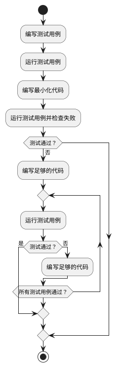
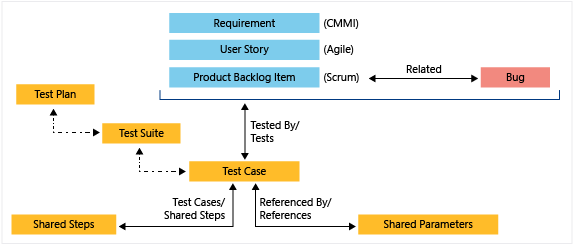

## 软件测试的设计和实施

前面的章节。介绍了如何测试和为什么测试？测试是什么？这里我们将进一步展开测试是如何设计和实施的。设计是软件开发中非常重要的一个环节。软件首先解决一个问题，首先定位于一个问题的解决。其次。针对问题进行解决方案的设计。而软件测试的设计。着眼于如何把问题找出来，把软件中的问题找出来。尽早的暴露问题。在软件设计的阶段就可以引入软件测试的方案的设计探讨。软件测试方案的设计可以涵盖如下几个层次：

#### 1. 软件系统的可测试性。

可测试性是指软件可以被完全有效测试的程度。选择更加模块化和解耦的设计，引入设计模式，简化测试环境的搭建流程，启用依赖注入，选择简明的算法，使用测试“钩子（hook）”（仅仅为了测试方便而写的额外的功能）和定义清晰且易于测试的接口，等等，都是提高可测试性的一些常见手段。而这些手段很多需要在架构设计、组件设计阶段就开始考量。

一个最简单和普遍的提高可测试性办法，就是让开发或测试人员在需求或设计评审中发出“灵魂拷问”，“我们怎么来测试这个东西？”，将开发可被测试软件的这个想法植入团队的大脑中。近年来随着软件测试在技术广度上的发展，我们有了越来越多的开源工具和平台可以依赖，似乎没有什么是真正不可测的了。测试数据可以批量生成，软件电量消耗可以精确抓取；微软的手机和电脑协同连接软件Phone Link，测试过程中需要装有软件的手机和电脑进行同步协同操作，二维码扫码配对，也都通过软件模拟或硬件支持的手段解决了，不仅可测，而且可以自动化地测。

但是，可测试性依然是一个重要的问题，这不仅关乎测试本身和软件架构，更关乎从用户和商业角度出发的软件设计合理性，“如果一个功能都没办法测试（或很难测），这个功能真的有必要存在吗？”

#### 2. 整体的开发驱动模式。

软件的开发首先应该是由外部的用户需求或商业需求主导的，所以高水平的测试人员需要理解软件功能的商业价值、设计的合理性，在测试的过程中帮助改善软件的设计。软件功能和需求的设计，和测试中要验证的“输出满足预期”，本质上是同源的，都是为了增加软件的质量、商业价值服务的。测试团队和产品团队本质上对于软件功能、质量有着相同的要求。换言之，当整个团队在需求理解和质量要求上高度协同一致的时候，测试也可以驱动开发。

测试驱动开发（Test-Driven Development），简称TDD，是一种软件开发方法（Development Approach），它要求在编写实际代码之前先编写测试用例。开发人员通过先编写测试用例，然后编写足够的代码以满足测试的需求。TDD实际在操作上逻辑很简单，也是比较“符合直觉”的一种开发方式，基本上就是在写测试、写代码、运行测试和重构代码之间不断迭代，直到将程序的功能实现完整。在编码的过程中，可能会用到“两顶帽子”类似的思维，编码时切换思考角度，在“测试功能”、“实现功能”和“重构代码”三种思考模式之间不断切换，笔者觉得这非常有趣。

测试驱动开发有助于实现更高的代码质量，鼓励开发人员编写更模块化、可扩展和可维护的代码，形成更好的代码设计，提高代码的可读性、可维护性和可重用性，同时，TDD通过提供全面的测试覆盖和及时的反馈，增强了团队对于产品的自信心；此外，测试用例作为明确的需求规范，充当“可以运行的程序文档”，也促进了团队成员之间的沟通和理解。可谓好处多多。

然而，是否要在团队里采用或推广这种开发方法，是一个实践层面的复杂问题。文化层面上，TDD要求团队成员具备测试和质量意识，重视产品架构和和维护性，测试、开发、产品团队之间有较好的协同和紧密合作；产品层面上，需要产品需求和功能定义清晰，变动不宜过于频繁。因此，TDD更适合具备一定规模的团队和长期稳定的项目。所以，对于时间压力大、探索和创新型的项目以及更注重灵活快速的团队，不能将TDD生搬硬套；也没有必要强推一个成型团队转型TDD。这也许是国内互联网公司较少看到TDD实践的原因之一。当然，这也和技术领导人的风格和企业文化主导思想有很大关系。

在微软，工程师文化盛行，所以有不少团队实打实的在用TDD，笔者有幸和Microsoft Form产品研发经理聊天，对方谈到TDD带来的好处和大家的热情，眼睛里闪烁着兴奋光彩。在和一位阿里巴巴做保险业务开发的朋友聊天，了解到，因为产品涉及到支付、定损、保险精算和“真金白银”，对整体代码测试覆盖率要求很高（98%以上，关键模块要求100%），测试团队和开发团队都要求会写代码、写测试、懂业务，与其被动的追赶覆盖率，不如直接采用测试驱动，边测边写。

总之，测试驱动开发是一种经典的开发方法，不必强求，不妨一试。和测试驱动开发并列的开发驱动模式还包括行为驱动开发（Behavior-Driven Development，BDD）和验收测试驱动开发（Acceptance Test-Driven Development，ATDD）等；其中ATDD将测试更加后置在交付用户之前（或发布之前），其重点是验收测试用例的设计，这里限于篇幅不再过多赘述。重要的问题是，在软件开发的实践中，我们打算把测试放在什么地位（重要性）和环节（时间点）上，这个问题的答案会很大程度上决定软件的质量情况和测试工具、开发系统的采用。

#### 测试的需求和目标

很少有人会问，为什么要做软件测试，这件事似乎在专业的软件团队里是与生俱来就要做的事情；但经常能听到团队的测试人员抱怨，“我们的产品研发团队根本就不重视测试”，“测试的地位低”等等声音。笔者认为这些“牢骚”其实往往是测试人员的妄自菲薄或者“有恨无人省”的委屈怨言。

测试的出发点应该从商业角度和用户角度的现实需求出发，求真务实，暴露问题，让软件质量的真相浮出水面。比如，一个软件产品要在中国上线，那要符合遵循《中华人民共和国个人信息保护法》（PIPL），而一个软件系统内部的数据流处理是否违背了个保法的原则，需要通过测试验证手段，结合网络数据流监测或抓包工具，像探针一样插入“黑盒”内进行测量才能知晓。在美国，医疗仪器设备软件产品要遵循FDA美国食品药品监督管理局所指定的要求标准，FDA对其下注册的软件产品的软件测试流程有非常严苛的要求，会派审核人员去软件开发团队对测试流程进行督导和盘查，确保软件实现了声称的规范水准。

以上提及的例子是典型的从实际出发的软件测试需求，有着明确的目的和外部需求。“符合预期”可以是非常宽泛的，提升软件的CMMI成熟度也可以是测试的一个出发点。在上一小节我们也提及了从目的出发的测试的分类方法，可用性、可靠性到安全性、合规性，可能会出现问题的角度都可以形成相应的测试需求，对应到相应的测试方法。

#### 测试技术方案选型

“Test Pass”，测试通过，是软件开发的一个重要的反馈信号或里程碑，好的测试工具、系统或技术方案应该具备较高的稳定性，环境部署方便，运行过程和结果清晰简明等特点，在保证测试结果有效性的基础上，其应该能够帮助研发团队更快、更高效地达到Test Pass，从而将产品开发推动到下一个阶段。此外，在选择测试工具和技术方案时，还可以考虑以下因素：

- 技术栈和平台：测试方案一般首先依赖于项目所使用的技术栈和平台。单元测试方面，Java主流框架有`Junit`、`TestNG`、`Mockito`等，C#有`MSTest`、`xUnit`、`nUnit`等；Web UI测试可以用`Playwright`、`Selenium`；移动端跨平台方案`Appium`；Android端用`Espresso`，iOS app使用`XCTest`。
- 测试需求和目标：测试的需求和目标对于测试方案的制定有很大的决定作用，确定要测试的功能、性能、安全性等方面的要求，以及所需的测试覆盖范围和深度。比如，安全性要求高的系统需要设计穿透测试，运用逆向工程、模拟黑客攻击来测试系统的“防御力”，而受众小、处于孵化器的项目则没有必要将问题复杂化。
- 团队技能和经验：优先根据团队成员的技能和经验，选定大家相对比较熟悉的测试工具和技术，确保能够有效地应用和支持所选方案。
- 开发环境和工作流程：选择与现有环境和工作流程相协调的工具和技术，以便实现无缝的集成和自动化。微软Azure DevOps平台有很高的灵活性，支持多种主流平台、测试工具的集成。
- 可用资源和成本效益：评估可用的资源和预算，对照考虑工具和技术的成本效益，来确定是否有足够的资源来支持和维护所选的测试工具和技术，以及它们是否能够提供预期的价值和回报。
- 社区支持和生态系统：还可以综合考虑测试工具和技术的社区支持和生态系统，优先选择受欢迎、活跃的工具和技术，以便能够获得广泛的支持、文档和资源，并从社区的经验和最佳实践中受益。

开发团队可以综合考虑以上因素，结合项目的具体情况和需求，选择适合的测试工具和技术方案，来实现高效、可靠的测试和质量保证。

#### 开发和测试团队的分工和流程

在传统的瀑布模式下，开发团队在完成开发后将软件交付给测试团队进行测试。开发团队负责设计、编码和集成，而测试团队负责执行测试用例、发现和报告缺陷。在这种模式下，开发和测试是连续的但分离的阶段。敏捷开发模式秉承“小步快跑”的理念，强调开发团队和测试团队之间的协作和整合。开发团队和测试团队一起参与每个迭代周期，共同制定需求、设计、编码、测试和验证，鼓励开发和测试团队在整个开发过程中密切合作。

一般而言，开发团队的需要负责：

- 设计和实现软件的架构、功能和特性。
- 编写高质量的代码，并进行单元测试。
- 解决开发过程中的技术问题和挑战。
- 提供必要的技术文档和支持。

而测试团队的责任包括：

- 制定测试策略、计划和测试用例。
- 执行各种测试（如单元测试、集成测试、系统测试、验收测试等）。
- 发现、报告和跟踪缺陷。
- 分析测试结果，提供质量评估和建议。

随着敏捷方法的兴起，开发团队和测试团队之间的责任划分越来越模糊。其实根据上面的职责界定，也可以看出各项职责之间都有着几乎高度重合或者密不可分的联系，比如，设计软件功能和设计测试用例实质都是在描述对软件的预期；执行测试虽然是测试团队的主要工作，开发自己写代码难道不需要自测吗？有的经验丰富的开发就是通过灵活运用TDD或者测试工具、代码检测工具，实现功能的阶段就把测试的活都干了，代码Pull request里面还附上了简明的“测试报告”（一般叫How this is tested 或者 How I test it），导致测试阶段完全挑不出毛病来；虽然一般约定是开发负责写单元测试，而测试人员也可以帮忙改进或创建单元测试，来提升覆盖、发现缺陷。

会写代码的测试在国内叫“测试开发工程师”，薪资比一般的测试人员要高很多，这类职位在阿里巴巴、京东这样的大厂招聘页面上很常见；国外叫“Software Development Engineer in Test”，简称SDET，或者“Quality Assurance Engineer”，简称QAE。测试开发在越来越多的“入侵”软件工程师的地盘，也许，随着AI和大语言模型技术LLM辅助编程的崛起，个体能效的提升，开发和测试之间的边界会越来越模糊，最终融合在一起。

<图片：一个问题的两个侧面>

总而言之，软件产品的开发和测试是紧密联系的，是对同一个问题的两个不同关注侧面；开发工程师和测试工程师作为重要部分共同构成了软件产品团队，共同为产品的成败负责。如果简单的把开发看成“实现功能的”，把测试看成“保证没bug的”，认为只有测试为质量负责，那么开发就有可能在写代码上放飞自我；认为开发应该为所有线上bug背锅，那么测试就会变得形式化，走马观花，形同虚设。

另外，从时间这个维度或者测试流程设计上看，测试和开发团队之间如何避免“互相等”的情况，也和权责、合作模式、开发流程密切关联。低效的情况无非就是测试人员无版本可测，或者开发人员写完代码但却发现没人能马上测试，或者迟迟没有测试bug产出或报告结果，导致发版延迟。这种情况一般需要贯彻敏捷开发“小步快跑”的理念，将功能拆解，让代码实现和测试用例设计可以并行，开发和测试可以“错峰”和衔接；同时也需要管理者洞察这种“空窗期”，通过整个产品团队范围进行人员资源的优化调配来解决。

<流程设计和并行进行、交叉测试>

最后，文化上，开发团队和测试团队之间的合作应该是紧密的，彼此互相支持、协作和沟通，团队领导需要建立良性文化，出了问题要一起反省，剖析改进，避免陷入相互甩锅的无效争执；成功优质的上线也要对整个产品团队的所有贡献者一同感谢。要相向而行，实现共同的目标：交付高质量的软件，让用户满意。

#### 测试用例的设计

测试用例（Test Case）之于测试工程师，犹如程序代码之于开发人员。测试用例是测试工作产出的最重要的“工件”之一。一个软件测试用例可以包含以下核心元素：

- 用例名称（Name）：用例的唯一标识符或名称，清楚地描述了被测试功能或场景。
- 测试目的（Objective）：明确说明了测试用例的目标和意图，即要测试的具体方面或功能。
- 预设条件/前提条件（Preconditions）：列出执行测试用例之前必须满足的条件或环境设置。
- 测试数据（Test Data）：指定用于执行测试的输入数据，包括必要的参数、配置和初始状态。
- 测试步骤（Test Steps）：详细描述了按照哪些顺序和方法执行测试用例，包括操作和预期结果。
- 预期结果（Expected Results）：明确说明每个测试步骤的预期输出或期望结果。
- 优先级（Priority）：指定测试用例的优先级，以帮助测试人员在测试计划中确定执行顺序。

测试用例设计方法和技巧是软件测试中非常重要的一部分。当我们把软件的内部逻辑看做为一个“黑盒”的时候，可以采用以下方法和技巧来设计测试用例：

1. 场景法（Use Case Testing）：根据用户使用软件的场景来设计测试用例，例如登录、注册、搜索等。这种从用户使用场景视角出发的用例设计其实是比较符合直觉和常用的设计方法。
2. 等价类划分法（Equivalence Partitioning）：将输入值划分为有效和无效的等价类，从每个等价类中选择一个或多个测试数据作为测试用例。通过将输入值划分为有效和无效的等价类，可以减少测试用例的数量，提高测试效率。
3. 边界值分析法（Boundary Value Analysis）：测试输入数据的边界值，包括最小值、最大值、中间值等。这种方法是对等价类划分的补充。
4. 错误推测法（Error Guessing）：凭经验，列举出程序中所有可能有的错误和容易发生错误的特殊情况，设计相应的测试用例。
5. 因果图分析（Decision Table Testing）：通过绘制因果图来梳理一个程序中的输入输出组合，明确测试预期结果和前置条件，进而设计测试用例。
6. 功能图分析（State Transition Testing or Functional Graph Analysis）：通过绘制功能图、系统状态迁移图来帮助测试人员理清软件系统的功能结构、状态变化，并基于功能图进行测试用例的设计和分析。功能图一般由状态迁移图和逻辑功能模型组成。一系列状态及其依赖的输入/输出数据满足的“条件对”组成测试用例。

这里限于篇幅，我们不再对每一个用例设计方法展开叙述。笔者认为，这些设计方法的核心价值在于从不同的角度为用例设计提供了思路，而其最终目的是服务于测试覆盖的完善、质量控制，最终落脚到用户价值。比如，我们从用户场景出发可以创建出登录、下单、结账等各类测试基本用例，通过因果分析来明确预期输入输出，通过等价类分析来丰富用例内容，进而再通过错误推断和边界分析来全面覆盖逻辑角落（corner case），这些方法可以非常好地组合起来帮助完善测试。但是，一定要明确，我们的最终目标产出不是因果图，不是等效类，而是经过有效用例验证后的高质量软件产品。此外，很多时候，我们从产品设计和需求文档层面出发，就可以明确很多输入输出预期，其中可能就暗含了因果图，功能图的逻辑体系。测试和开发人员在借助这些分析工具之前，全面的学习产品设计和需求文档可能比仅凭分析的纸上谈兵，有更大的意义。

从测试用例的组织方式上看，单个用例的范围可大可小，但一般会聚焦在一个功能点上，同一个模块的多个功能点所对应的用例，可以组合成为一个测试用例集（Test Suite），往往可以覆盖到一个场景（scenario）或者服务于一个特定的目的（如冒烟测试用例集）。在Azure DevOps系统中，提供了各层次的测试对象的定义，Test Plan可以包含Test Suite和Test Case，代表了一次具体的测试执行计划。这些测试对象可以在Azure DevOps上方便的进行管理、关联和重用，从而提高测试效率。

### 谁来测：测试人员的职业素养

DevOps和敏捷开发理念的崛起和流行，让测试人员和开发人员之间的权责边界变得模糊，软件产品出了质量问题，越来越多的是整个团队为之负责，而不是简单地让测试人员“背锅”。这种模糊和融合也意味着对测试人员的要求更加综合。谁来测，或者说，测试人员的水平和心态，都可以对测试执行成果产生很大的影响。在笔者看来，测试人员应该具备：

1. 软件行业的商业意识。
2. 和用户换位思考的同理心。
3. 对于新技术的学习能力。
4. 对产品设计的基本理解。

如果想走技术路线，测试人员可以深入学习软件开发知识，熟悉更多的测试工具，增加自己测试“探针”触及的深度，掌握自动测试、效能测试、穿透测试等。同时，也可以通过对产品和业务的理解，逐步拓宽自己的视野、提升思维，为产品交互逻辑发现和解决问题，创造价值；甚至逐步发展“老板思维”，展现自己的商业逻辑上的见解，成为测试管理者，为公司优化流程，实现利润最大化。

总之，测试人员不要妄自菲薄，假设“测试不受重视”，出于一些外界的成见给自己的能力和成长设限，从而错失发展良机。软件质量关乎着软件的成败和生命线，从质量出发，或者从团队能效、自动化出发，测试工作都大有可为。