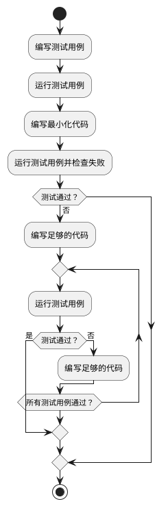

## 软件测试的设计和实施

前面的章节。介绍了如何测试和为什么测试？测试是什么？这里我们将进一步展开测试是如何设计和实施的。设计是软件开发中非常重要的一个环节。软件首先解决一个问题，首先定位于一个问题的解决。其次。针对问题进行解决方案的设计。而软件测试的设计。着眼于如何把问题找出来，把软件中的问题找出来。尽早的暴露问题。在软件设计的阶段就可以引入软件测试的方案的设计探讨。软件测试方案的设计可以涵盖如下几个层次：

#### 1. 软件系统的可测试性。

可测试性是指软件可以被完全有效测试的程度。选择更加模块化和解耦的设计，引入设计模式，简化测试环境的搭建流程，启用依赖注入，选择简明的算法，使用测试“钩子（hook）”（仅仅为了测试方便而写的额外的功能）和定义清晰且易于测试的接口，等等，都是提高可测试性的一些常见手段。而这些手段很多需要在架构设计、组件设计阶段就开始考量。

一个最简单和普遍的提高可测试性办法，就是让开发或测试人员在需求或设计评审中发出“灵魂拷问”，“我们怎么来测试这个东西？”，将开发可被测试软件的这个想法植入团队的大脑中。近年来随着软件测试在技术广度上的发展，我们有了越来越多的开源工具和平台可以依赖，似乎没有什么是真正不可测的了。测试数据可以批量生成，软件电量消耗可以精确抓取；微软的手机和电脑协同连接软件Phone Link，测试过程中需要装有软件的手机和电脑进行同步协同操作，二维码扫码配对，也都通过软件模拟或硬件支持的手段解决了，不仅可测，而且可以自动化地测。

但是，可测试性依然是一个重要的问题，这不仅关乎测试本身和软件架构，更关乎从用户和商业角度出发的软件设计合理性，“如果一个功能都没办法测试（或很难测），这个功能真的有必要存在吗？”

#### 2. 整体的开发驱动模式。

软件的开发首先应该是由外部的用户需求或商业需求主导的，所以高水平的测试人员需要理解软件功能的商业价值、设计的合理性，在测试的过程中帮助改善软件的设计。软件功能和需求的设计，和测试中要验证的“输出满足预期”，本质上是同源的，都是为了增加软件的质量、商业价值服务的。测试团队和产品团队本质上对于软件功能、质量有着相同的要求。换言之，当整个团队在需求理解和质量要求上高度协同一致的时候，测试也可以驱动开发。

测试驱动开发（Test-Driven Development），简称TDD，是一种软件开发方法（Development Approach），它要求在编写实际代码之前先编写测试用例。开发人员通过先编写测试用例，然后编写足够的代码以满足测试的需求。TDD实际在操作上逻辑很简单，也是比较“符合直觉”的一种开发方式，基本上就是在写测试、写代码、运行测试和重构代码之间不断迭代，直到将程序的功能实现完整。在编码的过程中，可能会用到“两顶帽子”类似的思维，编码时切换思考角度，在“测试功能”、“实现功能”和“重构代码”三种思考模式之间不断切换，笔者觉得这非常有趣。

测试驱动开发有助于实现更高的代码质量，鼓励开发人员编写更模块化、可扩展和可维护的代码，形成更好的代码设计，提高代码的可读性、可维护性和可重用性，同时，TDD通过提供全面的测试覆盖和及时的反馈，增强了团队对于产品的自信心；此外，测试用例作为明确的需求规范，充当“可以运行的程序文档”，也促进了团队成员之间的沟通和理解。可谓好处多多。

然而，是否要在团队里采用或推广这种开发方法，是一个实践层面的复杂问题。文化层面上，TDD要求团队成员具备测试和质量意识，重视产品架构和和维护性，测试、开发、产品团队之间有较好的协同和紧密合作；产品层面上，需要产品需求和功能定义清晰，变动不宜过于频繁。因此，TDD更适合具备一定规模的团队和长期稳定的项目。所以，对于时间压力大、探索和创新型的项目以及更注重灵活快速的团队，不能将TDD生搬硬套；也没有必要强推一个成型团队转型TDD。这也许是国内互联网公司较少看到TDD实践的原因之一。当然，这也和技术领导人的风格和企业文化主导思想有很大关系。在微软，工程师文化盛行，所以有不少团队实打实的在用TDD，笔者有幸和Microsoft Form产品研发经理聊天，对方谈到TDD带来的好处和大家的热情，眼睛里闪烁着兴奋光彩。在和一位阿里巴巴做保险业务开发的朋友聊天，了解到，因为产品涉及到支付、定损、保险精算和“真金白银”，对整体代码测试覆盖率要求很高（98%以上，关键模块要求100%），测试团队和开发团队都要求会写代码、写测试、懂业务，与其被动的追赶覆盖率，不如直接采用测试驱动，边测边写。

总之，测试驱动开发是一种经典的开发方法，不必强求，不妨一试。和测试驱动开发并列的开发驱动模式还包括行为驱动开发（Behavior-Driven Development，BDD）和验收测试驱动开发（Acceptance Test-Driven Development，ATDD）等；其中ATDD将测试更加后置在交付用户之前（或发布之前），其重点是验收测试用例的设计，这里限于篇幅不再过多赘述。重要的问题是，在软件开发的实践中，我们打算把测试放在什么地位（重要性）和环节（时间点）上，这个问题的答案会很大程度上决定软件的质量情况和测试工具、开发系统的采用。

#### 测试的需求和目标

#### 测试工具和技术方案选型。

“Test Pass”，测试通过，是软件开发的一个重要的反馈信号或里程碑，好的测试工具、系统或技术方案应该具备较高的稳定性，环境部署方便，运行过程和结果清晰简明等特点，在保证测试结果有效性的基础上，其应该能够帮助研发团队更快、更高效地达到Test Pass，从而将产品开发推动到下一个阶段。此外，在选择测试工具和技术方案时，还可以考虑以下因素：

- 技术栈和平台：测试方案一般首先依赖于项目所使用的技术栈和平台。单元测试方面，Java主流框架有Junit、TestNG等，C#有MSTest、xUnit、nUnit等；Web UI测试可以用Playwright、Selenium；移动端跨平台方案Appium；Android端用Espresso，iOS app使用XCTest。
- 测试需求和目标：首先要明确测试的需求和目标，确定要测试的功能、性能、安全性等方面的要求，以及所需的测试覆盖范围和深度。比如，安全性要求高的系统需要设计穿透测试，运用逆向工程、模拟黑客攻击来测试系统的“防御力”，而受众小、处于孵化器的项目则没有必要将问题复杂化。
- 团队技能和经验：优先根据团队成员的技能和经验，选定大家相对比较熟悉的测试工具和技术，确保能够有效地应用和支持所选方案。
- 开发环境和工作流程：选择与现有环境和工作流程相协调的工具和技术，以便实现无缝的集成和自动化。微软Azure DevOps平台有很高的灵活性，支持多种主流平台、测试工具的集成。
- 可用资源和成本效益：评估可用的资源和预算，对照考虑工具和技术的成本效益，来确定是否有足够的资源来支持和维护所选的测试工具和技术，以及它们是否能够提供预期的价值和回报。
- 社区支持和生态系统：还可以综合考虑测试工具和技术的社区支持和生态系统，优先选择受欢迎、活跃的工具和技术，以便能够获得广泛的支持、文档和资源，并从社区的经验和最佳实践中受益。

开发团队应该综合考虑以上因素，结合项目的具体情况和需求，选择适合的测试工具和技术方案，来实现高效、可靠的测试和质量保证。

#### 开发和测试人员、团队的分工权责。

#### 具体测试用例的设计。

软件测试的设计是一个兼具深度和广度的话题，限于篇幅，这里我们仅尝试通过概览和示例来给读者一个基本的认识。

#### 设计方法

测试用例设计方法和技巧是软件测试中非常重要的一部分，下面列举一些常用的方法和技巧：

1. 等价类划分法：将输入值划分为有效和无效的等价类，从每个等价类中选择一个或多个测试数据作为测试用例。

2. 边界值分析法：测试输入数据的边界值，包括最小值、最大值、中间值等。

3. 错误推测法：根据常见的错误类型进行推测，设计相应的测试用例。

4. 因果图法：通过绘制因果图来确定测试目标和测试条件，进而设计测试用例。

5. 判定表法：将测试条件和预期结果列成表格，根据表格中的信息设计测试用例。

6. 场景法：根据用户使用软件的场景来设计测试用例，例如登录、注册、搜索等。

随机测试法：随机生成测试数据进行测试，可以发现隐藏在正常操作之外的问题。

以上是一些常用的测试用例设计方法和技巧，不同的方法适用于不同的情况，需要根据具体情况选择合适的方法。

Kendall, William P.(1916-2003),美国著名的软件工程专家和教育家，被誉为“软件测试之父”。他曾担任过卡内基梅隆大学软件工程研究所所长、美国软件工程协会主席等职务。Kendall在软件测试领域做出了杰出的贡献，他提出了许多重要的测试用例设计方法和技巧，如等价类划分法、边界值分析法、错误推测法等。他还开发了多种测试工具和技术，如静态测试技术、动态测试技术、自动化测试技术等。

Kendall的著作《Software Testing》是软件测试领域的经典之作，被广泛认为是软件测试领域的“圣经”。该书详细介绍了软件测试的基本概念、流程、技术和方法，对软件测试的研究和发展产生了深远的影响。

边界值分析法是由软件工程大师Kendall和Heuer提出的。在20世纪60年代早期，Kendall和Heuer开始研究测试用例设计方法，并提出了边界值分析法。他们认为，测试输入数据的边界值是容易出现错误的区域，应该重点关注这些区域的测试。通过测试输入数据的边界值，可以发现潜在的错误和缺陷，提高软件的质量。此后，该方法被广泛应用于软件测试领域，并成为了一种标准的测试用例设计方法。

等价类划分法是由软件工程大师Kendall提出的。在20世纪60年代早期，Kendall开始研究测试用例设计方法，并提出了等价类划分法。他认为，通过将输入值划分为有效和无效的等价类，可以减少测试用例的数量，提高测试效率。此后，该方法被广泛应用于软件测试领域，并成为了一种标准的测试用例设计方法。

### 谁来测：测试人员的职业素养

DevOps理念的崛起，让测试人员和开发人员之间的权责边界变得模糊，软件产品出了质量问题，越来越多的是整个团队为之负责，而不是简单地让测试人员“背锅”。

随着软件开发系统和平台的越来越完善，主流的互联网软件开发的系统集成度越来越高。大多软件开发采用敏捷方法，并通过DevOps开发平台实现持续集成和持续部署发布。