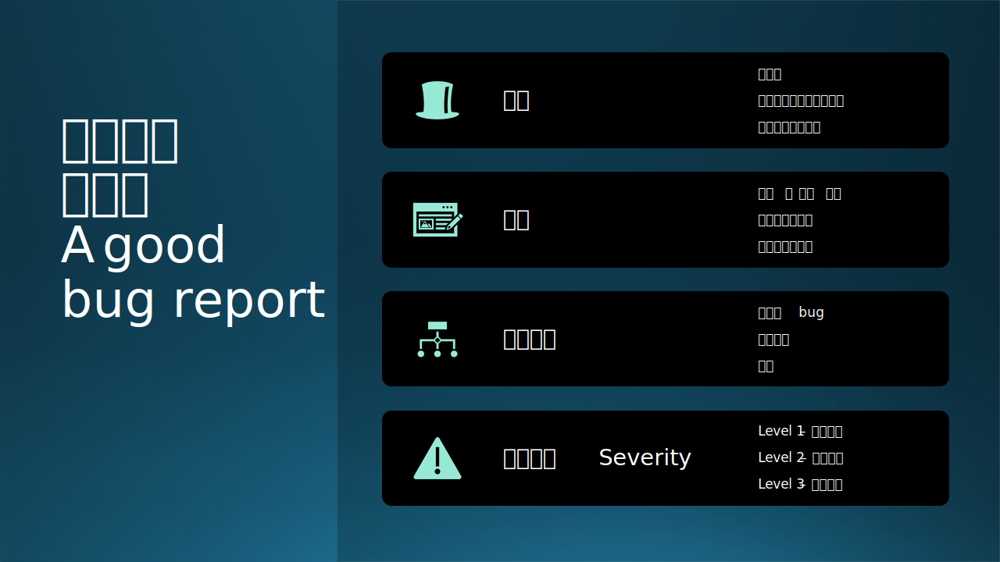

## 什么是软件测试

软件测试似乎并没有所谓的“权威”的定义，说法众多，也不必纠结，不过比较公认的说法是，软件测试是一种实际输出与预期输出之间的审核或者比较的过程。测试的意图是验证软件的行为，进而发现会导致系统失败的问题。结合前文，“测试是为发现错误而执行程序的过程”，这里关于定义提炼两个重点：

- 实际输出与预期输出间的比较。
- 带着质疑的视角。提供客观、独立的视角，以便业务了解和理解软件实施的风险。

这个过程可以很简短，也可以持续到所有利益相关者都满意为止。软件测试可以识别开发过程中的错误和问题，以便在产品发布之前修复它们

### 以问题为导向

问题是测试的最重要的产出之一。我们一般习惯称软件的问题为“Bug”，不同语境下也可以用为“Defect缺陷”、“Exception异常”、“Fault错误”和“Issue问题”等代指，他们分别强调了问题的不同方面或者不同部分。以下是一些由表及里的概念：

| 概念                | 解读                                               |
| ------------------- | -------------------------------------------------- |
| Symptom 症状        | 问题的表征，如崩溃、严重的卡顿                     |
| Issue 问题          | 一般是问题的表象的描述，代表了用户对这个问题的感知 |
| Defect 缺陷         | 可能指逻辑上的疏漏、不足之处和软件设计层面的问题   |
| Exception 异常      | 强调“和预期不符”，不一定是真的问题                 |
| Fault/Error 错误    | 问题在程序层面的表现，如段错误 Segment Fault        |
| Root Cause 根本原因 | 错误的根源，即导致代码错误的根本问题               |

从问题表象到根本原因之间的距离可长可短，一个程序的崩溃、请求的失败，一般首先影响的是用户的体验；开发团队可以将问题定位到一段出错的代码中；然而这段代码的出错，可能是其他代码导致的，比如常见的问题Out of memory内存溢出（OOM），往往出错的代码只是压倒骆驼的最后一根稻草，根本原因可能隐藏在整体的软件内存管理、资源利用效率和方式上。再说的发散一点，一个软件问题的根本原因，可能和软件的工程流程、发布流程、团队管理甚至企业文化都有关系。

微软内部的产品组会在临近上线前组织“Bug-bash”（打虫子）大会，召集开发团队的所有人，产品、开发、测试，全都来对产品进行“Self-host”自用自测，发现问题就报告出来。这样做有很多好处，一方面，鼓励大家多多用自己开发的软件，增强主人翁精神；另一方面，团队发现问题和解决问题的人坐在一个屋子里、或者处在一个会议中，缩短问题解决的周期，效率很高。

### 测试的分类

测试的分类方式 toxonomy

按照测试设计的方法
黑盒测试和白盒测试
灰盒测试

按照测试的实施方法分类
自动测试和手动测试

按照测试的目的分类

按照测试的范围分类

按照测试的时机和作用分类