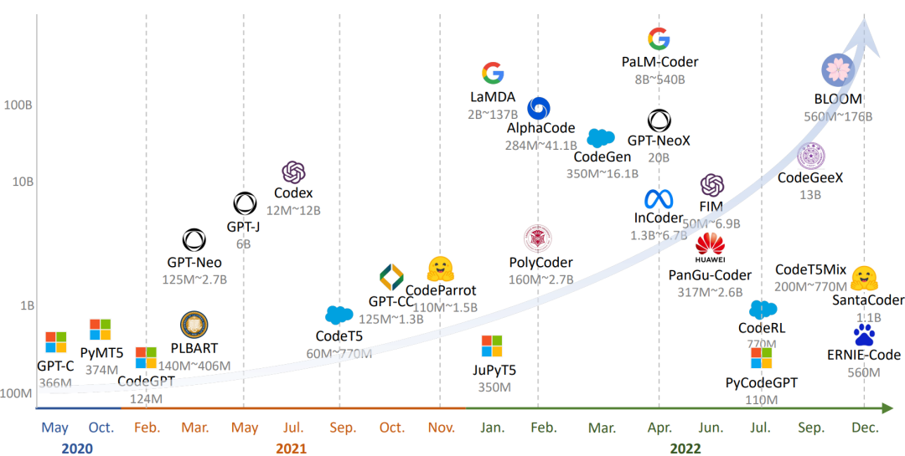
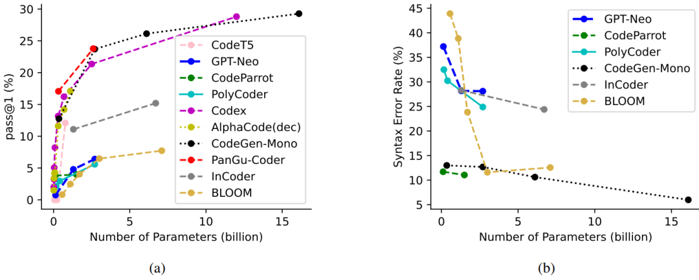
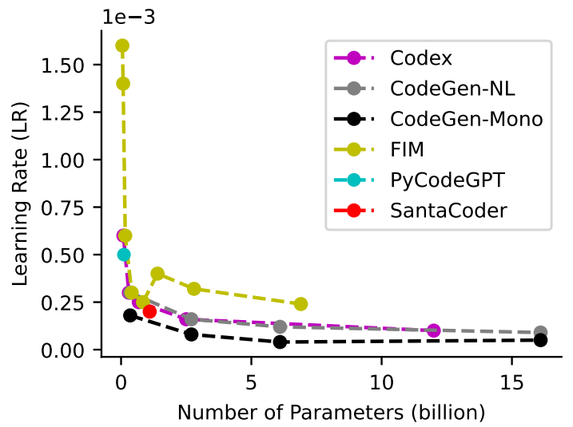

## 18.5 基于大模型的代码生成的调查

本文摘录自微软亚洲研究院 DKI 组的一篇论文，通过对 27 个大模型的调查研究，探索了自然语言到代码（NL2Code）的转换能力，促使读者思考一个问题：我们这些程序员会不会被人工智能所取代？我们如何从码农转变成一名真正的软件工程师？$^{[5]}$

原文标题：Large language Models Meet NL2Code: A Survey
原文链接：https://arxiv.org/pdf/2212.09420.pdf
原文作者：
```txt
· Daoguang Zan, Chinese Academy of Sciences, daoguang@iscas.ac.cn
· Bei Chen, Microsoft Research Beijing China, beichen@microsoft.com
· Fengji Zhang, Microsoft Research Beijing China, v-fengjzhang@microsoft.com
· Dianjie Lu, Shandong Normal University, ludianjie@sdnu.edu.cn
· Bingchao Wu, Chinese Academy of Sciences, bingchao2017@iscas.ac.cn
· Bei Guan, Chinese Academy of Sciences, guanbei@iscas.ac.cn
· YongJi Wang, Chinese Academy of Sciences, ywang@itechs.iscas.ac.cn
· Jianguang Lou, Microsoft Research Beijing China, jlou@microsoft.com
```

主要作者简介：

昝道广，中国科学院软件研究所博士研究生，曾在微软亚洲研究院数据知识与智能组实习，实习导师为楼建光和陈蓓研究员。研究兴趣为人工智能和软件工程，特别聚焦于基于超大语言模型的代码生成研究工作。微软实习期间在面向第三方代码库的超大语言模型领域中了做了多篇研究工作，并且已发表在人工智能领域顶级会议上，例如 IJCAI，EMNLP，ACL，ICLR等。

### 摘要

从自然生成代码的任务语言描述，或称为 NL2Code（Natual Language to Code），是代码智能中的一个紧迫而重大的挑战。由于预训练技术的快速发展，大型语言模型被用于生成代码，激发了 NL2Code 的进步。在本文中，我们对现有的 27 种大型语言进行了全面的调查，比较它们的基准和指标，直观地在 HumanEval 基准上比较所有现有模型。通过深入的观察和分析，提供了一些观点并得出结论，促成 NL2Code 大型语言模型成功的关键因素是“大量的优质数据和专家调优”。此外，我们基于模型和人类之间的差距讨论了挑战和机遇。我们还创建了一个网站 https://nl2code.github.io 跟踪最新进展。据我们所知，这是针对大型语言模型的首次调查 NL2Code，我们相信它将有助于该领域的持续发展。

### 18.5.1 引言

新手程序员，甚至是那些没有任何编程经验的程序员，是否有可能仅仅通过用自然语言描述他们的需求来创建软件?实现这一设想将对我们的生活、教育、经济和劳动力市场产生前所未有的影响。自然语言-代码（NL2Code）因其广阔的应用场景，是一项重要的研究任务，在学术界和工业界都引起了广泛的兴趣。

关于 NL2Code 的发展，其实和自然语言理解的发展类似，一开始，基本都是基于专家规则进行算法设计，但是此类方法需要对不同编程语言进行设计，泛化性差；随着技术发展，人们逐步开始使用静态语言模型，并使用向量空间来描述文字，此类方法在初期一般向量空间比较稀疏，不能建立长期的依赖关系；再后来，就用到了我们比较熟悉的神经网络，例如 CNN、RNN、LSTM，此类方法通过标记数据进行训练来构建自然语言（NL）和代码（Code）之间的关系，但实际效果对 NL2Code 任务的能力有限；现在，在 ChatGPT 风靡全球的背景下，越来越多的大型语言模型（Large Language Models，LLMs）如雨后春笋一样出现，通过语言指令，它们可以在零样本状况下生成代码，并在NL2Code任务上中取到了惊人的成绩。具有标志性的一个 LLM 模型就是Codex，它拥有 120 亿个参数，在 Python 编程任务上测试，可解决 72.31% 的问题，并且该模型已经商用可在实践中提高开发人员的工作效率。

### 18.5.2 可以完成 NL2Code 的大模型

对于 NL2Code 任务，其主要目的是基于给定自然语言问题描述生成所需要的代码。以下是一个关于 Python 编程问题的示例。其中有问题描述、模型生成代码、测试用例。

问题描述：
```python
from collections import Counter
def MostCommon（lst）:
    '''
    Find the most common element from lst.
    '''
```
模型生成的代码：
```python
    data=Counter（lst）
    return data.most_common（1）[0][0]
```
测试用例：
```python
def check（）:
    assert MostCommon（[1,2,1]）==1
    assert MostCommon（[4,0,0]）==0
    ...
```

针对 NL2Code 任务对 27 个具有代表性的 LLMs 进行了全面调研，表 17-12 总结了每个模型的详细信息，其中主要包括：模型架构、模型大小、模型层数（L）、注意力头数量（A）、隐藏维度（H）、模型参数是否开放（P）等五个方面。

表 17-12 可以完成 NL2Code 任务的 27 种大模型的总结


为了更好地可视化，图 17-2 按时间顺序展示了这些模型，绘制了最大的模型大小。观察到的一个趋势是，随着研究领域的发展，这些大型语言模型的规模也在不断扩大。此外，只有解码器的架构更适合于规模较大的预训练模型。



图 17-2 大模型时间表

### 18.5.3 LLMs 成功的原因

上面总结了 NL2Code 现有的大型语言模型（LLMs），但是这些模型在架构、模型规模等方面各不相同，无法进行统一的评估。为此，作者在 HumanEval 基准上进行了 Zero-shot 统一评估，其中 HumanEval 基准由 164 个手写的 Python 编程问题组成，对于每个编程问题都提供了测试用例，以评估生成代码正确性。使用 pass@k 作为评估指标，即通过k次尝试可以正确回答的问题的比例。表 17-13 显示根据模型大小进行分组，在该测试集上的测试结果。

表 17-13 在 HumanEval 上的性能指标


从表 17-13 可以看出，这些LLM在该数据集上的性能差异很大，尽管模型参数相似但效果差异也是很大。可以发现 Codex 在各种尺寸上都处于领先地位。为什么会存在这个问题呢？影响模型效果的关键因素是啥呢？作者经过分析给出的结论有：模型大小、数据质量、专家调优。

#### 1. 模型大小

根据前面的整理用于 NL2Code 的 LLMs 时间发展图可以发现，只要模型参数越多性能就越好。为了进一步说明模型参数大小和模型效果之间的关系，作者整理了 10 个比较有代表性的模型，在 HumanEval 基准上的 pass@1 结果，如图 17-3 所示：



图 17-3 在 HumanEval 上的语法错误率

根据上图，很明显的可以发现较大的模型通常会产生更好的结果。此外，当前模型无论大小，仍然可以通过进一步增加模型参数来实现性能的提升。

#### 2. 数据质量

随着 LLMs 模型参数的增加，其训练数据规模也在不断的增加。这在数据选择和预处理方面也有更高的要求。早期的模型，例如 CodeSearchNet、CoST、XLCoST等都是基于人工标注数据对进行训练（耗时耗力）；GPT系列模型（GPT-3 、GPT-Neo、GPT-J ）开始在大规模无监督数据集上进行训练，但是由于代码数据限制，并没有显示出很强的代码生成能力。由于 LLMs 模型的出现，它们可以在更大规模的未标记代码数据集上进行训练，最终模型效果惊人。

在惊叹于 LLMs 效果的同时，也要知道LLMs在训练之前通常会对数据进行预处理。为此作者调研了 Codex、AlphaCode、CodeGen、InCoder和PyCodeGPT 等 5 个强大模型的数据预处理方法。发现它们具有几个共同的特点：一是删除可能自动生成或未完成的代码文件，二是使用特定的规则来过滤不常见的代码文件。总之，这些预处理策略的目标是实现一个不重复的、完整的、正确的、干净的和通用的代码语料库。

#### 3. 专家调优

训练一个优秀的模型需要认真考虑模型训练阶段的各个参数。通过对 27 个 LLMs 模型的研究发现，它们都有一些共同的设置，比如都应用了 Adam 相关优化器并在初始化阶段相差不大。除此之外，还有需要调节的超参数，如学习率、批大小、窗口大小、预热、梯度累积和温度参数。对于学习率来说，随着模型的增大，学习率会逐步变小。如图 17-4 所示：



图 17-4 六个大模型上的学习率

对于温度参数，这里对比了两个模型在 HumanEval 任务上使用不同温度参数后模型的性能。结果发现，更高的温度参数产生更低的 pass@1 和更高的 pass@100，这表明更高的温度参数使 LLM 产生更多样化的预测，反之亦然。如图 17-5 所示：


图 17-5 在 HumanEval 上的温度参数的影响

此外，有研究表明窗口大小也是一个关键因素，具有大窗口的小模型会有时优于具有小窗口的大模型。此外，强大的 LLMs 通常主要使用两种技术在代码语料库上训练新的标记器：字节级字节对编码和句子片段。新的标记器可以更有效和准确地将代码内容拆分为 Tokens。这些经过验证的调优技术将为培训更强大的 LLM 提供有价值的参考。

### 18.5.4 评估基准指标

对 NL2Code 任务的评估，高质量的基准和可靠的度量是基础和必要的。我们总结了 17 个 NL2Code 基准测试，每个基准测试在大小、语言、复杂性和场景方面都有自己的特点，如表 17-14 所示。

表 17-14 NL2Code 的 17 个指标总结


但大多数基准测试只包含有限数量的实例。例如，HumanEval 和 MBPP 分别有 164 和 974 个实例。这是因为这些基准通常是手写的以防数据泄露。在大型语言模型时代，在创建新基准时避免数据泄漏至关重要。此外，大多数当前的基准测试都有英文的问题描述和 Python 的代码解决方案。最近，已经提出了几个多语言基准，例如涵盖多种编程语言的 MBXP，HumanEvalX 和 MultiPL ，以及涵盖多种自然语言的ODEX。多语言基准测试的详细信息如表 17-15 所示：

表 17-15 多语言测试指标


手动评估生成的代码是不切实际的，这就需要自动度量。上述基准均提供了基于执行的评估的测试用例，其中指标如 pass@k、n@k、测试用例平均值和执行精度。但是，这种方法对测试用例的质量有严格的要求，并且只能评估可执行代码。对于不可执行的代码，使用了 BLEU 、ROUGE 和 CodeBLEU 等指标，无法准确评估代码的正确性。到目前为止，在设计指标来评估代码的各个方面（例如漏洞、可维护性、清晰度、执行复杂性和稳定性）方面存在许多开放性挑战。

### 18.5.5 NL2Code 挑战与机遇

大预言模型在 NL2Code 的应用对学术界和工业界都有相当大的影响。虽然取得了惊人的进展，但仍然有很多挑战需求解决，这也为研究人员提供了充足的机会。下面作者总结了 NL2Code 任务的五个挑战和机会。

#### 1. 理解能力

自然语言固有的灵活性允许多种表达方式来传达功能需求，人类能够理解不同抽象层次的各种描述。相比之下，当前的 LLM 往往对给定的上下文敏感，这可能会导致性能下降。我们认为探索LLM 的理解能力是一个重要的研究方向，一种可能的解决方案是将复杂问题分解为多个步骤，这在推理任务中很常见。

#### 2.判断能力

人类能够判定一个编程问题是否被解决。当前模型不论输入什么都会给出答案，而且该答案正确与否都不能确定，这在实际应用中会存在一定的问题。目前为了提高 LLM 的判断能力，需要根据用户反馈采用强化学习的方式进行调优。我们认为探索 LLM 自我判断能力，也是一个比较重要的研究方向。

#### 3.解释能力

人类开发人员能够解释他们编写的代码，这对教育的和软件维护至关重要。最近的研究表明，LLM 具有自动生成代码解释的潜力。作者认为针对该能力也需要进一步的研究和探索，以充分发挥 LLM 在这方面的潜力。

#### 4. 自适应能力

当前的大型语言模型与人类之间的一个根本区别是它们适应新知识和更新知识的能力。人类开发人员能够根据文档资料实现 API 的快速开发，而 LLM 需要大量的知识和训练。我们认为如何提高 LLM 快速自学习能力也是一个比较大挑战。

#### 5. 多任务处理能力

大型语言模型已应用于各种与代码相关的任务，例如代码修复，代码搜索和代码审查，以及可以以类代码形式格式化的非代码任务方式，例如数学和化学。然而，LLM 和人类之间在多任务处理方面的能力存在差异。人类可以在任务之间无缝切换，而 LLM 可能需要复杂的提示工程。另一个证据是 LLM 缺乏能够像人类一样快速掌握多种编程语言。这些局限性揭示了未来研究的方向。

*由于篇幅有限，对原文有所删减，参考文章链接没有列出，有兴趣的读者可以阅读原文。*
