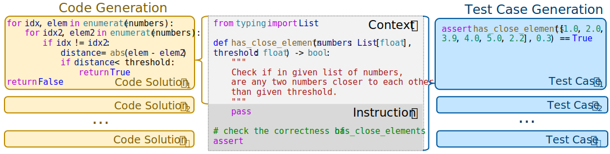

## 18.6 基于测试用例生成的代码生成方法

本文摘录自微软亚洲研究院 DKI 组的一篇论文，利用大模型（Large Language Models，LLMs）探索通过一种新颖的方式：通过测试用例与大模型生成代码的匹配关系来确定最优生成代码。这对于作为软件工程师的读者开阔思路很有好处，尤其是可以思考我们的代码如何写才是最佳的？我们的测试用例是否可以覆盖代码所涉及的方方面面？$^{[6]}$


原文标题：CODET: Code Generation with Generated Tests
原文链接：https://arxiv.org/pdf/2207.10397.pdf
原文作者：
```txt
· Bei Chen, Microsoft Research Beijing China, beichen@microsoft.com
· Fengji Zhang, v-fengjzhang@microsoft.com
· Anh Nguyen, anhnguyen@microsoft.com
· Daoguang Zan, v-dazan@microsoft.com
· Zeqi Lin, Microsoft Research Beijing China, zeqi.lin@microsoft.com
· Jian-Guang Lou, Microsoft Research Beijing China, jlou@microsoft.com
· Weizhu Chen, wzchen@microsoft.com
```
主要作者简介：

陈蓓，微软亚洲研究院主管研究员。博士毕业于清华大学计算机系，师从张钹院士及朱军教授。她的研究兴趣主要为自然语言处理、大规模语言模型及其应用，例如语义解析、对话系统、代码智能等。在领域顶级会议如 NeurIPS，ICLR，ACL，EMNLP，IJCAI，AAAI，KDD 等发表论文 30 余篇。近年来在语言模型与软件工程交叉领域发表多篇论文，包括代码生成，代码修复等任务。

### 摘要

得益于预训练语言模型如 CodeX 等的发展，我们能够为给定的编程问题自动生成代码代码解决方案（以下简称为“代码解”）。一般来说，预训练语言模型会生成多个不同的代码解，而从中选择出最为准确的代码解仍然是一个很大的挑战（例如，pass@100 通常比 pass@1 高很多）。验证一个代码解准确性最简单的方法是使用一组测试用例来执行它。然而，人工构建这样的测试用例是费时费力的。本报告旨在探索这样一个问题：预训练语言模型可以进行自我验证吗？我们提出了一个有趣的方法 CODET，它能够利用相同的预训练语言模型为代码解生成多个测试用例，从而降低人工成本。CODET 将生成的多个代码解在测试用例上执行，并进行双向执行一致性判断，从而挑选出最为准确的代码解。我们使用 5 个不同大小和能力的预训练语言模型，在 4 个有名的代码生成数据集上做了试验。试验结果证实 CODET 能够极大地提升代码生成的性能，其中 CODET 将 HumanEval 数据集的 pass@1 分数提升至 65.8%，比现有最高分数还要高 20+%。

### 18.6.1 引言

尽管代码生成的预训练技术取得了显着进步，但从大型语言模型生成的多个候选者中选择正确的代码解仍然是一个难题。例如，CodeX，一种最先进的代码预训练语言模型生成，可以实现 pass@100（如果给定的 100 个生成的代码解中有一个或多个可以通过相应的测试用例）为 77.4%，但在 HumanEval 基准上的 pass@1（单个代码解的正确率）仅为 33.5%。这个巨大的差距限制了代码生成模型的实用性，并激励我们探索如何选择正确的或多个候选的最佳代码解。

验证代码解正确性的一种直接方法是执行代码并检查它是否通过所有相应的测试用例。这种以执行为导向的方法已在各种领域得到广泛采用与代码相关的任务，例如代码生成、代码翻译、和程序合成。然而，这种方法在很大程度上依赖于测试用例的质量和数量，而这通常是昂贵的创建和维护非常耗时。此外，在像 Copilot2 这样的真实应用中，辅助开发者编写代码的代码生成工具，指望用户提供每个问题的测试用例是不现实的。因此，我们建议自动生成任意编程问题的测试用例，并使用它们快速验证任何代码解。


图 17-6 CODET 协议

在本文中，我们提出了 CODET 协议，如图 17-6 所示。首先，我们利用相同的预训练语言模型生成代码解，例如 CodeX，通过提供详细说明作为提示，为每个编程问题生成大量测试用例。接下来，受经典 RANSAC 算法启发，使用双向执行协议（Dual Execution Agreement）和测试用例，在每个生成的代码解上运行测试用例，并迭代地找到多组代码解和测试用例对。每组代码都能通过相同的测试用例，表明它们具有相同的功能，即使它们在实现上不同。我们期望能通过更多测试用例的代码解是更正确的，并且具有更多相似的代码解，比如，同一共识集中的代码解与问题描述更一致。因此，我们根据其中的测试用例和代码解的数量对每个共识集进行排名，并从排名最高的共识集中选择最佳代码解。

这种方法简单高效，因为它不需要任何标记数据或额外的排序器，但它实现了令人惊讶的卓越性能。我们在五个预训练语言模型使用这种方法做评估：三个 OpenAI CodeX 模型，INCODER 和 CODEGEN，以及四个已建立的代码生成基准：HumanEval、MBPP、APPS 和 CodeContests。试验结果表明该方法可以有效地从多个候选者中选择正确的代码解，提高了 pass@1 在所有基准测试中的得分。例如，CODET 实现了使用 code-davinci-002 的改进：HumanEval (47.0% → 65.8%)，MBPP (58.1% → 67.7%)，APPS (27.2% → 34.6%) 和 CodeContests (0.7% → 2.1%)。此外，当我们将最强大的预训练模型 code-davinci-002 和 CODET 结合起来，大幅领先于之前最先进的方法，例如 HumanEval：42.7% → 65.8%。

### 18.6.2 方法

代码生成的任务是解决一个编程问题：在上下文 $c$ 中生成代码 $x$。 如图 17-7 所示，上下文 $c$ 中包含自然语言问题描述代码注释的形式，以及包含 imports 和 function 等语句的代码片段标头。通常，我们采样一组代码解，表示为 $X = \{x_1, x_2, ..., x_N \}$，基于在上下文 $c$ 上使用预训练的语言模型 $M$，可以表示为 $X = M(c)$。我们的目标是从一组生成的代码解 $X$ 中选择最佳代码解 $\hat{x}$，其中 $\hat{x}$ 是正确解决给定编程问题的最有可能的代码解。为此，我们提出 CODET，希望利用预训练语言模型 $M$ 的力量。具体来说，我们使用 $M$ 为编程问题生成测试用例（18.6.1-1），然后根据双向执行协议选择最佳代码解 $\hat{x}$（18.6.2-2）。



图 17-7 代码生成与测试用例生成

#### 1. 测试用例生成

除了生成代码解，还需要生成测试用例来评估其正确性。测试用例是定义在上下文函数中的一对输入和预期输出。例如，在图 17-7 中，测试用例列表中是否存在小于阈值的近似值。为了生成测试用例，我们使用与生成代码解相同的预训练语言模型 $M$，但我们添加了一条指令 $p$ 到上下文 $c$ 作为提示，表明需要测试用例而不是代码解。指令 $p$ 由三部分组成：
（1）一个“pass”语句作为占位符，这表明不需要为函数生成代码。
（2）一条注释语句“检查入口点的正确性”，以阐明生成测试用例的意图，其中“入口点”是函数的名称。
 (3) 一条“assert”语句启动测试用例生成，指定测试用例的格式为输入-输出对。

然后，我们将连接的上下文和指令 $concat(c, p)$ 提供给语言模型 $M$，并从模型输出中抽取一组测试用例，表示为 $Y = \{y_1, y_2, ..., y_M\}$。测试用例的生成过程可以表示为 $Y = M(concat(c, p))$。语言模型会尝试通过为函数生成合理的输入输出对来完成指令。注意在生成代码解之前，我们从上下文 $c$ 中删除所有示例输入输出案例，以避免将真实的测试用例暴露给语言模型，并增加多样性和生成的测试用例的难度。

#### 2. 双向执行协议

在本小节中将解释如何使用生成的测试用例集 $Y = \{y_1, y_2, ..., y_M\}$ 作为一个标准从生成的代码集 $X = \{x_1, x_2,..., x_N \}$ 中选择最佳代码解 $x$。我们可以在测试用例 $y$ 上执行代码解 $x$，这意味着使用 $y$ 的输入运行由 $x$ 定义的函数，并将输出与 $y$ 的输出部分进行比较。如果代码解 $x$ 可以无错误地执行并且输出与预期输出匹配，那么代码解 $x$ 可以通过测试用例 $y$。此外，两个代码解 $x_i$ 和 $x_j$ 如果可以通过 $Y$ 中的同一组测试用例，则认为它们之间有一个功能协议（即两个函数的实现不同但具有相同的功能）。我们的方法基于以下假设：

（1）给定某个编程问题，代码解和测试用例是独立的，并且是从预训练语言模型 $M$ 中随机抽样的。
（2）不正确的代码解往往是多种多样的，并且在两个错误代码解之间具有功能协议的出现概率非常低。

这些假设是类似于经典的 RANSAC 算法，这是一个稳健的在嘈杂数据中找到共识的方法。受 RANSAC 的启发，我们提出了我们的方法 CODET 执行双向执行协议，这是一种迭代方法，如下所示：

- 从所有可能的 $D = \{(x, y)|x ∈ X, y ∈Y\}$ 中随机选择 $(x,y)$。然后尝试在测试用例 $y$ 上执行代码解 $x$。如果 $x$ 可以通过 $y$，那么我们说 $(x, y)$ 对是一个假设解（hypothetical inlier，直译为假设的内点），因为它假设地描述了编程问题的正确功能。否则，我们说 $(x, y)$ 是异常解，因为它没有描述正确的功能。图 17-8 显示了一个简单的示例编程问题“返回数字的平方”。$(x_1, y_1)$ 和 $(x_3, y_2)$ 是两个假设解，而 $(x_1, y_4)$ 和 $(x_3, y_1)$ 是两个异常解。


图 17-8 代码解和测试用例的对应关系

- 如果 $(x, y)$ 是一个假设解，我们从 $D$ 中收集所有与它一致的对，形成一个集合 $S$，称为共识集。为了找到一致的对 $(x, y)$，首先找到 $x$ 可以通过的所有测试用例，记为 $S_y$。然后，我们找到所有可以通过与 $x$ 完全相同的测试用例的代码解，表示为 $S_x$。最后，共识集是包含来自 $S_x$ 的代码解和测试用例的所有对的集合来自 $S_y$，即 $S = \{(x, y)|x ∈ S_x, y ∈ S_y\}$。例如在图 17-8 中，我们可以得到 $S_x = \{x_1, x_2\}, S_y = \{y_1, y_2, y_3\}$ 来自假设解 $(x_1, y_1)$（上方绿色部分）和 $S_x = \{x_3\}，S_y = \{y_2, y_3, y_4, y_5\}$ 来自 $(x_3, y_2)$（下方紫色部分）。

- 我们将共识集评分为 $f(S) = |S_x||S_y|$，其中 $|S_x|$ 是 $S_x$ 中的生成代码数，$|S_y|$ 是 $S_y$ 中的测试用例数。这个分数等于在共识集中的成对的数量。直觉是，与假设一致的对越多，此功能越有可能是正确的。按照图 17-8 中的示例，$(x_1, y_1)$ 的假设共识集分数为 $2 \times 3=6$，因为 $|S_x| = |\{x_1, x_2\}|=2$，$|S_y| = |\{y_1, y_2, y_3\}|=3$；而 $(x_3, y_2)$ 的假设分数为 $1\times4=4$，因为 $|S_x| = |\{x_3\}|=1$，$|S_y| = |\{y_2, y_3, y_4, y_5\}|=4$。

我们重复上述过程某个次数，每次产生一个共识集和它的分数。最后，通过从共识中选择有最高分的任意代码解来获得最佳代码解 $\hat{x}$。如果我们想要获得 $k$ 个代码解，我们可以选择 Top $k$ 个得分最高的集合，并从 $k$ 个共识集合中的每一个中挑选一个代码解。

实际中，当 $D$ 中的代码解数不多时，我们可以简化上面的方法通过检查 $D$ 中所有可能的对，而不是从 $D$ 中采样。特别地，对于每个代码解 $x ∈ X$，我们运行 $Y$ 中的每个测试用例，并跟踪它通过了哪些测试用例。将通过相同测试用例的代码解组合在一起，因为它们具有相同的功能。这样将 $X$ 中的所有代码解分成几组，记作 $X = \{S^1_x, S^2_x,···,S^K_x \}$，其中 $K$ 是代码解组的数量。每个组 $S_x$ 都有一个集合，是它通过的测试用例的数量，我们将其写为 $S_y$。然后，我们得到 $K$ 个共识集，每个共识集都有形式 $S = \{(x, y)|x ∈ S_x, y ∈ S_y\}$。我们可以对由 $f(S) = |S_x||S_y|$ 设置的每个共识进行评分，如前。这个朴素的版本捕捉到了相同的下线直觉，但发现所有共识集都是正确的，无需重复采样。

### 18.6.3 试验步骤

#### 1. 模型

我们的试验基于 CodeX、INCODER 和 CODEGEN。
- CodeX 是 GPT-3 的后代，并且能够理解所提供的上下文并生成功能程序。我们用三个 OpenAI 提供的具有不同功能的 CodeX 模型：code-cushman-001、code-davinci-001 和 code-davinci-002。
- INCODER 是一个统一的生成模型，可以执行从左到右代码生成和代码填充，使用 INCODER 6.7B 版本 (INCODER 6B)。
- 而 CODEGEN 是一个大型语言模型家族执行会话程序合成，使用 16B 的单语版本 (CODEGEN-MONO-16B)。

#### 2. 指标和基线

我们使用 pass@k（有 $n$ 个样本）进行性能评估和利用真实测试用例来确定代码解的功能正确性。对于每个问题，我们采样 $n$ 个代码解，然后选择其中的 $k$ 个进行评估。如果有的话 $k$ 个代码解中的一个通过了所有地面实况测试用例，则认为问题已解决。然后 pass@k 是已解决问题的百分比。我们使用 pass@k 的无偏定义作为我们的基准，其中 $k$ 个代码解是从 $n$ 个样本中随机选取的。CODET 使用双向执行协议机制从 $n$ 个样本中选择 $k$ 个代码解。此外，我们还使用包括了 Li 等人的聚类方法作为比较，表示为 AlphaCode-C。我们的复制是使用 CODET 生成的测试输入，在测试输入，按测试输出对代码解进行分组，并按大小对集群进行排序。

#### 3. 基准

我们对四个公共代码生成基准进行了试验。基准的统计数据如表 17-16 所示。

表 17-16 统计基准


(1) HumanEval 由手写的 Python 编程问题组成。原始上下文包括示例输入输出案例，这些案例在我们的试验中被删除以避免暴露真实的测试案例。附录 B 中的试验表明，这种去除操作是合理且必不可少的。
(2) MBPP 包含众包 Python 编程问题，我们遵循 HumanEval 为其构建上下文。
(3) APPS 包括从开放访问编码网站收集的编码问题，这些网站有不同的难度级别。
(4) CodeContests 包括从 Codeforces 平台上抓取的竞争性编程问题。

为了启用零样本推理，我们为 APPS 和 CodeContests 构建上下文如下：原始问题描述为被视为删除输入输出示例的注释，以及一个简单的函数头“def solution(stdin : str) → str :” 放置在注释之后以容纳输入/输出数据格式。


### 18.6.4 试验结果

在本节中，我们在五个不同的预训练模型和四个基准上评估 CODET 验证其有效性，然后通过测试用例分析和案例研究提供更多的发现。

#### 1. HumanEval 和 MBPP 的结果

各种模型在 HumanEval 和 MBPP 基准上的试验结果总结在表 17-17 中。如果我们比较基准列上的 pass@100 和 pass@1，前者明显优于后者，表明选择最佳代码解的潜力来自 100 个生成的样本。

表 17-17 HumanEval 和 MBPP 试验结果


对于三个 CodeX 模型，当我们将 CODET 列与基准列进行比较时，CODET pass@1 比基线 pass@1 实现了大约 10% 的绝对改进。HumanEval 的改进始终超过 10%。令人惊讶的是，即使是最强的基线，code-davinci-002，改进为 18.8%，将 pass@1 提高到 65.8%，这比之前报告的最佳结果绝对改进了 20+%。我们将此归因于对 code-davinci-002 生成的更高质量的测试用例进行了更大的改进，提供了在第 18.6.4-3 节中进行更深入的分析。CODET 在 MBPP 基准测试中也取得了卓越的性能，尽管改进幅度略小于 HumanEval。使用以 code-davinci-002 为例，pass@1 提升了9.6%。我们还报告 pass@2 和通过 CODET 的 pass@10 进一步显示其优越性。CODET 的 pass@2 结果接近基线 pass@10 结果。同时，对 pass@10 的改进也始终高于 HumanEval 基准测试的 10%。

INCODER-6B 和 CODEGEN-MONO-16B 的试验结果进一步验证了 CODET 的有效性。很明显，CODET 可以显着提高 pass@1，绝对提高范围为 4.2% 到 13.1%。INCODER-6B 实现了最大的改进，比 MBPP 基准上涨 13.1%。与 CodeX 的试验结果相似，pass@2 结果接近基线 pass@10。所有结果都表明 CODET 可以提高各种预训练语言模型的性能一致。

至于 AlphaCode-C，它在使用不同模型的两个基准测试中始终不如 CODET，证明了我们采用测试用例信息的双向执行协议的优越性考虑在内。

#### 2. APPS 和 CodeContests 的结果

我们还在两个更具挑战性的基准测试 APPS 和 CodeContests 上进行了试验。我们构建 APPS 和 CodeContests 的零样本版本，以符合我们对 HumanEval 的设置和 MBPP 通过删除问题描述中的示例输入输出案例。我们使用 code-davinci-002 用于代码解和测试用例生成。APPS 采样数设置为 50 以节省计算成本，一共 5000 个测试问题上。而对于 CodeContests，采样数设置为 1000 以解决特别难的问题。结果总结在表 17-18 中，我们可以清楚地观察到一致的性能改进在使用 CODET 的两个基准测试中。APPS 中的问题的 pass@1 改进为 7.4%，而对于竞争基本问题，APPS 和 CodeContest 改进并不大。此外，我们注意到代码-davinci-002由于这两个基准的难度更高。

表 17-18 APPS 和 CodeContests 的试验结果


#### 3. 测试用例分析

测试用例对 CODET 至关重要，因为其核心思想是基于测试驱动的执行协议。因此，在本小节中，我们通过回答以下研究问题来分析测试用例。

**（1）Q1：生成的测试用例的质量如何？**

我们使用规范代码解评估生成的测试用例的正确性。一个测试用例是如果规范代码解可以通过它，则认为是正确的。图 17-9a 总结了分布 HumanEval 上的测试用例准确度，其中横轴表示每个的准确度值问题，纵轴表示对应问题的概率密度精度值。我们可以看到 CodeX 模型生成的测试用例要高得多，准确率高于 CODEGEN/INCODER。除了准确率，我们还引入了测试用例毒性率作为质量的衡量标准。如果任何生成的代码解都可以，我们认为测试用例是“有毒的”通过它而规范的代码解不能。有毒的测试用例可能会阻碍共识的评分设置并导致 CODET 失败。如图 17-9b 所示，我们可以发现毒性率与不同模型的测试用例准确性高度相关，其中比例 CodeX 模型的毒性测试用例数量小于CODEGEN/INCODER。我们还评估了使用附录 H.2 中的两个覆盖标准生成的测试用例的代码覆盖，其中 CodeX 模型仍然优于 CODEGEN/INCODER，平均覆盖率超过 95%。比较表 17-7 所示的测试用例质量和 CODET 的性能，我们可以发现质量测试用例的数量与使用关于不同模型的 CODET 的性能增益密切相关。


图 17-9 测试用例准确率与毒性率

**（2）Q2：更好的测试用例能否进一步提升平庸模型的性能？**

从上面与图 17-9 的讨论，可以发现 code-davinci-002 是最有能力的生成高质量测试用例的模型。因此，我们进行了一项试验，通过使用 code-davinci-002 生成的测试用例，以提高其他四种模型（code-cushman-001、ode-davinci-001、INCODER 和 CODEGEN）的性能。表 17-19 总结了性能改进是基于 HumanEval 和 MBPP 基准的不同模型。一般来说，使用测试 code-davinci-002 生成的案例可以显着提高使用测试的性能由能力较差的模型本身生成的案例。对于 code-cushman-001 和 code-davinci-001，pass@1 的绝对改进在 1.8% 到 4.3% 之间，而对于 INCODER 和 CODEGEN，范围从 6.2% 到 15.9%。以上结果表明正确的代码通过采用更好的测试用例，可以进一步利用平庸模型生成的代码解。

表 17-19 使用 code-davinci-002 生成的测试用例的代码解性能


**（3）Q3：当测试用例较少时，CODET 的效果如何？**

在为 HumanEval 基准生成测试用例时，我们对每个问题抽样 100 次，每个样本可能包括多个断言语句（即测试用例），记为Sampling Number = 100。然后我们提取第一个来自每个样本的 5 个句法正确的测试用例，表示为as Limit = 5. 这意味着每个问题都配备了最多 500 个测试用例。提取测试的实际数量案例总结在附录 H.1 中。我们通过减少采样数和限制来对测试用例的数量进行消融研究。如表 17-20 所示，我们可以得出结论，在 CODET 中使用更多的测试用例通常可以导致更好的性能，而当 Sampling Number ≥ 50 且 Limit ≥ 3 时，性能差距缩小。此外，CODET 将 pass@1 提高了 9.5%，仅 10测试用例使用 code-davinci-002，建议高考案例效率。我们可以在中使用较小的采样数实际应用程序以平衡性能和计算成本。

表 17-20 较少的测试用例时的 CODET 方法的性能


#### 4. 案例研究

在 CODET 中，我们基于好的代码解可以通过最多的测试用例并同意最多的相同功能的代码解。我们使用“双”因为代码解和测试用例都很关键。图 17-10a 显示了一个案例使用 code-cushman-001 的 HumanEval 基准测试。得分最高的共识集具有正确的如果列表中的所有数字都低于阈值 t，则返回 true 的功能，而共识集排在第 2 位的人并没有完全理解边界条件。第二次共识中的代码解共识集可以通过比第一个共识集（即 218）更多的测试用例（即 226）。然而，考虑到代码解和测试用例，CODET 可以成功地对共识集进行排名，并且找到正确的代码解。这种情况并不少见，说明我们设计的双向执行协议的合理性。为了进一步的统计证明，我们进行了一项消融研究来评分通过仅考虑代码解或测试用例的数量来达成共识。


图 17-10 案例

CODET 由预训练的语言模型赋能，但也受到它们的限制。所以，第 2.2 节中的第二个假设并不总是成立，导致错误情况8个生成了正确的代码解，但不在前 1 个共识集中。对于在 HumanEval 基准测试中代码为 cushman-001 的 CODET，我们发现 164 个编程问题中有 53 个是属于这种情况。我们手动调查了这些问题，发现其中 20% 可以被归咎于诸如问题描述不明确、角落案例未被发现和缺乏导入语句，而其余问题归因于模型的失败理解问题描述。图 5b 显示了由歧义引起的错误情况。这正确理解描述“sum(first index value, last index value)”是把第一个加起来和最后一个值，而将所有值从第一个到最后一个求和的代码解排名第一。

*由于篇幅有限，对原文有所删减，参考文章链接没有列出，有兴趣的读者可以阅读原文。*
