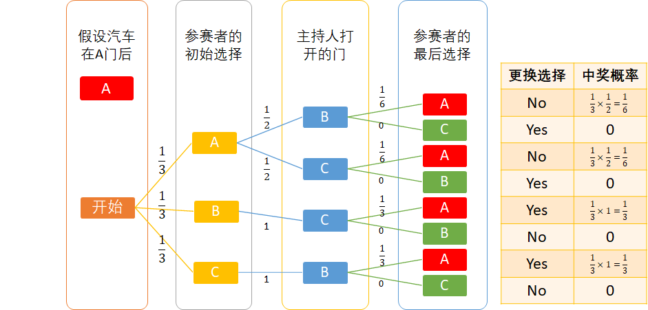

## 1.2 正确的解法

### 1.2.1 正确的穷举法

表 1 中的推导存在着一个细节，读者可能并没有注意：

- 当奖品所在之门和参赛者初始选择之门都是 A 时，主持人可以在 B 和 C 中任意打开一扇门，概率为 50%。
- 但是如果奖品所在之门是 A，参赛者初始选择之门是 B，此时主持人只能打开 C 门，概率为100%，没有别的选择！
- 参赛者初选之门也是有概率的，选择ABC三个门的概率相等，都是 $\frac{1}{3}$。

另外，有些读者看表格可能有困难，所以我们把这些情况变成概率数字放在图 2 中。

<center>


图 1.2.1 正确的穷举法
</center>

- 第一列：仍然假设汽车在 A 门后；
- 第二列：参赛者的初始选择可能是 A,B,C 中的任一个，所以可能性是 $\frac{1}{3}$；
- 第三列：如果参赛者选 A，则主持人打开 B,C 门的概率各为 $\frac{1}{2}$；
- 第四列：假设主持人打开 B 门，参赛者如果不更换选择，中奖概率是 $\frac{1}{6}$；更换选择的中奖概率是 0；
......

最后可以统计出，在所有的 8 种情况中：
- 更换选择而中奖（图 2 右侧表中“更换选择”为“Yes”的行）的概率是 $\frac{1}{3}+\frac{1}{3}=\frac{2}{3}$。
- 不更换选择而中奖（图 2 右侧表中“更换选择”为“No”的行）的概率是 $\frac{1}{6}+\frac{1}{6}=\frac{1}{3}$。

**结论是：更换选择中奖的概率更大**。

### 1.2.2 理论推导

对于蒙提霍尔问题，玛丽莲·沃斯·莎凡特（2008年为止吉尼斯世界纪录所认定拥有最高智商的人类及女性）在她专栏的回答是：“更换选择会更好。” 

这在当时的美国引起了激烈的争议，人们寄来了数千封抱怨信：
- 一位来自佛罗里达大学的读者写道：“这个国家已经有够多的数学文盲了，我们不想再有个世界上智商最高的人来充数！真让人羞愧！”
- 另一个人写道：“我看你就是那只山羊！”
- 美国陆军研究所的埃弗雷特·哈曼写道：“如果连博士都要出错，我看这个国家马上要陷入严重的麻烦了。” 

好吧，请读者们忍住笑，哈哈，我们现在从理论上推导一下这个问题。

首先扩展一下上述问题：假设有 $n$ 个门，参赛者先选择了一个门，然后主持人打开了一个没有汽车的门。那么场上现在还有 $n-1$ 个关闭的门。

下面我们以上帝视角来分析各种情况：

- 定义事件 $X_1$ 是参赛者初始选择到了汽车的概率，$P(X_1)=\frac{1}{n}$；
- 事件 $X_1$ 的反向事件 $X_2$ 是参赛者初始没有选择到了汽车的概率，$P(X_2)=1-P(X_1)=\frac{n-1}{n}$；
- 定义事件 $Y$ 是一个固执的参赛者的行为，**没有改变选择而中奖**的概率是：
  - $X_1$（初始选择时就中奖的事件）发生时，**没有改变选择**，所以有：$P(Y|X_1)=1$,；
  - 相反，$X_2$（初始时选择错误的事件）发生时，**没有改变选择**，那么中奖概率为0，所以有：$P(Y|X_2)=0$；
- 定义事件 $Z$ 是一个头脑灵活的参赛者的行为，**改变了选择而中奖**，则有：
    - $X_1$ 初始选择正确，但是不幸后来**改变了选择**，则中奖概率为0，所以有：$P(Z|X_1)=0$；
    - $X_2$ 初始选择错误，但是最终**改变了选择**，除去主持人打开的一扇门，以及放弃了自己初选的一扇门，剩余 $n-2$ 扇门的中奖概率是 $P(Z|X_2)=\frac{1}{n-2}$。


根据全概率公式，不改变选择而中奖的概率由两部分（初始选择正确和初始选择正确）组成：

$$
P(Y)=\sum_{i=1}^{n} P(X_i)P(Y|X_i) \tag{1}
$$

改变选择而中奖的概率也由两部分（初始选择正确和初始选择正确）组成：

$$
P(Z)=\sum_{i=1}^{n} P(X_i)P(Z|X_i) \tag{2}
$$

**没有改变选择而中奖**的概率是：

$$
\begin{aligned}
P(Y) &= P(X_1)P(Y|X_1)+P(X_2)P(Y|X_2)
\\
&=\frac{1}{n} \times 1 + \frac{n-1}{n} \times 0 
\\
&= \frac{1}{n}
\end{aligned}
 \tag{3}
$$

**改变选择而中奖**的概率是：

$$
\begin{aligned}
P(Z) &= P(X_1)P(Z|X_1)+P(X_2)P(Z|X_2)
\\
&=\frac{1}{n} \times 0 + \frac{n-1}{n} \times \frac{1}{n-2}
\\
&= \frac{n-1}{n(n-2)}
\end{aligned}
 \tag{4}
$$

比较 $P(Z)$ 和 $P(Y)$ 的大小：

$$P(Z)-P(Y)=\frac{n-1}{n(n-2)}-\frac{1}{n}=\frac{1}{n(n-2)} \tag{5}$$

$n$ 必须大于等于 3，这个游戏才能进行下去。所以当 $n>2$ 时，$P(Z)-P(Y) > 0,P(Z)>P(Y)$，改变选择而中奖的概率大于不改变选择而中奖的概率，应该改变选择。


特别地，如果 $n=3$，则：$P(Y)=\frac{1}{3},P(Z)=\frac{2}{3}$，改变选择中奖的概率是不改变的 2 倍。

### 1.2.3 代码模拟

【代码位置：ThreeDoors.py】

如果读者忘记了概率论的基本知识，也不擅长于穷举推导，但是还残留有一点点的编程技巧，那么我们可以用代码模拟上述过程，看看结果如何。这也是程序员学习理论知识的窍门之一。

先写一个函数，可以随机选择不在禁选列表中的门，这样就可以适用于本次游戏中的各种“选择场景”。

```Python
# 随机选择一扇不在forbidden_doors列表中存在的门
# 该列表可以是空，表示可以在所有doors中选择
def choice_one_door(doors, forbidden_doors):
    choice_candidate = doors.copy() # 生成一个副本，避免修改原数据
    for door in doors:
        if (door in forbidden_doors):
            choice_candidate.remove(door)
    # print(doors)
    changed_door = random.choice(choice_candidate)
    return changed_door
```

再写一个函数，模拟一次的游戏过程：
1. 模拟主持人把汽车藏在任意一扇门后面，定义为 gift_door；
2. 模拟参赛者做初始选择，定义为 first_choice；
3. 模拟主持人随机打开一扇没有汽车的门而且不是参赛者初选的门，定义为 opened_door；
4. 模拟参赛者更换选择的门，定义为 second_choice；
5. 比对奖品门 gift_door 是否和参赛者的初选门一致；
6. 比对奖品门 gift_door 是否和参赛者的换选门一致；
7. 返回两个比对结果，表示一个状态组：不更换选择是否中奖，更换选择是否中奖。

```Python
# n_doors: 一共有几扇门（>=3)
# return: 如果不换门而中奖，返回 (1,0)
#         如果更换门而中奖，返回（0,1)
def try_once(n_doors: int):
    # 一共n扇门
    doors = [i for i in range(n_doors)]
    # 汽车随机在n扇门之一后，忽略山羊（那只是个讽刺）
    gift_door = choice_one_door(doors, [])
    # 参赛者从n扇门中随机选一个
    first_choice = choice_one_door(doors, [])
    # 主持人打开一扇门（除了参赛者的首选门和汽车所在的门以外）
    opened_door = choice_one_door(doors, [gift_door, first_choice])
    # 参赛者更换了一扇门（不能选自己的首选门和主持人打开的门）
    second_choice = choice_one_door(doors, [first_choice, opened_door])
    # 如果参赛者不更换门而中奖
    no_change_but_win = 1 if (gift_door == first_choice) else 0
    # 参赛者更换门而中奖
    win_after_change = 1 if (gift_door == second_choice) else 0

    return no_change_but_win, win_after_change
```

当然，上述函数也可以只返回一个单一值，比如用 0 表示不更换选择而中奖，用 1 表示更换选择而中奖。但是需要在下面的主函数中去判断返回值。而笔者的实现只需要在下面的主程序中简单地把返回值累加就可以了，不需要再做判断。

```Python
if __name__ == "__main__":
    total = 100000
    n_doors = 3
    n_win_0 = 0
    n_win_1 = 0
    for i in range(total):
        no_change_but_win, win_after_change = try_once(n_doors)
        n_win_0 += win_after_change
        n_win_1 += no_change_but_win

    print(n_win_0, n_win_1)
    print(str.format("更换选择而中奖的概率={0} \n不更换而中奖的概率={1}", 
                     n_win_0/total, n_win_1/total))
```

运行结果如下：

```
66259 33741
更换选择而中奖的概率=0.66259 
不换选择而中奖的概率=0.33741
```

更换选择中奖的概率约等于 $\frac{2}{3}$，不更换选择中奖的概率约等于 $\frac{1}{3}$，与穷举法和理论推导结论一致。

读者还可以把 n_doors 改成更大的数，看看与公式 2,3 是否一致。

```
14554 12480
更换选择而中奖的概率=0.14554 
不换选择而中奖的概率=0.1248
```

比如当 n_doors=8 时，按公式 2，结果是 $0.1248 \approx \frac{1}{8}$；按公式 3，结果是 $0.14554 \approx \frac{8-1}{8 \times (8-2)}=\frac{7}{48}$。


### 1.2.4 结论

有些读者可能会有疑问：为什么要在强化学习的课程里分析这个概率论的问题？

原因如下：

1. 强化学习中，基于模型的理论部分，也是以概率论为基础的，可以先热复习一下热身。
2. 图 2 中，其实是由“策略-动作-状态”组成的，这与强化学习的理论基本一致。
3. 使用代码模拟，也是一种“聪明的笨办法”，利用计算机快速模拟实际环境的交互，这也是强化学习的重要方法，在理论上被称为蒙特卡洛方法。
4. 对于没有受过训练的可以直接阅读并理解公式推导的读者来说，用代码理解公式及理论知识，是一种重要手段。
