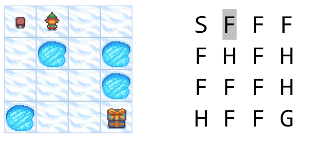
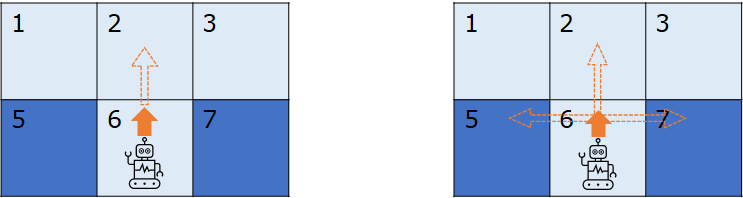

## 10.1 冰面行走问题

在 10.2 节中，我们重温了第六章和第七章中的相关内容。在第八章中，引入了策略问题，并使用贝尔曼期望方程来评估策略的价值。在本章中后续的内容，就是要学习在我模型的情况下，如何使用蒙特卡洛法来评估策略的价值，即估算状态价值函数 $V_\pi$ 和动作价值函数 $Q_\pi$。

### 10.1.1 提出问题

冰面行走问题是 OpenAI Gym 中的一个强化学习环境。在 Gym 文档 https://www.gymlibrary.ml/ 中，提供了以下一些环境：

- Atari - 雅达利游戏

    包含一些简单的射击、追逐、对战游戏，玩家通过学习环境变化来控制物体执行各种动作以赢得游戏。

- MuJoCo- 多关节运动控制。

    Multi-Joint dynamics with Contact，具有接触的多关节动力学。它是一个物理模拟器，用于促进机器人、生物力学、图形和动画以及其他需要快速准确模拟的领域的研究和开发。

- Toy Text - 玩具文本环境

    都是使用本机Python库（如StringIO）创建的。这些环境设计得非常简单，具有很少的离散状态和动作空间，因此易于学习，适用于强化学习算法的调试实现。所有环境都可以通过每个环境文档中指定的参数进行配置。

- Classic Control - 经典控制环境

    提供了五种典型的控制环境，所有这些环境在给定范围内的初始状态都是随机的。这组环境更容易通过策略来解决，可以通过每个环境文档中指定的参数进行配置。

- Box2D - 二维仿真控制游戏

    这些环境都涉及基于物理控制的玩具游戏，使用基于 box2d 的物理和基于 PyGame 的渲染。这些环境是奥列格·克利莫夫在早期创造的，从那时起就成为了流行的玩具基准。所有环境都可以通过每个环境文档中指定的参数进行配置。


我们要解决的问题叫做 Frozen Lake（直译为冰冻湖面，即冰面行走），归属于 Toy Text 环境，如图 10.1.1 所示：

<center>


图 10.1.1 FrozenLake问题示意图

（左图：图形化界面；右图：字符化界面）
</center>

为什么叫做 Toy Text 呢？看图 10.1.1 的右图就可以明白了，这些问题是可以用字符化界面来展示说明并模拟推演的，其中第一行第二个字符 F 底色是灰色的，表示智能体当前的位置。字符代表的含义解释如下。

在一个 4x4 网格的冰冻湖面上，存在 4 种状态区域：

- S - Start 起点，一个，左上角；
- F - Frozen 冰面，十个，图中浅蓝色网格；
- H - Hole 冰洞，四个，图中深蓝色网格；
- G - Goal 目的地，一个，右下角。

环境说明：

- 目标：让图中的小人（智能体）学会从起点尽量安全地走到终点拿到礼物，不要掉入冰洞。
- 分幕：一旦掉入冰洞，本幕结束，回到起点重新开始。拿到礼物也结束一幕。
- 奖励：只有到达目的地才有 +1 的奖励，其它任何状态、动作都是 0 分的奖励（相当于没有奖励）。
- 动作：上下左右四个动作。出界时回到动作出发点。

另外，在冰面行走时有两种难度选项：

- 简单模式：智能体会沿着指定的行走方向顺利地到达下一格。如图 10.1.2 左图所示。
- 困难模式：由于冰面很滑，智能体有 1/3 的概率偏向出发点与动作方向左侧的格子，1/3 的概率偏向右侧的格子，只有 1/3 的概率会沿着指定的行走方向到达下一格。如图 10.1.2 右图所示，实心箭头表示行走方向，虚线箭头表示有可能到达的方向。

<center>


图 10.1.2 冰面行走问题的两种难度模式
（左图：简单模式；右图：困难模式）
</center>

比如图 10.1.2 中智能体所在的位置为 $s_6$，如果向上方走，在简单模式下，会直接走到 $s_2$；在困难模式下有可能会滑倒左侧 $s_5$ 或右侧 $s_7$ 冰洞中，只有 1/3 的概率可以到达 $s_2$。

### 10.1.2 有模型与无模型

有的读者可能会觉得这个问题很简单，只需要用代码判断下一个格子是不是冰洞，如果是的话就绕开，然后让智能体尽量向右下方移动，就可以完成任务了。为什么要用强化学习？

如同所有的机器学习一样，强化学习就是要避免使用“程序”来控制智能体的行为，而是让它真正具有一些智能。

曾经有人讨论电饭锅是不是智能体，因为它可以自动地把米饭做熟。电饭锅里面只是一个 Program（程序），不是 Intelligence（智能），比如：它不会知道锅里放了多少米和多少水。它只有一个温度传感器和一个定时器，当在一个温度下持续了 30 分钟后，它就会认为米饭熟了。

而强化学习的解题思路是计算状态价值函数和动作价值函数，让智能体“学习”到在什么状态下要执行什么动作，才能获利最大。冰面行走问题是一个标准的马尔可夫决策过程 MDP 的场景，如第八章所学，MDP 下有两种价值函数：状态价值函数和动作价值函数。

$$
v_\pi(s) = \mathbb E[G_t \mid S_t=s]=\mathbb E \Big[\sum_{k=0}^T \gamma^k R_{t+k+1} \mid S_t=s\Big] \tag{10.1.1}
$$

$$
q_\pi(s,a) = \mathbb E[G_t \mid S_t=s, A_t=a]=\mathbb E \Big[\sum_{k=0}^T \gamma^k R_{t+k+1} \mid S_t=s,A_t=a\Big] \tag{10.1.2}
$$

式（10.1.1）和式（10.1.2）与 8.4 节中的关于 $v_\pi,q_\pi$ 的表达式有所不同，这里没有写出后续的含有模型信息的公式，即状态转移概率，这是因为在实际问题中，有很多场景是得不到状态转移概率的，无法做精确计算，只能使用蒙特卡洛方法来做“近似”。

有模型的问题，即 model-based，如果模型已知，则可以用动态规划来解决，叫做 Planning。因为是迭代计算，所以不算是数学解析解，只能叫做高精度的迭代解。

无模型的问题，即 model-free，用本章学习的蒙特卡洛法来解决，它不试图得到环境模型的数学描述，而是通过大量样本的奖励值得到“平均”值，叫做近似解。

高方差、低偏差。。。。。。

### 10.1.3 用动态规划法得到近似解

#### 冰面行走问题的两种模式

这就又回到以前的问题：如果只能近似的话，那么以什么为基准来做近似呢？如何判断近似得到位了呢？

对于 Gym 中的这个冰面行走问题，其实它的背后是有一个环境模型的，而 Gym 中的其它很多环境，比如雅达利游戏，就属于没有环境模型的，或者是环境模型过于复杂无法描述的，比如 21 点纸牌游戏。所以，我们可以先用第八章学习的贝尔曼期望方程和第九章学习的贝尔曼最优方程，来得到冰面行走问题的“迭代”解，然后再用蒙特卡洛方法来“近似”，得到一些基本的概念，然后再去解决无模型的问题。

为了使用动态规划法，需要先查看环境提供的数据结构。

【代码位置】MC_103_FrozenLake_DP.py

```python
env = gym.make('FrozenLake-v1', map_name = "4x4", is_slippery=False)    # 设置环境为“简单”
print(env.P)    # env.unwrapped.P
```

得到如下结果：

```
{
    0: {0: [(1.0, 0, 0.0, False)], 1: [(1.0, 4, 0.0, False)], 2: [(1.0, 1, 0.0, False)], 3: [(1.0, 0, 0.0, False)]}, 
    1: {0: [(1.0, 0, 0.0, False)], 1: [(1.0, 5, 0.0, True)],  2: [(1.0, 2, 0.0, False)], 3: [(1.0, 1, 0.0, False)]}, 
    ......  
    14: {0: [(1.0, 13, 0.0, False)], 1: [(1.0, 14, 0.0, False)], 2: [(1.0, 15, 1.0, True)], 3: [(1.0, 10, 0.0, False)]}, 
    15: {0: [(1.0, 15, 0, True)],    1: [(1.0, 15, 0, True)],    2: [(1.0, 15, 0, True)],   3: [(1.0, 15, 0, True)]}
}
```

- 首先，这是一个字典形式的数据结构，key 是状态序号（0-15）。

- 其次，每个状态序号下面的 value 是另外一个字典，其 key 是动作序号（0-3）。

- 第三级，动作序号下面的 value 是一个列表，里面只有一项用 tuple 表示的数据，比如（1.0, 0, 0.0, False），其含义是：
    - 1.0：动作发生后的转移概率；
    - 0：转移到的目标状态序号；
    - 0.0：得到的奖励值；
    - False：目标状态是否为终止状态。


如果设置环境为“困难”，即把参数 is_slippery 设置为 True：

```python
env = gym.make('FrozenLake-v1', map_name = "4x4", is_slippery=True)     # 设置环境为“困难”
print(env.P)    # env.unwrapped.P
```
得到如下结果：

```
{
    0: {    # 状态 0
        0: [(0.333, 0, 0.0, False), (0.333, 0, 0.0, False), (0.333, 4, 0.0, False)],    # 动作0
        1: [(0.333, 0, 0.0, False), (0.333, 4, 0.0, False), (0.333, 1, 0.0, False)],    # 动作1
        2: [(0.333, 4, 0.0, False), (0.333, 1, 0.0, False), (0.333, 0, 0.0, False)],    # 动作2
        3: [(0.333, 1, 0.0, False), (0.333, 0, 0.0, False), (0.333, 0, 0.0, False)]     # 动作3
    },         
    ......
    14: {   # 状态 14
        0: [(0.333, 10, 0.0, False), (0.333, 13, 0.0, False), (0.333, 14, 0.0, False)], # 动作 0
        1: [(0.333, 13, 0.0, False), (0.333, 14, 0.0, False), (0.333, 15, 1.0, True)],  # 动作 1
        2: [(0.333, 14, 0.0, False), (0.333, 15, 1.0, True),  (0.333, 10, 0.0, False)], # 动作 2
        3: [(0.333, 15, 1.0, True),  (0.333, 10, 0.0, False), (0.333, 13, 0.0, False)]  # 动作 3
    },
    15: {   # 状态 15
        0: [(1.0, 15, 0, True)],    # 动作0 （转移概率, 下个状态, 奖励, 是否终止）
        1: [(1.0, 15, 0, True)],    # 动作1
        2: [(1.0, 15, 0, True)],    # 动作2
        3: [(1.0, 15, 0, True)]     # 动作3
    }
}
```

仍然是一个二级字典结构，但是在第三级数据中加入了状态转移的描述，比如状态 0 下的动作 2 下列表由三组 tuple 组成，表示在状态 0 执行动作 2（向右移动）时：
- (0.333, 4, 0.0, False) ，移动方向的右侧，**滑到**状态 4 的概率为 0.333，奖励 0.0，非终止状态；
- (0.333, 1, 0.0, False) ，移动方向的前方，**达到**状态 1 的概率为 0.333，奖励 0.0，非终止状态；
- (0.333, 0, 0.0, False) ，移动方向的左侧，**回到**状态 0 的概率为 0.333，奖励 0.0，非终止状态。

注意我们使用了三种不同的词汇来描述状态转移：

- **滑到**：表示与动作预期的方向不同；
- **达到**：表示与动作预期的方向相同；
- **回到**：本来是应该向上方滑动，但是出界了，所以回到了当前的位置。

状态 15 的数据比较简单，和环境为“简单”时相同，因为该状态是终止状态，无论任何动作都会回到原地。但是细心的读者会发现，该状态中并没有得到奖励为 +1 的信息，这是为什么？

因为我们前面讲“奖励”的时候说过，正确的奖励定义是面向转移过程的。在这个问题中，只有从状态 14 才有可能到达状态 15，因此，我们可以再看一下状态 14 的数据：

- 动作 0，因为是向左移动，所以没有任何可能达到状态 15；
- 动作 1，向下移动，有可能向左**滑到**状态 15，奖励 1.0，列表第三项；
- 动作 2，向右移动，有可能直接**达到**状态 15，奖励 1.0，列表第二项；
- 动作 3，向上移动，有可能向右**滑到**状态 15，奖励 1.0，列表第一项。

#### 冰面行走问题简单模式下的随机策略的迭代解

有了上述对数据的理解，把第九章的代码稍微改动一下，就可以完成对 $v_\pi,q_\pi$ 的迭代计算了。

【代码位置】Algorithm.Algo_PolicyValueFunction.py, MC_103_FrozenLake_DP.py

$V_\pi$ 结果如下：

```
====================is slippery=False====================
迭代次数 =  21
---------------随机策略下的状态价值函数 V---------------
[[0.014 0.011 0.021 0.01 ]
 [0.016 0.    0.041 0.   ]
 [0.035 0.088 0.142 0.   ]
 [0.    0.176 0.439 0.   ]]
```

$Q_\pi$ 结果如下：

```
---------------随机策略下的动作价值函数 Q---------------
[[0.014 0.016 0.011 0.014]      +-----+-----+-----+-----+
 [0.014 0.    0.021 0.011]      |     |     |     |     |
 [0.011 0.041 0.01  0.021]      |  ┼  |  ┼─►|  ┼  |◄─┼  |
 [0.021 0.    0.01  0.01 ]      |  ▼  |     |  ▼  |     |
 [0.016 0.035 0.    0.014]      +-----+-----+-----+-----+
 [0.    0.    0.    0.   ]      |     |     |     |     |
 [0.    0.142 0.    0.021]      |  ┼  |  ┼  |  ┼  |  ┼  |
 [0.    0.    0.    0.   ]      |  ▼  |     |  ▼  |     |
 [0.035 0.    0.088 0.016]      +-----+-----+-----+-----+
 [0.035 0.176 0.142 0.   ]      |     |     |     |     |
 [0.088 0.439 0.    0.041]      |  ┼─►|  ┼  |  ┼  |  ┼  |
 [0.    0.    0.    0.   ]      |     |  ▼  |  ▼  |     |
 [0.    0.    0.    0.   ]      +-----+-----+-----+-----+
 [0.    0.176 0.439 0.088]      |     |     |     |     |
 [0.176 0.439 1.    0.142]      |  ┼  |  ┼─►|  ┼─►|  ┼  |
 [0.    0.    0.    0.   ]]     +-----+-----+-----+-----+
```

从 $Q$ 函数结果以及抽取出的策略（方格内的箭头）来看，这个结果是非常正确的，可以引导智能体从起点安全地到达终点。

有了上述基准后，我们就可以去研究最佳的算法了。
