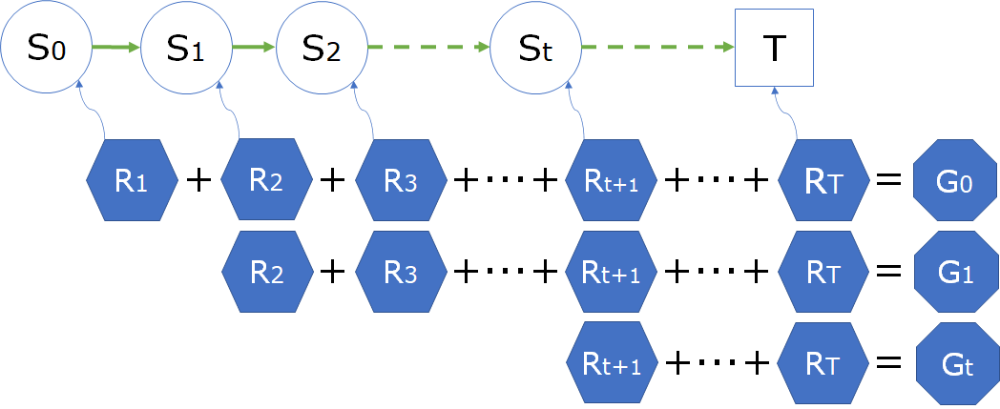
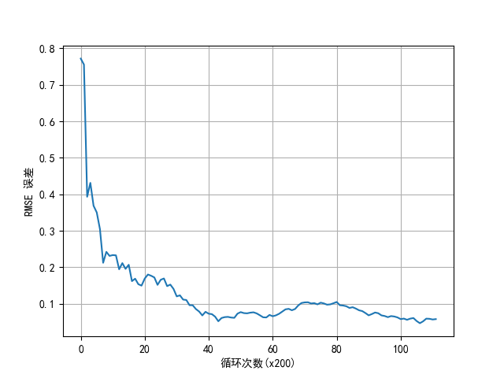

## 10.3 价值评估

在 6.3 节中，已经学习过如何使用最朴素的蒙特卡洛方法来评估价值函数。本小节学习使用蒙特卡洛法估算 MRP 下的价值函数 $V$，将要接触到一种算法：首次访问法。需要说明的是，这种算法同样适用于估算 MDP 下的价值函数 $V_\pi, Q_\pi$。

### 10.3.1 提出问题

#### 安全驾驶问题中的状态价值函数估算方法

首先要回忆一下，在 MRP 中，因为没有牵涉到动作问题，所以只有状态价值函数的概念。

在第六章中，针对 MRP 问题，我们曾经使用蒙特卡洛方法估算过“安全驾驶问题”中的状态价值函数。当时给读者留下的印象可能是：

- 这种方法怎么运行起来那么慢？
- 因为要采样很多次才能基本稳定下来，否则两次试验之间的差别特别大，那么到底采样多少次才算合理？
- 这种方法怎么能保证准确？有没有基准可以比较？
- 最终得到的结果的可信度有多高？

在 6.3 节中，我们根据回报 $G$ 的定义：

$$
G_t = R_{t+1}+\gamma R_{t+2}+\gamma^2 R_{t+3}+ \cdots +\gamma^{T-t-1} R_{T}
\tag{10.3.1}
$$

以及价值函数 $V$ 的定义：

$$
v_t(s) = \mathbb E [G_t | S_t = s]
\tag{10.3.2}
$$

然后使用最朴素的蒙特卡洛采样法初步计算出了安全驾驶问题的各个状态的价值函数。简述其过程如下：

1. 使用蒙特卡洛采样，每次采样都需要指定一个初始状态 $s_0$，然后开始在幕内循环；
2. 得到一个 $R$ 后，累积计算 $G = G + \gamma^{t-1}R$，直到幕内循环结束（到 $T$），得到式（10.3.1）的计算结果；
3. 进行下一次采样，$G$ 值清零后再用 step 2 的循环重新计算 $G$ 值并累积；
4. 最后求 $G$ 的平均（数学期望）得到 $v_t(s_0)$，即式（10.3.2）。

这种方法的特点是：
- 易理解，完全按照定义来计算；
- 省空间，不需要记录中间状态，来了一个 $R$ 后立刻计算，然后扔掉，只保留 $G$ 值；
- 随着幕数的增加，会更逼近真实值；
- 每次多幕循环只计算一个起始状态的价值；
- 遍历状态并在环境控制下重复多次，速度慢；
- 浪费了中间的采样结果。

#### 充分利用样本数据

聪明的读者可能会发现一个问题：在得到一幕的采样后，如果不“从头”开始，而是从第二个、第三个状态开始计算，是不是就能在一次采样中就可以得到很多状态的 $G$ 值呢？

<center>


图 10.3.1 重复利用样本来计算不同时刻/状态的回报值
</center>


如图 10.3.1 所示，从 $S_0$ 开始一幕的采样，到 $T$ 为止结束，得到 $R_1,\cdots,R_T$ 的序列后：
- 第一行：固然可以从 $R_1$ 开始计算出 $G_0$；
- 第二行：但是如果从 $R_2$ 开始，不就能计算出 $G_1$ 了吗？
- 第三行：同理，还可以计算出这一采样序列中的任意的 $G_t$ 出来。

这样的话利用一次采样结果可以计算出很多状态的 $G$ 值，会大幅提高算法的效率。当然，这就需要把每一幕的采样结果记录下来，计算完所有可能的 $G$ 后，扔掉这一幕记录，再进行下一幕的采样。


#### 用贝尔曼方程得到解析解

在第六章时，我们还没有学习贝尔曼方程（第七章的内容），所以当时使用了蒙特卡洛法依靠大量的采样来计算 $G$ 值。由于安全驾驶问题实际上是有一个模型的，所以可以利用贝尔曼方程得到该问题的“近似真实解”，并以此为基准（Ground Truth）来衡量算法的性能。而性能又包括两个方面：1. 速度；2. 准确度。需要在这二者之间寻找平衡。

下面是用贝尔曼方程的矩阵法计算出来的状态价值函数值 $V$（精确到小数点后两位）。

【代码位置】MC_102_SafetyDrive_DataModel.py

```
状态价值函数计算结果(数组) : [ 1.03  1.72  2.72  3.02 -5.17 -6.73  6.   -2.37 -1.    5.    0.  ]
Start:       1.03
Normal:      1.72
Pedestrians: 2.72
DownSpeed:   3.02
ExceedSpeed:-5.17
RedLight:   -6.73
LowSpeed:    6.0
MobilePhone:-2.37
Crash:      -1.0
Goal:        5.0
End:         0.0
```

但是我们也讲到过，当状态数量很多时，用矩阵法计算的复杂度很高，而且很多问题没有模型，因此也不能使用贝尔曼方程（动态规划）。

#### 衡量算法准确度 RMSE

RMSE - Root Mean Square Error，均方根误差，用于比较观测值与真实值之间的偏差，通常不是比较两个标量，而是比较两个向量（数组）。比如，可以用贝尔曼方程的矩阵法计算出来的状态价值数组做为基准值 $Y$，用蒙特卡洛法估算出来的数组值 $X$与基准值 $Y$ 之间计算 RMSE。

$$
RMSE = \sqrt{\frac{1}{n} \sum_{i=1}^n (x_i-y_i)^2} \tag{10.3.3}
$$

其中：

- $n$ 为数组元素个数；
- $x_i$ 为观测值；
- $y_i$ 为真实值。

代码实现为：

```python
def RMSE(x, y):
    err = np.sqrt(np.sum(np.square(x - y))/y.shape[0])
    return err
```

比如，假设真实值为 $y=[1,2,3]$，观测值为 $x=[1.1,2,2.9]$，则：$RMSE=\sqrt{[(1.1-1)^2+(2-2)^2+(2.9-3)^2]/3} \approx 0.08$。

在做向量比较时，有一些资料上把 $n$ 解释为观测次数，其实是不对的。另外，在式（10.3.3）中的 $x,y$ 是可以对调的，不影响计算结果。

注意，不同的问题之间的 RMSE 是不可比的，比如在问题 A 中，理想的 RMSE 应该小于 0.01，而在问题 B 中，只要小于 0.1 就达到要求了。最简单的做法是先用全 0 值与基准值作比较，计算出 RMSE_0，然后把该值除以 50 得到 RMSE_0_50，只要后续的算法达到 RMSE_0_50 的级别，就算符合要求了。

用 $y=[1,2,3]$ 举例来说，RMSE_0=$\sqrt{[(1-0)^2+(2-0)^2+(3-0)^2]/3}/50 \approx 0.0432$，只要后续算法的误差为这个级别就行了。

如果用安全驾驶问题的基准值 y=[1.03, 1.72, 2.72, 3.02, -5.17, -6.73, 6, -2.37, -1, 5, 0] 来做例子的话，RMSE_0_50 = 0.076。


### 10.3.2 首次访问法

#### 什么是首次访问法

在图 10.3.1 中，$s_0,s_1,\cdots,s_t$ 代表的是不同时刻的状态，而不是不同的状态。说起来比较绕，我们举个例子。在安全驾驶问题中，一个序列可能是这样的：出发$s_0 \to$正常行驶$s_1 \to$闹市减速$s_2 \to$礼让行人$s_3\to$正常行驶$s_4\to \cdots$

读者可以看到，正常行驶状态出现了两次，一次在 $s_1$，一次在 $s_4$，对这个状态来说，$s_1$ 就叫做首次访问。在这两个状态可以计算出 $G_1$ 和 $G_4$ 来，那么最后 $V_{正常行驶}$ 的值是 $G_1$ 呢还是 $G_4$ 呢？

更一般地，在一个采样序列中，有如下状态序列数据：Episode=$[s_a, s_b, s_c, s_a, s_d, s_b]$, $\tau=6$。

- 首次访问法在倒序遍历到最后那个 $s_b$ 时，$t=\tau-1=5$，先检查 $s_b$ 是否在 Episode[0:5] 中；在本例中 Episode[0:5] 含有 $s_b$，所以就不会把这个 $t$ 上的 $G_t$ 值记录到 $G$ 的累积值中。
- $t=4$，$s_d$ 在 Episode[0:4] 中不存在，叫做首次访问，记录其 $G_t$ 值；
- $t=3$，$s_a$ 在 Episode[0:3] 中存在，不记录其 $G_t$ 值；
......

在这个例子中，最终会计算的是 $s_a, s_b, s_c, s_d$ 四个状态的 $G$ 值。

马尔科夫链的环状结构会使得这种情况非常常见，显然第一个 $s_a$ 和 第四个 $s_a$ 在时域 $t$ 上应该具有不同的价值。但是从全局/静态角度看，它们又应该具有相同的价值。Sutton 在研究了这个问题后，认为根据大数定律，首次访问法的方差以 $1/\sqrt{n}$ 的速度收敛。

#### 算法描述

【算法 10.3】首次访问型蒙特卡洛法。

下面的伪代码中，$\leftarrow$ 表示赋值，$\Leftarrow$ 表示追加列表。

---

输入：起始状态 $s,\gamma$, Episodes
初始化：$G(S) \leftarrow 0, N(S) \leftarrow 0$
多幕 Episodes 循环：
　　列表置空 $Episode = [\ ] $ 用于存储序列数据 $(s,r)$
　　幕内循环直到终止状态：
　　　　从 $s$ 根据环境模型得到 $s',r$ 以及是否终止的标志
　　　　$Episode \Leftarrow (s',r)$
　　　　$s \leftarrow s'$
　　$G_t \leftarrow 0$
　　对 $Episode$ 从后向前倒序遍历, $t=\tau-1,\tau-2,...,0$
　　　　取出 $s_t,r_t$
　　　　$G_t \leftarrow \gamma G_t+r_t$
　　　　如果 $s_t$ 不在 $s_0,s_1,\cdots,s_{t-1}$ 中，即首次访问：
　　　　　　$G(s_t) \leftarrow G(s_t)+G_t$
　　　　　　$N(s_t) \leftarrow N(s_t)+1$
$V(S) \leftarrow G(S) / N(S)$
输出：$V(S)$

---

#### 倒序遍历方法

图 10.3.2 是倒序遍历方法的说明。

<center>


图 10.3.2 首次访问法中计算 G 值的方法
</center>

把这张图与图 6.3.1 做比较，就可以发现橙色部分的“计算顺序”是不同的。其中，状态下标 $_S,_N,_L,_G,_E$ 等是安全驾驶问题中对应的状态的缩写，在这里无关紧要，但它们是一个真实的序列。

“倒序遍历”与“首次访问”，这两个顺序是正好相反的，请读者仔细甄别其具体含义。

#### 算法实现

【代码位置】Algorithm.Algo_MC_Value_Evaluation.py

```Python
# MC1-FirstVisit 首次访问法
def MC_FirstVisit(dataModel, start_state, episodes, gamma):
    Value = np.zeros(dataModel.nS)  # G 的总和
    Count = np.zeros(dataModel.nS)  # G 的数量
    for episode in tqdm.trange(episodes):   # 多幕循环
        TrajectoryState = []        # 一幕内的状态序列
        TrajectoryReward = []       # 一幕内的奖励序列
        s = start_state
        is_end = False
        while (is_end is False):    # 幕内循环
            next_s, r, is_end = dataModel.step(s)   # 从环境获得下一个状态和奖励
            TrajectoryState.append(s.value)
            TrajectoryReward.append(r)
            s = next_s
        assert(len(TrajectoryState) == len(TrajectoryReward))
        num_step = len(TrajectoryState)
        G = 0
        # 从后向前遍历计算 G 值
        for t in range(num_step-1, -1, -1):
            s = TrajectoryState[t]
            r = TrajectoryReward[t]
            G = gamma * G + r
            if not (s in TrajectoryState[0:t]):# 是否首次访问
                Value[s] += G     # 值累加
                Count[s] += 1     # 数量加 1
    
    Count[Count==0] = 1 # 把分母为0的填成1，主要是终止状态
    return Value / Count    # 求均值
```
与每次访问法代码不同的是，上述代码使用了两个 Trajectory 来分别记录状态序列和奖励序列（当然这二者是同步的），便于在判断是否首次访问时简单易行。

#### 运行结果

【代码位置】MC_102_FirstVisit.py

首次访问法的运行结果：

```
gamma = 1.0
状态价值函数计算结果(数组) : [ 1.03  1.71  2.73  2.83 -5.2  -6.71  6.   -2.28 -1.    5.    0.  ]
Start:       1.03
Normal:      1.71
Pedestrians: 2.73
DownSpeed:   2.83
ExceedSpeed:-5.2
RedLight:   -6.71
LowSpeed:    6.0
MobilePhone:-2.28
Crash:      -1.0
Goal:        5.0
End:         0.0
耗时 : 4.39701247215271
误差 = 0.06336656060380948
```

#### 几种算法的运行结果比较

表 10.3.1  $\gamma=1$ 时的状态值计算结果比较

|状态|矩阵法<br>（第七章）|顺序计算法<br>（第六章）|首次访问法<br>（本章）|
|-|:-:|:-:|:-:|:-:|
|出发 Start|           1.03|1.11|1.03|
|正常行驶 Normal|      1.72|1.52|1.71|
|礼让行人 Pedestrians| 2.72|2.70|2.73|
|闹市减速 DownSpeed|   3.02|2.79|2.83|
|超速行驶 ExceedSpeed| -5.17|-5.19|-5.2|
|路口闯灯 RedLight|    -6.73|-6.71|-6.71|
|小区减速 LowSpeed|     6.00|6.00|6.00|
|拨打电话 MobilePhone| -2.37|-2.51|-2.28|
|发生事故 Crash|       -1.00|-1.00|-1.00|
|安全抵达 Goal|        5.00|5.00|5.00|
|终止 End|              0.00| 0.00|0.00|
|**误差 RMSE**|-|**0.102**|**0.063**|
|**总采样次数**|-|**50000**|**100000**|
|**耗时**|-|**7.37**|**4.70**|


可以看到，改进的算法在速度上和精度上都比原始算法要好。RMSE 的误差值，原始顺序计算法误差为 0.102（大于前面说过的 RMSE_0_50=0.076），改进算法为 0.063（小于 0.076），越小越好。

从性能上看，第六章介绍的顺序计算法对每个状态做了 5000 次采样，一共 10 个有效状态，所以就是 50000 次采样。首次访问法对所有状态（混合）一共做了 20000 次采样，以每幕平均 5 个状态来估算，就有至少 100000 次采样，结果自然会比顺序计算法要准确。

几种算法的耗时值其实并不准确，因为每次运行都有不同的值，但是可以确定的是，首次访问法比顺序计算法性能要好，因为重复利用了采样结果。


### 10.3.3 何时可以停止迭代

在问题规模比较小时，我们当然可以循环尽可能多的幕数，得到更多的采样来计算均值，以逼近期望值。但是，问题规模较大较复杂时，循环会很耗费时间。所以，如何权衡循环时间和结果精度之间的关系，是一个需要研究的问题。

这可能让读者想起了在动态规划迭代中所采用的方法：当前后两次结果的差值的最大值小于一个给定的阈值时，就可以停止迭代。代码是这样的：

```python
    if abs(V-V_old).max() < delta:
        break
```

- 动态规划方法有个特点：它的每一次迭代，肯定会改变计算值，而且这种改变是由大变小的。当上述代码成立时，并假设不终止迭代，那么下一次的迭代结果的差值，也一定会小于 delta。
- 而蒙特卡洛法也有个特点：它的每一次循环，也肯定会改变计算值，但是改变的幅度是不可预知的。因为采样是随机的，每次采样可能会改变多个值，也可能只改变一个值。

表 10.3.1 

|状态|$s_1$|$s_2$|$s_3$|
|-|-|-|-|
|当前 V 值|0.8|0.9|1.0|
|被访问次数|1000|500|100|

假设新的一幕采样使得 $s_1$ 的被访问次数 +1，而且 reward=1，那么最新的状态值为：$v(s_1)=\frac{0.8 \times 1000+1}{1000+1} \approx 0.8002$，那么 $0.8002-0.8=0.0002 < $1e-3，可以看到它的变化非常小，但是并不能以这一次的结果来判定应该结束迭代了，因为这种采样的变化是累积的，只有当多次采样后的变化幅度仍然很小时，才可以认定是收敛了。

还有一个问题是阈值的设置，在动态规划问题中，将 delta 设置为 1e-4 甚至 1e-6，都是可行的。但是在蒙特卡洛方法中，1e-2 或 1e-3 才有可能是一个合理的值。

第三个问题是，由于蒙特卡洛方法的不稳定性，某一次的收敛有可能是假象，我们可以设定为必须连续三次检查都收敛，才算是真的收敛。

检查是否收敛部分的代码：

```python
# MC - FirstVisit with EarlyStop 首次访问法,早停
def MC_FirstVisit_EarlyStop(dataModel, start_state, episodes, gamma, checkpoint=100, delta=1e-3):
    ......
        if (episode+1)%checkpoint == 0:
            Count[Count==0] = 1 # 把分母为0的填成1，主要是终止状态
            V = Value / Count   # 求均值
            if abs(V-V_old).max() < delta:          # 判断是否收敛
                less_than_delta_count += 1          # 计数器 +1
                if (less_than_delta_count == 3):    # 计数器到位
                    break                           # 停止迭代
            else:                                   # 没有持续收敛
                less_than_delta_count = 0           # 计数器复位
            V_old = V.copy()

    return Value / Count    # 求均值

```

在主程序代码中的几个关键值设置：

```python
    episodes = 100000       # 最多循环 100000 次
    checkpoint = 200        # 每 200 次检查一次收敛情况
    delta = 1e-2            # 阈值为 1e-2
```

运行结果如下：

```
循环幕数 = 22400
状态值 = [1.068  1.742  2.804  3.168 -5.131 -6.672  6.  -2.366 -1.   5.  0.]
误差 = 0.057937657059503364
```

一共循环了 22400 次，达到了 3 次收敛的条件，最终的误差为 0.058。

在代码中还记录了每次检查时的 V 值，并计算出与基准值的误差，显示在图 10.3.3 中。

<center>


图 10.3.3 早停法
</center>

从图中可以看到，误差的变化幅度还是比较大的，但是到了 23000 次以后，估计会很平缓了，读者可以自行测试。
