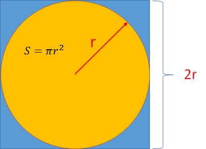
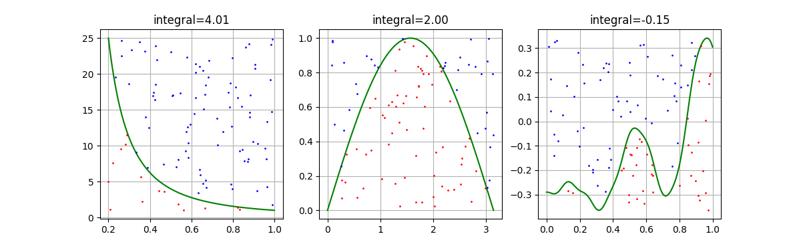

## 蒙特卡洛方法

本节中将要学习的蒙特卡洛方法，是强化学习的一种重要手段，在后面的学习中，要更充分地讨论蒙特卡洛预测和蒙特卡洛控制，都是以本节的内容为理论基础的。

其实在“三门问题”和“学生学习问题”中，已经使用了蒙特卡洛的思想来解决问题了，接下来我们系统地了解一下这种方法。

### 1 提出问题一

#### 估算圆周率

假设我们已经知道了圆面积的方程为 $S = \pi r^2$，但是不知道 $\pi$ 的具体数值。能否通过一些简单的方法得到 $\pi$ 值呢？

请读者先放松一下，看看历史上关于圆周率计算的故事。

联合国教科文组织在2019年11月26日第四十届大会批准宣布，3月14日为“国际数学日（International Day of Mathematics,简称IDM）”。因为“3.14”是圆周率数值最接近的数字，所以这一天也叫圆周率日（$\pi$ day）。

- 公元前250年，希腊数学家阿基米德通过割圆术计算圆周率，阿基米德进行了96边形的割圆之后，将圆周率推到了小数点后两位3.14。
- 直到公元265年，中国的数学家刘徽用割圆术的方法，通过正3072边形计算出π的数值为3.1416，艰难地把圆周率推到了小数点后四位。
- 200年后，祖冲之继续使用割圆术计算12,288形的边长，将圆周率推到了小数点后六位，可惜的是，由于文献的失传，祖冲之的计算方法我们现在已经不得而知了。
- 800年后，随着近代数学的发展，数学家韦达、罗门、科伊伦、司乃耳、格林伯格通过割圆术陆续将圆周率推到了小数点后39位，这个精度是什么概念呢，如果我们通过小数点后39位的圆周率计算一个一个可观察宇宙大小的圆，计算的误差仅仅只有一个氢原子大小。
- 十六世纪到十七世纪，人们发现了一种新的圆周率计算方法——无穷级数法，让计算圆周率的工作变得更加快速。无穷级数是一组无穷数列的和，数学家梅钦通过无穷级数将圆周率推算到小数点后100位，在很短的时间里，人们通过梅钦类公式反复打破了新的圆周率记录。
- 18世纪，法国数学家布丰提出了随机投针法，即利用概率统计的方法来计算圆周率的值，也就是著名的投针实验。布丰在地板上画出若干平行的直线，再将一根根短于平行直线距离的针撒到地板上，通过统计针的总数和与直线相交的针的个数，从而计算圆周率。

这种算法虽然虽然没有打破圆周率的记录，但这种将几何与概率结合起来的思想催生了蒙特卡洛算法，也让人工智能成为了可能。

#### 用蒙特卡洛方法估算圆周率

先给出一个试验方法，如图 1 所示。

<center>


图 1 正方形与内切圆
</center>

中学几何的知识告诉我们：
- 圆的面积 $S_c=\pi r^2$；
- 正方形的面积 $S_s=2r \times 2r=4r^2$；
- 那么圆的面积除以正方形的面积 $S_c/S_s=\pi r^2 / 4r^2=\pi/4$；
- 所以 $\pi = 4S_c/S_s$。

如果是古人的话，可能会在图 1 上平铺一层细沙，然后称出在圆内的细沙的重量，再称出方形内细沙的重量，以此来模拟面积计算。现在我们借助计算机的力量，在图 1 内随机打点，然后统计出圆内的点的数量和方形内点的数量，也同样可以模拟出面积计算。

#### 实现代码

【代码位置：CirclePi_1.py】

```python
# 随机投点
def put_points(ax, num_total_points):
    ax.axis('equal')
    data = np.random.uniform(-1, 1, size=(num_total_points, 2))     # 在正方形内生成随机点
    r = np.sqrt(np.power(data[:,0], 2) + np.power(data[:,1], 2))    # 计算每个点到中心的距离
    num_in_circle = 0   # 统计在圆内的点数
    for i, point in enumerate(data):    # 绘图
        if (r[i] < 1):
            num_in_circle += 1     # 计数
            ax.scatter(point[0], point[1], s=1, c='r')
        else:
            ax.scatter(point[0], point[1], s=1, c='b')
    # 计算 pi 值
    title = str.format("n={0},$\pi$={1}",num_total_points, num_in_circle/num_total_points*4)
    ax.set_title(title)
    draw_circle(ax, 1, 0, 0)
    ax.grid()
```

为了避免随机性，可以使用相同的点数做多次试验并求平均，或者使用不同的点数做多次试验求平均。在此我们使用了第二种方法，绘制出图 2 所示的结果。

<center>


图 2 随机投点估算圆周率
</center>

在本次试验中，随机点数量与估算出的 $\pi$ 值对应关系如下：

- 100个点：3.04
- 200个点：3.04
- 500个点：3.136
- 1000个点：3.18
- 平均：3.099

人们通常以为点数越多，估算出的值越准确。从趋势上来看确实如此，但也不能避免单次试验的结果都带来的偏差。因此，在图 3 的试验中，我们分别使用 1000 到 20,000 个点来做估算，并且每个点数上都重复了 100 次取平均，最后得到了误差的变化图。

【代码位置：CirclePi_2.py】

<center>


图 3 随机点计算圆周率的误差变化
</center>

从横坐标上看，投点数量越多，偏差和方差都会随之减小。从最终的平均结果来看，3.1418 已经可以代表这种方法的精度了。当然，读者还可以用更多的点数来验证，不过单次试验的结果总会令人失望的。

对于估算不规则图形面积的问题，用这种方法同样可以解决。

### 2 提出问题二

#### 计算定积分

对于复杂函数，如何计算其定积分？

在图 4 中，显示了三个函数的图形，从左到右分别是：

- $f_1(x) = \frac{1}{x^2}$
- $f_2(x) = \sin(x)$
- $f_3(x) = 0.4x^2 + 0.3x\sin(15x) + 0.01\cos(50x)-0.3$

前两个简单函数，可以得知：

$$
\int_{0.2}^1 \frac{1}{x^2} dx = 4, \quad \int_0^{\pi} \sin(x) dx = 2
$$

那么第三个函数就要稍微费劲儿些了。

<center>


图 4 计算函数积分
</center>

#### 用蒙特卡洛方法估算定积分值

从问题一中，我们学到了随机投点的方法，在此仍然可以使用，但是由于函数值域区间的变化，写出代码来有些复杂（但还是可以完成的）。所以这一次介绍一个不同的方法，见图 5。

<center>


图 5 计算函数积分
</center>

假设把定积分的上下限 [a,b] 分成 N 等份，形成 N 个黄色的矩形，则其宽度为 $\frac{b-a}{N}$，其高度取矩形宽度的中点位置的 $f(x)$ 值，那么每个矩形的面积 $S_{x_i}=\frac{b-a}{N}f(x_i)$，于是曲线下的面积（即积分）可以近似为：

$$
S = \sum_{i=1}^N S_{x_i} = \frac{b-a}{N} \sum_{i=1}^N f(x_i) \tag{1}
$$

如果 $N$ 足够大的话，$S$ 的值会非常接近于数学积分值。

其理论基础是，随机变量 $X$ 的数学期望为：

$$
\mathbb E[X]=\int_{-\infty}^{\infty} pdf(x)·x \ dx \tag{2}
$$

其中 $pdf(x)$ 是概率分布函数，变成离散型公式就是：

$$
S = \frac{1}{N} \sum_{i=1}^N \frac{f(x_i)}{pdf(x_i)} \tag{3}
$$

如果我们使用均匀分布，则 $pdf(X_i)=\frac{1}{b-a}$，是一个常量，所以式 3 可以变形为式 1。

#### 实现代码

【代码位置：Integral.py】

```Python
def f1(x):  # 函数 1
    y = 1/(x*x)
    return y

def f2(x):  # 函数 2
    y = np.sin(x)
    return y

def f3(x):  # 函数 3
    y = 0.4 * x * x + 0.3 * x * np.sin(15*x) + 0.01 * np.cos(50*x) - 0.3
    return y

def integral(f, a, b, n):   # 计算积分
    v = 0
    repeat = 10     # 重复 10 次取平均
    for i in range(repeat):
        x = np.random.uniform(a, b, size=(n, 1))    # 随机生成 x
        y = f(x)    
        v += np.sum(y) / n * (b-a)  # 按式 1 计算
    return v/repeat
```
最后得到的结果是：
```
S1 = 4.008150279723373
S2 = 2.0017614436591833
S3 = -0.15136664866974026
```

### 3 蒙特卡洛方法

#### 什么是蒙特卡洛方法

蒙特卡罗方法也称统计模拟方法，是一类随机算法的统称，是在1940年代中期由于科学技术的发展和电子计算机的发明，而提出的一种以概率统计理论为指导的数值计算方法。是指使用随机数（或更常见的伪随机数）来解决很多计算问题的方法。

20世纪40年代，在冯·诺伊曼，斯塔尼斯拉夫·乌拉姆和尼古拉斯·梅特罗波利斯在洛斯阿拉莫斯国家实验室为核武器计划工作时，发明了蒙特卡罗方法。因为乌拉姆的叔叔经常在摩纳哥的蒙特卡洛赌场输钱得名，而蒙特卡罗方法正是以概率为基础的方法。与它对应的是确定性算法。

蒙特卡洛方法是一种近似推断的方法，通过采样大量样本的方法来求解期望、均值、面积、积分等问题。蒙特卡洛对某一种分布的采样方法有直接采样、接受拒绝采样与重要性采样三种，直接采样最简单，但是需要已知累积分布的形式。接受拒绝采样与重要性采样适用于原分布未知的情况，这两种方法都是给出一个提议分布，不同的是接受拒绝采样对不满足原分布的粒子予以拒绝，而重要性采样则是给予每个粒子不同的权重，大家可以根据不同的场景使用这三种方法中的一种进行采样。

读者不要单纯地认为点越多越精确，这是有一个前提的。总体而言，不精确是因为我们的点还没有到某个量级。一般情况下，蒙特卡罗算法的特点是，采样越多，越近似最优解，而永远不是最优解。

其优点比较明显，尤其对于具有统计性质的问题可以直接进行解决，对于连续性的问题也不必进行离散化处理。其缺点也很显然，对于确定性问题转化成随机性问题做的估值处理，丧失精确性，得到一个接近准确的N值也不太容易。


通常蒙特卡洛方法可以粗略地分成两类：

- 所求解的问题本身具有内在的随机性，借助计算机的运算能力可以直接**模拟随机的过程**
  例如在核物理研究中，分析中子在反应堆中的传输过程。中子与原子核作用受到量子力学规律的制约，人们只能知道它们相互作用发生的概率，却无法准确获得中子与原子核作用时的位置以及裂变产生的新中子的行进速率和方向。
  科学家依据其概率进行随机抽样得到裂变位置、速度和方向，这样模拟大量中子的行为后，经过统计就能获得中子传输的范围，作为反应堆设计的依据。

- 所求解问题可以转化为某种**随机分布的特征数**
  比如随机事件出现的概率，或者随机变量的期望值。通过随机抽样的方法，以随机事件出现的频率估计其概率，或者以抽样的数字特征估算随机变量的数字特征，并将其作为问题的解这种方法多用于求解复杂的多维积分问题。
  我们在上面举的例子是一个一维的积分问题，积分结果是曲线下的面积；当然可以再增加一维随机采样，变成二维积分问题，结果为曲面下的体积，比一维积分更有实际作用。


蒙特卡洛在强化学习中应用的核心主要包含以下几点：

- MC方法是直接从经验轨迹当中直接进行学习。
- MC方法是一种model-free方法，即没有MDP的转移概率以及奖励的先验知识。
- MC方法从完整的经验轨迹中学习，不使用bootstrapping方法。
- MC方法简单得使用这个思想：价值=平均回报。
- 缺点在于只能应用于一定有终结点的按幕分的MDP过程。


### 参考资料

https://new.qq.com/omn/20220314/20220314A09IY600.html