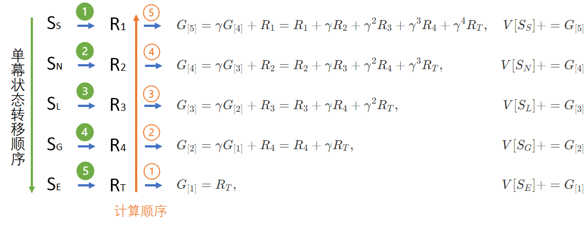
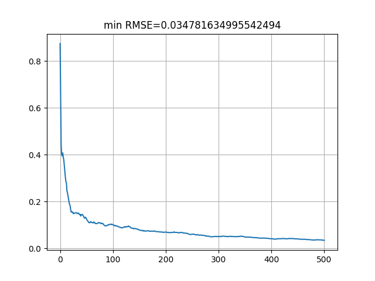

## 每次访问型 MC


### 算法改进

在上一节中，我们借助回报 $G$ 的定义

$$
G_t = R_{t+1}+\gamma R_{t+2}+\gamma^2 R_{t+3}+ \cdots +\gamma^{T-t-1} R_{T}  \tag{1}
$$

以及价值函数 $V$ 的定义

$$
V_t(s) = \mathbb E [G_t | S_t = s]
\tag{2}
$$

初步计算出了安全驾驶问题的各个状态的价值函数。回忆其过程如下：

1. 使用蒙特卡洛采样，每次采样都需要指定一个初始状态，然后在幕内循环，直到终止状态。
2. 然后根据式 1 开始“从头”计算这个初始状态的回报 $G$ 值。
3. 进行下一次采样，再计算 $G$ 值。
4. 最后求平均（数学期望）得到 $V$。

聪明的读者可能会发现一个问题：如果不“从头”开始，而是从第二个、第三个状态开始计算，是不是就能在一次采样中就可以得到很多状态的 G 值呢？

<center>


图 1 
</center>

如图 1 所示，从 $S_1$ 开始一幕的采样，到 $S_T$ 为止结束，得到 $R$ 的序列后：
- 固然可以从 $R_2$ 开始计算出 $G_1$。
- 但是如果从 $R_3$ 开始，不就能计算出 $G_2$ 了吗？
- 同理，还可以计算出这一采样序列中的任意的 $G_t$ 出来。

这样，利用一次采样结果可以计算出很多状态的 $G$ 值，会大幅提高算法的效率。


### 算法描述

下面的伪代码中，$\leftarrow$ 表示赋值，$\Leftarrow$ 表示追加列表。

---

输入：起始状态$S,Episodes,\gamma$
初始化：$G_{value}[S] \leftarrow 0, G_{count}[S] \leftarrow 0$
多幕 $Episodes$ 循环：
　　列表 $T = [\ ] $ 用于存储序列数据 $(S,R)$
　　获得状态 $S$ 的奖励值 $R$
　　$T \Leftarrow (S,R)$
　　幕内循环直到终止状态：
　　　　从 $S$ 根据状态转移概率得到 $S',R'$ 以及终止标志
　　　　$T \Leftarrow (S',R')$
　　　　$S \leftarrow S'$
　　对 $T$ 从后向前遍历, $t=\tau-1,\tau-2,...,0$
　　　　从 $T$ 中取出 $S_t,R_t$
　　　　$G \leftarrow \gamma G+R_t$
　　　　$G_{value}[S_t] \leftarrow G_{value}[S_t]+G$
　　　　$G_{count}[S_t] \leftarrow G_{value}[S_t]+1$
$V[S] \leftarrow G_{value}[S] / G_{count}[S]$
输出：$V[S]$

---

### 算法说明

<center>


图 2
</center>


### 算法实现

```Python
# 反向计算G值，记录每个状态的G值，每次访问型
def MC_Sampling_Reverse(dataModel, start_state, episodes, gamma):
    V_value_count_pair = np.zeros((dataModel.num_states, 2))  # state[total value, count of g]
    for episode in tqdm.trange(episodes):
        trajectory = []     # 按顺序 t 保留一幕内的采样序列
        trajectory.append((start_state.value, dataModel.get_reward(start_state)))
        curr_s = start_state
        is_end = False
        while (is_end is False):
            # 从环境获得下一个状态和奖励
            next_s, r, is_end = dataModel.step(curr_s)
            trajectory.append((next_s.value, r))
            curr_s = next_s
        #endwhile
        G = 0
        # 从后向前遍历
        for t in range(len(trajectory)-1, -1, -1):
            s, r = trajectory[t]
            G = gamma * G + r
            V_value_count_pair[s, 0] += G     # 累积总和
            V_value_count_pair[s, 1] += 1     # 累计次数
        #endfor
    #endfor
    V = V_value_count_pair[:,0] / V_value_count_pair[:,1]   # 计算平均值
    return V
```


<center>


图 2
</center>

### 运行结果

表   $\gamma=1$ 时的状态值计算结果比较

|状态|原始算法|改进算法|准确值|
|-|-:|-:|-:|-:|
|出发 Start|           1.09|1.07|1.03|
|正常行驶 Normal|      1.64|1.77|1.72|
|礼让行人 Pedestrians| 2.74|2.75|2.72|
|闹市减速 DownSpeed|   2.99|3.18|3.02|
|超速行驶 ExceedSpeed| -5.81|-5.06|-5.17|
|路口闯灯 RedLight|    -6.72|-6.72|-6.73|
|小区减速 LowSpeed|     6.00|6.00|6.00|
|拨打电话 MobilePhone| -2.32|-2.40|-2.40|
|发生事故 Crash|       -1.00|-1.00|-1.00|
|安全抵达 Goal|        +5.00|5.00|5.00|
|终止 End|              0.00| 0.00|0.00|
|**误差 RMSE**|**0.042**|**0.034**||

可以看到，改进的算法在速度上和精度上都比原始算法要好。最后一行不是状态值，是 RMSE 的误差值，原始算法误差为 0.042，改进算法为 0.034，越小越好。

从性能上看，原始算法对每个状态做了 10000 次采样，相当于一共 $11 \times 10000=110000$ 次采样。改进算法对所有状态（混合）一共做了 50000 次采样。


### 参考资料

https://new.qq.com/omn/20220314/20220314A09IY600.html