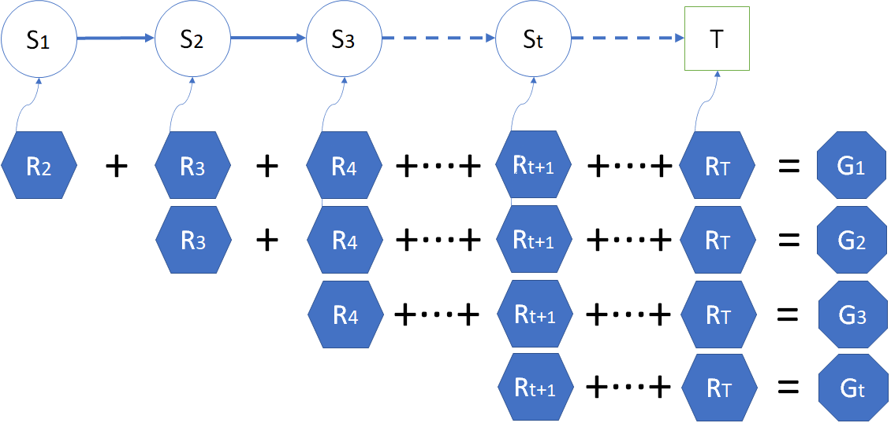

## 10.2 

### 10.2.1 

在 6.3 节中，我们根据回报 $G$ 的定义：

$$
G_t = R_{t+1}+\gamma R_{t+2}+\gamma^2 R_{t+3}+ \cdots +\gamma^{T-t-1} R_{T}
\tag{10.2.1}
$$

以及价值函数 $V$ 的定义：

$$
v_t(s) = \mathbb E [G_t | S_t = s]
\tag{10.2.2}
$$

已经使用了最朴素的蒙特卡洛采样法初步计算出了安全驾驶问题的各个状态的价值函数。回忆其过程如下：

1. 使用蒙特卡洛采样，每次采样都需要指定一个初始状态 $s_0$，然后开始在幕内循环；
2. 得到一个 $R_t$ 后，计算 $G = G + \gamma^{t-1}R_t$，直到幕内循环结束；
3. 进行下一次采样，再计算 $G$ 值；
4. 最后求 $G$ 的平均（数学期望）得到 $v(s_0)$，即式（10.2.2）。

这种方法的特点是：
1. 稳定；
2. 省空间，不需要记录中间状态，来了一个 $R_t$ 后立刻计算，然后扔掉，只保留 $G$ 值；
3. 随着幕数的增加，会更逼近真实值；
4. 遍历状态并在不受控的情况下重复多次，速度慢；
5. 浪费了中间的采样状态。

聪明的读者可能会发现一个问题：如果不“从头”开始，而是从第二个、第三个状态开始计算，是不是就能在一次采样中就可以得到很多状态的 G 值呢？

<center>


图 10.2.1 
</center>


如图 10.2.1 所示，从 $S_0$ 开始一幕的采样，到 $T$ 为止结束，得到 $R_1,\cdots,R_T$ 的序列后：
- 第一行：固然可以从 $R_1$ 开始计算出 $G_0$。
- 第二行：但是如果从 $R_2$ 开始，不就能计算出 $G_1$ 了吗？
- 第三行：同理，还可以计算出这一采样序列中的任意的 $G_t$ 出来。

这样的话利用一次采样结果可以计算出很多状态的 $G$ 值，会大幅提高算法的效率。


### 算法描述

【算法 10.2.1】

下面的伪代码中，$\leftarrow$ 表示赋值，$\Leftarrow$ 表示追加列表。

---

输入：起始状态$s,\gamma$, Episodes
初始化：$G(s) \leftarrow 0, N(S) \leftarrow 0$
多幕 Episodes 循环：
　　列表 $T = [\ ] $ 用于存储序列数据 $(s,r)$
　　幕内循环直到终止状态：
　　　　从 $s$ 根据环境模型得到 $s',r$ 以及是否终止的标志
　　　　$T \Leftarrow (s',r)$
　　　　$s \leftarrow s'$
　　　　$G_t \leftarrow 0$
　　对 $T$ 从后向前遍历, $t=\tau-1,\tau-2,...,0$
　　　　从 $T$ 中取出 $s_t,r_t$
　　　　如果 $s_t$ 不在 $s_0,s_1,\cdots,s_{t-1}$ 中：
　　　　　　$G_t \leftarrow \gamma G_t+r_t$
　　　　　　$G(s_t) \leftarrow G(s_t)+G_t$
　　　　　　$N(s_t) \leftarrow N(s_t)+1$
$V(S) \leftarrow G(S) / N(S)$
输出：$V(S)$

---


### 算法说明

<center>


图 2
</center>


### 算法实现

```Python
# 反向计算G值，记录每个状态的G值，每次访问型
def MC_Sampling_Reverse(dataModel, start_state, episodes, gamma):
    V_value_count_pair = np.zeros((dataModel.num_states, 2))  # state[total value, count of g]
    for episode in tqdm.trange(episodes):
        trajectory = []     # 按顺序 t 保留一幕内的采样序列
        trajectory.append((start_state.value, dataModel.get_reward(start_state)))
        curr_s = start_state
        is_end = False
        while (is_end is False):
            # 从环境获得下一个状态和奖励
            next_s, r, is_end = dataModel.step(curr_s)
            trajectory.append((next_s.value, r))
            curr_s = next_s
        #endwhile
        G = 0
        # 从后向前遍历
        for t in range(len(trajectory)-1, -1, -1):
            s, r = trajectory[t]
            G = gamma * G + r
            V_value_count_pair[s, 0] += G     # 累积总和
            V_value_count_pair[s, 1] += 1     # 累计次数
        #endfor
    #endfor
    V = V_value_count_pair[:,0] / V_value_count_pair[:,1]   # 计算平均值
    return V
```


<center>


图 2
</center>

### 运行结果

表   $\gamma=1$ 时的状态值计算结果比较

|状态|原始算法|改进算法|准确值|
|-|-:|-:|-:|-:|
|出发 Start|           0.98|1.02|1.03|
|正常行驶 Normal|      1.77|1.71|1.72|
|礼让行人 Pedestrians| 2.71|2.75|2.72|
|闹市减速 DownSpeed|   2.92|2.95|3.02|
|超速行驶 ExceedSpeed| -5.19|-5.23|-5.17|
|路口闯灯 RedLight|    -6.71|-6.72|-6.73|
|小区减速 LowSpeed|     6.00|6.00|6.00|
|拨打电话 MobilePhone| -2.40|-2.39|-2.40|
|发生事故 Crash|       -1.00|-1.00|-1.00|
|安全抵达 Goal|        5.00|5.00|5.00|
|终止 End|              0.00| 0.00|0.00|
|**误差 RMSE**|**0.039**|**0.030**|0.000|

可以看到，改进的算法在速度上和精度上都比原始算法要好。最后一行不是状态值，是 RMSE 的误差值，原始算法误差为 0.042，改进算法为 0.034，越小越好。

从性能上看，原始算法对每个状态做了 10000 次采样，相当于一共 $11 \times 10000=110000$ 次采样。改进算法对所有状态（混合）一共做了 50000 次采样。


### 参考资料

https://new.qq.com/omn/20220314/20220314A09IY600.html