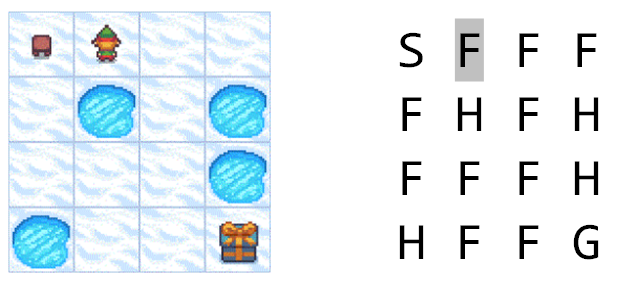

## 10.3 估算 MDP 下的价值函数

### 10.3.1 提出问题

这是 OpenAI Gym 中的一个强化学习问题。在 Gym 文档 https://www.gymlibrary.ml/ 中，提供了以下一些环境：

- Atari - 雅达利游戏

    包含一些简单的射击、追逐、对战游戏，玩家通过学习环境变化来控制物体执行各种动作以赢得游戏。

- MuJoCo- 多关节运动控制。

    Multi-Joint dynamics with Contact，具有接触的多关节动力学。它是一个物理模拟器，用于促进机器人、生物力学、图形和动画以及其他需要快速准确模拟的领域的研究和开发。

- Toy Text - 玩具文本环境

    都是使用本机Python库（如StringIO）创建的。这些环境设计得非常简单，具有很少的离散状态和动作空间，因此易于学习，适用于强化学习算法的调试实现。所有环境都可以通过每个环境文档中指定的参数进行配置。

- Classic Control - 经典控制环境

    提供了五种典型的控制环境，所有这些环境在给定范围内的初始状态都是随机的。这组环境更容易通过策略来解决，可以通过每个环境文档中指定的参数进行配置。

- Box2D - 二维仿真控制游戏

    这些环境都涉及基于物理控制的玩具游戏，使用基于 box2d 的物理和基于 PyGame 的渲染。这些环境是奥列格·克利莫夫在早期创造的，从那时起就成为了流行的玩具基准。所有环境都可以通过每个环境文档中指定的参数进行配置。

我们要解决的问题叫做 Frazen Lake（冰冻湖面），归属于 Toy Text 环境，如图 10.3.1 所示：

图 10.3.1 FrozenLake问题示意图

在一个 4x4 网格的冰冻湖面上，存在 4 种状态区域：

- Start 起点，一个，左上角；
- Frozen 冰面，十个，图中浅蓝色网格；
- Hole 冰洞，四个，图中深蓝色网格；
- Goal 目的地，一个，右下角。

目标：让图中的小人（智能体）学会从起点尽量安全地走到终点，不要掉入冰洞。
分幕：一旦掉入冰洞，本幕结束，回到起点重新开始。达到目的地也结束一幕。
奖励：只有到达目的地才有 +1 的奖励，其它任何状态、动作都是 0 分的奖励（相当于没有奖励）。
动作：上下左右四个动作。出界时回到动作出发点。

另外，在冰面行走时有两种难度选项：

- 简单，智能体会沿着指定的行走方向顺利地到达下一格。
- 难，由于冰面很滑，智能体有 1/3 的概率偏向出发点与动作方向左侧的格子，1/3 的概率偏向右侧的格子，只有 1/3 的概率会沿着指定的行走方向到达下一格。

比如图 10.3.1 中小人所在的位置，如果向上方走，有可能会滑倒左侧起点，有可能滑倒右侧的格子，还有可能向上出界因而回到当前位置，各有 1/3 的概率。

### 10.3.2

有的读者可能会觉得这个问题很简单，只需要用代码判断下一个格子是不是冰洞，如果是的话就绕开，然后让智能体尽量向右下方移动，就可以完成任务了。为什么要用强化学习？

如同所有的机器学习一样，强化学习就是要避免使用“程序”来控制智能体的行为，而是让它真正具有一些智能。

曾经有人讨论电饭锅是不是智能体，因为它可以自动地把米饭做熟。电饭锅里面只是一个 Program（程序），不是 Intelligence（智能），比如：它不会知道锅里放了多少米和多少水。它只有一个温度传感器和一个定时器，当在一个温度下持续了 20 分钟后，它就会认为米饭熟了。

而强化学习的解题思路是计算状态价值函数和动作价值函数，让智能体学习到在什么状态下要执行什么动作，才能获利最大。冰面行走问题是一个标准的马尔可夫决策过程 MDP 的场景，如第八章所学，MDP 下有两种价值函数：状态价值函数和动作价值函数。

$$
v_\pi(s) = \mathbb E[G_t \mid S_t=s]=\mathbb E \Big[\sum_{k=0}^T \gamma^k R_{t+k+1} \mid S_t=s\Big] \tag{10.3.1}
$$

$$
q_\pi(s,a) = \mathbb E[G_t \mid S_t=s, A_t=a]=\mathbb E \Big[\sum_{k=0}^T \gamma^k R_{t+k+1} \mid S_t=s,A_t=a\Big] \tag{10.3.2}
$$

式（10.3.1）和式（10.3.2）与 8.4 节中的关于 $v_\pi,q_\pi$ 的表达式有所不同，这里没有写出后续的含有模型信息的公式，即状态转移概率，这是因为在实际问题中，有很多场景是得不到状态转移概率的，无法做精确计算，只能使用蒙特卡洛方法来做“近似”。

