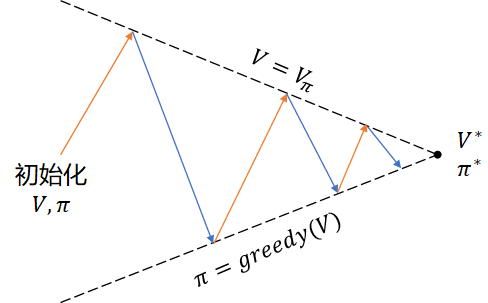

## 10.4 贪心策略与软性策略

### 10.4.1 估算 MDP 中的价值函数

#### 估算 $v_\pi$ 与 $q_\pi$

在 10.2 节中，我们是使用首次访问法和每次访问法，估算了 MRP 问题中的状态价值函数，也在一开始就提到过，这两个方法同样适用于估算 MDP 问题中的状态价值函数，包括状态价值函数和动作价值函数。

首先看状态价值函数的定义：

$$
v_\pi(s) \doteq \mathbb E [G_t \mid S_t=s] \tag{10.4.1}
$$

这和式（10.2.2）没有区别，所以，算法所需要的参数以及过程都和 10.2 节中一样，只不过是运行在一个 MDP 环境下而已。

再看动作价值函数的定义：

$$
\begin{aligned}
q_\pi(s,a) & \doteq \mathbb E [G_t \mid S_t = s, A_t=a]
\\
&= R(s,a)+ \gamma P_{ss'}^a V_\pi(s')
\end{aligned}
\tag{10.4.2}
$$

在无模型的情况下，如果利用式（10.4.1）估算出了 $v_\pi$ 后，能直接算出 $q_\pi$ 吗？不能！虽然 $R(s,a)$ 可以通过与环境交互得到，但是因为不知道 $P_{ss'}^a$，所以无法计算 $q_\pi$。

在这种情况下，我们只能通过式（10.4.2）的第一行的定义来估算 $q_\pi$。估算出 $q_\pi$ 后，才能指导智能体按照从 $q_\pi$ 中提出的策略 $\pi(s) \doteq \argmax_a q_\pi(s,a)$ 来行动。

#### 探索性出发

在 8.4 节中，我们学习过 Q 函数的定义。如果应用到冰面行走问题上，Q 函数表格会如表 10.4.1 所示。

表 10.4.1 冰面行走问题的 Q 函数表格

|状态 $\to$ 动作|UP|LEFT|DOWN|RIGHT|
|:-:|:-:|:-:|:-:|:-:|
|$s_0$|$q_\pi(s_0,a_0)$|$q_\pi(s_0,a_1)$|$q_\pi(s_0,a_2)$|$q_\pi(s_0,a_3)$|
|$s_1$|$q_\pi(s_1,a_0)$|$q_\pi(s_1,a_1)$|$q_\pi(s_1,a_2)$|$q_\pi(s_1,a_3)$|
|...|...|...|...|...|
|$s_{14}$|$q_\pi(s_{14},a_0)$|$q_\pi(s_{14},a_1)$|$q_\pi(s_{14},a_2)$|$q_\pi(s_{14},a_3)$|
|$s_{15}$|$q_\pi(s_{15},a_0)$|$q_\pi(s_{15},a_1)$|$q_\pi(s_{15},a_2)$|$q_\pi(s_{15},a_3)$|

状态-动作的组合构成 Q 表格，一共有 16x4=64 个组合。如果想评价在某个状态上哪个动作最好，那么最起码要在该状态上尝试完所有动作后才会有评价的基础。

而在另外一些问题中，可以在表 10.4.1 中遍历所有单元格作为问题的起点，然后开始与环境交互进行分幕采样，比如 21 点游戏，就可以任意指定初始时的手牌点数；但是在冰面行走问题中，由于环境的 env.reset() 函数总会返回定义好的 $s_0$ 状态为起点，所以我们无法进行上述组合遍历。所以探索性出发这条路走不通。

#### 策略迭代

图 9.7.1 策略迭代示意图

### 10.4.2 软性策略

$\varepsilon$-Soft

### 10.4.3 GLIE 方法