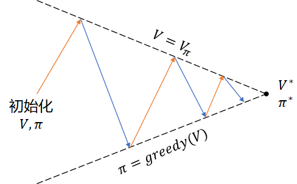

## 10.4 策略迭代

#### 探索性出发（Exploring Starts）

在 8.4 节中，我们学习过 Q 函数的定义。如果应用到冰面行走问题上，Q 函数表格会如表 10.4.1 所示。

表 10.4.1 冰面行走问题的 Q 函数表格

|状态 $\to$ 动作|UP|LEFT|DOWN|RIGHT|
|:-:|:-:|:-:|:-:|:-:|
|$s_0$|$q_\pi(s_0,a_0)$|$q_\pi(s_0,a_1)$|$q_\pi(s_0,a_2)$|$q_\pi(s_0,a_3)$|
|$s_1$|$q_\pi(s_1,a_0)$|$q_\pi(s_1,a_1)$|$q_\pi(s_1,a_2)$|$q_\pi(s_1,a_3)$|
|...|...|...|...|...|
|$s_{14}$|$q_\pi(s_{14},a_0)$|$q_\pi(s_{14},a_1)$|$q_\pi(s_{14},a_2)$|$q_\pi(s_{14},a_3)$|
|$s_{15}$|$q_\pi(s_{15},a_0)$|$q_\pi(s_{15},a_1)$|$q_\pi(s_{15},a_2)$|$q_\pi(s_{15},a_3)$|

状态-动作的组合构成 Q 表格，一共有 16x4=64 个组合。如果想评价在某个状态上哪个动作最好，那么最起码要在该状态上尝试完所有动作后才会有评价的基础。

而在另外一些问题中，可以在表 10.4.1 中遍历所有单元格作为问题的起点，然后开始与环境交互进行分幕采样，比如 21 点游戏，就可以任意指定初始时的手牌点数；但是在冰面行走问题中，由于环境的 env.reset() 函数总会返回定义好的 $s_0$ 状态为起点，所以我们无法进行上述组合遍历。所以探索性出发这条路走不通。

#### 策略迭代

图 9.7.1 策略迭代示意图

### 10.4.2 软性策略

$\varepsilon$-Soft

我们已经不是第一次接触软性策略了，在第二章的躲避强盗问题中，曾经学习过梯度上升法，里面使用了 Softmax 函数，根据各个动作的价值计算出备选概率，而不是使用非黑即白的硬性策略 argmax() 来选择后续动作。这样做的好处是：一方面在以最大概率选择（利用）了历史表现最好的动作的同时，给其它表现不好的动作一定的机会来进行探索。

### 10.4.3 GLIE 方法