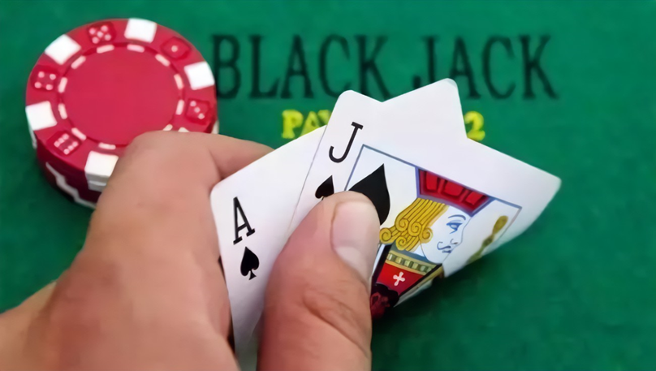

## 二十一点问题

二十一点是一个十分具有趣味性的牌类游戏，最早出现在16世纪，起源于法国，法语称为ving-et-un（20 和 1）。后传入英国并广泛流传。如果玩家拿到黑心 A 和黑心 J 会给予额外的奖励，英文名称叫黑杰克（Blackjack）。

图 11.1.2 二十一点游戏

该游戏由 2 到 6 人进行，一名庄家，其余为玩家。

使用除大小王之外的 52 张扑克牌，一般为多副牌（比如四副）混在一起使用，以避免依赖一些简单的概率计算来获胜。比如，如果只使用一副牌，则一共有四张 A；如果有四个玩家都有一张 A，那么庄家肯定没有 A。如果是四副牌的话，就不用考虑这些问题了，相当于牌池足够大。

玩家的目标是使手中牌的点数之和不超过 21 点且尽量大。

游戏过程中会给庄家和玩家每人发两张牌，一张为明牌，一张为暗牌。接下来会有几种情况：

- 如果玩家手中的两张牌之点数和为 21，称为天和，除非庄家也是天和（算平局），否则玩家直接获胜。

- 玩家可以根据手中牌点数和的大小与庄家手中牌点数来要牌 (hit) 并决定何时停牌 (stick) 。当选择继续要牌后，若总和大于21点，则算自爆（bust），游戏失败。

- 全部停牌后，庄家翻开扣着的牌，如果点数之和小于 17 点，则继续要牌；直到所有点数之和是 17 点或大于 17 点后，和玩家进行比较，谁的点数更靠近 21，谁获胜；如果庄家自爆，玩家获胜；若两方点数相同，则为平局。

具体点数计算规则如下：

1. 2 到 10 的点数就是其牌面的数字；
2. J,Q,K 三种牌均记为 10 点；
3. A（Ace牌）可以当作 1 点，也可以当作 11 点，11 点时称为“有可用的 A”（Usable Ace）。

#### 动作空间

我们要研究的是玩家的策略，所以只有两个动作：

- 要牌（hit）
- 停牌（stick）

#### 状态空间

表 11.1.1 玩家的状态

|庄家手中的明牌 $\to$|1|2|...|10|
|-|-|-|-|-|
|玩家手中的牌||||
|12||||
|13||||
|...||||
|20||||

玩家的状态由两个因素决定：

1. 庄家手中的牌（一张明牌）；
2. 玩家自己手中的所有牌。

因为当玩家手中的牌不到 12 点时，再来任何一张牌都后，总数都不会超过 21 点，所以我们只考虑 12 点到 20 点（包含）之间的情况。如果是 21 点（比如一张 A 和一张 10）是天和，也不必考虑。

所以，所有的状态在表 11.1.1 中所示，一共有 10x9=90 种状态。

另外，庄家玩家有 A 的话，那将会有很大的变数，所以有 A 无 A 算是第三个因素，那么整个状态空间是 2x10x9=180。

#### 分幕与奖励

- 玩家赢，R=1；
- 玩家输，R=-1；
- 平局，R=0。

每一局看作一幕，中间过程没有任何奖励。

在这个强化学习问题中，拿到黑桃 A 和 J 不再有奖励，因为它与强化学习无关，只与运气有关。

