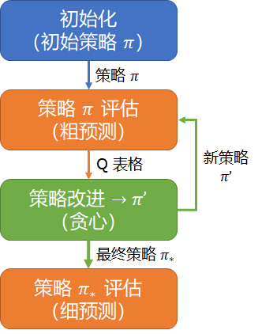
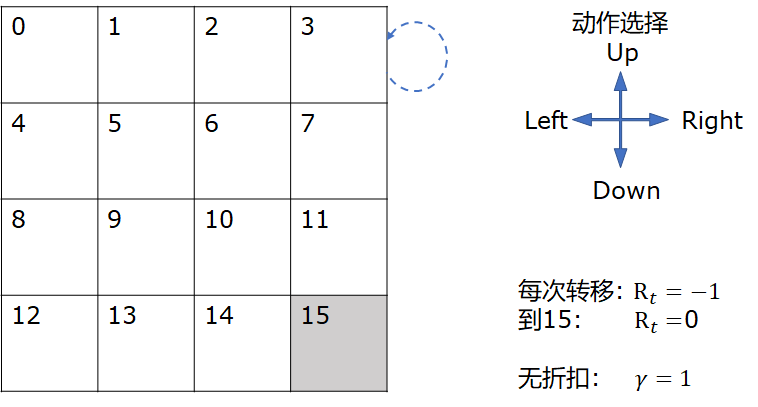
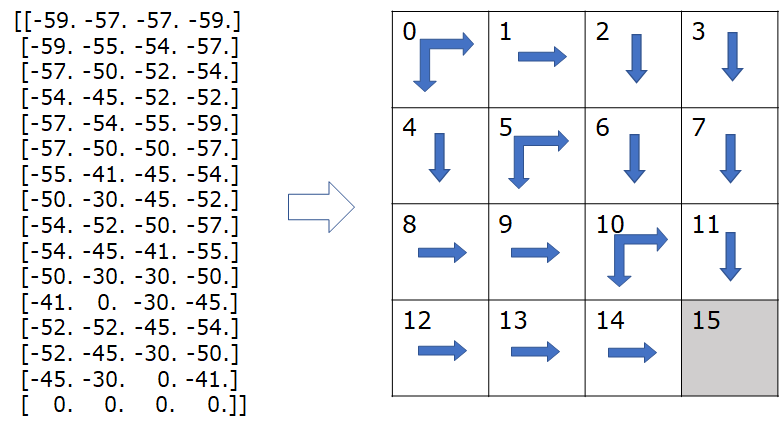
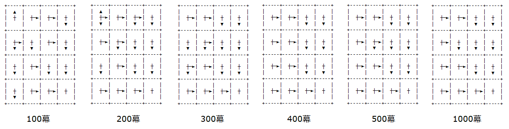
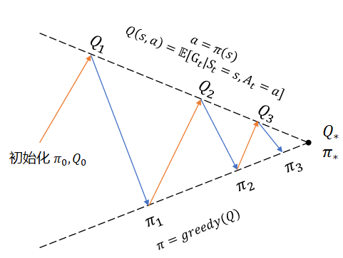
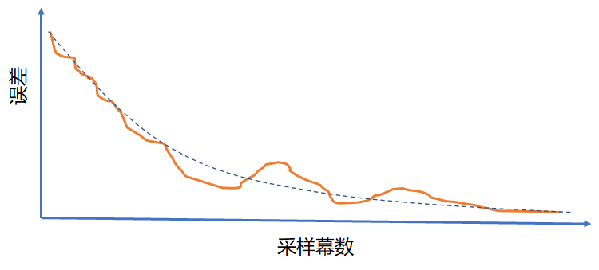

## 11.2 蒙特卡洛控制

### 11.2.1 价值迭代与策略迭代

要想解决二十一点问题，就需要得到每个状态下的最优策略，比如：当庄家明牌是 9 点，玩家自己手中是 16 点，此时是要牌还是停牌？

在第 9 章中，我们已经学习了如何得到最优策略，就是为了解决这一类问题的。但是在很多问题中，比如二十一点，没有环境信息，不能使用贝尔曼最优方程及动态规划方法，所以就要研究蒙特卡洛控制问题。

什么是蒙特卡洛控制？

在第 10 章中，我们学习了蒙特卡洛预测，就是通过采样的方法来评估一个策略的状态价值函数和动作价值函数，也称作策略评估。基于这个评估结果，可以在每个状态上都取动作价值函数最大的方向，形成新的策略，然后再进行一轮或多轮策略评估，得到每个状态上的新的动作价值函数，再取最大值形成新策略。这就是蒙特卡洛控制，意为控制智能体采取最优策略。

#### 价值迭代

我们先复习一下第 9 章中学习的价值迭代的工作方法，如图 11.2.1 所示。

<center>


图 11.2.1 价值迭代方法示意图
</center>

价值迭代，是以计算动作价值函数 $Q_{k+1}(s,a)=P[R+\gamma V_k(s')]$ 为手段，在每次迭代中都取 $V_{k+1}(s)=\max_a Q_{k+1}(s,a)$，这样一步步地逼近最优价值函数。

#### 策略迭代

在本章中，由于没有环境信息（缺乏 $P,R$ 的直接定义），所以无法使用价值迭代法，只能尝试其它方法。而在第十章中曾经提到过：预测 $Q$ 函数比预测 $V$ 函数更有用，因为从 $Q$ 函数的表格型结果中可以抽取出策略 $\pi$ 来。由此，我们看到了解决问题的思路：

1. 首先，给定任意策略 $\pi$，使用蒙特卡洛方法来预测 $Q$，这在第十章中已经学习过了；
2. 其次，有了 $Q$ 值后，按照价值迭代的办法，从中直接取最大值所对应的动作，由此可以确定新的策略；
3. 根据新的策略，回到第 1 步。

何时结束上述循环过程呢？可以有两个方法：

1. 指定循环次数；
2. 比较旧策略和新策略，如果相等，说明没有改进余地了，停止。

这种方法被称为**策略迭代**。


【算法 11.2】策略迭代

----

输入：策略 $\pi$，折扣 $\gamma$, 幕数 Episodes

1. 初始化
　　初始化数组：$Q(S,A) \leftarrow 0$
　　初始化策略：$\pi(S) \leftarrow Random$ 随机策略

2. 策略评估（单幕或多幕 Episodes 循环）：
　　根据当前策略与环境进行交互
　　得到 $Q(S,A)$
3. 策略改进
　　$old.policy \leftarrow \pi$
　　对每个状态更新策略：$\pi(s) \leftarrow \argmax_a Q(s)$
　　如果 $\pi \ne old.policy$，跳转到第 2 步
　　否则结束
　　或者是达到了指定的多幕循环次数而结束

输出：$Q(S,A), \pi$

----

### 11.2.2 策略迭代算法研究基础代码框架

在上述算法中，策略改进是我们本章要研究的重点，其它部分利用以前的知识都可以抽象成通用模块，所以我们来做一下模块划分，以便可以统一接口，专心研究算法部分。

模块可以做如图 11.2.2 的划分。


<center>


图 11.2.2 策略迭代示意图
</center>

下面看看各个模块的具体功能。

【代码位置】Algorithm/Base_MC_Policy_Iteration.py

#### 初始化模块

```python
# 策略迭代
class Policy_Iteration(object):
    # 初始化
    def __init__(self, env, init_policy, gamma):
        self.env = env                          # 环境
        self.gamma = gamma                      # 折扣
        self.nA = self.env.action_space.n       # 动作空间
        self.nS = self.env.observation_space.n  # 状态空间
        self.n_episode = 0                      # 分幕循环次数计数器
        self.Value = np.zeros((self.nS, self.nA))   # 回报值 G 累计
        self.Count = np.zeros((self.nS, self.nA))   # 访问次数累计
        self.Q = np.zeros((self.nS, self.nA))       # Q=Value/Count实时计算
        self.policy = init_policy               # 初始策略
```

初始化工作很简单，主要是接收初始化参数，准备好数据存储与计算的空间。其中的初始策略一般选用随机策略。

#### 策略 $\pi$ 评估（粗预测）模块

本模块实际上就是每次访问法。代码与 10.5 节中的算法没有区别，就不再赘述了。

为什么叫做粗预测？在给定一个初始策略，或者是非最优策略后，我们要估算出它的 Q 值。由于蒙特卡洛方法需要很多次分幕采样才能得到较为精确的结果，所以耗时很长。但是，我们从 10.5 节中对于三个策略的预测可以看到，即使是很差的策略，在循环到一定的幕数后，也可以得到不错的方向性指导。这就提示我们，可以指定一个不是很大的循环次数，粗略得到 Q 表格即可。即使其中有些动作方向不是最优的，但是还有机会在后续的迭代中改进。

可以用一个简单的方格世界的例子来说明这个概念。


<center>


图 11.2.2 简单的方格世界
</center>


在图 11.2.2 所示的 4x4 方格世界中，可以从任意点出发，终点为 $s_{15}$。在到达 $s_{15}$ 之前，每一步移动都得到 -1 的奖励，到 $s_{15}$ 的奖励为 0。智能体可以选择四个方向移动，出界后会返回原地。无折扣。

由于存在 $s_{15}$ 终止状态，所以是一个分幕任务，可以用蒙特卡洛法来解决。当然，这个问题也可以用动态规划来解决，因为知道环境信息。

我们先看看用动态规划法得到的解，如图 11.2.3 所示。

【代码位置】MC_112_GridWorld.py

<center>


图 11.2.3 简单的方格世界
（左：Q 表格函数值；右：动作方向）
</center>

可以看到这种方法的结果是沿对角线成镜像对称的，很漂亮。

我们再看看用蒙特卡洛法采样 100幕、200幕、300幕、400幕、500幕和1000幕得到的解，如图 11.2.4。

<center>


图 11.2.4 简单的方格世界
</center>

- 100幕的结果，只有左上角的状态位不靠谱；
- 200幕时，仍然是左上角的动作有误差；
- 300幕时，在细节上与后面的图还有差距，但是在每个状态上的动作选择都是合理的，尽管不是最优的；
- 后续三图，动作选择已经没有什么可挑剔的了。

在比较图 11.2.3 和 图 11.2.4 后，读者可能会有疑问：在图 11.2.3 中，$s_0,s_5,s_{10}$ 三个状态上的动作是可以向下和向右，两个 q 函数值相等，而整体上看，也是以对角线为中心成镜像的。那为什么在图 11.2.4 中，即使是经过了 1000 幕，也没有出现这种完全对称的情况？

因为图 11.2.4 是用动态规划算法得到的结果，比较精准，如果一个状态中有两个动作等价，那这种方法确实可以得出两个相等的 q 值来。而图 11.2.4 是用蒙特卡洛法，就不那么精准了，误差在小数点以后两位都是正常的，所以极少能够得到两个完全相等的 q 值。

比如 $q_1$ = 0.0506，$q_2$ = 0.0507，在我们看来 $q_1,q_2$ 之间的误差是蒙特卡洛方法造成的，可以忽略，但是算法就是认为它们不等，除非强制截断到小数点后两位。对于不同的问题，或者相同的问题但折扣不同，小数点后的精度需要多少位不是固定的，需要具体问题具体分析。

下面是具体实现，基本就是采样，然后计算 G 值。

```python
    # 策略迭代
    def policy_iteration(self, episodes):
        for _ in tqdm.trange(episodes):   # 多幕循环
            self.n_episode += 1
            # 重置环境，开始新的一幕采样
            Episode = self.sampling()
            # 从后向前遍历计算 G 值
            G = 0
            for t in range(len(Episode)-1, -1, -1):
                G, s = self.calculate(Episode, t, G)    # 计算Gt值
                self.policy_improvement(s)  # 评估后立刻做策略改进
```

回到我们要解决的问题上来，事实证明，经过 300 幕的循环，方格世界问题就能够得到正确的策略了，在此之上继续做策略迭代没有问题，不必非得要循环到 $Q$ 函数值收敛为止，也就是说最终的 $Q$ 函数值可以不等于理论上的最优策略的最大值，但是策略与最优策略没有差别。而在实际的应用中，我们甚至可以让粗预测模块循环更少的次数，以加快整体迭代速度。

在图 11.2.1 所示的价值迭代的算法中（贝尔曼最优方程），每计算一次 $Q$ 值，立刻从中取最大者来计算一次 $V$ 值，相当于评估与改进的速度比例为 1:1，这是一种极端的情况。


#### 策略改进模块

我们可以借助图 11.2.5 来理解策略改进机制。

<center>


图 11.2.5 策略迭代示意图
</center>

过程描述：

1. 初始化 $Q, \pi$ 为 0，不妨命名为 $Q_0, \pi_0$，$Q_0$ 为全 0 的表格；
2. 使用蒙特卡洛每次访问法根据 $\pi_0$ 估算 $Q_1$；
3. 使用贪心算法从 $Q_1$ 中抽取出新的策略 $\pi_1$；
4. 比较 $\pi_0$ 和 $\pi_1$，如果一致则认为收敛；
5. 使用蒙特卡洛每次访问法根据 $\pi_1$ 估算 $Q_2$；
6. 使用贪心算法从 $Q_2$ 中抽取出新的策略 $\pi_2$；
7. 比较 $\pi_1$ 和 $\pi_2$，如果一致则认为收敛；
......

以此类推，直到收敛为止，就认为得到了最优策略 $\pi_*$，如果需要的话可以再估算一次 $Q$ 值来得到 $Q_*$。所以，所谓的策略改进模块（算法），就是 $\pi=greedy(Q)$ 贪心算法，也是我们本章研究的对象。

这里的代码只是定义了一个 policy_improvement() 函数，并没有具体实现，要靠后面将要研究的各种算法来重写此函数。

```python
    # 策略改进(算法重写此函数)
    def policy_improvement(self, s):
        pass
```

该函数输入为状态值 $s$，实现时需要在内部计算 self.Q[s]，然后修改 self.policy[s] 的值，来改进策略。

注意，这个框架缺省设置为在做一次策略评估后，立刻做一次策略改进，有些过于激进。如果需要做多次策略评估后才进行一次策略改进，需要在实现 policy_improvement() 函数时，判断 self.n_episode 的值是否可以被 $n$ 整除（$n$ 是需要策略评估的次数），然后再做策略改进。由于随机过程的存在，只进行一次策略评估就立刻做策略改进的话，确实有些不够稳妥。

至于算法何时可以结束的问题，检测是否收敛有一定的难度，因为蒙特卡洛采样会造成一定的波动，整体看会有一个收敛的趋势，如图 11.2.6 所示。

<center>


图 11.2.6 蒙特卡洛方法误差收敛过程示意图
</center>

虚线是整体趋势，呈下降/收敛形态，但是局部可能会有较大波动，以至于很难用算法来判断是否收敛。在中间的某些时段内，误差已经呈收敛态势，但是忽然就会有一个上升的现象发生。所以，一般会用绘制图表的方法来辅助判断。


#### 策略 $\pi_*$ 评估（细预测）模块

这一部分是可选的，用来验证我们认为的最优策略 $\pi_*$ 是不是名副其实。简单的验证方法是从 $\pi_*$ 得到 $Q_*$ 后，看看 $Q_*$ 的值是不是大于以往每个策略上得到的相应位置的 $Q$ 值，或者看循环多次以后，$Q_*$ 表格中的每个值是不是都可以收敛到某个具体的数值。

这里需要注意一个问题，在做最终的评估时，需要把 $Q$ 表格置为全 0，用于统计蒙特卡洛法采样时累计原始数据的 Value 和 Count 也要置为全 0，相当于重新开始。因为在得到最优策略之前，已经累计了一些回报值，会拉低整体平均值，不能计算在最优策略之内。


https://zhuanlan.zhihu.com/p/28498261

理论证明策略迭代方法的正确

- 可以比较policy iteration and value iteration
- 可以绘图：结果图、曲线（趋势）图

- maze  https://cs.stanford.edu/people/karpathy/reinforcejs/gridworld_dp.html

$$
\pi_*=\argmax_\pi v_\pi(s)
$$


