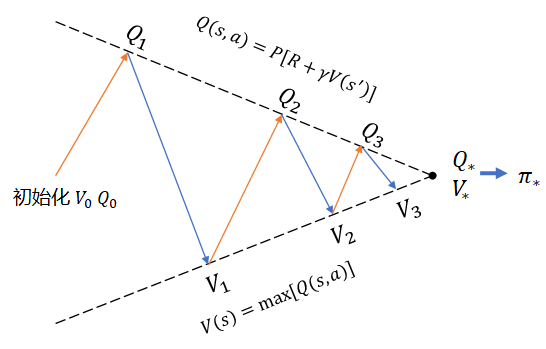

## 11.2 蒙特卡洛控制

什么是蒙特卡洛控制？


策略迭代


上一节中，通过对三种策略的评估比较得知：相对正确的策略，其动作价值函数值也会相对较大。那么如何找到最优策略呢？

我们先复习一下第九章中学习的价值迭代的工作方法，如图 11.1.1 所示。

<center>


图 11.1.1 价值迭代方法示意图
</center>

价值迭代，是以计算动作价值函数 $Q_{k+1}(s,a)=P[R+\gamma V_k(s')]$ 为手段，在每次迭代中都取 $V_{k+1}(s)=\max_a Q_{k+1}(s,a)$，这样一步步地逼近最优价值函数。

在本章中，由于没有环境信息（缺乏 $P,R$ 的直接定义），所以无法使用价值迭代法，只能尝试其它方法。而在第十章中曾经提到过：预测 $Q$ 函数比预测 $V$ 函数更有用，因为从 $Q$ 函数的表格型结果中可以抽取出策略 $\pi$ 来。由此，我们看到了解决问题的思路：

1. 首先，给定任意策略 $\pi$，使用蒙特卡洛方法来预测 $Q$，这在第十章中已经学习过了；
2. 其次，有了 $Q$ 值后，按照价值迭代的办法，从中直接取最大值所对应的动作，由此可以确定新的策略；
3. 根据新的策略，回到第 1 步。

何时结束上述循环过程呢？可以有两个方法：

1. 指定循环次数；
2. 比较旧策略和新策略，如果相等，说明没有改进余地了，停止。

这种方法被称为**策略迭代**。


【算法 11.1】策略迭代

----

输入：策略 $\pi$，折扣 $\gamma$, 幕数 Episodes

1. 初始化
　　初始化数组：$Q(S,A) \leftarrow 0$
　　初始化策略：$\pi(S) \leftarrow Random$ 随机策略

2. 策略评估（多幕 Episodes 循环）：
　　根据当前策略与环境进行多幕交互
　　得到 $Q(S,A)$
3. 策略改进
　　$old.policy \leftarrow \pi$
　　对每个状态更新策略：$\pi(s) \leftarrow \argmax_a Q(s)$
　　如果 $\pi \ne old.policy$，跳转到第 2 步
　　否则结束

输出：$Q(S,A), \pi$


----

在上述算法中，策略改进是我们本章要研究的重点，其它部分利用以前的知识都可以抽象成通用模块，所以我们来做一下模块划分，以便可以统一接口，专心研究算法部分。

模块可以做如图 11.1.1 的划分。


<center>


图 11.1.1 策略迭代示意图
（左图：初始化在迭代中；右图：初始化在迭代外）
</center>

有左右两个子图，我们稍后再解释，先看看各个模块的具体功能。

#### 初始化模块

```python
# 策略迭代
class Policy_Iteration(object):
    # 初始化
    def __init__(self, env, policy, gamma, episodes, final, check_policy_method=0):
        self.policy = policy                        # 初始策略
        self.rough_episodes = episodes              # 粗预测的分幕循环次数
        self.final_episodes = final                 # 细预测的分幕循环次数
        self.env = env                              # 环境
        self.gamma = gamma                          # 折扣
        self.check_method = check_policy_method     # 迭代终止条件
        self.nA = self.env.action_space.n           # 动作空间
        self.nS = self.env.observation_space.n      # 状态空间
        self.n_iteration = 0                        # 分幕循环次数总和
        self.Value = np.zeros((self.nS, self.nA))   # G 的总和
        self.Count = np.zeros((self.nS, self.nA))   # G 的数量
```

初始化工作很简单，主要是接收初始化参数，其中最主要的工作是最后两行代码，把计算 G 值的数据清零。

#### 策略 $\pi$ 评估（粗预测）模块

本模块实际上就是每次访问法。代码与 10.5 节中的算法没有区别，就不再赘述了。

为什么叫做粗预测？在给定一个初始策略，或者是非最优策略后，我们要估算出它的 Q 值。由于蒙特卡洛方法需要很多次分幕采样才能得到较为精确的结果，所以耗时很长。但是，我们从 10.5 节中对于三个策略的预测可以看到，即使是很差的策略，在循环到一定的幕数后，也可以得到不错的方向性指导。这就提示我们，可以指定一个不是很大的循环次数，粗略得到 Q 表格即可。即使其中有些动作方向不是最优的，但是还有机会在后续的迭代中改进。

可以用一个简单的方格世界的例子来说明这个概念。


<center>


图 11.1.2 简单的方格世界
</center>


在图 11.1.2 所示的 4x4 方格世界中，可以从任意点出发，终点为 $s_{15}$。在到达 $s_{15}$ 之前，每一步移动都得到 -1 的奖励，到 $s_{15}$ 的奖励为 0。智能体可以选择四个方向移动，出界后会返回原地。无折扣。

由于存在 $s_{15}$ 终止状态，所以是一个分幕任务，可以用蒙特卡洛法来解决。当然，这个问题也可以用动态规划来解决，因为知道环境信息。

我们先看看用动态规划法得到的解：

<center>


图 11.1.2 简单的方格世界
（左：Q 表格函数值；右：动作方向）
</center>

可以看到这种方法的结果是沿对角线成镜像对称的，很漂亮。

我们再看看用蒙特卡洛法循环 100幕、200幕、300幕、400幕、500幕和1000幕得到的解：

<center>


图 11.1.2 简单的方格世界
</center>

- 100幕的结果，只有左上角的状态位不靠谱；
- 200幕时，仍然是左上角的动作有误差；
- 300幕时，在细节上与后面的图还有差距，但是在每个状态上的动作选择都是合理的，尽管不是最优的；
- 后续三图，动作选择已经没有什么可挑剔的了。

在比较图 11.1.2 和 图 11.1.3 后，读者可能会有疑问：在图 11.1.2 中，$s_0,s_5,s_{10}$ 三个状态上的动作是可以向下和向右，两个 q 函数值相等，而整体上看，也是以对角线为中心成镜像的。那为什么在图 11.1.3 中，即使是经过了 1000 幕，也没有出现这种完全对称的情况？

因为图 11.1.2 是用动态规划算法得到的结果，比较精准，如果一个状态中有两个动作等价，那这种方法确实可以得出两个相等的 q 值来。而图 11.1.3 是用蒙特卡洛法，就不那么精准了，误差在小数点以后两位都是正常的，所以极少能够得到两个相等的 q 值。

回到我们向解决的问题上来，事实证明，经过 300 幕的循环，就能够得到正确的策略了，在此之上继续做策略迭代没有问题，不必非得要循环到 Q 函数数值收敛为止。而在实际的应用中，我们甚至可以让粗预测模块循环更少的次数，以加快整体迭代速度。


#### 策略改进模块

我们可以借助图 11.1.2 来理解策略改进机制。

<center>


图 11.1.2 策略迭代示意图
</center>

初始化策略可以命名为 $\pi_0$，而 $Q_0$ 在代码中虽然不存在，但是 $Q=Value/Count$，所以 self.Value=np.zeros(...) 和 self.Count=np.zeros(...) 代表了 $Q_0 \leftarrow 0$。

1. 初始化 $Q, \pi$ 为 0，不妨命名为 $Q_0, \pi_0$；
2. 使用蒙特卡洛每次访问法根据 $\pi_0$ 估算 $Q_1$；
3. 使用贪心算法从 $Q_1$ 中抽取出新的策略 $\pi_1$；
4. 比较 $\pi_0$ 和 $\pi_1$，如果一致则认为收敛；
5. 使用蒙特卡洛每次访问法根据 $\pi_1$ 估算 $Q_2$；
6. 使用贪心算法从 $Q_2$ 中抽取出新的策略 $\pi_2$；
7. 比较 $\pi_1$ 和 $\pi_2$，如果一致则认为收敛；
......

以此类推，直到收敛为止，就认为得到了最优策略 $\pi_*$，如果需要的话可以再估算一次 $Q$ 值来得到 $Q_*$

所以，所谓的策略改进模块（算法），就是 $\pi=greedy(Q)$ 贪心算法，也是我们本章研究的对象。

这里的代码只是定义了一个 policy_improvement() 函数，并没有具体实现，要靠后面将要研究的各种算法来重写此函数。

```python
    # 策略改进(算法重写此函数)
    def policy_improvement(self, Q):
        pass
```

该函数输入为 $Q$ 表格值，实现时需要在内部修改 self.policy 的值，来改进策略。


#### 策略 $\pi_*$ 评估（细预测）模块

这一部分是可选的，用来验证我们认为的最优策略 $\pi_*$ 是不是名副其实。简单的验证方法是从 $\pi_*$ 得到 $Q_*$ 后，看看 $Q_*$ 的值是不是大于以往每个策略上得到的相应位置的 $Q$ 值，或者看循环多次以后，$Q_*$ 表格中的每个值是不是都可以收敛到某个具体的数值。


#### 


左图

初始化放在迭代内部，理由是：使用 $\pi$ 策略评估模块进行预测，生成 Q 表格后，通过策略改进模块抽取出新的策略 $\pi'$。此时应该再次初始化，以保证

右图


https://zhuanlan.zhihu.com/p/28498261

理论证明策略迭代方法的正确

- 可以比较policy iteration and value iteration
- 可以绘图：结果图、曲线（趋势）图

- maze  https://cs.stanford.edu/people/karpathy/reinforcejs/gridworld_dp.html

$$
\pi_*=\argmax_\pi v_\pi(s)
$$


