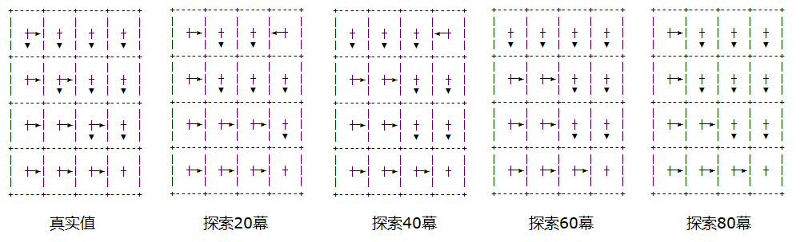

## 10.4 软性策略

### 10.4.1 $\epsilon$-贪心策略

在 11.3 节中，我们使用贪心算法配合探索性出发，来评估动作价值。因为探索性出发可以提供足够的机会让备选动作来表现出价值，然后才能贪心，这与第二章的躲避强盗问题是相同的。但是它的缺点是显而易见的：
1. 不知道要探索多少次才算合理。
2. 需要每个状态都可以作为起点。

在本章中，我们将学习软性策略，来避开探索性出发的缺点。比如在二十一点问题中，Gym 的交互环境不可能让我们指定每个状态作为起点，虽然它具有一定的随机性，但仍然不能满足均等的机会。

我们已经不是第一次接触软性策略了，在第二章的多臂强盗问题中，曾经学习过梯度上升法，里面使用了 Softmax 函数，根据各个动作的价值计算出备选概率，而不是使用非黑即白的硬性策略 argmax() 来选择后续动作。这样做的好处是：一方面在以最大概率选择（利用）了历史表现最好的动作的同时，给其它表现不好的动作一定的机会来进行探索。

具体到策略问题上来，与 4.4.2 节的 $\epsilon$-贪心策略差不多，使用一个概率值来贪心地执行当前已知的最佳动作，而用另外一个概率值来进行探索。其策略表示为式（11.4.1）：

$$
\pi'(a \mid s)=
\begin{cases}
1-\epsilon+\frac{\epsilon}{|A|}, & a=\argmax_a Q(s,a)
\\
\frac{\epsilon}{|A|}, & a \ne \argmax_a Q(s,a)
\end{cases}
\tag{11.4.1}
$$

用 $\pi'$ 表示更新策略，在实际的操作中是在原策略 $\pi$ 上直接更新，初始原策略可以是随机策略。

假设 $\epsilon=0.4,|A|=4$，则：
- 当 $a$ 是四个动作的最大值时，$\pi(a|s)=1-0.4+0.4/4=0.7$
- 当 $a$ 不是四个动作的最大值时，$\pi(a|s)=0.4/4=0.1$

很容易看到，$0.7+0.1 \times 3=1.0$ 是一个全概率值，则后续的策略是在那个目前最佳的动作上，以 0.7 的概率继续贪婪执行，以 0.1 的概率选择执行其它三个动作。


【算法 11.3.2】

---

输入：起始状态 $s$，策略 $\pi$，折扣 $\gamma$，幕数 Episodes，贪心系数 $\epsilon$
初始化数组：$G(S,A) \leftarrow 0, N(S,A) \leftarrow 0$，$S$ 为状态空间，$A$ 为动作空间
多幕 Episodes 循环：
　　列表置空 $Episode = [\ ] $ 用于存储序列数据 $(s,a,r)$
　　幕内循环直到终止状态：
　　　　从 $s$ 根据策略 $\pi$ 得到动作 $a$
　　　　执行 $a$ 从环境得到 $s',r$ 以及是否终止的标志
　　　　$Episode \Leftarrow (s,a,r)$，相当于是 $(s_t,a_t,r_{t+1})$
　　　　$s \leftarrow s'$
　　$G_t \leftarrow 0$
　　对 $Episode$ 从后向前遍历, $t=\tau-1,\tau-2,...,0$
　　　　取出 $(s_t,a_t,r_{t+1})$
　　　　$G_t \leftarrow \gamma G_t+r_{t+1}$
　　　　$G(s_t,a_t) \leftarrow G(s_t,a_t)+G_t$
　　　　$N(s_t,a_t) \leftarrow N(s_t,a_t)+1$
　　　　$Q(s_t,A) \leftarrow G(s_t,A)/N(s_t,A)$
　　　　$A^* \leftarrow \argmax_a Q(s_t,A)$
　　　　$\pi(a \mid s)=
\begin{cases}
1-\epsilon+\frac{\epsilon}{|A|}, & if \ a=A^*
\\
\frac{\epsilon}{|A|}, & if \ a\ne A^*
\end{cases}
$
输出：$Q(S,A)$

---

算法实现如下：

```python
class MC_SoftGreedy(base.Policy_Iteration):
    def __init__(self, env, init_policy, gamma, epsilon):
        super().__init__(env, init_policy, gamma)
        self.epsilon = epsilon
        self.best_p = 1 - epsilon + epsilon / self.nA   # 最佳动作备选概率 
        self.other_p = epsilon / self.nA    # 其它动作备选概率        

    def policy_improvement(self, s):
        # 做策略改进，soft-greedy 算法
        if np.min(self.Count[s]) == 0:  # 避免被除数为 0
            return
        self.Q[s] = self.Value[s] / self.Count[s]  # 得到该状态下所有动作的 q 值
        self.policy[s] = self.other_p    # 先设置该状态所有策略为普通动作策略
        argmax = np.argmax(self.Q[s])
        self.policy[s, argmax] = self.best_p    # 设置最佳动作策略
```

<center>


图 11.3.2
</center>


### 10.4.3 GLIE 方法

