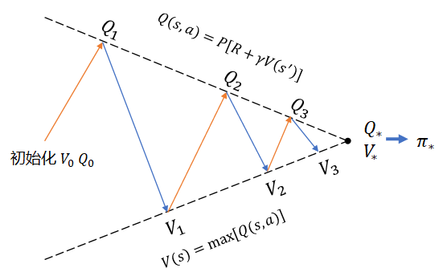
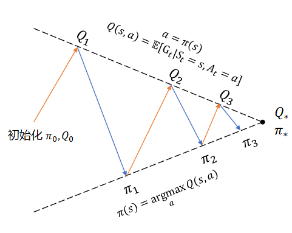
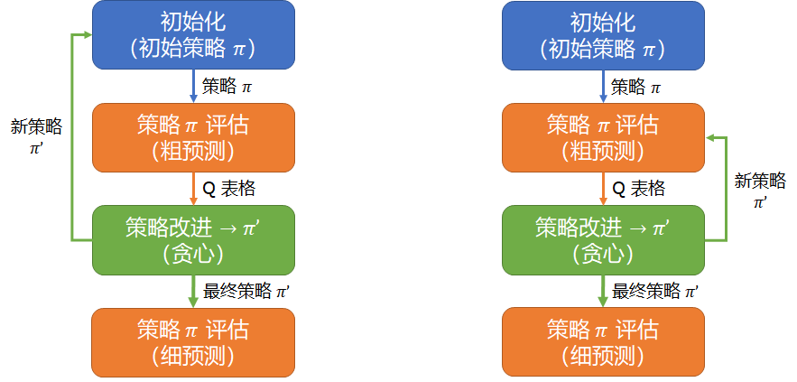

## 11.1 蒙特卡洛控制

什么是蒙特卡洛控制？


策略迭代


上一节中，通过对三种策略的评估比较得知：相对正确的策略，其动作价值函数值也会相对较大。那么如何找到最优策略呢？

我们先复习一下第九章中学习的价值迭代的工作方法，如图 11.1.1 所示。

<center>


图 11.1.1 价值迭代方法示意图
</center>

价值迭代，是以计算动作价值函数 $Q_{k+1}(s,a)=P[R+\gamma V_k(s')]$ 为手段，在每次迭代中都取 $V_{k+1}(s)=\max_a Q_{k+1}(s,a)$，这样一步步地逼近最优价值函数。

在本章中，由于没有环境信息（缺乏 $P,R$ 的直接定义），所以无法使用价值迭代法，只能尝试其它方法。而在第十章中曾经提到过：预测 $Q$ 函数比预测 $V$ 函数更有用，因为从 $Q$ 函数的表格型结果中可以抽取出策略 $\pi$ 来。由此，我们看到了解决问题的思路：

1. 首先，给定任意策略 $\pi$，使用蒙特卡洛方法来预测 $Q$，这在第十章中已经学习过了；
2. 其次，有了 $Q$ 值后，按照价值迭代的办法，从中直接取最大值所对应的动作，由此可以确定新的策略（贪心策略）；
3. 根据新的策略，回到第 1 步。

何时结束上述循环过程呢？可以有两个方法：

1. 指定循环次数；
2. 比较旧策略和新策略，如果相等，说明没有改进余地了，停止。

这种方法被称为**策略迭代**。

<center>


图 11.1.2 策略迭代方法示意图
</center>

策略迭代的方法是：

【算法 10.6】策略迭代

----

输入：策略 $\pi$，折扣 $\gamma$, 幕数 Episodes

1. 初始化
　　初始化数组：$Q(S,A) \leftarrow 0$
　　初始化策略：$\pi(S) \leftarrow Random$ 随机策略

2. 策略评估（多幕 Episodes 循环）：
　　根据当前策略与环境进行多幕交互
　　得到 $Q(S,A)$
3. 策略改进
　　$old.policy \leftarrow \pi$
　　对每个状态更新策略：$\pi(s) \leftarrow \argmax_a Q(s)$
　　如果 $\pi \ne old.policy$，跳转到第 2 步
　　否则结束

输出：$Q(S,A), \pi$


----


<center>


图 10.6.1 策略迭代示意图
</center>


所以模块可以


<center>


图 10.6.2 策略迭代示意图
（左图：初始化在迭代中；右图：初始化在迭代外）
</center>

#### 初始化模块

```python
# 策略迭代
class Policy_Iteration(object):
    # 初始化
    def __init__(self, env, policy, gamma, episodes, final, check_policy_method=0):
        self.policy = policy                        # 初始策略
        self.rough_episodes = episodes              # 粗预测的分幕循环次数
        self.final_episodes = final                 # 细预测的分幕循环次数
        self.env = env                              # 环境
        self.gamma = gamma                          # 折扣
        self.check_method = check_policy_method     # 迭代终止条件
        self.nA = self.env.action_space.n           # 动作空间
        self.nS = self.env.observation_space.n      # 状态空间
        self.n_iteration = 0                        # 分幕循环次数总和
        self.Value = np.zeros((self.nS, self.nA))   # G 的总和
        self.Count = np.zeros((self.nS, self.nA))   # G 的数量
```

初始化工作很简单，主要是接收初始化参数，其中最主要的工作是最后两行代码，把计算 G 值的数据清零。

#### 策略 $\pi$ 评估（粗预测）

为什么叫做粗预测？在给定一个初始策略，或者是非最优策略后，我们要估算出它的 Q 值。由于蒙特卡洛方法需要很多次分幕采样才能得到较为精确的结果，所以耗时很长。但是，我们从 10.5 节中对于三个策略的预测可以看到，即使是很差的策略，在循环到一定的幕数后，也可以得到不错的方向性指导。这就提示我们，可以指定一个不是很大的循环次数，粗略得到 Q 表格即可。即使其中有些动作方向不是最优的，但是还有机会在后续的迭代中改进。

代码如下：

```python
    # 策略评估
    def policy_evaluation(self, episodes):
        for _ in tqdm.trange(episodes): # 多幕循环
            self.n_iteration += 1
            s = self.env.reset()        # 重置环境，开始新的一幕采样
            Episode = []                # 一幕内的(状态,奖励)序列
            done = False
            while (done is False):      # 幕内循环
                action = np.random.choice(self.nA, p=self.policy[s])
                next_s, reward, done, _ = self.env.step(action)
                Episode.append((s, action, reward))
                s = next_s
            # 从后向前遍历计算 G 值
            G = 0
            for t in range(len(Episode)-1, -1, -1):
                s, a, r = Episode[t]    # 取出
                G = self.gamma * G + r
                self.Value[s,a] += G    # 值累加
                self.Count[s,a] += 1    # 数量加 1
        # 多幕循环结束，计算 Q 值
        self.Count[self.Count==0] = 1   # 把分母为0的填成1，主要是针对终止状态Count为0
        Q = self.Value / self.Count     # 求均值
        return Q
```


左图

初始化放在迭代内部，理由是：使用 $\pi$ 策略评估模块进行预测，生成 Q 表格后，通过策略改进模块抽取出新的策略 $\pi'$。此时应该再次初始化，以保证

右图


#### 探索性出发（Exploring Starts）

在 8.4 节中，我们学习过 Q 函数的定义。如果应用到冰面行走问题上，Q 函数表格会如表 10.4.1 所示。

表 10.4.1 冰面行走问题的 Q 函数表格

|状态 $\to$ 动作|UP|LEFT|DOWN|RIGHT|
|:-:|:-:|:-:|:-:|:-:|
|$s_0$|$q_\pi(s_0,a_0)$|$q_\pi(s_0,a_1)$|$q_\pi(s_0,a_2)$|$q_\pi(s_0,a_3)$|
|$s_1$|$q_\pi(s_1,a_0)$|$q_\pi(s_1,a_1)$|$q_\pi(s_1,a_2)$|$q_\pi(s_1,a_3)$|
|...|...|...|...|...|
|$s_{14}$|$q_\pi(s_{14},a_0)$|$q_\pi(s_{14},a_1)$|$q_\pi(s_{14},a_2)$|$q_\pi(s_{14},a_3)$|
|$s_{15}$|$q_\pi(s_{15},a_0)$|$q_\pi(s_{15},a_1)$|$q_\pi(s_{15},a_2)$|$q_\pi(s_{15},a_3)$|

状态-动作的组合构成 Q 表格，一共有 16x4=64 个组合。如果想评价在某个状态上哪个动作最好，那么最起码要在该状态上尝试完所有动作后才会有评价的基础。

在一些问题中，可以在表 10.4.1 中遍历所有单元格作为问题的起点，然后开始与环境交互进行分幕采样，比如 21 点游戏，就可以任意指定初始时的手牌点数；但是在冰面行走问题中，由于环境的 env.reset() 函数总会返回定义好的 $s_0$ 状态为起点，虽然可以通过先期与环境交互到达指定的起始状态，然后再进行正式的采样，但是比较麻烦。

所以我们无法进行上述组合遍历。所以探索性出发这条路走不通。


#### 策略迭代


### 10.4.2 软性策略

$\varepsilon$-Soft

我们已经不是第一次接触软性策略了，在第二章的躲避强盗问题中，曾经学习过梯度上升法，里面使用了 Softmax 函数，根据各个动作的价值计算出备选概率，而不是使用非黑即白的硬性策略 argmax() 来选择后续动作。这样做的好处是：一方面在以最大概率选择（利用）了历史表现最好的动作的同时，给其它表现不好的动作一定的机会来进行探索。


### 10.4.3 GLIE 方法