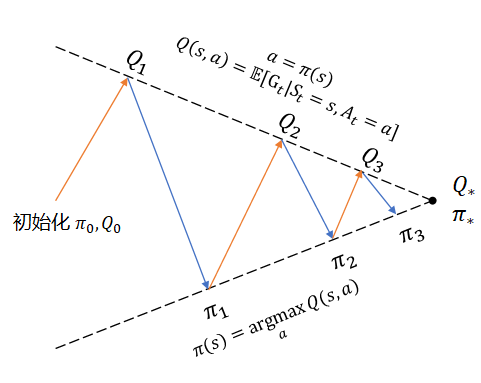

## 10.6 策略迭代 $\pi$

上一节中，通过对三种策略的评估比较，得知相对正确的策略，其动作价值函数值也会相对较大。那么如何找到最优策略呢？在本章中，由于没有环境信息，所以无法使用第九章学习的**价值迭代**法，只能尝试其它方法，被称为**策略迭代**。

策略迭代的方法是：

【算法 10.6】策略迭代

----

输入：策略 $\pi$，折扣 $\gamma$, 幕数 Episodes

1. 初始化
　　初始化数组：$Q(S,A) \leftarrow 0$
　　初始化策略：$\pi(S) \leftarrow Random$ 随机策略

2. 策略评估（多幕 Episodes 循环）：
　　根据当前策略与环境进行多幕交互
　　得到 $Q(S,A)$
3. 策略改进
　　$old.policy \leftarrow \pi$
　　对每个状态更新策略：$\pi(s) \leftarrow \argmax_a Q(s)$
　　如果 $\pi \ne old.policy$，跳转到第 2 步
　　否则结束

输出：$Q(S,A), \pi$

----

图 10.6.1 策略迭代示意图

#### 探索性出发（Exploring Starts）

在 8.4 节中，我们学习过 Q 函数的定义。如果应用到冰面行走问题上，Q 函数表格会如表 10.4.1 所示。

表 10.4.1 冰面行走问题的 Q 函数表格

|状态 $\to$ 动作|UP|LEFT|DOWN|RIGHT|
|:-:|:-:|:-:|:-:|:-:|
|$s_0$|$q_\pi(s_0,a_0)$|$q_\pi(s_0,a_1)$|$q_\pi(s_0,a_2)$|$q_\pi(s_0,a_3)$|
|$s_1$|$q_\pi(s_1,a_0)$|$q_\pi(s_1,a_1)$|$q_\pi(s_1,a_2)$|$q_\pi(s_1,a_3)$|
|...|...|...|...|...|
|$s_{14}$|$q_\pi(s_{14},a_0)$|$q_\pi(s_{14},a_1)$|$q_\pi(s_{14},a_2)$|$q_\pi(s_{14},a_3)$|
|$s_{15}$|$q_\pi(s_{15},a_0)$|$q_\pi(s_{15},a_1)$|$q_\pi(s_{15},a_2)$|$q_\pi(s_{15},a_3)$|

状态-动作的组合构成 Q 表格，一共有 16x4=64 个组合。如果想评价在某个状态上哪个动作最好，那么最起码要在该状态上尝试完所有动作后才会有评价的基础。

在一些问题中，可以在表 10.4.1 中遍历所有单元格作为问题的起点，然后开始与环境交互进行分幕采样，比如 21 点游戏，就可以任意指定初始时的手牌点数；但是在冰面行走问题中，由于环境的 env.reset() 函数总会返回定义好的 $s_0$ 状态为起点，虽然可以通过先期与环境交互到达指定的起始状态，然后再进行正式的采样，但是比较麻烦。

所以我们无法进行上述组合遍历。所以探索性出发这条路走不通。

#### 策略迭代

### 10.4.2 软性策略

$\varepsilon$-Soft

我们已经不是第一次接触软性策略了，在第二章的躲避强盗问题中，曾经学习过梯度上升法，里面使用了 Softmax 函数，根据各个动作的价值计算出备选概率，而不是使用非黑即白的硬性策略 argmax() 来选择后续动作。这样做的好处是：一方面在以最大概率选择（利用）了历史表现最好的动作的同时，给其它表现不好的动作一定的机会来进行探索。

### 10.4.3 GLIE 方法