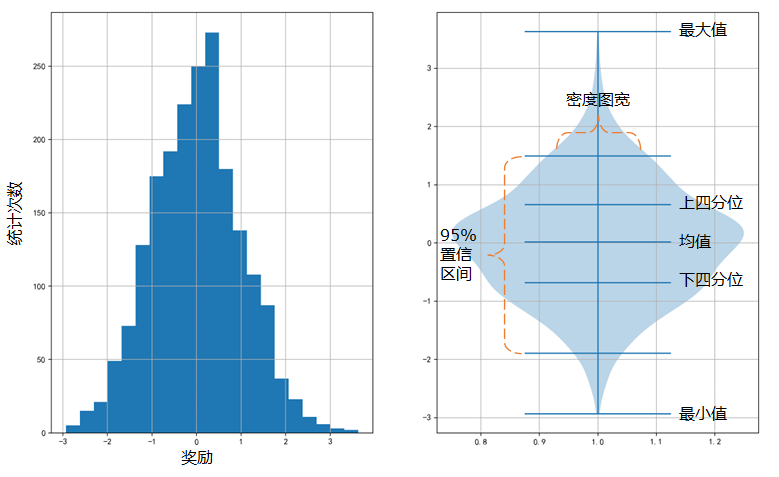
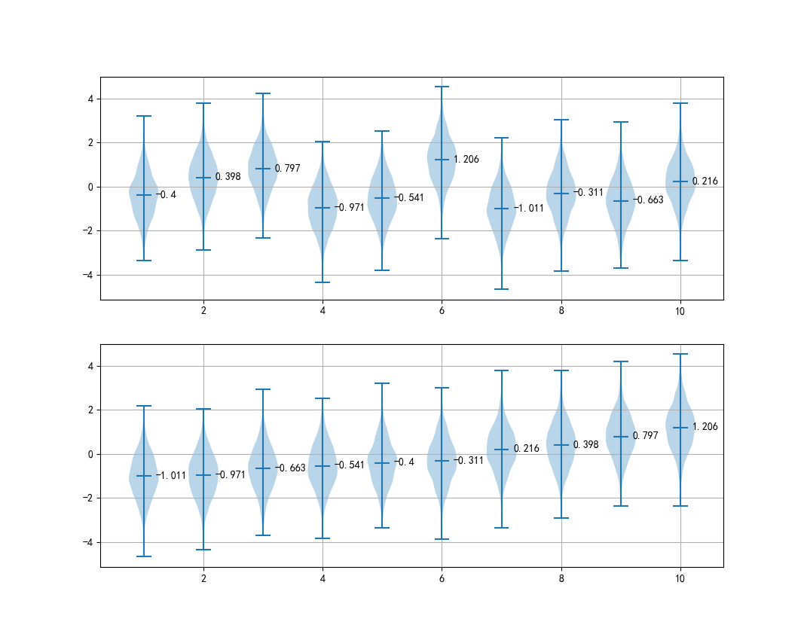

## 2.2 多臂赌博机建模

### 2.2.1 收益随机分布的多臂赌博机

下面再描述一下我们将要研究的多臂赌博机平台的细节。

首先看单臂的情况，如图 2.2.1 所示。

<center>



图 2.2.1 多臂赌博机的一个臂的奖励情况
（左图：奖励及其分布次数；右图：用小提琴图表示的收益分布）
</center>

- 每个臂的奖励都是一个正态分布，均值为 0，方差为 1，样本数量为 2000。
- 最小值和最大值都是随机采样的结果，基本是在 $\pm3$ 左右。
- 均值在 0 左右，偏差很小。
- 小提琴蓝色区域的宽度表示样本的密度。
- 上下四分位和置信区间在这个问题中暂时用不上。

生成 10 臂赌博机的原始数据的代码如下：

【代码位置】bandit_22_ArmBandits.py

```python
    # 生成原始数据
    num_arm = 10
    num_data = 2000
    np.random.seed(5)
    k_reward_dist = np.random.randn(num_data, num_arm) # num_arm 放在后面是为了可以做矩阵加法
    print("原始均值=", np.round(np.mean(k_reward_dist, axis=0),3))
    draw_one_arm(k_reward_dist[:,0])
```

得到 10 臂的原始数据的均值为：

```
原始均值= [ 0.018  0.019  0.004 -0.02  -0.005  0.004 -0.011 -0.005  0.027 -0.015]
```

可以看到基本接近于 0。如果 10 个臂返回的奖励值都类似，就没有可比性了，所以我们要人为地定义一个正态分布的均值：

```python
    # 生成期望均值
    reward_mu = np.random.randn(num_arm)
    print("期望平均回报=", np.round(reward_mu,3))
    draw_mu(reward_mu)
```

它的期望平均回报为：

```
期望平均回报= [-0.418  0.379  0.792 -0.951 -0.536  1.202 -1.    -0.306 -0.69   0.231]
```

绘制在图 2.2.2 中。

<center>


图 2.2.2 多臂赌博机期望的奖励均值分布

</center>


然后把期望均值叠加在原始数据上，生成奖励的期望数据：

【代码位置】bandit_22_ArmBandits.py

```python
    # 生成期望数据（=原始数据+期望均值）
    k_reward_dist_mu = reward_mu + k_reward_dist
    print("实际均值=", np.round(np.mean(k_reward_dist_mu, axis=0),3))
```

实际均值如下：

```
实际均值= [-0.4    0.398  0.797 -0.971 -0.541  1.206 -1.011 -0.311 -0.663  0.216]
```

$$
实际均值 = 原始均值 + 期望均值
$$


从图 2.2.2 可以看到，期望均值是随机的，由于随机种子可能不同，我们不能保证最好的选择一定是 5 号臂，所以，我们给这 10 组数据按照期望均值重新排个序，这样在出统计图时就能很容易地知道谁大谁小。

【代码位置】bandit_22_ArmBandits.py

```python
    # 按均值排序
    reward_mu_sort_arg = np.argsort(reward_mu)  # 对期望均值排序（并不实际排序，而是返回序号）
    k_reward_dist_mu_sort = np.zeros_like(k_reward_dist_mu)
    for i in range(10):
        idx = reward_mu_sort_arg[i] # 第i个臂对应的新序号是idx
        k_reward_dist_mu_sort[:,i] = k_reward_dist_mu[:,idx] # 重新排序
    draw_k_arm(k_reward_dist_mu, k_reward_dist_mu_sort)
```

绘制出图 2.2.3。

<center>



图 2.2.3 多臂赌博机奖励分布
（上图：10 臂赌博机期望数据分布；下图：10 臂赌博机按均值排序）
</center>

图 2.2.3 的上图，是按期望均值的原始顺序排列的 10 臂赌博机的奖励分布情况，下图是排序后的分布情况，比如：上图中的 1 号臂，在下图中排在 5 号位置。这样一来，10 个臂的回报情况是从左到右依次变好。当然，我们在做算法的时候，要假装不知道 10 号臂是最佳选择，而是需要探索。

### 2.2.2 如何定义最好的动作

我们假设只有三个动作，而且只玩 10 轮，记录的结果如表 2.2.1 所示。

表 2.2.1 一个三臂赌博机的 10 轮的模拟结果

|轮数 $t\to$|1|2|3|4|5|6|7|8|9|10|
|-|-|-|-|-|-|-|-|-|-|-|
|动作 $A_t$|$a_1$|$a_1$|$a_2$|$a_2$|$a_2$|$a_3$|$a_1$|$a_1$|$a_2$|$a_3$|
|收益 $R_t$|1.0|1.2|0.9|1.1|0.8|1.3|1.2|1.1|0.9|1.0|

表 2.2.1 中，第二行表示玩家（算法）选择了哪个臂（动作）$a_i, \ i=1,2,3$；第三行表示得到的奖励（只是一些模拟数据）。很自然地，可以通过奖励的平均值来衡量三个动作的优略：

$$
\begin{aligned}
q(a_1)&=\frac{1.0+1.2+1.2+1.1}{4}=1.125
\\
q(a_2)&=\frac{0.9+1.1+0.8+0.9}{4}=0.924
\\
q(a_3)&=\frac{1.3+1.0}{2}=1.15
\end{aligned}
\tag{2.2.1}
$$

式（2.2.1）告诉我们，在只玩 10 轮的经验下，$q(a_3)$ 的值最大，$a_3$ 就是最好的动作。

理论上，可以定义某个动作的价值为 $q_*$，则有：

$$
q_*(a) \doteq \mathbb E [R_t|A_t=a] \tag{2.2.2}
$$

意思是在任意时刻 $t$，动作 $a$ 的价值是执行该动作获得的收益的期望值。而期望的计算方式如式（2.2.1）所示，可以泛化为：

$$
Q_n(a)=\frac{动作 a 的收益总和}{执行动作 a 的次数 n} \tag{2.2.3}
$$

$n$ 表示动作被选择的次数，当 $n$ 足够大时，可以保证每个动作都被采样到足够多的次数，然后求平均值，称为**采样平均**，这样计算出来的 $Q_n(a)$ 将会收敛到 $q_*(a)$。大写的 $Q$ 表示泛化，小写的 $q$ 表示实例化到某个具体动作。

按照式（2.2.3）的规则，式（2.2.1）的三个 $q$ 值可以分别写成 $q_4(a_1),q_4(a_2),q_2(a_3)$。

在式（2.2.1）中，当前状态对于 $a_3$ 来说是 $n=2$。假设 $t=11$ 时选择了 $a_3$，则 $n=3$，$q(a_1),q(a_2)$ 的值不会变化，$q(a_3)$ 的值会被重新计算，由$q_2(a_3)$ 变成 $q_3(a_3)$。介绍一个小技巧，计算 $q_3(a_3)$ 时可以这样做：

$$
q_{3}(a_3)= \frac{1}{3}[2q_{2}(a_3) + R_{3}]=\frac{1}{3}[3q_{2}(a_3)-q_{2}(a_3)+R_{3}]=q_{2}(a_3)+\frac{1}{3}[R_{3}-q_{2}(a_3)]
\tag{2.2.4}
$$

在式（2.2.4）中：
- $q_2$ 表示当前的 $a_3$ 动作价值；
- $q_3$ 表示第三次选择 $a_3$ 后的动作价值；
- $R_3$ 表示第三次执行 $a_3$ 后的收益。

如果泛化到一般情况，针对某个动作如果第 $n$ 次被选到，有：

$$
Q_{n}=Q_{n-1}+\frac{1}{n}[R_n - Q_{n-1}] \tag{2.2.5}
$$

式（2.2.5）的好处是当历史数据很多时，我们只需要记录 $n, Q_{n-1}$ 两个变量，得到 $R_n$ 后即可计算出 $Q_n$ 来。另外，式（2.2.5）的一个泛化形式是：

$$
\begin{aligned}
Q_{n}&=Q_{n-1}+\alpha [R_n - Q_{n-1}] 
\end{aligned}
\tag{2.2.6}
$$

步长参数 $\alpha \in (0,1]$ 是一个常数，而不是像式（2.2.5）的 $\frac{1}{n}$ 那样随着采样次数 $n$ 的增加而降低。在解决一个非平稳问题的时候，即无法用 $\frac{1}{n}$ 来做平均值计算的时候，可以使用式（2.2.6）。

在 2.4 节贪心法中，会使用式（2.2.5)；在 2.5 节梯度上升法中，会使用式（2.2.6）。
