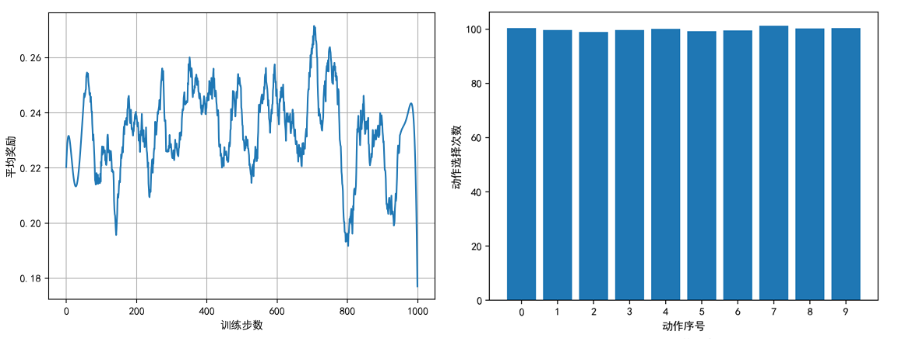
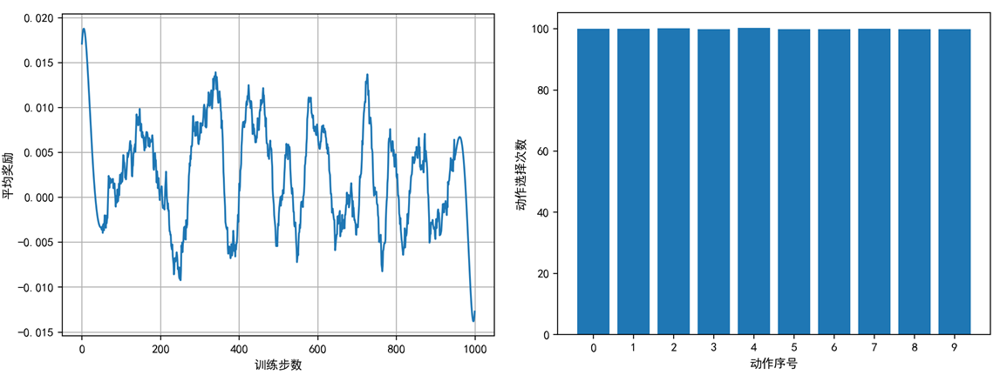

## 2.3 多臂赌博机基类实现

### 2.3.1 基类实现

定义 K 臂赌博机的基类，它完成了一些重复性的基本功能，不同的算法只需要重载其中的一个方法即可。

【代码位置】bandit_23_Base.py

```python
class KArmBandit(object):
    def __init__(self, k_arms=10, mu=0, sigma=1):
        self.k_arms = k_arms    # 臂数
        self.mu = mu            # 奖励均值
        self.sigma = sigma      # 奖励方差
        # 初始化 k 个 arm 的期望收益，并排序，但算法不要依赖这个排序
        self.E = np.sort(self.sigma * np.random.randn(self.k_arms) + self.mu)
```

清零操作，用于反复多轮执行算法，算法开始时调用此方法一次。

```python
    def reset(self):
        # 初始化 k 个 arm 的动作估值 Q_n 为 0
        self.Q = np.zeros(self.k_arms)
        # 保存每个 arm 被选择的次数 n
        self.action_count = np.zeros(self.k_arms, dtype=int)
        self.steps = 0   # 总步数，用于统计
```

算法要重载这个方法，用于选择动作。

```python
    # 得到下一步的动作（下一步要使用哪个arm，由算法决定）
    def select_action(self):
        pass
```

执行动作，获得奖励。

```python
    # 执行指定的动作，并返回此次的奖励
    def pull_arm(self, action):
        reward =  np.random.randn() + self.__expection[action]
        return reward
```

更新动作价值，需要在得到奖励后立刻调用。

```python
    # 更新 q_n
    def update_Q(self, action, reward):
        # 总次数(time)
        self.steps += 1
        # 动作次数(action_count)
        self.action_count[action] += 1
        # 计算动作价值，采样平均
        self.Q[action] += (reward - self.Q[action]) / self.action_count[action]
```

### 2.3.2 用随机算法做基本测试

【算法 2.3.1】随机算法。

---

初始化赌博机 k_arms=10
初始化奖励分布
$r \leftarrow 0$，循环 2000 次：
　　动作集 $A$ 的价值 $Q(A)=0$
　　每个动作被执行的次数计数器 $n \leftarrow 0$
　　$t \leftarrow 0$，迭代 1000 轮：
　　　　随机选择动作 $a$
　　　　执行 $a$ 得到奖励 $r$
　　　　$N(a) \leftarrow N(a)+1$
　　　　更新动作价值 $Q(a) \leftarrow Q(a)+\frac{1}{N(a)}[r - Q(a)]$
　　　　$t \leftarrow t+1$
　　$r \leftarrow r+1$

---

代码实现片段如下：

```python
    bandit = KArmBandit(k_arms)
    # 运行 2000 次取平均值
    for r in trange(runs):
        # 每次run都清零计算 q 用的统计数据
        bandit.reset()
        # 训练 1000 轮
        for t in range(steps):
            action = np.random.randint(k_arms)  # 随机选择一个动作，算法要重载 select_action() 方法
            reward = bandit.pull_arm(action)    # 执行动作获得奖励
            bandit.update_Q(action, reward)     # 更新动作价值
```

得到基本的统计结果如图 2.3.1。

<center>


图 2.3.1 10 臂赌博机随机动作选择测试结果
（左图：2000 次的平均奖励；右图：10 个动作的被选择次数）
</center>

从图 2.3.1 右图中可以看到，10 个动作（从 0 到 9）的被选择次数是非常接近的，都是 100 次左右（1000/10=100）；而左图中可以看到同一个 10 臂赌博机运行 2000 次（每次 1000 轮）后的平均奖励值，结果居然不是 0 或者接近 0，而是 0.23 附近，这是为什么呢？

我们不妨打印出 self.E 来观察：

```
10 臂的奖励均值：[-0.909  -0.592 -0.331 -0.330 -0.252 0.109 0.188 0.441 1.582 2.431]
奖励均值的均值：0.2337991556306549
```

这 10 个值看上去分布还比较均匀，但是它们的均值是 0.23，而不是 0，也就是说在正态分布中没有取到中点上，而是偏右了，相当于产生了偏差，这是不满足多臂赌博机测试条件的。

那么如何得到没有偏差的数据呢？用 np.random.randn(self.k_arms) 函数，当 self.k_arms=10 的时候是没有办法得到的，因为样本数量太小，肯定有偏差，只能手工调整数据。

等一等！我们还有一个办法：由于需要运行 2000 次求平均，所以如果每次运行前我们都初始化一个不同赌博机，则这 2000 个赌博机的均值就可以接近于 0 了！

所以，我们需要改一下前面两段代码：

```python
class KArmBandit(object):
    def __init__(self, k_arms=10, mu=0, sigma=1): # 臂数,奖励分布均值,奖励分布方差
        self.k_arms = k_arms    # 臂数
        self.mu = mu            # 奖励均值
        self.sigma = sigma      # 奖励方差

    def reset(self):
        # 初始化 k 个 arm 的期望收益，并排序，但算法不要依赖这个排序
        self.E = np.sort(self.sigma * np.random.randn(self.k_arms) + self.mu)
        ......
```

把生成 self.E 的生成代码放到 reset() 函数中，就可以达到上面的目的。因为 reset() 函数会在每一轮开始调用一次，一共 2000 轮的话，应该可以得到均值近似为 0 的数据。

相应地，算法 2.3.1 也要有所调整：

【算法 2.3.2】正确初始化的随机算法。

---

初始化 KArmBandit(k_arms=10)
$r \leftarrow 0$，循环 2000 次：
　　初始化奖励分布（注意这里与算法 2.3.1 不同）
　　动作集 $A=10$ 的价值 $Q(A)=0$
　　每个动作被执行的次数计数器 $N(A) \leftarrow 0$，一共有10个计数器
　　$t \leftarrow 0$，迭代 1000 步：
　　　　随机选择动作 $a$
　　　　执行 $a$ 得到奖励 $r$
　　　　针对动作 $a$ 的计数器 $N(a) \leftarrow N(a)+1$
　　　　更新动作价值 $Q(a) \leftarrow Q(a)+\frac{1}{N(a)}[r - Q(a)]$
　　　　$t \leftarrow t+1$
　　$r \leftarrow r+1$

---

再试一遍：

<center>


图 2.3.2 正确设置的 10 臂赌博机随机动作选择测试结果
（左图：2000 次的平均奖励；右图：10 个动作的被选择次数）
</center>

这次可以看到图 2.3.2 左图中均值接近于 0 的奖励曲线了；右图中每个动作被选择的次数也基本相等。

还有几个部分要简单说明：

类函数 simulate()，执行【算法 2.3.2】：

```python
    def simulate(self, runs, steps):
        # 记录历史 reward，便于后面统计，每一轮每一步
        rewards = np.zeros(shape=(runs, steps))
        for r in trange(runs):
            # 每次run都清零计算 q 用的统计数据，并重新初始化奖励均值
            self.reset()
            # 测试 time 次
            for s in range(steps):
                action = self.select_action()   # 算法选择动作
                reward = self.pull_arm(action)  # 执行动作获得奖励
                self.update_Q(action, reward)   # 更新动作价值
                rewards[r, s] = reward          # 记录历史信息便于统计算法性能
        return rewards
```

最后返回 rewards 数组即可。但是由于需要多方面统计，所以在实际的代码中还增加了关于动作的两个统计数据数组。

函数 mp_simulate()，开多进程执行上面的 simulate()，每个赌博机占用一个进程，可以让多个不同参数的赌博机同时训练。

```python
# 输入参数：赌博机列表，臂数，运行次数，训练轮数，图例文字，图标题
def mp_simulate(bandits, k_arms, runs, steps, labels, title):
    ......
    pool = mp.Pool(processes=4)
    results = []
    for i, bandit in enumerate(bandits):
        results.append(pool.apply_async(bandit.simulate, args=(runs,steps,)))
    pool.close()
    pool.join()
    ......
```

用户可以根据自己的机器的 CPU 个数来调整 processes 的值。由于我们每次只运行 4 个参数的比较，所以设置为大于 4 的值没有意义。
