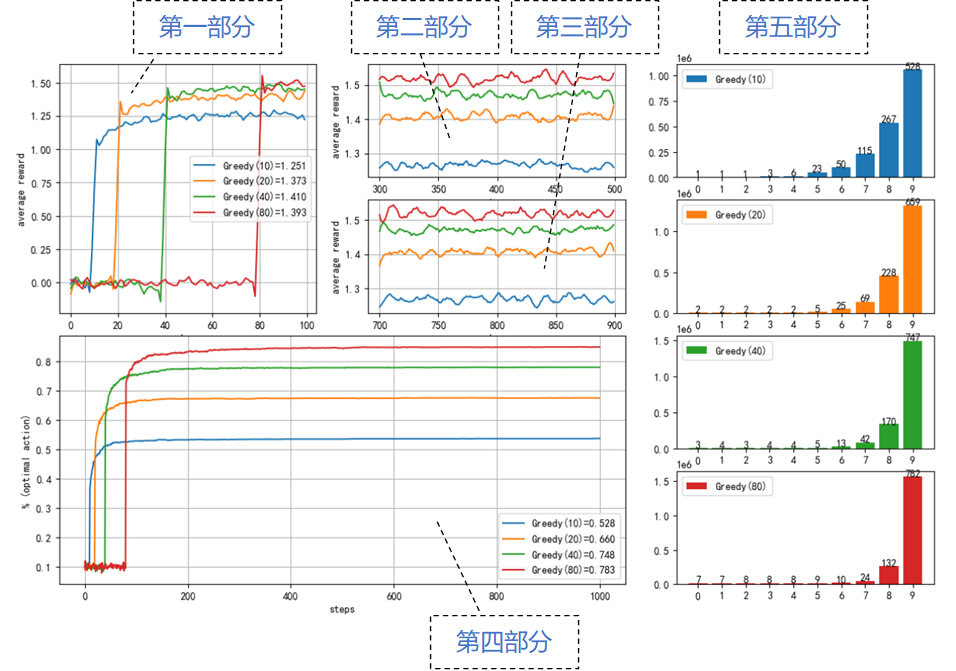

## 2.4 两种贪心算法

### 2.4.1 先试探后贪心

#### 算法描述

【算法 2.4.1】

---
初始化：$T \leftarrow$ 试探次数，动作集 $A$ 的价值 $Q(A)=0$
$r \leftarrow 0$，循环 2000 次：
　　初始化奖励分布和计数器
　　$t \leftarrow 0$，迭代 1000 轮：
　　　　如果 $t < T$，随机选择动作 $a = random\{A\}$；
　　　　否则 $a = \argmax_a \ Q(A)$
　　　　执行 $a$ 得到奖励 $r$
　　　　更新 $a$ 的动作价值 $Q_n(a)$
　　　　$t \leftarrow t+1$
　　$r \leftarrow r+1$

---

在本例中动作集数量为 10，如果只试探 10 次，一是可能没有选到所有的动作进行试探，二是即使选到了，由于概率分布，该动作的收益在当时的表现不佳，都有可能错过最佳动作的确定。

如果试探次数足够多，就大概率可以找到最佳动作。


#### 算法实现

【代码位置】

```python
class KAB_Greedy(kab_base.KArmBandit):
    def __init__(self, k_arms=10, mu=0, sigma=1, try_steps=10):
        super().__init__(k_arms=k_arms, mu=mu, sigma=sigma)
        self.try_steps = try_steps  # 试探次数

    def select_action(self):
        if (self.step < self.try_steps):
            action = np.random.randint(self.k_arms) # 随机选择动作
        else:
            action = np.argmax(self.Q)  # 贪心选择目前最好的动作
        return action
```

- 试探次数 $n$ 定义为 self.try_steps；
- 时间步 $t$ 定义为 self.step；
- $t \leftarrow t+1$ 的操作在基类 KArmBandit 中实现。

#### 算法结果与分析

<center>


图 2.4.1 贪心算法
</center>

读者第一次看到图 2.4.1 这张图，在本章中全是类似格式的图，所以有必要详细说明一下。

- 第一部分：0-100 步内的平均收益；
- 第二部分：300-500 步内的平均收益；
- 第三部分：700-900 步内的平均收益；
- 第四部分：0-1000 步内的最优动作选择比例；
- 第五部分：所有动作被选择的次数。


### 2.4.2 $\epsilon$-贪心算法


【算法 2.4.2】

---
初始化：$\epsilon \leftarrow$ 探索概率 $\in [0,1]$，动作集 $A$ 的价值 $Q(A)=0$
$r \leftarrow 0$，循环 2000 次：
　　初始化奖励分布和计数器
　　$t \leftarrow 0$，迭代 1000 轮：
　　　　得到一个随机数 $m \in [0,1]$
　　　　如果 $m < \epsilon$，随机选择动作 $a = random\{A\}$
　　　　否则 $a = \argmax_a \ Q(A)$
　　　　执行 $a$ 得到奖励 $r$
　　　　更新 $a$ 的动作价值 $Q_n(a)$
　　　　$t \leftarrow t+1$
　　$r \leftarrow r+1$

---

算法实现
【代码位置】

```python
class KAB_E_Greedy(kab_base.KArmBandit):
    def __init__(self, k_arms=10, epsilon=0.1):
        super().__init__(k_arms=k_arms)
        self.epsilon = epsilon  # 探索概率

    def select_action(self):
        if (np.random.random_sample() < self.epsilon):
            action = np.random.randint(self.k_arms) # 随机选择动作
        else:
            action = np.argmax(self.Q)  # 贪心选择目前最好的动作
        return action
```

<center>


图 2.4.2 $\epsilon$-贪心算法
</center>

