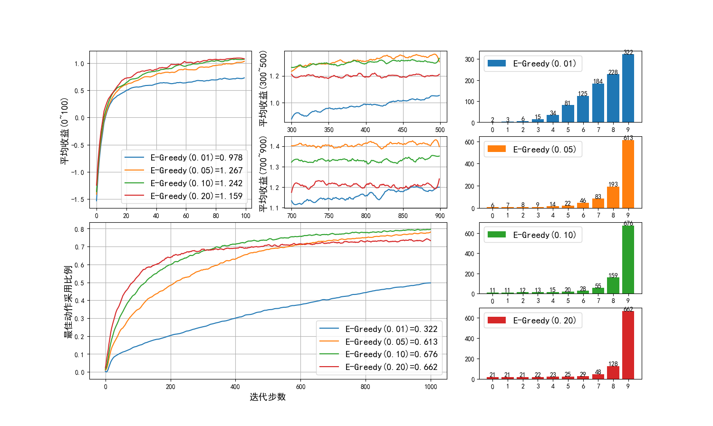

## 4.4 两种贪心算法

### 4.4.1 先试探后贪心

由于玩家不知道 10 个臂的收益情况，所以先要在每个臂上试探几次，找到最佳的臂，然后持续拉动它就可以了。

#### 算法描述

【算法 4.4.1】贪心算法

---
初始化：$T \leftarrow$ 试探次数
$r \leftarrow 0$，循环 2000 次：
　　初始化奖励分布和计数器，动作集 $A$ 的价值 $Q(A)=0$
　　$t \leftarrow 0$，迭代 1000 步：
　　　　如果 $t < T$，随机选择动作 $a = random\{A\}$；否则 $a = \argmax_a \ Q(A)$
　　　　执行 $a$ 得到奖励 $r$
　　　　$N(a) \leftarrow N(a)+1$
　　　　更新动作价值 $Q(a) \leftarrow Q(a)+\frac{1}{N(a)}[r-Q(a)]$
　　　　$t \leftarrow t+1$
　　$r \leftarrow r+1$

---

在本例中动作集空间为 10，如果只试探 10 次，一是可能没有选到所有的动作进行试探，二是即使选到了，由于概率分布，该动作的收益在当时的表现不佳，都有可能错过最佳动作的确定。

如果试探次数足够多，就大概率可以找到最佳动作。找到合适的试探次数参数，是我们的目标。

#### 算法实现

【代码位置】bandit_24_Greedy.py

```python
class KAB_Greedy(kab_base.KArmBandit):
    def __init__(self, k_arms=10, try_steps=10):
        super().__init__(k_arms=k_arms)
        self.try_steps = try_steps  # 试探次数

    def select_action(self):
        if (self.step < self.try_steps):
            action = np.random.randint(self.k_arms) # 随机选择动作
        else:
            action = np.argmax(self.Q)  # 贪心选择目前最好的动作
        return action
```

- 试探次数 $T$ 定义为 self.try_steps；
- 时间步 $t$ 定义为 self.steps；
- $t \leftarrow t+1,r \leftarrow r+1$ 的操作在基类 KArmBandit 中实现。

#### 参数设置

设置 try_steps 分别为 10、20、40、80 来做四组试验：

```python
if __name__ == "__main__":
    runs = 2000
    steps = 1000
    k_arms = 10

    bandits:kab_base.KArmBandit = []
    bandits.append(KAB_Greedy(k_arms, try_steps=10))
    bandits.append(KAB_Greedy(k_arms, try_steps=20))
    bandits.append(KAB_Greedy(k_arms, try_steps=40))
    bandits.append(KAB_Greedy(k_arms, try_steps=80))

    labels = [
        'Greedy(10)',
        'Greedy(20)',
        'Greedy(40)',
        'Greedy(80)'
    ]
    title = "Greedy"
    kab_base.mp_simulate(bandits, k_arms, runs, steps, labels, title)
```

#### 结果分析

10 个动作，每次迭代 1000 步，运行 2000 次取平均。注意，是纵向平均，即 2000 次内有 2000 个第 1 步，2000 个第 2 步，......，然后对每一步取平均，分母为 2000。

<center>


图 2.4.1 贪心算法
</center>

读者第一次看到图 2.4.1 这张图，在本章中全是相同模板的图，所以有必要详细说明一下。

- 第一部分：0-100 步内的平均收益。

    这一部分衡量算法的**探索效率**。
    
    比如红色线条，参数为 Greedy(80)，表示 try_steps=80，这个参数设置可以保证后期取得最好的效果，但是前期 80 步内几乎没有收益，而在有些实际应用中，希望马上能看到算法效果，这个参数就不合适了，20 或 40 可能比较合适。

    这一部分的图例是四种参数的总平均收益，其中 Greedy(40) 最好，为 1.409。

- 第二部分：300-500 步内的平均收益。

    这一部分衡量算法的**收敛效率**。
    
    所谓收敛，就是看这一部分的曲线的趋势，是继续向上攀升呢，还是一直横向振动。如果是横向振动，说明收敛的速度还不错；如果是向上攀升，说明还没有收敛，有继续提高的空间。

- 第三部分：700-900 步内的平均收益。

    这一部分衡量算法的**利用能力**。
    
    如果持续在高位横盘，就是有很好的利用能力；如果持续在低位横盘，说明算法能力有限或者参数设置不当，导致前期的最佳动作判断不准确。

- 第四部分：0-1000 步内的最优动作选择比例。

    这一部分从另外一个角度衡量算法的**性能**和**稳定性**。
    
    在前三部分中都是用平均收益来衡量，这一部分是来考察最佳动作的选择比例，其它 9 个动作忽略。值越高越好，最大值为 1。它是在 0-1000 区间内的平均数，以红色曲线为例，在该参数设置下，在大概 400 步后，其实已经非常稳定地选择了最佳动作。

    在这一部分中，


- 第五部分：所有动作被选择的次数。

    这一部分衡量算法在每个动作上的**探索与利用**次数。

    展示了算法的 4 个不同的参数设置下的每个动作的执行次数，10 个柱子上的数字相加应该等于 1000。由于我们在 KArmBandit() 类中“偷偷地”对十个动作的收益期望值进行了由小到大的排序，所以，四个柱状图都是梯形的左低右高分布，过渡过程越陡峭越好，靠右端的柱子越高越好。所以红色和绿色较好。


#### 关于探索与利用（EE - Exploration and Exploitation）

**探索与利用**，在强化学习中是一个永久的话题，请读者牢记这一点。

首先，前期探索是为了后期利用，尤其是对于贪婪算法来说，前期探索的结果正确的话，后期利用时就可以最大限度地获利。

以图 2.4.1 中的蓝色曲线来说：

- 它在前期探索的步数非常少（只有10步），就立刻开始利用，实际上它还没有找到最佳动作；
- 从第一部分来看，它可以很快地获利；
- 但是从第二部分和第三部分来看，明显后劲不足；
- 第四部分显示了它的最佳动作选择率只有 52% 左右；
- 第五部分也印证了它在前 9 个非最佳动作上浪费了很多时间。

在互联网应用中，敏捷开发是大家所推崇的做法，但是每一个好的功能都是经过前期的长时间用户调研后才开始开发应用的，否则就是浪费开发资源。一旦这些功能部署出去，开发者就可以很舒服地获利了。相反，一些急躁的决策者，闭门造车地臆想出了一些功能，快速开发上线，发现用户不买账，然后又不断地修改，造成开发资源的持续浪费，却始终没有获利。


其次，探索也要适可而止，不要花费太多的资源，尤其是在资源有限的情况下。

- 比如参数 Greedy(80)（红色），在第四部分中比其它三个参数好很多，第五部分也是如此，但是在第一部分尝试次数太多，导致了它在 1000 步内的平均收益为 1.379；
- 再看参数 Greedy(40)（蓝色），首先看它的平均收益为 1.409，在四个参数中最好。虽然它只探索了 40 步就开始了利用，但是在 1000 步这个限定的步长内，它还是超过了看起来比它好的 Greedy(80)。
- Greedy(10) 和 Greedy(20) 这两个参数，匆忙结束了探索，就想立刻获得回报，“心急吃不上热豆腐”，平均收益只有 1.268,1.361。


### 4.4.2 $\epsilon$-贪心算法

不同于上面的“先探索后利用”的方式，$\epsilon$-贪心算法在任何时候都保留着探索的机会，这个机会用 $\epsilon$ 的值来控制。

#### 算法描述

【算法 4.4.2】$\epsilon$-贪心算法

---
初始化：$\epsilon \leftarrow$ 探索概率 $\in [0,1]$
$r \leftarrow 0$，循环 2000 次：
　　初始化奖励分布和计数器，动作集 $A$ 的价值 $Q(A)=0$
　　$t \leftarrow 0$，迭代 1000 步：
　　　　得到一个随机数 $m \in [0,1]$
　　　　如果 $m < \epsilon$，随机选择动作 $a = random\{A\}$；否则 $a = \argmax_a \ Q(A)$
　　　　执行 $a$ 得到奖励 $r$
　　　　$N(a) \leftarrow N(a)+1$
　　　　更新动作价值 $Q(a) \leftarrow Q(a)+\frac{1}{N(a)}[r-Q(a)]$
　　　　$t \leftarrow t+1$
　　$r \leftarrow r+1$

---

与算法 2.4.1 不同的地方在于动作选择策略取决于输入参数 $\epsilon$，通常把它设置为 0.1 或更小。每次迭代都先取一个随机数：

- 如果它大于 $\epsilon$，则贪心选择目前 Q 值最大的动作——利用；
- 如果它小于 $\epsilon$，则随机选择动作——探索。

所以，可以预想到，$\epsilon$ 越大，探索的机会越多，利用的机会就越少。找到合适的探索概率参数，是我们的目标。

#### 算法实现

【代码位置】bandit_24_E_Greedy.py

```python
class KAB_E_Greedy(kab_base.KArmBandit):
    def __init__(self, k_arms=10, epsilon=0.1):
        super().__init__(k_arms=k_arms)
        self.epsilon = epsilon  # 探索概率

    def select_action(self):
        if (np.random.random_sample() < self.epsilon):
            action = np.random.randint(self.k_arms) # 随机选择动作进行探索
        else:
            action = np.argmax(self.Q)  # 贪心选择目前最好的动作进行利用
        return action
```
#### 参数设置

设置 $\epsilon$ 分别为 0.01、0.05、0.10、0.20 来做四组试验：

```python
......
    bandits.append(KAB_E_Greedy(k_arms, epsilon=0.01))
    bandits.append(KAB_E_Greedy(k_arms, epsilon=0.05))
    bandits.append(KAB_E_Greedy(k_arms, epsilon=0.10))
    bandits.append(KAB_E_Greedy(k_arms, epsilon=0.20))
......
```

有的读者可能会有疑问，为什么选择这四个参数而不是 0.3、0.4 等等？因为笔者已经事先做了一些试验，得到了一个最佳范围。读者也可以自行试验，间距从大到小，一步步来得到最佳范围，最后要保证第一个和第四个参数的结果比第二个和第三个参数的结果要差，就说明已经达到目的了。

#### 结果分析

同样是 10 个动作，每次迭代 1000 步，运行 2000 次取平均。

<center>


图 2.4.2 $\epsilon$-贪心算法
</center>

从图 2.4.2 来看，

- 参数 $\epsilon=0.01$

    探索的机会太少，所以一直到了 1000 步时，平均收益还处于上升状态，意味着还在继续强化对于最佳动作的判断。

- 参数 $\epsilon=0.20$

    探索的机会太多，在已经得到了最佳动作后，还在继续探索。看第四部分的红色柱图，前 8 个非最佳动作的选择次数比绿色柱图要多，浪费了很多利用的机会。

- 参数 $\epsilon=0.10$

    最佳参数，平均收益可以达到 1.282，但是比算法 4.4.1 的最大值 1.409 要小，原因是 1000x0.1=100，即花了 100 步做探索，而算法 4.4.1 中的最佳参数是 40 步。

- 参数 $\epsilon=0.05$

    这个参数在 700-900 步中的表现很好，从第四部分看，也属于后来居上的，但是在 1000 步的限制下，会比第三个参数要差一些。读者可以延长步数进行更多的验证。

