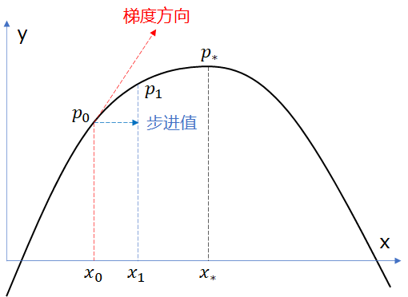
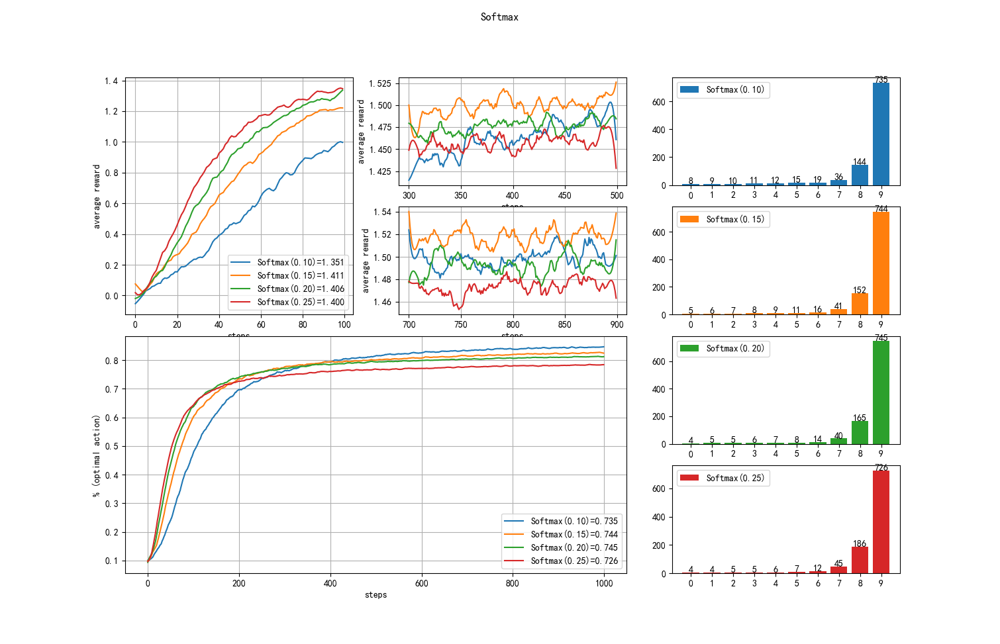
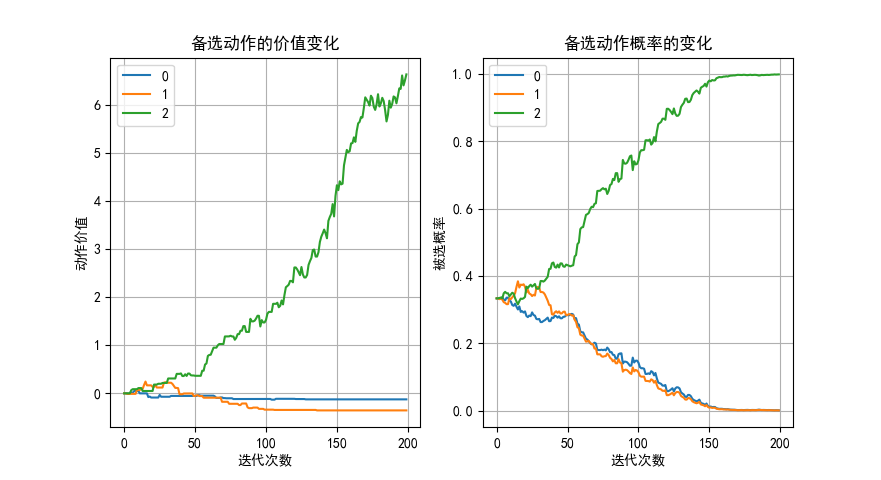

## 2.5 梯度上升法


### 2.5.1 Softmax 分布

在 2.4 节中，贪心法使用了 argmax() 操作，非黑即白地选出了一个最大值来执行动作，然后又不得不引入 $\epsilon$ 来提供探索的机会。那么有没有一种操作可以同时兼顾探索与利用呢？我们知道 np.random.choice(n, p=) 可以通过指定概率 p 来从 n 个项目中做出选择，所以把动作价值转换成概率就可以实现这个目标。

假设有 3 个动作 $a_1,a_2,a_3$，它们到目前为止的动作价值 Q 分别为 1,2,3，按照贪心法，动作 $a_3$ 肯是下一个备选。转换成概率的话，有几个方法。

#### 方法一

$$
p_{a_1}=\frac{1}{1+2+3}=\frac{1}{6}, \quad p_{a_2}=\frac{2}{6}, \quad p_{a_3}=\frac{3}{6}
$$

满足 $p_{a_1}+p_{a_2}+p_{a_3}=1$ 的条件。但是当其中有一个负数的时候，就不能这样做了。

#### 方法二

$$
p_{a_1}=\frac{1^2}{1^2+2^2+3^2}=\frac{1}{14}, \quad p_{a_2}=\frac{4}{14}, \quad p_{a_3}=\frac{9}{14}
$$

也满足 $p_{a_1}+p_{a_2}+p_{a_3}=1$ 的条件。但是当其中有一个值为 0 时，就不能这样做了。

#### 方法三

$$
p_{a_1}=\frac{e^1}{e^1+e^2+e^3} \approx 0.09, \quad p_{a_2} \approx 0.24, \quad p_{a_3} \approx 0.67
$$

这种方法可以克服前两种方法的缺陷，并满足 $p_{a_1}+p_{a_2}+p_{a_3}=1$ 的条件，被称作 Softmax，在神经网络中做分类时广泛采用。它的泛化形式是：

$$
softmax (a) =\frac{e^{a}}{\sum_{x \in A} e^x} \tag{2.5.1}
$$

其中，$a$ 表示一个具体的动作，$A$ 是动作集合，$x$ 是 $A$ 中的每个动作，$a$ 也是 $A$ 中的某个动作。

#### 策略 $\pi$

在将几个备选动作的价值转换为概率后，就可以用 np.random.choice(n, p=) 轻松地从中选择一个动作了，动作值大的概率也大，反之亦然，兼顾了探索与利用。那么在每一次选择动作时的策略 $\pi$，就可以认为是使用 np.random.choice() 函数实现的，每个动作被选择的概率就是式（2.5.1）。

因此，策略可以定义为动作价值 $Q(x)$ 的函数：

$$
\pi(a) \doteq \mathbb P[A_t=a] =\frac{e^{Q(a)}}{\sum_{x \in A} e^{Q(x)}} \tag{2.5.2}
$$

$\pi(x)$ 对 $Q(a)$ 的偏导数为：

$$
\frac{\partial \pi(x)}{\partial Q(a)}=
\begin{cases}
\pi(a)(1-\pi(a)) & x=a
\\
-\pi(a)\pi(x) & x \ne a
\end{cases}
\tag{2.5.3}
$$

由于策略 $\pi$ 是一个概率形式，在该策略下每个动作都有被选择的可能，进而得到动作对应的奖励，那么最终的奖励只能是一个期望：

$$
\mathbb E [R_t]= \sum_{x \in A} \pi(x) R_x \tag{2.5.4}
$$

其中，$R_x$ 是执行动作 $x$ 后得到的收益 $R$。

### 2.5.2 梯度上升（Gradient Ascent）

在赌博机问题中，收益越大越好。在开始阶段，算法需要探索，逐步找到最佳动作后，平均收益会上升，但是不是无限上升，而是在逐步逼近一个最大值。这就满足用梯度上升法解决问题的条件。

<center>


图 2.5.1 梯度上升
</center>

在图 2.5.1 中，假设一个函数 $y=f(x)$ 的曲线是一个类似抛物线的形状，有最大值点 $p_*$。目前我们处于 $p_0$ 点，在该点处求出导数，即梯度 $\nabla f(x_0)$，乘以一个步进值 $\alpha$，再加上 $x_0$，得到 $x_1$，如式（2.5.5）所示：

$$
x_1 = x_0 + \alpha \cdot \nabla f(x_0) \tag{2.5.5}
$$

如果 $\alpha$ 值足够小的话，经过几轮这样的计算，就会最终达到 $x_*$，从而得到最大值。

具体到赌博机问题上：
- $x$ 就相当于动作价值 $Q(x)$；
- $\alpha$ 是式（2.2.6）中所述的非平稳状态下的步长值；
- $f(x)$ 是式（2.5.3）中的 $\mathbb E[R_t]$；
- $\nabla f(x)$ 就是对 $f(x)$ 求关于被选中的动作 $a$ 的价值函数 $Q(a)$ 的偏导。

$$
\nabla f(a) = \frac{\partial \mathbb E[R_t]}{\partial Q(a)}=\frac{\partial [\sum \pi(x)R_x]}{\partial Q(a)}
\tag{2.5.6}
$$

为了简化问题，下面我们进行实例化推导，即：假设只有 3 个动作 $a,b,c$，对应的动作价值为 $Q(a),Q(b),Q(c)$，那么式（2.5.6）可以表示为：

$$
\begin{aligned}
\nabla f(a) &= \frac{\partial [\pi(a)R_a + \pi(b)R_b + \pi (c) R_c]}{\partial Q(a)}
\\
&= \frac{\partial \pi(a)}{\partial Q(a)}R_a + \frac{\partial \pi(b)}{\partial Q(a)}R_b+ \frac{\partial \pi (c)}{\partial Q(a)}R_c
\\
&=\pi(a)[1-\pi(a)]R_a-\pi(a)\pi(b)R_b-\pi(a)\pi(c)R_c
\\
&=\pi(a)\big[R_a - [\pi(a)R_a+\pi(b)R_b+\pi(c)R_c]\big]=\pi(a)(R_a-\sum_x \pi_x R_x)\\
&=\pi(a)(R_a-\mathbb E[R_t])
\end{aligned}
\tag{2.5.7}
$$

由于是假设执行了动作 $a$，所以 $R_a$ 就是当前动作的收益 $R_t$；$\mathbb E[R_t]$ 可以用到当前为止历史收益的均值来表示，简写为 $\bar{R_t}$。则式（2.5.7）进一步表示为 $\pi(a)(R_t-\bar{R_t})$，那么最终结果是：

$$
Q_{t+1}(a) = Q_t(a) + \alpha (R_t - \bar {R_t})\pi_t(a) \tag{2.5.8}
$$

式（2.5.8）都加上了下标 $t$，表示当前迭代次数，也暗示了 $Q(a),\pi(a)$ 都是随着迭代次数而变化的。

在 Sutton 的书中，经过一系列的假设和推导，得到的梯度更新公式为：

$$
\begin{cases}
Q_t(a) \doteq Q_{t-1} (a) + \alpha (R_t - \bar{R})(1-\pi_t(a)), & 被选动作 a=x
\\
Q_t(x) \doteq Q_{t-1} (x) + \alpha (R_t - \bar{R})(-\pi_t(x)), & 其它动作 a \ne x
\end{cases}
\tag{2.5.9}
$$

由读者自己阅读理解，看看哪一个更合理，可以接受。

### 2.5.3 算法与实现

#### 算法描述

【算法 2.5.1】

---
初始化：$\alpha \leftarrow$ 步长值 $\in (0,1]$
$r \leftarrow 0$，循环 2000 次：
　　初始化奖励分布和计数器，动作集 $A$ 的价值 $Q(A)=0$，$\bar{R} \leftarrow 0$
　　$t \leftarrow 0$，迭代 1000 步：
　　　　从动作价值计算备选概率：$\pi(x)=\frac{e^{Q(x)}}{\sum_{y \in A} e^{Q(y)}}$
　　　　根据概率选择动作：$a=random.choice(p=\pi(x))$
　　　　执行 $a$ 得到奖励 $r$
　　　　$N(a) \leftarrow N(a)+1$
　　　　$\bar{R} \leftarrow \bar{R} + (r-\bar{R})/t$
　　　　更新 $a$ 的动作价值函数 $q(a) \leftarrow q(a)+\alpha(r-\bar{R})\pi(a)$
　　　　$t \leftarrow t+1$
　　$r \leftarrow r+1$

---

找到合适的 $\alpha$ 参数，是我们的目标。

#### 从动作价值计算备选概率

实现式（2.5.1）有一个小技巧，以避免计算指数时值过大而溢出：

假设一共有 a,b,c 三个值，a 最大，则计算 $p_b$ 时有：

$$
p_b=\frac{e^b}{e^a+e^b+e^c}=\frac{e^b/e^a}{e^a/e^a+e^b/e^a+e^c/e^a}=\frac{e^{b-a}}{e^{a-a}+e^{b-a}+e^{c-a}}
\tag{2.5.10}
$$

这样一来，所有的指数值都是小于等于 0 的，肯定不会溢出。实现如下：

【代码位置】bandit_25_Softmax.py

```python
    def select_action(self):
        q_exp = np.exp(self.Q - np.max(self.Q))     # 所有的值都减去最大值
        self.P = q_exp / np.sum(q_exp)    # softmax 实现
        action = np.random.choice(self.k_arms, p=self.P)  # 按概率选择动作
        return action
```

#### 更新动作价值

由于本算法需要特殊的更新动作价值的方法，所以需要重载基类中的 update_Q() 函数，以实现式（2.5.8）。

```python
    def update_Q(self, action, reward):
        self.steps += 1 # 迭代次数
        self.action_count[action] += 1  # 动作次数(action_count)
        self.average_reward += (reward - self.average_reward) / self.steps
        self.Q[action] += self.alpha * (reward - self.average_reward) * self.P[action]
```

#### 参数设置

```python
    bandits.append(KAB_Softmax(k_arms, alpha=0.5))
    bandits.append(KAB_Softmax(k_arms, alpha=0.6))
    bandits.append(KAB_Softmax(k_arms, alpha=0.7))
    bandits.append(KAB_Softmax(k_arms, alpha=0.8))
```

设置 4 个不同的 $\alpha$ 参数。

#### 运行结果

<center>


图 2.5.1 梯度上升法结果
</center>

从图 2.5.1 来看，4 组参数的效果差不多。

- $\alpha=0.5$

    因为步长太小，探索阶段的“热身”过于缓慢，但是在最佳动作利用率方面后来居上。相信如果迭代次数多时，会有更好的效果。

- $\alpha=0.8$

    在探索阶段最“猛”，快速上升到本身的最佳值，但是后期的后劲不足，一直处于末位。因为步长过大，不容易稳定地寻找到最佳动作。

这就给了我们一个启示：能不能在开始阶段用 $\alpha=0.8$，后期用 $\alpha=0.5$ 呢？读者可以自行试验。

### 2.6.4 深入理解

我们还可以加入一些特殊的代码，来观察算法中动作价值的变化，包括动作价值（self.Q）的变化以及备选概率（self.P）的变化。

根据图 2.5.1，可以看到迭代 200 步后，算法就可比较稳定了，所以我们可以用下面的代码来得到这 200 步内的一些关键数据：

【代码位置】bandit_25_softmax_test.py

创建一个测试类，从 KAB_Softmax 继承。

```python
class KAB_Softmax_test(KAB_Softmax):
    def __init__(self, k_arms=10, alpha:float=0.1):
        super().__init__(k_arms=k_arms, alpha=alpha)
        self.Ps = []    # 记录运行过程中每一步的动作备选概率
        self.Qs = []    # 记录运行过程中每一步的动作价值
    # 重载
    def select_action(self):
        q_exp = np.exp(self.Q - np.max(self.Q))     # 所有的值都减去最大值
        self.P = q_exp / np.sum(q_exp)    # softmax 实现
        action = np.random.choice(self.k_arms, p=self.P)  # 按概率选择动作
        self.Ps.append(self.P)          # 记录概率
        self.Qs.append(self.Q.copy())   # 记录价值
        return action
```

主函数：

```python
if __name__ == "__main__":
    runs = 1        # 只运行一次
    steps = 200     # 迭代200步
    k_arms = 3      # 3个动作
    bandit = KAB_Softmax_test(k_arms, alpha=0.15)   # 步长参数0.15
    bandit.simulate(runs, steps)
    # 绘图
    ......
```

为了节省篇幅，还有一些绘图代码省略了。代码中只设置了 3 个动作（动作太多的话挤在一起看不清楚），运行 200 步，而且只运行一次（而不是多次求平均），这样的话，如果多次运行会出现不同的结果，但是大致趋势应该相同。绘出图 2.5.2。

<center>


图 2.5.2 迭代 200 步内的备选动作的变化
（左图：动作价值的变化；右图：备选概率的变化）
</center>

从左图看，3 个动作的初始价值都是 0，随着算法的进行而分裂，第 2 个动作（从 0 开始数）最后可以到达 10，其它 2 个动作按照它们的收益均值依次排列，1 在 0 的上面，因为在基类中我们“偷偷”地做了排序，序号越大的动作收益均值也越大，这样便于直观比较。

右图是 Softmax 函数计算的概率，大概在第 25 步时，动作 2 就已经脱颖而出了，然后一路飙升。在任意时刻，所有的动作的概率之和为 1，这是由 softmax 的算法决定的。

打印输出最终的动作价值和备选概率，可以看到，基本上有很少的几率可以选到 0 号和 1 号动作，99.79% 都会选择 2 号动作。

```
最终的动作价值 = [-0.13 -0.36  6.64]
最终的备选概率 = [1.14896740e-03 9.13158833e-04 9.97937874e-01]
备选概率的和 = 1.0000000000000002
```

但是如果 k_arms=10 的话，0.15 这个参数值就不合适了，读者可以自行试验。
