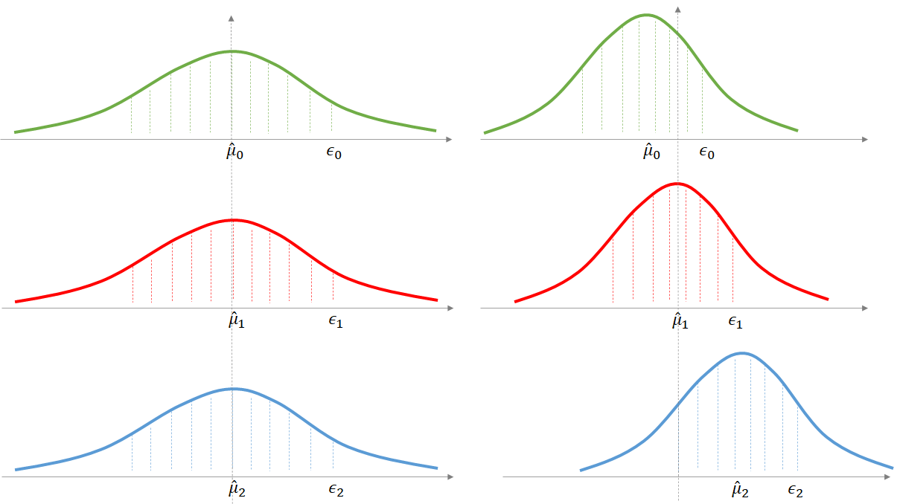
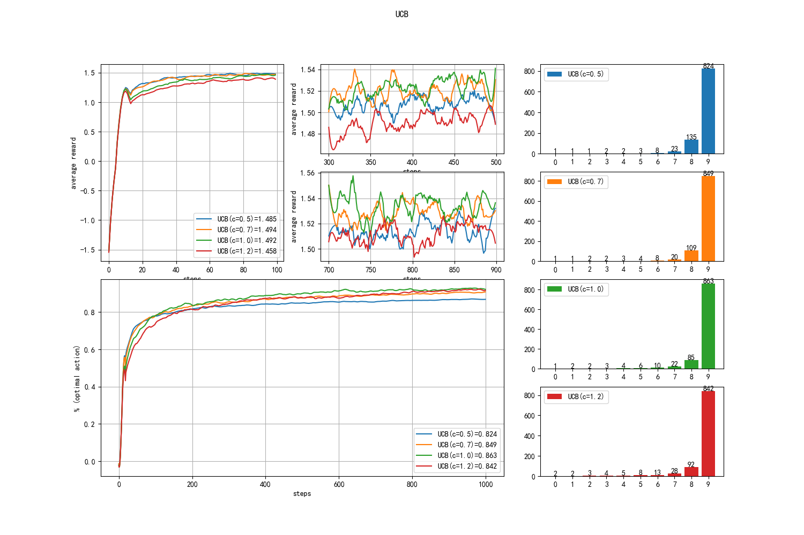
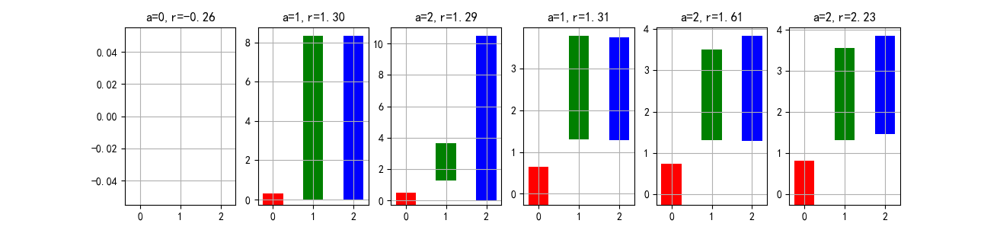

## 2.6 置信上界法（UCB）

UCB - Upper Confidence Bound，置信上界。要理解此算法，需要先了解置信度、置信区间等基本知识。

### 2.6.1 置信度和置信区间

#### 点估计与区间估计

一个中学有 2000 名学生，体育老师想知道男生女生的平均身高。

- 如果只随机测量一个学生的身高，不具有代表性，误差会很大；
- 如果所有学生都测量一遍，工作量太大。
- 所以体育老师就只在每个年级中抽测一个班的学生的身高，用于估计全校学生的平均身高，称作点估计。

在抽测之前，几个体育老师先给出了自己的“盲猜”：

- 老师甲说：我估计男生的平均身高是 1.75 米，女生是 1.65 米。
- 老师乙说：我估计男生的平均身高在 1.73 米到 1.77 米，女生是 1.62 米到 1.66 米之间。
- 老师丙说：我估计男生在 1 米到 2 米之间，女生也一样......其它老师一阵哄笑。

#### 置信度（置信水平）与置信区间

置信度（confidence coefficient）

- 老师甲的估计数据过于精确，但是不容易正确。
- 老师丙说的虽然是个笑话，但是它的正确程度基本上可以达到 100%。
- 老师乙估计得更“靠谱”一些，也就是说有 95% 的把握是正确的，这个 95% 就是置信度，[1.73,1.77] 以及 [1.62,1.66] 就是置信区间。

如果让老师乙进一步缩小范围的话，那么只能这样说：我有 90% 的把握确定男生的身高在 [1.74, 1.76] 之间。范围虽然小了（更精确了），但是把握（置信度）也降低了。

在图 2.6.1 中，有三个分布，虽然都是正态分布，但是方差和均值各不相同。

<center>


图 2.6.1 置信度与置信上界
</center>

- 绿色的分布方差最大，90% 置信区间的范围较宽。
- 蓝色的分布方差最小，90% 置信区间的范围最窄。
- 红色的分布方差居中，90% 置信区间的范围也中等。

三者的置信上界如各自的箭头所示。

#### 多臂赌博机问题

回到多臂赌博机问题上，根据设定，玩家并不知道哪个臂的真实均值最大，而是需要去探索。假设只有三个臂，那么玩家在前三次只是拉动每个臂一次，以获得初步的估计均值。如图 2.6.2 所示。

<center>


图 2.6.2 多臂赌博机问题的置信上界
</center>

- 左图是最开始的情况，由于没有任何历史数据依赖，所以三个动作的估计均值和上界是相同的。
- 右图是三个臂各拉动一次后的结果：
    - 可以看到绿色的曲线均值 $\hat{\mu}_0$ 向左偏移了（因为得到的收益值是负数），而且置信区间也缩窄了。
    - 红色的曲线似乎原地未动，但是置信区间也缩窄了。
    - 蓝色的曲线向右移动了一些，是因为得到的收益值比较高，$\hat{\mu}_2$ 值会变大。

当迭代次数越来越多时，三个动作的 $\hat{\mu}$ 肯定会估计得越准确，而 $\hat{\mu}$ 到 $\epsilon$ 的距离也会越来越近。

### 2.6.2 霍夫丁不等式

下面我们要解决图 2.6.2 中的 $\epsilon$ 的计算问题。

若 $X=[x_1,\cdots,x_n]$ 为 [0,1] 之间的随机变量，其样本均值为 $\hat{\mu} = \frac{1}{n}(x_1+\cdots+x_n)$，则根据霍夫丁不等式有：

$$
\mathbb P\big[\mu > \hat{\mu} + \epsilon \big ] \le e^{-2n\epsilon^2}
\tag{2.6.1}
$$

意为 X 的平均数 $\hat{\mu}$ 与真实均值 $\mu$ 的差大于任意值 $\epsilon$ （一般定义为误差）的概率为 $e^{-2n\epsilon^2}$。当 $n$ 很大的时候，不等式后面的值会很小，也就是说 X 的平均数很接近于真实均值。

可以与真实应用场景对接：

- $X$，某个臂的一系列收益值；
- $\mu$，样本期望值，可以看作某个动作的真实价值 $Q(a)$；
- $\hat{\mu}$，样本均值，可以看作根据历史收益记录估算出来的某个动作的价值 $\hat{Q}(a)$；
- $n$，样本数量，可以看作选择某个动作的次数 $N(a)$；
- $\epsilon$，任何正数，一般表示误差，可以看作某个动作价值的置信上界 $U(a)$。

式（2.6.1）可以改写为：

$$
\mathbb P[ Q(a) > \hat{Q}(a) + U(a)] \le e^{-2N(a)U(a)^2} \tag{2.6.2}
$$

从数学符号层面令 $p=e^{-2N(a)U(a)^2}$，两边取自然对数运算，得到关于上界 $U(a)$ 的表达式：

$$
U(a) = \sqrt{\frac{-\ln p}{2N(a)}}
$$

因为式（2.6.1）中的 $\epsilon$ 可以是任何正数，所以 $p$ 也可以是任何整数，接下来我们赋予 $p$ 一个真实的含义，指定 $p = t^{-2}$，$t$ 为赌博机迭代次数，一般都很大，$p$ 就会很小，则：

$$
U(a) = \sqrt{\frac{-\ln p}{2N(a)}}=\sqrt{\frac{-\ln t^{-2}}{N(a)}}=\sqrt{\frac{\ln t}{N(a)}}
\tag{2.6.3}
$$

在有些文献中会令 $p=t^{-4}$，则式（2.6.3）根号中的分子会变成 $2\ln t$，就是所谓的 UCB1 算法。由于式（2.6.4）中还会增加一个参数 $c$，所以这个 $2\ln t$ 与 $\ln t$ 没有区别，可以借 $c$ 的调整来弥补，就会形成下文要介绍的 UCB 算法。

霍夫丁不等式告诉我们，虽然在有限的样本数量内，我们估计的 $\hat{\mu}$ 不准，但是我们有把握真实的均值就在 $\hat{\mu} \pm \epsilon$ 的区间内，如果一定要给一个把握的程度的话，是 90%。

### 2.6.3 UCB 算法

赌博机问题中，搬动每个臂的结果收益也属于一个分布，其动作价值的真实均值取决于数据设置，而实际价值取决于收益。一方面，我们利用每个臂的多次动作获得的实际收益来计算 $Q(a)$，另一方面，我们会根据算法的迭代次数和每个动作的被选择次数来计算出该动作的上界。两者相加为：

$$
q(a) = \Big [Q_t(a) + \sqrt{\frac{\ln t}{N_t(a)}} \Big ]
\tag{2.6.5}
$$

由于一共有 10 个动作，所以一共有 10 个 $q(a)$，而且每轮迭代都会发生变化：被选中的动作的 UCB 会变小，其它动作的 UCB 值会变大（因为分母部分的 $N(a)$ 没变，但是分子 $t$ 增加了）。我们会选择 10 个 $q(a)$ 中最大值做为下一个被选动作。这样就会有式（2.6.4）：

$$
A_t = \argmax_a \Big [Q_t(a) + c\sqrt{\frac{\ln t}{N_t(a)}} \Big ]
\tag{2.6.4}
$$

由于操作符是 $\argmax_a$，所以后面的表达式中的 $a$ 都是指的动作集中的每个动作都做一次计算，然后取出最大值。

- $A_t$：最终选出的最佳动作。
- $Q_t(a)$：每个动作的价值估算。
- $c$：参数。
- $\ln t$：$t$ 为迭代次数，求其自然对数值。
- $N_t(a)$：每个动作被选择的次数，小于迭代次数 $t$。

我们需要平衡利用与探索二者的关系，在式（2.6.4）中，参数 $c$ 就可以达到这个目的：
- 当 $c$ 值较小时，表达式主要依赖 $Q_t(a)$ 的值，，即相信前面的采样结果，偏利用；
- 当 $c$ 值较大时，表达式会更加依赖后面的部分的计算结果，给被选择次数少的动作以更多的机会，偏探索。

根据式（2.6.4），再看图 2.6.2，下一轮的动作选择肯定是蓝色的 2 号臂。所以，UCB 算法告诉我们：因为真实的 $\mu$ 值落到 $\hat{\mu} \pm \epsilon$ 的区间内的概率很大，我们应该乐观地选择 $\hat{\mu} + \epsilon$ 值最大的那个动作。


### 2.6.4 算法与实现

#### 算法描述

【算法 2.6.1】

---
初始化：$c$ 
$r \leftarrow 0$，循环 2000 次：
　　初始化奖励分布和计数器，动作集 $A$ 的价值 $Q(A)=0$
　　$t \leftarrow 0$，迭代 1000 步：
　　　　计算所有动作的置信上界 $UCB = c \sqrt{\frac{\ln t}{N(A)}}$
　　　　选择最大值的动作：$a=\argmax_{a \in A} [ Q(a) + UCB]$
　　　　执行 $a$ 得到奖励 $r$
　　　　$N(a) \leftarrow N(a)+1$
　　　　更新动作价值 $Q(a) \leftarrow Q(a)+\frac{1}{N(a)}[r-Q(a)]$
　　　　$t \leftarrow t+1$
　　$r \leftarrow r+1$

---

找到合适的 $c$ 是我们的目标。

#### 代码实现

【代码位置】bandit_26_UCB.py

```python
    def select_action(self):
        # 式(2.6.4)
        ucb = self.C * np.sqrt(math.log(self.steps + 1) / (self.action_count + 1e-2))
        estimation = self.Q + ucb
        action = np.argmax(estimation)
        return action
```

读者可以看到代码实现和式（2.6.4）不完全相同：

- $\ln t$ 实现为 math.log(slef.steps+1)，这是因为对数计算的输入值必须大于 0。但是在第一步时 self.steps = 0，所以要 +1，避免计算错误。由于这个 +1 是对所有动作都做的，所以不会对算法结果有影响。
- $N(A)$ 实现为 self.action_count + 1e-2，因为最初阶段，self.action_count 有很多 0 的单元，直到所有动作至少被选择一次。如果是 0，则在 +1e-2 后，UCB 值会很大，则算法就会选择此动作。

#### 参数设置

四组测试的参数 c 分别设置为：[0.5, 0.7, 1.0, 1.2]：

```python
    bandits:kab_base.KArmBandit = []
    bandits.append(KAB_UCB(k_arms, c=0.5))
    bandits.append(KAB_UCB(k_arms, c=0.7))
    bandits.append(KAB_UCB(k_arms, c=1))
    bandits.append(KAB_UCB(k_arms, c=1.2))
```

#### 运行结果

得到图 2.6.3 的结果。

<center>


图 2.6.3 置信上界法结果
</center>

其中，c=0.7 和 c=1.0 时的效果最好，在多次测试中，它们两个的平均收益基本相等。

图 2.6.3 右侧的动作统计比较有趣，低价值动作的选择次数非常少，只有当 c=1.2 时，探索的次数会多一些，但是由于最佳动作选择准确，所以这种探索没有带了什么更多的好处。

### 2.6.5 深入理解

在代码中加入一些统计逻辑，可以帮助读者更深入地理解算法的运行过程。

在此，我们只设置了 3 个臂的赌博机，迭代 100 次，借以观察几个关键值的变化：

- 动作价值 Q；
- 上界值 UCB；
- c 值固定为 1，计算 Q+UCB，由此得出最大值；
- 被选择的动作，以及得到的收益。

第一次运行结果如下：

【代码位置】bandit_26_ucb_test.py

```
step= 0, Q=[0. 0. 0.],       UCB=[0. 0. 0.],       Q+UCB=[0. 0. 0.],       a=0, r=-0.26
step= 1, Q=[-0.26 0.  0.  ], UCB=[0.83 8.33 8.33], Q+UCB=[0.57 8.33 8.33], a=1, r=1.30
step= 2, Q=[-0.26 1.3 0.  ], UCB=[1.04 1.04 10.48],Q+UCB=[0.78 2.34 10.48],a=2, r=1.29
step= 3, Q=[-0.26 1.3 1.29], UCB=[1.17 1.17 1.17], Q+UCB=[0.91 2.47 2.46], a=1, r=1.31
step= 4, Q=[-0.26 1.3 1.29], UCB=[1.26 0.89 1.26], Q+UCB=[1.   2.2  2.55], a=2, r=1.61
step= 5, Q=[-0.26 1.3 1.45], UCB=[1.33 0.94 0.94], Q+UCB=[1.07 2.25 2.39], a=2, r=2.23
......
```

其中：
- Q=[x y z]，分别是 3 个动作的动作价值（估计的均值）；
- UCB=[x y z]，分别 3 个动作的上界值；
- Q+UCB=[x y z]，分别 3 个动作的均值+上界值；

按算法运行过程分析：

- step 0

    - 初始值，所有数值都为 0。
    - 由于 step=0，step+1=1，所以计算 UCB 时 $\ln(step+1)=0$；
    - Q+UCB 的值都是 0，此时按顺序选择了 a=0，即第 0 个动作；
    - 得到 r=-0.26 的收益，这个收益会计算到动作 0 的价值上。

- step 1

    - 上一次动作 0 收益 -0.26，所以 Q[0]=-0.26, 其它两个动作值不变；
    - 计算 UCB，动作 0 的次数为 1，所以分母为 1：$\sqrt{\frac{\ln 2}{1+1e-2}}=0.83$，动作 1,2 的次数为 0，所以分母是 1e-2：$\sqrt{\frac{\ln 2}{0+1e-2}}=8.33$；
    - 与 Q 值相加，得到 [-0.57, 8.33, 8.33]；
    - 按顺序取最大值 8.33，执行动作 1；
    - 得到 r=1.30 的收益。

- step 2

    - 上一次动作 1 收益 1.30，所以 Q[1]=1.3, 其它两个动作值不变；
    - 计算 UCB，动作 0,1 的次数为 1，所以分母为 1：$\sqrt{\frac{\ln 3}{1+1e-2}}=1.04$，动作 2 的次数为 0，所以分母是 1e-2：$\sqrt{\frac{\ln 3}{0+1e-2}}=10.48$；
    - 与 Q 值相加，得到 [0.78, 2.34, 10.48]；
    - 取最大值 10.48，执行动作 2；
    - 得到 r=1.29 的收益。
 
- step 3

    计算过程与前几步相同，由于动作 2 刚被执行过一次，所以其 UCB 值立刻降低，三者都是 1.71，就要比拼 Q 值了。
    动作 1 比动作 2 略好，执行动作 1，得到收益 r=1.31。

- step 4

    尽管动作 1 的 Q 值没有降低，但是由于多被执行了一次，所以 UCB 值降低了，所以本轮选择动作 2。

- step 5

    这一步仍然会选动作 2。后面一直到 100 步都选择了动作 2。

图 2.6.4 解释了前 5 步的运算过程。三种颜色代表三个动作，柱形图的底部表示 $\hat{\mu}$ 值，柱形图的高度表示 UCB 值。这样的话，只要比较三个柱子的顶部值，谁最大就选择谁。

<center>


图 2.6.4 置信上界法前 5 步的图形化解释
</center>

每张子图的标题是当前状态下选择的动作 $a$ 的序号，以及执行 $a$ 后获得的收益，会影响到下一张子图的柱形图的形状。

有趣的是动作 0 的 UCB 值，虽然在后几步中没有选择到它，但是它的 UCB 值在不断地增加，这是因为式（2.6.4）中 $t$ 的增加。其它两个动作，只要被执行了，它的 UCB 值就会缩短，这样就给其它动作留出更多的被选机会。

我们再看后面的过程，也是比较曲折的：

```
.....
step= 6, Q=[-0.26  1.3   1.71], UCB=[1.39 0.98 0.8 ], Q+UCB=[1.13 2.29 2.52], a=2, r=-0.29
step= 7, Q=[-0.26  1.3   1.21], UCB=[1.43 1.02 0.72], Q+UCB=[1.17 2.32 1.93], a=1, r=-0.83
step= 8, Q=[-0.26  0.59  1.21], UCB=[1.47 0.85 0.74], Q+UCB=[1.21 1.45 1.95], a=2, r=-0.51
......
step=11, Q=[-0.26  0.59  0.88], UCB=[1.57 0.91 0.6 ], Q+UCB=[1.31 1.5  1.48], a=1, r=0.87
step=12, Q=[-0.26  0.66  0.88], UCB=[1.59 0.8  0.6 ], Q+UCB=[1.33 1.46 1.49], a=2, r=1.07
step=13, Q=[-0.26  0.66  0.9 ], UCB=[1.62 0.81 0.57], Q+UCB=[1.36 1.47 1.48], a=2, r=0.88
step=14, Q=[-0.26  0.66  0.9 ], UCB=[1.64 0.82 0.55], Q+UCB=[1.38 1.48 1.45], a=1, r=2.11
......
step=17, Q=[-0.26  0.75  0.9 ], UCB=[1.69 0.64 0.57], Q+UCB=[1.43 1.39 1.47], a=2, r=-0.23
step=18, Q=[-0.26  0.75  0.79], UCB=[1.71 0.65 0.54], Q+UCB=[1.45 1.4  1.33], a=0, r=0.48
step=19, Q=[0.11 0.75 0.79],    UCB=[1.22 0.65 0.55], Q+UCB=[1.33 1.4  1.34], a=1, r=0.91
step=20, Q=[0.11 0.77 0.79],    UCB=[1.23 0.62 0.55], Q+UCB=[1.34 1.38 1.34], a=1, r=-1.13
step=21, Q=[0.11 0.56 0.79],    UCB=[1.24 0.59 0.56], Q+UCB=[1.35 1.14 1.34], a=0, r=-0.86
step=22, Q=[-0.21  0.56  0.79], UCB=[1.02 0.59 0.56], Q+UCB=[0.81 1.15 1.35], a=2, r=0.99
......
step=25, Q=[-0.21  0.56  0.65], UCB=[1.04 0.6  0.5 ], Q+UCB=[0.83 1.16 1.15], a=1, r=1.35
step=26, Q=[-0.21  0.64  0.65], UCB=[1.05 0.57 0.5 ], Q+UCB=[0.83 1.21 1.15], a=1, r=-1.66
step=27, Q=[-0.21  0.43  0.65], UCB=[1.05 0.55 0.51], Q+UCB=[0.84 0.98 1.16], a=2, r=1.24
......
step=70, Q=[-0.21  0.43  0.77], UCB=[1.19 0.62 0.28], Q+UCB=[0.98 1.05 1.05], a=1, r=0.50
step=71, Q=[-0.21  0.43  0.77], UCB=[1.19 0.6  0.28], Q+UCB=[0.98 1.03 1.05], a=2, r=-0.10
step=72, Q=[-0.21  0.43  0.75], UCB=[1.19 0.6  0.27], Q+UCB=[0.98 1.03 1.03], a=1, r=0.42
step=73, Q=[-0.21  0.43  0.75], UCB=[1.2  0.58 0.27], Q+UCB=[0.98 1.01 1.03], a=2, r=0.03
......
step=77, Q=[-0.21  0.43  0.74], UCB=[1.2  0.58 0.27], Q+UCB=[0.99 1.01 1.01], a=1, r=0.77
step=78, Q=[-0.21  0.46  0.74], UCB=[1.2  0.56 0.27], Q+UCB=[0.99 1.02 1.01], a=1, r=-1.23
step=79, Q=[-0.21  0.35  0.74], UCB=[1.21 0.54 0.27], Q+UCB=[0.99 0.89 1.01], a=2, r=-0.01
step=80, Q=[-0.21  0.35  0.73], UCB=[1.21 0.54 0.27], Q+UCB=[0.99 0.89 0.99], a=0, r=0.02
step=81, Q=[-0.16  0.35  0.73], UCB=[1.05 0.54 0.27], Q+UCB=[0.89 0.89 0.99], a=2, r=1.52
......
step=99, Q=[-0.16  0.35  0.71], UCB=[1.07 0.55 0.24], Q+UCB=[0.92 0.9  0.95], a=2, r=-0.02
```

- 前 26 步，一直在三个动作之间来回轮换；
- 从第 27 步开始，动作 2 占据霸主地位；
- 一直到第 70 步，虽然动作 2 的 Q 值持续增加，但是随着被选择次数的增加，上界也不断变小，终于被动作 1 等到了机会。
  
    这是由于 $t$ 的值一直在增大，而前两个动作的 $N(a)$ 没有变化，所以总体值会增大；而动作 2 的 $N(a)$ 虽然也在线性增大，但是分子是对数趋势增加，所以总体值会减小。
- 第 77 步，三个动作又展开了争夺，最终动作 2 靠着持续的高收益而笑到最后。
