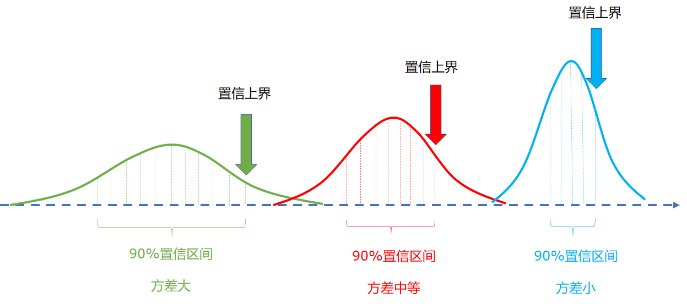

## 2.6 置信上界法（UCB）

UCB - Upper Confidence Bound，置信上界。

### 2.6.1 置信度和置信区间

#### 点估计

一个中学有 2000 名学生，体育老师想知道男生女生的平均身高。如果都测量一遍，工作量太大，所以体育老师就只在每个年级中抽测一个班的学生的身高，用于估计全校学生的平均身高。

#### 区间估计

在抽测之前，几个体育老师先给出了自己的“盲猜”。老师甲说：我估计男生的平均身高是 1.75 米，女生是 1.65 米。老师乙说：我估计男生的平均身高在 1.73 米到 1.77 米，女生是 1.62 米到 1.66 米之间。老师丙说：我估计男生在 1 米到 2 米之间，女生也一样......其它老师一阵哄笑......

#### 置信度（置信水平）与置信区间

置信度（confidence coefficient）

- 老师甲的估计数据过于精确，但是不容易正确。
- 老师丙说的虽然是个笑话，但是它的准确程度基本上可以达到 100%。
- 老师乙估计得更“靠谱”一些，也就是说有 95% 的把握是正确的，这个 95% 就是置信度，[1.73,1.77] 以及 [1.62,1.66] 就是置信区间。

在图 2.6.1 中，有三个分布，虽然都是正态分布，但是方差和均值各不相同。

<center>


图 2.6.1 置信上界法
</center>

- 绿色的分布方差最大，90% 置信区间的范围较宽。
- 蓝色的分布方差最小，90% 置信区间的范围最窄。
- 红色的分布方差居中，90% 置信区间的范围也中等。

三者的置信上界如各自的箭头所示。

### 2.6.2 霍夫丁不等式


若 $X=[x_1,\cdots,x_n]$ 为 [0,1] 之间的随机变量，其均值为 $\bar{\mu} = \frac{1}{n}(x_1+\cdots+x_n)$，则根据霍夫丁不等式有：

$$
\mathbb P\big[\bar{\mu} - \mu > \epsilon \big ] \le e^{-2n\epsilon^2}
\tag{2.6.1}
$$

意为 X 的平均数与真实均值的差大于任意值 $\epsilon$ （一般定义为误差）的概率为 $e^{-2n\epsilon^2}$。当 $n$ 很大的时候，不等式后面的值会很小，也就是说 X 的平均数很接近于真实均值。

可以与真实应用场景对接：

- $\mathbb E[X]$，样本期望值，可以看作某个动作的真实价值 $Q(a)$；
- $\bar{X}$，样本均值，可以看作根据历史记录估算出来的某个动作的价值 $\hat{Q}(a)$；
- $n$，样本数量，可以看作选择某个动作的次数 $N(a)$；
- $\epsilon$，任意正数，一般表示误差，可以看作某个动作的价值上界 $U(a)$。

式（2.6.1）可以改写为：

$$
\mathbb P[\hat{Q}(a) - Q(a) > U(a)] \le e^{-2N(a)U(a)^2} \tag{2.6.2}
$$

从数学符号层面令 $p=e^{-2N(a)U(a)^2}$，对式（2.6.2）两边取自然对数运算，得到关于上界 $U(a)$ 的表达式：

$$
U(a) = \sqrt{\frac{-\ln p}{2N(a)}}
$$

因为式（2.6.1）中的 $\epsilon$ 可以是任何正数，所以接下来我们赋予 $p$ 一个真实的含义，指定 $p = t^{-2}$，$t$ 为赌博机迭代次数，一般都很大，$p$ 就会很小，则：

$$
U(a) = \sqrt{\frac{-\ln p}{2N(a)}}=\sqrt{\frac{\ln t}{N(a)}}
\tag{2.6.3}
$$

### 2.6.3 UCB 算法

赌博机问题中，搬动每个臂的结果收益也属于一个分布，其动作价值的真实均值取决于数据设置，而实际价值取决于收益。一方面，我们利用每个臂的多次动作获得的实际收益来计算 $Q(a)$，另一方面，我们会根据算法的迭代次数和每个动作的被选择次数来计算出该动作的上界。两者相加为：

$$
q(a) = \Big [Q_t(a) + \sqrt{\frac{\ln t}{N_t(a)}} \Big ]
\tag{2.6.5}
$$

由于一共有 10 个动作，所以一共有 10 个 $q(a)$，而且每轮迭代都会发生变化：被选中的动作的 UCB 会变小，其它动作的 UCB 值会变大（因为分母部分的 $N(a)$ 没变，但是分子 $t$ 增加了）。我们会选择 10 个 $q(a)$ 中最大值做为下一个被选动作。这样就会有式（2.6.4）：

$$
A_t = \argmax_a \Big [Q_t(a) + c\sqrt{\frac{\ln t}{N_t(a)}} \Big ]
\tag{2.6.4}
$$

由于操作符是 $\argmax_a$，所以后面的表达式中的 $a$ 都是指的动作集中的每个动作都做一次计算，然后取出最大值。

- $A_t$：最终选出的最佳动作。
- $Q_t(a)$：每个动作的价值估算。
- $c$：参数。
- $\ln t$：$t$ 为迭代次数，求其自然对数值。
- $N_t(a)$：每个动作被选择的次数，小于迭代次数 $t$。

我们需要平衡利用与探索二者的关系，在式（2.6.4）中，参数 $c$ 就可以达到这个目的：
- 当 $c$ 值较小时，表达式主要依赖与 $Q_t(a)$ 的值，，即相信前面的采样结果，偏利用；
- 当 $c$ 值较大时，表达式会更加重视后面的部分的计算结果，给被选择次数少的动作以更多的机会，偏探索。


### 2.6.3 算法与实现

#### 算法描述

【算法 2.5.1】

---
初始化：$c$ 
$r \leftarrow 0$，循环 2000 次：
　　初始化奖励分布和计数器，动作集 $A$ 的价值 $Q(A)=0$
　　$t \leftarrow 0$，迭代 1000 步：
　　　　计算所有动作的置信上界 $UCB = c \sqrt{\frac{\ln t}{N(A)}}$
　　　　选择最大值的动作：$a=\argmax_{a \in A} [ Q(a) + UCB]$
　　　　执行 $a$ 得到奖励 $r$
　　　　$N(a) \leftarrow N(a)+1$
　　　　更新动作价值 $Q(a) \leftarrow Q(a)+\frac{1}{N(a)}[r-Q(a)]$
　　　　$t \leftarrow t+1$
　　$r \leftarrow r+1$

---


#### 代码实现

```python
    def select_action(self):
        # 式(2.6.4)
        ucb = self.C * np.sqrt(math.log(self.steps + 1) / (self.action_count + 1e-2))
        estimation = self.Q + ucb
        action = np.argmax(estimation)
        return action
```

读者可以看到代码实现和式（2.6.4）不完全相同：

- $\ln t$ 实现为 math.log(slef.steps+1)，这是因为对数计算的输入值必须大于 0。但是在第一步时 self.steps = 0，所以要 +1，避免计算错误。由于这个 +1 是对所有动作都做的，所以不会对算法结果有影响。
- $N(A)$ 实现为 self.action_count + 1e-2，因为最初阶段，self.action_count 有很多 0 的单元，直到所有动作至少被选择一次。如果是 0，则在 +1e-2 后，UCB 值会很大，则算法就会选择此动作。

#### 参数设置

四组测试的参数 c 分别设置为：[0.3,0.5,0.7,1.0]：

```python
    bandits:kab_base.KArmBandit = []
    bandits.append(KAB_UCB(k_arms, c=0.3))
    bandits.append(KAB_UCB(k_arms, c=0.5))
    bandits.append(KAB_UCB(k_arms, c=0.7))
    bandits.append(KAB_UCB(k_arms, c=1))
```

#### 运行结果


得到图 2.6.2 的结果。


<center>


图 2.6.2 置信上界法结果
</center>

其中，c=0.7 和 c=1.0 时的效果最好，在多次测试中，它们两个的平均收益基本相等。

图 2.6.2 右侧的动作统计比较有趣，低价值动作的选择次数非常少，只有当 $c=1.2$ 时，探索的次数会多一些，但是由于最佳动作选择准确，所以这种探索没有带了什么更多的好处。

### 2.6.4 深入理解

在代码中加入一些统计逻辑，可以帮助读者更深入地理解算法的运行过程。

在此，我们只设置了 3 个臂的赌博机，迭代 100 次，借以观察几个关键值的变化：

- 动作价值 Q；
- 上界值 UCB；
- c 值固定为 1，计算 Q+UCB，由此得出最大值；
- 被选择的动作，以及得到的收益。

第一次运行结果如下：

```
step= 0, Q=[0. 0. 0.],          UCB=[0. 0. 0.],        Q+UCB=[0. 0. 0.],          a=0, r=-1.35
step= 1, Q=[-1.35  0.    0.  ], UCB=[0.83 8.33 8.33],  Q+UCB=[-0.52  8.33  8.33], a=1, r=-0.19
step= 2, Q=[-1.35 -0.19  0.  ], UCB=[1.04 1.04 10.48], Q+UCB=[-0.31  0.85 10.48], a=2, r=0.77
step= 3, Q=[-1.35 -0.19  0.77], UCB=[1.17 1.17 1.17],  Q+UCB=[-0.18  0.98  1.94], a=2, r=-1.08
step= 4, Q=[-1.35 -0.19 -0.15], UCB=[1.26 1.26 0.89],  Q+UCB=[-0.09  1.07  0.74], a=1, r=-1.50
step= 5, Q=[-1.35 -0.85 -0.15], UCB=[1.33 0.94 0.94],  Q+UCB=[-0.02  0.1   0.79], a=2, r=1.02
......
```

- step 0

    - 初始值，所有数值都为 0。
    - 由于 step=0，step+1=1，所以计算 UCB 时 $\ln(step+1)=0$；
    - Q+UCB 的值都是 0，此时按顺序选择了 a=0，即第 0 个动作；
    - 得到 r=-1.35 的收益，这个收益会计算到动作 0 的价值上。

- step 1

    - 上一次动作 0 收益 -1.35，所以 Q[0]=-1.35, 其它两个动作值不变；
    - 计算 UCB，动作 0 的次数为 1，所以分母为 1：$\sqrt{\frac{\ln 2}{1+1e-2}}=0.83$，动作 1,2 的次数为 0，所以分母是 1e-2：$\sqrt{\frac{\ln 2}{0+1e-2}}=8.33$；
    - 与 Q 值相加，得到 [-0.52, 8.33, 8.33]；
    - 按顺序取最大值 8.33，执行动作 1；
    - 得到 r=-0.19 的收益。

- step 2

    - 上一次动作 1 收益 -0.19，所以 Q[1]=-0.19, 其它两个动作值不变；
    - 计算 UCB，动作 0,1 的次数为 1，所以分母为 1：$\sqrt{\frac{\ln 3}{1+1e-2}}=1.04$，动作 2 的次数为 0，所以分母是 1e-2：$\sqrt{\frac{\ln 3}{0+1e-2}}=10.48$；
    - 与 Q 值相加，得到 [-0.31, 0.85, 10.48]；
    - 取最大值 10.48，执行动作 2；
    - 得到 r=0.77 的收益。
 
- step 3

    计算过程与前几步相同，仍然执行动作 2，得到收益 r=-1.08（运气不好）。

- step 4

    上一步的运气不好，造成目前 Q[2] 的值低于预期（虽然仍比前两个值高），但是由于动作 2 已经执行了 2 次，所以 UCB 值会比前两个小，Q+UCB 两者相加后得到 [-0.09, 1.07, 0.74]，最大值为动作 1，执行后收益 r=-1.50。

- step 5

    这一步又回归正常了，所以最终仍然会选动作 2。后面一直到 100 步都选择了动作 2。


我们再看一个比较特殊的例子：

```
step= 0, Q=[0. 0. 0.],          UCB=[0. 0. 0.],       Q+UCB=[0. 0. 0.],       a=0, r=1.20
step= 1, Q=[1.2 0.  0. ],       UCB=[0.83 8.33 8.33], Q+UCB=[2.03 8.33 8.33], a=1, r=0.52
step= 2, Q=[1.2  0.52 0.  ],    UCB=[1.04 1.04 10.48],Q+UCB=[2.25 1.57 10.48],a=2, r=0.59
step= 3, Q=[1.2  0.52 0.59],    UCB=[1.17 1.17 1.17], Q+UCB=[2.37 1.69 1.76], a=0, r=-0.64
step= 4, Q=[0.28 0.52 0.59],    UCB=[0.89 1.26 1.26], Q+UCB=[1.17 1.78 1.85], a=2, r=-1.69
step= 5, Q=[ 0.28  0.52 -0.55], UCB=[0.94 1.33 0.94], Q+UCB=[1.22 1.85 0.39], a=1, r=-0.26
step= 6, Q=[ 0.28  0.13 -0.55], UCB=[0.98 0.98 0.98], Q+UCB=[1.26 1.11 0.43], a=0, r=-1.18
......
step=39, Q=[-0.15 -0.37 -0.68], UCB=[0.38 0.64 0.86], Q+UCB=[0.23 0.27 0.18], a=1, r=-1.03
step=40, Q=[-0.15 -0.43 -0.68], UCB=[0.39 0.61 0.86], Q+UCB=[0.23 0.18 0.18], a=0, r=-1.49
step=41, Q=[-0.21 -0.43 -0.68], UCB=[0.38 0.61 0.86], Q+UCB=[0.17 0.18 0.19], a=2, r=0.95
......
step=49, Q=[-0.21 -0.43  0.  ], UCB=[0.39 0.63 0.55], Q+UCB=[0.18 0.19 0.55], a=2, r=1.68
......
step=59, Q=[-0.21 -0.43  0.21], UCB=[0.4  0.64 0.42], Q+UCB=[0.19 0.21 0.63], a=2, r=0.51
......
step=69, Q=[-0.21 -0.43  0.19], UCB=[0.4  0.65 0.36], Q+UCB=[0.2  0.22 0.55], a=2, r=1.90
......
step=79, Q=[-0.21 -0.43  0.22], UCB=[0.41 0.66 0.32], Q+UCB=[0.2  0.23 0.54], a=2, r=1.43
......
step=89, Q=[-0.21 -0.43  0.21], UCB=[0.42 0.67 0.29], Q+UCB=[0.21 0.24 0.5 ], a=2, r=1.14
......
step=99, Q=[-0.21 -0.43  0.21], UCB=[0.42 0.68 0.27], Q+UCB=[0.21 0.25 0.48], a=2, r=0.72
```

- 前三步三个动作各被选择了一次，这很正常；
- 第 4 步动作 2 的收益很不理想（本来应该是一个大于 0 的收益），所以后面几步中一直没有被选择；
- 直到第 10 步，前两个动作没有再超常发挥，才回到动作 2，但是它的表现又很糟，收益只有 -1.27。
- 蹉跎到第 41 步时，动作 2 获得了 0.95 的收益，才算彻底翻身，此后一直保持优势。
- 在后面的过程中，每隔 10 步摘抄下来一条数据，可以看到，虽然一直在选择动作 2，但是：
    - 动作 0 的 UCB 值从 0.38 上升到了 0.42；
    - 动作 1 的 UCB 值从 0.61 上升到了 0.68；
    - 动作 2 的 UCB 值从 0.86 下降到了 0.27。
    
    这是由于 $t$ 的值一直在增大，而前两个动作的 $N(a)$ 没有变化，所以总体值会增大；而动作 2 的 $N(a)$ 也在线性增大，但是分子是对数趋势降低，所以总体值会减小。但是由于 Q 值一直差距明显，所以动作 2 始终处于优势地位。

如果在后面的过程中，动作 2 有几次连续表现不好的话，会被动作 1 反超一次，但是很快又会回到动作 2。
