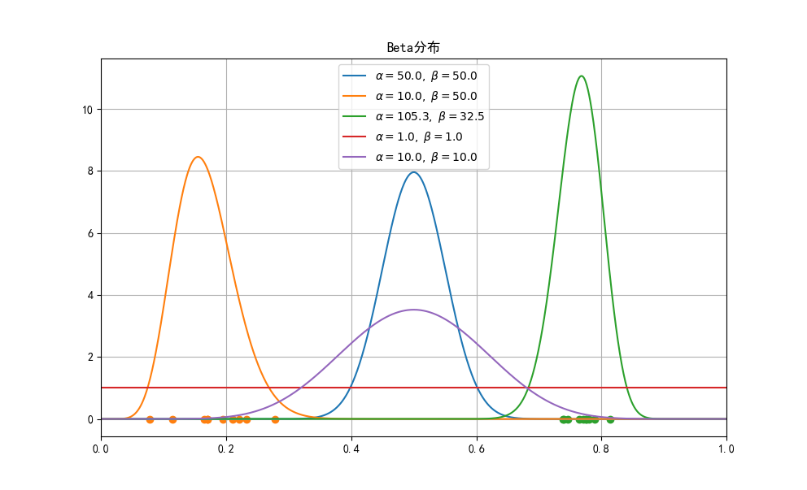
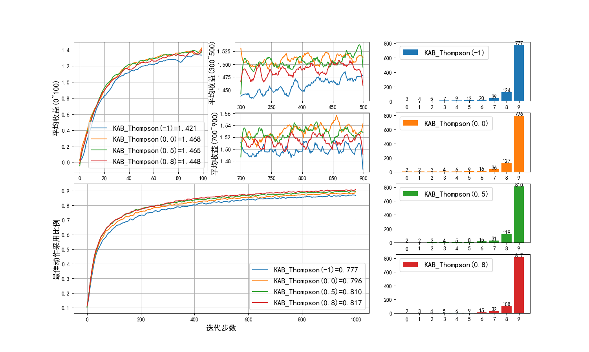

$$
P(x)=\frac{win}{win+loss}=\frac{a}{a+b}
$$

Beta 分布
$$
f(x)=\frac{x^{a-1}(1-x)^{b-1}}{B(a,b)}
$$

$B(a,b)=\frac{\Gamma(a)\Gamma(b)}{\Gamma(a+b)}$，而 $\Gamma$ 为伽马函数。

图 2.7.1 Beta分布

理论比较复杂，但是实现比较简单。

图 2.7.1 Beta分布

