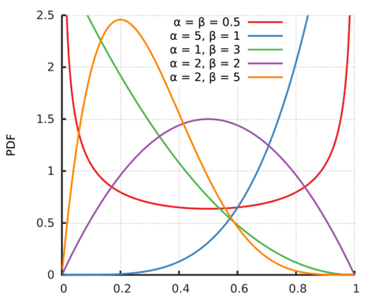
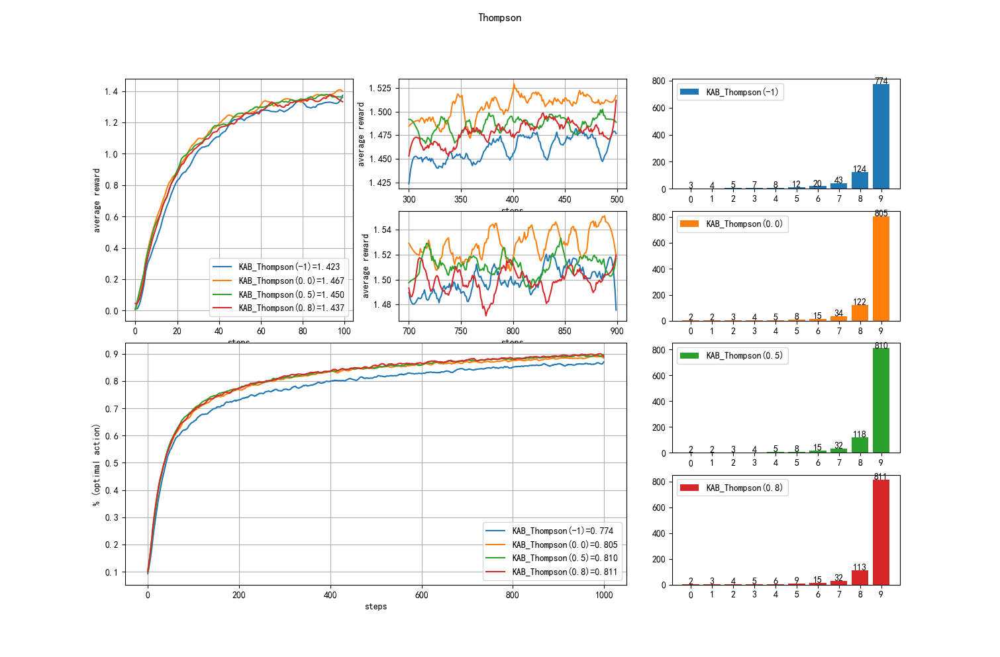
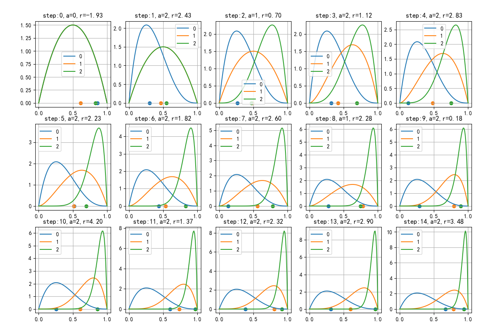

## 2.7 后验采样法

后验采样法，又叫做汤普森采样（Thompson Sampling），因为其认为赌博机的每个臂的收益有一个先验的伯努利分布，其后验分布为 Beta 分布，然后我们可以在 Beta 分布上采样，所以叫做后验采样。

### 2.7.1 伯努利分布与二项分布

在日常生活和工程实践中，我们会经常遇到非此即彼的情景，比如：
- 一个集体活动，参加还是居家；
- 一个项目上线后，成功还是失败；
- 自己做了一个菜，好吃还是不好吃；
- 给用户展示的广告，用户点击还是忽略；
- 一个乒乓球运动员，在比赛中是输了还是赢了；
......

如果把对自己有利的结果叫做 win，不利的结果叫做 loss，只有两种结果，这就是一个伯努利分布。可以定义成功率为：

$$
P(x=1)=\frac{win}{win+loss}=\frac{\alpha}{\alpha+\beta} \tag{2.7.1}
$$

而失败率为：$P(x=0)=\frac{loss}{win+loss}=\frac{\beta}{\alpha+\beta}=1-P(x=1)$，$x$ 代表一次事件。

如果上述事件发生了很多次，每次都会得到 win 或 loss 的结果，就叫做二项分布。

### 2.7.2 Beta 分布

当式（2.7.1）所描述的事件发生很多次以后，可以用于预测未来的结果。但是为了提供决策依据，我们通常会给出一个成功或失败的概率，而不是简单地说会成功或者会失败，那么这个概率会形成一种分布，就是 Beta 分布。Beta 分布是二项分布的共轭先验分布。


$$
f(x)=\frac{x^{\alpha-1}(1-x)^{\beta-1}}{B(\alpha,\beta)} \tag{2.7.2}
$$

$B(\alpha,\beta)=\frac{\Gamma(\alpha)\Gamma(\beta)}{\Gamma(\alpha+\beta)}$，而 $\Gamma$ 为伽马函数。

图 2.7.1 是不同参数 $(\alpha,\beta)$ 组合的 Beta 概率密度函数的示意图。

【代码位置】bandit_27_BetaDist.py

<center>


图 2.7.1 Beta分布
</center>

- 红色线：$\alpha=1,\beta=1$

    当成功和失败的次数都各只有 1 次时，无法给出一个有倾向性预判，所以是一条直线。

- 紫色线：$\alpha=10,\beta=10$

    成功和失败的次数都有 10 次，预判为一个正态分布，成功和失败的概率相同。

- 蓝色线：$\alpha=50,\beta=50$

    成功和失败的次数都有 50 次，仍预判为一个正态分布，成功和失败的概率相同，但是它的方差比橙色线的要小很多，峰值突出，范围缩小。

- 橙色线：$\alpha=10,\beta=50$

    成功 10 次，失败 50 次，整个分布会向左（成功概率较低的方向）移动。在此分布下进行 10 次采样（橙色的点），都处于该曲线的主要分布范围内。其峰值位于 10/(10+50)=0.17 附近。

- 绿色线：$\alpha=105.3,\beta=32.5$

    $\alpha,\beta$ 参数也也可以是浮点数，由于代表成功的 105.3 比 代表失败的 32.5 大很多，整个分布会向右（成功概率较高的方向）移动。在此分布下进行 10 次采样（绿色的点），都处于该曲线的主要分布范围内。其峰值位于 105.3/(105.3+32.5)=0.76 附近。

### 2.7.3 汤普森采样法（Thompson Sampling）

上面的理论知识给了我们一些启示：假设图 2.7.1 中的红色、绿色、蓝色代表三个动作的话，我们只需要从三个分布中获得一个采样，然后比较它们的采样值，谁更大（更接近右侧的 1）就采用谁。

这样做面临的一个问题是：如何判断什么是成功什么是失败呢？

在选择动作后，唯一能够得到的反馈就是收益值，我们只能根据收益值的大小来确定成功与失败。方法可以是：

- 与当前时刻所有收益的均值做比较，大于均值认为是成功；
- 与心目中的一个期望值做比较，该值可以是 0, 0.5, 1, 1.5 等等，但不可能太大而超出了赌博机能给出收益的一般范围，太小的话又会起不到作用。

还有一种方法是与当前时刻执行某个动作的所有收益的均值做比较，大于均值认为是成功。这种方法的效果很糟糕，读者可以自行试验。

在 $\alpha,\beta$ 的计数方法上，也可以有两种方法：
- 使用动作计数（正整数），成功时 win += 1，失败时 loss += 1；
- 使用收益值计数（浮点数），成功时 win += abs(reward)，失败时 loss += abs(reward)。

我们首先确认一下计数方法，经过多次试验验证，使用收益方式比动作计数更有效，因为 reward 数值更能反映出“成功与失败”的关系来：
- 如果用动作计数，每次增加一个固定值 1；
- 如果用收益值计数，reward=1.2 就会比 reward=0.8 要好一些，可以更细粒度地表现“成功的程度”。

读者可以自行测试。

### 2.7.4 算法实现

#### 算法描述

理论比较复杂，但是实现比较简单。


【算法 2.7.1】

---
初始化：$m$，当 $m=-1$ 时，与整体均值比较；$m\ge0$ 时是指定的比较值
$r \leftarrow 0$，循环 2000 次：
　　初始化奖励分布和计数器，动作集 $A$ 的价值 $Q(A)=0$
　　设置初始Beta分布参数 $\alpha[A] \leftarrow 1, \beta[A] \leftarrow 1$
　　整体均值 $\bar{R} \leftarrow 0$
　　$t \leftarrow 0$，迭代 1000 步：
　　　　概率 $p[A] \leftarrow$ 所有动作的 $Beta(\alpha,\beta)$ 采样
　　　　选择最大值的动作：$a=\argmax_{a \in A} p[a]$
　　　　执行 $a$ 得到奖励 $r$
　　　　$N(a) \leftarrow N(a)+1$
　　　　$\bar{R} \leftarrow \bar{R}+(r-\bar{R})/t$
　　　　在 $a$ 上更新参数 $\alpha,\beta$
　　　　　　win = False
　　　　　　$m=-1$ 时，$r > \bar{R}$, win = True
　　　　　　$m\ge0$ 时，$r > m$, win = True
　　　　　　if win == True，则 $\alpha \leftarrow \alpha + |r|$，否则 $\beta \leftarrow \beta + |r|$
　　　　$t \leftarrow t+1$
　　$r \leftarrow r+1$

---

#### 初始化

【代码位置】bandit_27_Thompson.py

```python
    def reset(self):
        super().reset()
        self.total_average = 0
        self.alpha = np.ones(self.k_arms)   # 初始化为 1
        self.beta = np.ones(self.k_arms)    # 初始化为 1
```

把 $\alpha,\beta$ 两个数值都初始化为 1，是为了避免最开始时计算 B 函数失败，因为要求两个参数都要大于 0。


#### 动作选择

```python
    def select_action(self):
        p_beta = np.random.beta(self.alhpa, self.beta)    # 从Beta分布中采样
        action = np.argmax(p_beta)  # 取最大值动作
        return action
```

从 10 个动作的 Beta 分布中采样，获得 10 个概率值，从中选择最大者。

#### 更新价值函数

```python
    def update_Q(self, action, reward):
        super().update_Q(action, reward)
        # 更新整体均值
        self.total_average += (reward - self.total_average) / self.steps

        is_win = False        
        if (self.method == -1): # 与整体均值比较
            if (reward >= self.total_average):
                is_win = True
        else:   # 与输入的期望值比较
            if (reward >= self.method):
                is_win = True
        # 用reward计数
        if is_win:
            self.alpha[action] += abs(reward)
        else:
            self.beta[action] += abs(reward)

```

其实这一部分没有必要更新价值函数，只需要更新 $\alpha,\beta$，用收益值 reward 的绝对值作为更新值。

#### 运行结果

<center>


图 2.7.2 Beta分布
</center>

### 2.7.5 深入理解

下面我们仍然在上面的算法代码基础上注入一些辅助代码，来帮助读者理解算法运行过程。

在图 2.7.3 中，15 副子图展示了三个动作前 15 步的算法过程。其中，蓝色为动作 0，橙色为动作 1，绿色为动作 2，它们依次从坏到好。

【代码位置】bandit_27_thompson_test.py

<center>


图 2.7.3 三个动作的前 15 步的运行结果
</center>

- step 0

    最开始时三个动作的 $\alpha,\beta$ 初始值相同，所以三条曲线重合了，只能看到绿色曲线。对三个分布分布采样，得到蓝、橙、绿三个点，由于具有随机性，蓝色点的概率最大（最靠近 1），所以采用了动作 a=0，得到 r=-1.93。

- step 1

    step 0 的收益并不好，于是动作 0 的 $\beta = \beta + 1.93$，其它两个动作不变，形成子图 2，蓝色曲线向左偏移了。再次采用，蓝色点显然就比其它两个点靠近 0，这次选择绿色点代表的 2 号动作，得到 r=2.43，相当给力。

- step 2

    由于上一轮 2 号动作的出色表现，绿色曲线向右偏移了。再次采用，橙色点稍微大一点，于是选择了 1 号动作。

    ......

后面的过程就不赘述了，读者可以结合下面的打印输出的具体数值自行理解。

```
step:0  win:loss=[2. 2. 2.]:[2. 2. 2.]  beta=[0.86 0.61 0.83]   a=0     r=-1.93
step:1  win:loss=[2. 2. 2.]:[3. 2. 2.]  beta=[0.34 0.47 0.54]   a=2     r=2.43
step:2  win:loss=[2. 2. 3.]:[3. 2. 2.]  beta=[0.32 0.48 0.37]   a=1     r=0.7
step:3  win:loss=[2. 3. 3.]:[3. 2. 2.]  beta=[0.4  0.44 0.58]   a=2     r=1.12
step:4  win:loss=[2. 3. 4.]:[3. 2. 2.]  beta=[0.15 0.53 0.67]   a=2     r=2.83
step:5  win:loss=[2. 3. 5.]:[3. 2. 2.]  beta=[0.59 0.53 0.55]   a=0     r=-0.53
step:6  win:loss=[2. 3. 5.]:[4. 2. 2.]  beta=[0.43 0.56 0.69]   a=2     r=1.82
step:7  win:loss=[2. 3. 6.]:[4. 2. 2.]  beta=[0.13 0.59 0.61]   a=2     r=2.6
step:8  win:loss=[2. 3. 7.]:[4. 2. 2.]  beta=[0.27 0.8  0.48]   a=1     r=2.28
step:9  win:loss=[2. 4. 7.]:[4. 2. 2.]  beta=[0.28 0.75 0.75]   a=1     r=-1.81
step:10 win:loss=[2. 4. 7.]:[4. 3. 2.]  beta=[0.25 0.49 0.77]   a=2     r=4.2
step:11 win:loss=[2. 4. 8.]:[4. 3. 2.]  beta=[0.59 0.58 0.92]   a=2     r=1.37
step:12 win:loss=[2. 4. 9.]:[4. 3. 2.]  beta=[0.38 0.7  0.8 ]   a=2     r=2.32
step:13 win:loss=[2. 4. 10.]:[4. 3. 2.] beta=[0.31 0.43 0.93]   a=2     r=2.9
step:14 win:loss=[2. 4. 11.]:[4. 3. 2.] beta=[0.66 0.63 0.84]   a=2     r=3.48
step:15 win:loss=[2. 4. 12.]:[4. 3. 2.] beta=[0.24 0.32 0.85]   a=2     r=1.82
step:16 win:loss=[2. 4. 13.]:[4. 3. 2.] beta=[0.07 0.87 0.9 ]   a=2     r=2.2
step:17 win:loss=[2. 4. 14.]:[4. 3. 2.] beta=[0.08 0.69 0.88]   a=2     r=3.25
step:18 win:loss=[2. 4. 15.]:[4. 3. 2.] beta=[0.32 0.31 0.95]   a=2     r=1.77
step:19 win:loss=[2. 4. 16.]:[4. 3. 2.] beta=[0.25 0.63 0.88]   a=2     r=1.74
```
