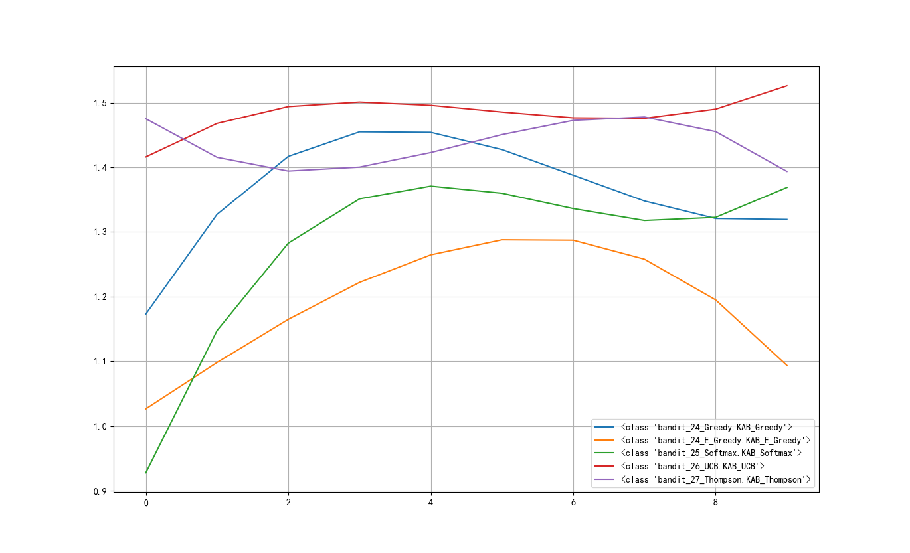
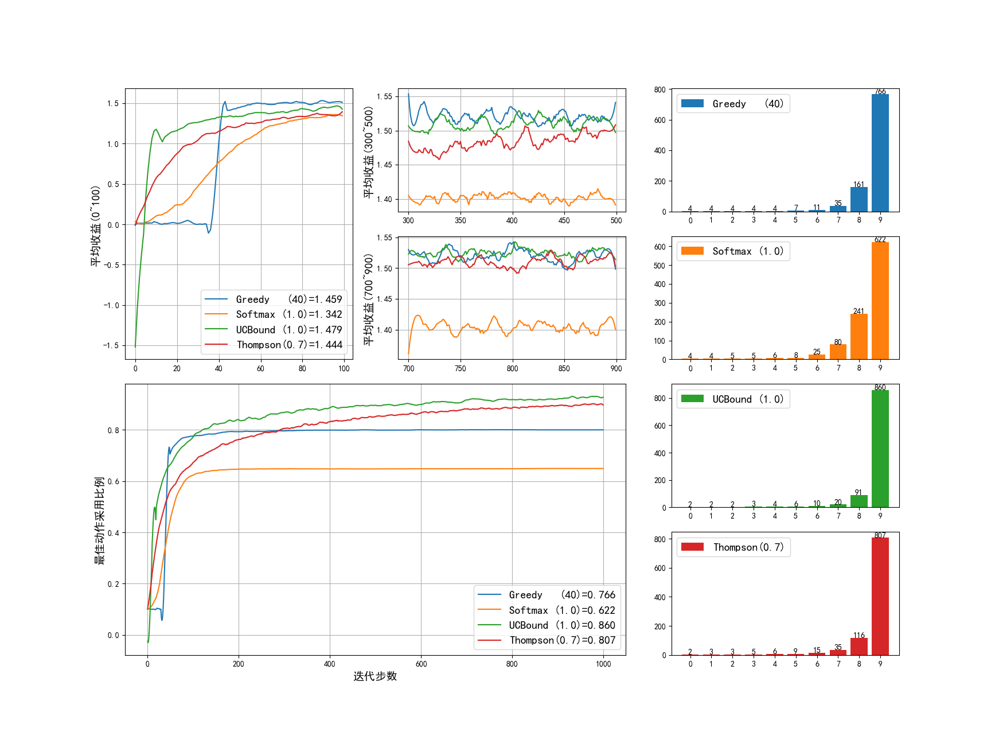
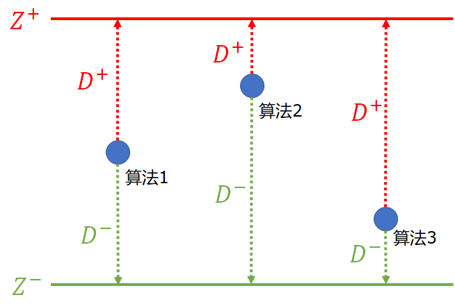

## 2.8 算法性能比较

### 2.8.1 根据平均收益值比较

在前面的几个小节中，一共介绍了 4 种算法：

- 贪心法
- 梯度上升法
- 置信上界法
- 后验采样法

读者肯定会问：这些算法中哪一种最好呢？这要看问题的设置和参数选择。一种最简单的比较方式，就是在指定的有限迭代步数内，谁的平均收益最高，谁就最好。

【代码位置】bandit_28_Compare.py

```python
if __name__ == "__main__":
    runs = 200
    steps = 1000
    k_arms = 10
    # 算法类名称
    algo_names = [KAB_Greedy, KAB_E_Greedy, KAB_Softmax, KAB_UCB, KAB_Thompson]
    algo_params = { # 算法参数
        KAB_Greedy: [10, 20, 30, 40, 50, 60, 70, 80, 90, 100],
        KAB_E_Greedy: [0.01, 0.02, 0.03, 0.04, 0.05, 0.08, 0.10, 0.15, 0.20, 0.25],
        KAB_Softmax: [0.1, 0.2, 0.3, 0.4, 0.5, 0.6, 0.7, 0.8, 0.9, 1.0],
        KAB_UCB: [0.2, 0.3, 0.4, 0.5, 0.6, 0.7, 0.8, 0.9, 1.0, 1.2],
        KAB_Thompson: [0, 0.1, 0.2, 0.3, 0.4, 0.5, 0.6, 0.7, 0.8, 0.9]
    }
```

每个算法给出 10 个不同参数（由小到大排序），运行 200 轮 x 1000 步后，获得总体的平均收益值，然后把 10 个值用一条平滑曲线连接起来（拟合），形成一个趋势图。如图 2.8.1 所示。

<center>


图 2.8.1 五种算法的平均收益比较
</center>

可以看到：

- 红色曲线，UCB 算法似乎最好，每个参数上的收益值都普遍高于其它几个算法。
- 橙色曲线，$\epsilon$-贪心算法最差，它的第 5 个或第 6 个参数最好，也就是 $\epsilon$ 为 0.1 左右时。
- 蓝色曲线，普通的贪心算法虽然简单，但是针对这个问题还是比较有效的。
- 紫色曲线，后验采样法大概处于第二位。
- 绿色曲线，只比 $\epsilon$-贪心算法好一点儿。如果采用 Sutton 的算法，读者可以自己进行比较。

### 2.8.2 根据综合指标比较

#### 可视化比较

其中贪心法包括两种，从上面的比较中，我们已经得知 $\epsilon$-贪心算法最差，所以去掉它以后，我们再进行一次多指标比较。

【代码位置】bandit_28_Segment.py

```python
    bandits.append(KAB_Greedy(k_arms, 40))
    bandits.append(KAB_Softmax(k_arms, 1.0))
    bandits.append(KAB_UCB(k_arms, 1.0))
    bandits.append(KAB_Thompson(k_arms, 0.7))
```

<center>


图 2.8.2 四种算法的多指标比较
</center>

从各方面看，梯度上升（Softmax）法远远落后于其它三种算法，其原因有二：

1. 在 0-100 步内，迟迟没有确定最佳动作，试探次数太多（见图 2.8.2 左上角子图）；
2. 在后续的步骤内，虽然 9 号动作概率较大，但是 6,7,8 三个动作还是分走了不少流量，造成对 9 号动作的利用率不够（见图 2.8.2 右侧橙色柱图）。

综合指标比较：

- 探索效率

    比较 0-100 步内的平均收益，即“探索效率”。蓝色的贪心算法最好，绿色的 UCB 置信上界法其次，很快地就达到很高的位置。

- 收敛效率

    比较 300-500 步内的平均收益，即“收敛效率”。蓝、绿、橙三色的算法都已经收敛了，只有红色的后验采样法还处于上升阶段。

- 利用能力

    比较 700-900 步内的平均收益，即“利用能力”。这一部分中，只要曲线不出现很大的抖动就可以。蓝、绿两线都可以保持高位运行。

- 稳定性

    比较 0-1000 步内最佳动作的利用率，这也直接决定了收益均值。绿色和红色曲线最好。从这一部分看，如果迭代次数不是 1000 次而是 2000 次，那么红色线所代表的后验采样法的平均收益将会高于贪心法。

- 探索利用比例

    比较 10 个动作的选择次数。第 9 个动作的数值越高越好，绿色和红色最好，橙色最差。

#### 量化比较

我们可以采样优劣距离法（TOPSIS - Technique for Order Preference by Similarity to Ideal Solution），通过比较算法的各个子部分的数值，来得到综合排名。

【代码位置】bandit_28_TOPSIS.py

这个方法的步骤是：

1. 设计并提取特征值

针对赌博机问题的特点，我们一共设计了 8 个特征值，如表 2.8.1 所示。

表 2.8.1 原始特征值

|算法|0-100步<br>平均收益|300-500步<br>平均收益|500-900步<br>平均收益|1000步<br>平均收益|0-100步<br>平均收益|300-500步<br>平均收益|500-900步<br>平均收益|1000步<br>平均收益|
|-|-|-|-|-|-|-|-|-|
|贪心法|   0.867|1.485|1.483|1.421|0.460|0.766|0.775|0.737|
|梯度上升法|0.817|1.383|1.382|1.328|0.365|0.6|0.6|0.576|
|置信上界法|1.185|1.491|1.503|1.460|0.565|0.857|0.903|0.838|
|后验采样法|1.080|1.512|1.532|1.468|0.514|0.862|0.912|0.836|

2. 特征值归一化：把要比较的数值按列进行归一化。

$$y=\frac{x-x_{min}}{x_{max}-x_{min}} \tag{2.8.1}$$

比如在表 2.8.1 中，0-100步平均收益这一列，使用式（2.8.1）计算，$\frac{0.867-0.817}{1.185-0.817}=0.137$。这一整列变成了下面的 [0.137, 0, 1, 0.714]，其中，最小的值变成 0，最大的值变成 1。

```
[[0.137 0.791 0.674 0.664 0.476 0.634 0.562 0.615]
 [0.    0.    0.    0.    0.    0.    0.    0.   ]
 [1.    0.839 0.807 0.94  1.    0.979 0.97  1.   ]
 [0.714 1.    1.    1.    0.745 1.    1.    0.995]]
```

3. 计算加权规范矩阵

每一列的数值的平方和再开根号做分母，每一列的每个数值做分子：

$$
z_{ij} = \frac{y_{ij}}{\sqrt{\sum_{i=1}^n y^2_{ij}}} \tag{2.8.2}
$$

比如，在上面的输出中的第一列数值，$\frac{0.137}{\sqrt{0.137^2+0^2+1^2+0.714^2}}=0.111$。

得到如下结果：

```
[[0.111 0.518 0.464 0.436 0.357 0.413 0.374 0.399]
 [0.    0.    0.    0.    0.    0.    0.    0.   ]
 [0.809 0.550 0.556 0.617 0.749 0.637 0.646 0.650]
 [0.578 0.655 0.689 0.656 0.558 0.651 0.666 0.647]]
``` 

4. 确定最优（上界）和最劣（下界）向量

取八个特征值（列）中的最大值和最小值，组成最优向量和最劣向量：

$$
Z^+=[\max(z_{11},\cdots,z_{n1}),\cdots,\max(z_{1m},\cdots,z_{nm})]=[Z_1^+,\cdots,Z_m^+]
\\
Z^-=[\min(z_{11},\cdots,z_{n1}),\cdots,\min(z_{1m},\cdots,z_{nm})]=[Z_1^-,\cdots,Z_m^-]
\tag{2.8.3}
$$

```
Z_max = [0.809 0.655 0.689 0.656 0.749 0.651 0.666 0.650]
Z_min = [0. 0. 0. 0. 0. 0. 0. 0.]
```

5. 计算样本到上下界的距离

$$
D_i^+=\sqrt{\sum_{j=1}^m (Z_j^+ - z_{ij})^2}
\\
D_i^-=\sqrt{\sum_{j=1}^m (Z_j^- - z_{ij})^2}
\tag{2.8.4}
$$

```
d_plus.shape= (4,)
[0.981 1.959 0.176 0.300]
d_minus.shape= (4,)
[1.133 0.000 1.858 1.807]
```

6. 计算总距离值

$$
D_i = \frac{D_i^-}{D_i^- + D_i^+} \tag{2.8.5}
$$

比如上面的输出中，$\frac{1.133}{1.133+0.981}=0.536$，得到下面的输出：

```
D = [0.536 0.000 0.913 0.858]
```

<center>


图 2.8.3 TOPSIS 算法中计算总距离的含义
</center>

图 2.8.3 中所示，距离 $Z^-$ 越近的话（即 $D_i^-$ 值越小），$D_i$ 值就越小。


7. 排序并得到最优方法

$$
best = \argmax(D_i) \tag{2.8.6}
$$

```
序号：[2, 3, 0, 1]
0 = KAB_UCB
1 = KAB_Thompson
2 = KAB_Greedy
3 = KAB_Softmax
```

最后可知，UCB 置信上界算法最好，Thompson 后验采样算法其次，Greedy 贪心法第三，Softmax 梯度上升法最差。这与图 2.8.1 所示的结果相同。
