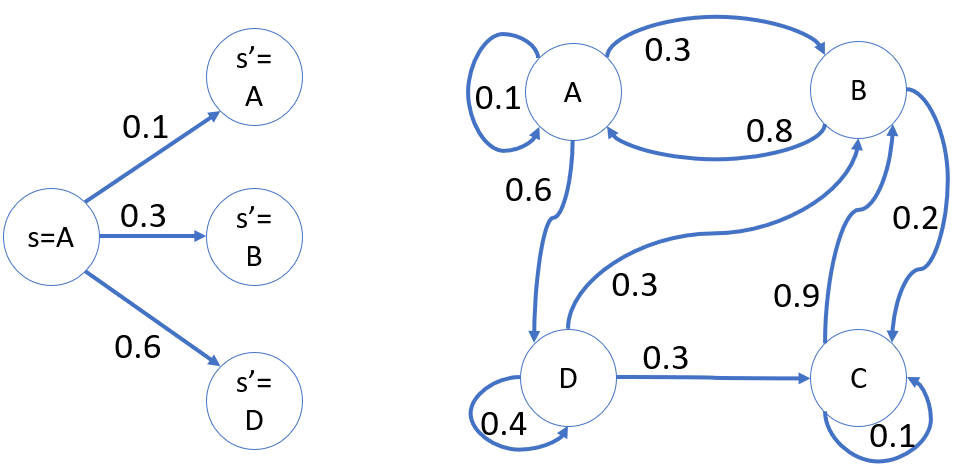

## 3.2 转移概率

### 3.2.1 找出隐藏的规律

转移概率是马尔可夫链中的重要概念，我们后面再讲马尔科夫链，所以本节先把转移概率的问题搞清楚。

在本问题中：

- 有 4 个门店，我们称之为 4 个状态：$[A, B, C, D]$。
- 对于 B 店的某辆车来说，它第二天早晨出现在哪个门店就有 4 种可能，叫做转移概率。

如何根据历史数据计算出转移概率呢？

1. 首先，我们要假设 3.1 节中的数据是准确的，因为是从 100 辆不同的车长达 100 天的运营情况统计得到的，所以具有代表性。

2. 其次，假设有一种隐藏的规律，从第一天到第二天是按照它运行的，那么从第二天到第三天也应该是按照同样的规律运行的，所以只需要统计相隔一天的变化即可。

幸运的是在 3.1.2 节中，我们把统计间隔 $t$ 也作为参数传到了统计函数中，所以可以很方便地得到“天数=1”的数据：

```
天数 = 1
从 B 店出租 3013 次，还到 A 店 2412 次
从 B 店出租 3013 次，还到 B 店 0 次
从 B 店出租 3013 次，还到 C 店 601 次
从 B 店出租 3013 次，还到 D 店 0 次
```

奇怪的现象出现了，在 4 组数据中，居然第二组和第四组的返还车辆为 0，即，没有从 B 店返回到 B,D 两店的车。

不要慌！代码没有错！数据也没有错！因为上述数据中 2412 + 601 = 3013，租出总数等于返回总数，说明没有错误。我们就可以放心地获得一个规律：

$$
从B店租出后=
\begin{cases}
\frac{还到A店次数}{从B店租出次数}=\frac{2412}{3013} \approx 0.8 & \to P(A|B)
\\
\frac{还到B店次数}{从B店租出次数}=\frac{0}{3013} = 0 & \to P(B|B)
\\
\frac{还到C店次数}{从B店租出次数}=\frac{601}{3013} \approx 0.2 & \to P(C|B)
\\
\frac{还到D店次数}{从B店租出次数}=\frac{0}{3013} = 0 & \to P(D|B)
\end{cases}
\tag{3.2.1}
$$

式（3.2.1）中的每一项，其实就是条件概率：

$$
P(X|Y)=\frac{P(X,Y)}{P(Y)} \tag{3.2.2}
$$

因为在式（3.2.1）中，我们省略了一个条件，就是样本总数为 $N(S)=100\times100=10000$，所以，以 B 店租出 A 店返回为例，完整的条件概率公式应该这样写：

$$
P(A|B) = \frac{P(AB)}{P(B)} =\frac{N(AB)}{N(S)}/\frac{N(B)}{N(S)}=\frac{N(AB)}{N(B)}=\frac{2412}{3013} \approx 0.8
$$

有了上面的思路，我们只需要做一个双重（4x4）循环，就可以得到四个门店之间的所有数据。

【代码位置：RentCar_2_OneByOne.py】

```Python
if __name__ == "__main__":
    # 读取文件
    data_array = carData.read_data()
    for rent_from in car_1.RentalStore:
        print(str.format("从 {0} 店租出：", rent_from.name))
        for return_to in car_1.RentalStore:
            num_from, num_to = car_1.Statistic(data_array, rent_from, return_to, t=1)
            print(str.format(
                "还到 {0} 店：租出次数={1}, \t归还次数={2}, \tP({4}|{5})={3}", 
                return_to.name, num_from, num_to, num_to/num_from, return_to.name, rent_from.name))
```

运行上述代码，输出如下：

```
从 A 店租出：
还到 A 店：租出次数=2677,       归还次数=267,   P(A|A)=0.09973851326111319
还到 B 店：租出次数=2677,       归还次数=813,   P(B|A)=0.3036981695928278
还到 C 店：租出次数=2677,       归还次数=0,     P(C|A)=0.0
还到 D 店：租出次数=2677,       归还次数=1597,  P(D|A)=0.596563317146059
从 B 店租出：
还到 A 店：租出次数=3013,       归还次数=2412,  P(A|B)=0.8005310321938267
还到 B 店：租出次数=3013,       归还次数=0,     P(B|B)=0.0
还到 C 店：租出次数=3013,       归还次数=601,   P(C|B)=0.19946896780617324
还到 D 店：租出次数=3013,       归还次数=0,     P(D|B)=0.0
从 C 店租出：
还到 A 店：租出次数=1555,       归还次数=0,     P(A|C)=0.0
还到 B 店：租出次数=1555,       归还次数=1385,  P(B|C)=0.8906752411575563
还到 C 店：租出次数=1555,       归还次数=170,   P(C|C)=0.10932475884244373
还到 D 店：租出次数=1555,       归还次数=0,     P(D|C)=0.0
从 D 店租出：
还到 A 店：租出次数=2655,       归还次数=0,     P(A|D)=0.0
还到 B 店：租出次数=2655,       归还次数=811,   P(B|D)=0.3054613935969868
还到 C 店：租出次数=2655,       归还次数=780,   P(C|D)=0.2937853107344633
还到 D 店：租出次数=2655,       归还次数=1064,  P(D|D)=0.4007532956685499
```

这样就得到了所有的转移概率，以 A 店为例：

- 从 A 店租车后（保留小数点后面一位）：
    - 还到 A 店的概率是0.1
    - 还到 B 店的概率是0.3
    - 还到 C 店的概率是0.0
    - 还到 D 店的概率是0.6

把上述数据绘制在图 3.2.1 中，避免赘述。

<center>


图 3.2.1 状态转移概率图
（左侧：以A店为起点的转移概率；右侧：所有门店的交叉转移概率）
</center>

图 3.2.1 中的左图展示了从 A 店租车，到 A,B,D 店还车的情况，其中，$s=A$ 表示当天早晨租车，而 $s'=A$ 表示晚上还车（或者是第二天该车在哪里出现）；右图展示了综合情况。

### 3.2.2 解决经理的问题

重复一下需求：公司经理想知道如果有一天（命名为第 0 天）这辆车从 B 号店出租了，2 天后的早晨最有可能在哪个店出现？5 天后又会如何？

一般情况下，读者会根据图 3.2.1 从 B 店出发，再根据概率顺藤摸瓜地计算出第 1 天的情况，再计算出第 2 天的情况。

- 第 1 天早晨出现在各门店的概率是：$[0.8,\ 0.0,\ 0.2,\ 0.0]$。
- 第 2 天早晨出现在各门店的概率是......有点儿复杂，我们绘制出图 3.2.2 来帮助整理思路。

<center>


图 3.2.2 第一天和第二天的出现概率
</center>

从图 3.2.2 一眼就可以看出来，第 2 天早晨该车出现在各门店的概率就是两个连续的概率之乘积，比如：
- 第 1 天
    - 出现在 A 店（橙色）的概率是 0.8；
    - 出现在 C 店（红色）的概率是 0.2；
    - 但是不可能出现在 B,D 店；
    
- 第 2 天
    - 由于 A 店有0.3的概率还到B店，所以出现在 B 店的概率是 $0.8 \times 0.3=0.24$；
    - 由于 C 店有0.9的概率还到B店，所以出现在 B 店的概率是 $0.2 \times 0.9=0.18$；

    有趣的是，第 1 天虽然不能出现在 B 店，但是第 2 天可以。

所以，该车第 2 天早晨出现在 B 店的概率是 $0.24+0.18=0.42$。出现在其它店的数字也可以同理得到。

我们再把图 3.2.2 的所有情况列在表 3.2.1 中，便于统计，数字的颜色和图 3.2.2 是一一对应的，表示是哪个门店，方便读者对照理解。

表 3.2.1 第一天和第二天的概率计算统计表

|从$\rightarrow$到|A店|B店|C店|D店|第1天|
|:-:|-|-|-|-|-|
|**A店**|$\color{orange}{0.8\times0.1=0.08}$|$\color{orange}{0.8\times0.3=0.24}$|$\color{orange}{0.8\times0.0=0.00}$|$\color{orange}{0.8\times0.6=0.48}$|$\color{orange}{0.8}$|
|**B店**|$\color{green}{0.0\times0.8=0.0}$|$\color{green}{0.0\times0.0=0.0}$|$\color{green}{0.0\times0.2=0.0}$|$\color{green}{0.0\times0.0=0.0}$|$\color{green}{0.0}$|
|**C店**|$\color{red}{0.2\times0.0=0.00}$|$\color{red}{0.2\times0.9=0.18}$|$\color{red}{0.2\times0.1=0.02}$|$\color{red}{0.2\times0.0=0.00}$|$\color{red}{0.2}$|
|**D店**|$\color{blue}{0.0\times0.0=0.0}$|$\color{blue}{0.0\times0.3=0.0}$|$\color{blue}{0.0\times0.3=0.0}$|$\color{blue}{0.0\times0.4=0.0}$|$\color{blue}{0.0}$|
|**第2天**|$0.08$|$0.24+0.18=0.42$|$0.02$|$0.48$|$1.0$|

数据解读：

- 表 3.2.1 中间部分的 4x4 区域，和图 3.2.2 的数据是一致的。
- 最后一列是中间 4 列的和，所以正好是第 1 天该车的出现概率。
- 最后一行是中间 4 行的和，所以是第 2 天该车的出现概率。

OK! 2 天后的问题解决了，那么 5 天后呢？这么计算太麻烦了，接下来我们引入转移概率矩阵的概念来帮助解决问题。
