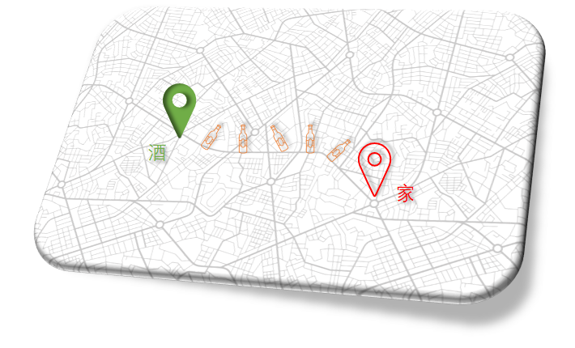
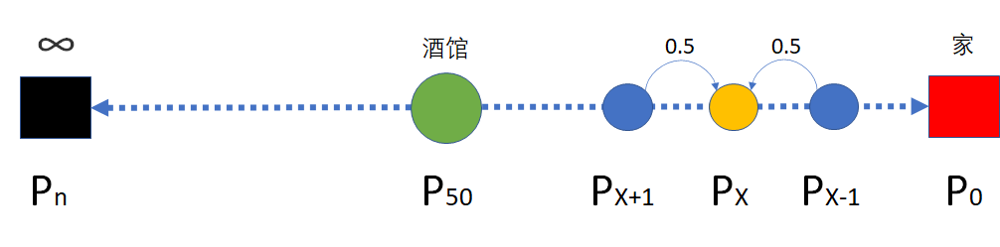
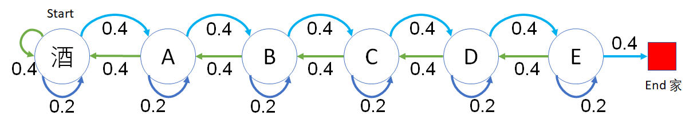

# 第 4 章 从单纯转移到过程形成

#### 温故知新

#### 内容摘要

#### 本章目录

- [4.1 醉汉回家问题](1-醉汉回家问题.md)
- [4.2 马尔可夫性质](2-马尔可夫性质.md) 	
- [4.3 马尔可夫过程](3-马尔可夫过程.md) 
- [4.4 理论分析与试验](4-理论分析与试验.md) 

## 4.1 醉汉回家问题

### 4.1.1 提出问题

有一个喜欢喝酒的大叔，下班后经常去酒馆喝酒，家也离酒馆比较近，就在一条街上，走 50 步就能到家。

<center>



图 4.1.1 醉汉回家问题
</center>

但是由于每次都喝醉了酒，酒家不分。在回家的路上步履蹒跚，像是一个东倒西歪的酒瓶子，每个时刻他可能向前走的概率是 0.4，向后走的概率是 0.4，在原地不动发呆的概率是 0.2。

请问，他从酒馆出发能走到家的概率是多少？

### 4.1.2 建立模型

在第 3 章中，我们已经学习了状态转移矩阵的知识，在此，我们试图给醉汉回家的过程用状态及转移概率绘制出来。

<center>


图 4.1.2 醉汉回家问题示意图
</center>

问题描述：

图 4.1.2 是个示意图，并没有画出 50 步来，只画了 6 步。

- 起点为圆形（酒），代表酒馆；
- 终点为红色方框，代表家；
- 中间有 ABCDE 五个节点；
- 每个节点都有向前、向后、原地不动三种选择，概率用数字表示；
- 从酒馆开始允许向相反方向走；
- 到家后就不会再出来。

图 4.1.2 的模型如何使用呢？我们以后再讲，本章的目的是让读者学会使用这种模型来分析问题。

### 4.1.3 代码模拟

从表面上看，醉汉会向前一步又向后一步，然后原地愣一下......，这样的话，他从酒馆出发，永远也回不到家，因为“平均值”就在酒馆附近。

不善于理论推导的话，可以发挥计算机的优势，写一段代码来模拟这个醉汉：

【代码位置：RandomWalker_1_Reverse.py】

```Python
# 从酒馆出发,允许向家的相反方向走
def RandomWalker(distance=50):
    position = 0    # 距离酒馆的位置，为50时表示到家
    counter = 0     # 行走的步数（包括原地不动）
    trajectory = [] # 行走的路径
    while(position < distance): # 判断是否到家
        # 随机选择向前(1)向后(-1)不动(0), 概率是[0.4,0.2,0.4]
        step = np.random.choice([-1,0,1], p=[0.4,0.2,0.4])
        position += step    # 更新位置
        counter += 1        # 更新步数
        trajectory.append(position) # 记录位置

    # 输出最后位置和步数，计算位置平均值
    print(str.format("步数 : {0}\t最远 : {1}\t平均步数 : {2}", counter, np.min(trajectory), np.mean(trajectory)))
 
if __name__ == "__main__":
    for i in range(10):     # 试验10次
        RandomWalker(50)
```

运行上述代码，可以得到 10 次试验结果如下：

```
步数 : 1404     最远 : -11      平均步数 : 13.004985754985755
步数 : 5854     最远 : -40      平均步数 : -4.8963102152374445
步数 : 8312     最远 : -84      平均步数 : -15.017204042348412
步数 : 7645     最远 : -70      平均步数 : -7.099542184434271
步数 : 5420     最远 : -36      平均步数 : 8.072878228782288
步数 : 1419     最远 : -4       平均步数 : 15.985200845665961
步数 : 22170    最远 : -114     平均步数 : -41.33098782138024
步数 : 1699     最远 : -13      平均步数 : 9.114184814596822
步数 : 128704   最远 : -276     平均步数 : -90.89893088015913
步数 : 1034     最远 : -1       平均步数 : 25.192456479690524
```

数据解读：

- 第一次试验结果，走了 1404 步，最远走到了反向 11 步的地方，历史路径的平均位置是 13。
- 第二次试验结果，走了 5854 步，最远走到了反向 40 步的地方，历史路径的平均位置是 -4.89。
  ......

这个结果说明了醉汉是一定可以到家的，但是步数和平均位置的方差很大。

读者在运行这个程序时，可能会得到不同的试验数据，这是正常的，因为随机过程不同。

## 4.2 马尔可夫性质（Markov property）

根据图 4.1.2，读者也许可以发现这个应用场景的一个特点，即：醉汉下一步要走到哪里，只与当前的位置有关，而与以前是如何到达当前位置的无关。

比如，醉汉在 C 点，他下一步可能走到 B,C,D 中的一点，至于从哪个状态到达的 C 点并不重要。这个特性，叫做马尔可夫形状。

对于汉语是母语的读者来说，通常中文比英文更能表现出哲理来，但是在这里，我们先记住一句很有哲理的英文：

*The future is independent of the past given the present.*

**将来**只取决于**现在**，与**过去**无关。

当一个随机过程在给定当前状态及所有过去状态情况下，其未来状态的条件概率分布仅依赖于当前状态；换句话说，在给定现在状态时，它与过去状态（即该过程的历史路径）是条件独立的，那么此随机过程即具有**马尔可夫性质**。

<center>


图 4.2.1 马尔可夫性质
</center>

马尔可夫性质是概率论中的一个概念，因为俄国数学家安德雷·马尔可夫（Andrey Markov, 1856-1922）得名。在大学期间，马尔可夫表现优异，师从了前面提到的俄国数学的重要奠基人契比雪夫，可以说是契比雪夫和他的弟子们的成就让俄国在数学世界中占有了一席之地。马尔可夫的主要工作集中在数论和概率论的研究方面，尤其是概率论方面，圣彼得堡学派对概率论这门学科贡献很大，马尔可夫在概率论领域成果颇多，从一开始对大数定理和中心极限定理的研究，逐渐发展到对随机变量的研究，终于提出了大名鼎鼎的马尔可夫链概率（在稍后讲解）模型。

用公式表示为：

$$
\mathbb P[S_{t+1}|S_t]=\mathbb P[S_{t+1}|S_1,S_2,...,S_t] \tag{4.2.1}
$$

翻译成普通话：给定当前状态 $S_t$ 时，下个状态 $S_{t+1}$ 的发生概率，等于给定以前所有状态下 $S_{t+1}$ 的发生概率。这实际上就是忽略了 $S_1, S_2, S_{t-1}$ 的存在。

与醉汉回家的例子相似，在前面的租车还车问题的例子中，一辆车出现在 B 门店，我们只关心那么它的下一个出现点在哪里，而不管它从哪个门店转移过来的。

从本节开始，我们把 A,B,C,D 这些门店、单元等等统称为状态，状态之间的过渡成为状态转移。状态转移的概率定义为：

$$
p_{ss'}=\mathbb P[S_{t+1}=s'|S_t=s] \tag{4.2.2}
$$

可以理解为当 $t$ 时刻的状态 $S_t$ 为 $s$ 时（$s$ 可以是上述具体问题中的 A,B,C,D 等），转移到下一个时刻 $t+1$ 时的状态 $S_{t+1}$ 是 $s'$ 的概率（$s'$ 同样可以是上述具体问题中的 A,B,C,D 等）。

举一个具体的例子，在醉汉回家问题中，如果 $s=C, s'=D$，则：

$$
p_{ss'}=p_{CD} =\mathbb P[S_{t+1}=D|S_t=C]=0.4
$$

同理有：

$$
p_{CC} =\mathbb P[S_{t+1}=C|S_t=C]=0.2
\\
\\
p_{CB} =\mathbb P[S_{t+1}=B|S_t=C]=0.4
$$

另外，在前面的租车还车问题中，我们已经学习过了转移概率矩阵，这同样可以应用到马尔可夫性质中的状态转移，所以改名为状态转移矩阵（State Transition Matrix），公式形式相同，如式（4.2.3）。

$$
\qquad \qquad \quad [to]
\\
P = [from]
\begin{pmatrix}
p_{11} & \cdots & p_{1n}
\\
\vdots & \ddots & \vdots
\\
p_{n1} & \cdots & p_{nn}
\end{pmatrix}
\tag{4.2.3}
$$

其中：$\sum_{j=1}^n p_{ij}=1, \ i=1,...,n$，即一行中所有的值相加为 1。

马尔可夫性质对于数学后续的发展起到了基石的作用，后续很多数学家在此基础上发展出了更多的扩散模型和随机过程模型。


## 4.3 马尔可夫过程

### 4.3.1 马尔可夫过程（Markov Process）

假设醉汉出了酒馆以后，行走到的每个节点（状态）都被记录下来，有可能是这样的一个状态序列：

$酒 \to A \to B \to B \to A \to B \to C \to D \to D \to C \cdots$

我们把这个序列，叫做过程。因为它具有**马尔可夫性质**，所以称之为**马尔可夫过程**。

它是一个无记忆的随机过程，由具有马尔可夫性质的随机状态序列构成。由于时间和状态的特性，又可以分成几种情况，列在表 4.3.1 中。

表 4.3.1 不同类型的马尔可夫过程

|              |     时间连续     |  时间离散  |
| ------------ | :--------------: | :--------: |
| **状态连续** |   马尔可夫过程   |     -      |
| **状态离散** | 连续的马尔科夫链 | 马尔可夫链 |

- 时间和状态都连续的，叫做**马尔可夫过程**（严格意义上的），比如：一个电子的随机运动。
- 时间和状态都不连续的，叫做**马尔可夫链**，比如：棋类游戏。在棋类比赛中，虽然时间在流动，但是它只存在于比赛者的思考过程中，盘面没有任何变化，除非比赛者移动或部署了棋子。
- 时间连续、状态离散的，叫做**连续时间的马尔科夫链**，比如：一个扫地机器人的工作过程，它在一段连续时间内一直处于“扫地”状态，在另外一段连续时间内处于“充电”状态。

举几个例子：

- 马尔可夫链蒙特卡罗
  将马尔科夫链与蒙特卡洛方法结合，把经典蒙特卡洛方法中统计独立的特性改造为马尔科夫性质的统计相关，在某些情况下对随机现象的建模效果更佳，这种方法在图像处理、信号处理、金融分析等领域有广泛应用。

- 隐马尔可夫模型
  是对马尔可夫模型的扩展，这种模型的思想核心是把马尔科夫的状态转移设定为未知的隐含量，通过可观测的状态转移过程来估计隐含的状态，然后再用隐含状态来预计未来的变化，利用这种方法发现很多实际问题能够得到有效的建模，典型的应用包括了语音识别、生物信息科学的DNA分析和故障诊断等领域。

- 马尔可夫随机场
  给随机场定义一种马尔可夫性质，即随机场中每个位置的属性定义是马尔可夫性的，简单理解就是随机场中每个位置的属性只与邻近的位置有关，与其他位置无关。这种方法被应用于图像分割取得较好效果。


由于具有马尔可夫性质，所以马尔可夫过程是一个无记忆的随机过程，由“状态-概率”二元组组成：$<S,P>$。

- $S$ 为有限的状态空间集，$s_t$ 表示时间步 $t$ 的状态，其中$S=\{s_1,s_2,...s_n\}$，是一个状态的集合。
- $P$ 为状态转移矩阵，$P_{ss'}=\mathbb P[S_{t+1}=s'| S_t=s]$。
- 输出为 $[S_0, S_1,\cdots,S_t,\cdots]$，是一个按时间排序的状态序列，对应到实际的状态值上可能是多种，比如：
  - $[s_1,s_2,s_1,s_2,s_3,\cdots]$
  - $[s_2,s_3,s_4,s_4,s_1,\cdots]$
  - ......

大写的 $S_t$ 是一个变量，只表示在时间 $t$ 的状态；小写的 $s_n$ 是一个实例，表示一个真实的状态。比如，在下面这个醉汉行走的过程中：

$酒 \to A \to B \to B \to A \to B \to C \to D \to D \to C \cdots$

状态集合$S=\{酒,A,B,C,D,E,家\}$，$S_t$ 按时间顺序是：$S_0=s_酒,S_1=s_A,S_2=s_B,S_3=s_B,S_4=s_A,S_5=s_B,S_6=s_C,S_7=s_D,S_8=s_D,S_9=s_C,\cdots$。

### 4.3.2 马尔科夫链（Markov Chain）

 马尔科夫链（MC, Markov Chain）是一种最简单的马尔可夫过程，专指离散数据集的马尔可夫过程。经典的马尔可夫链主要是研究当前状态和未来状态之间的转移概率，并可以计算出多次试验之后的每个状态的概率分布，从而将看起来毫无规律的一些随机现象变成了整体有序的状态变化。

上述的醉汉回家以及租车还车的过程，都是马尔可夫链的具体例子。

马尔可夫链极其扩展被广泛的应用：

- 如物理学和化学中，马尔可夫链和马尔可夫过程被用于对动力系统进行建模，形成了马尔可夫动力学（Markov dynamics）。
- 在排队论（queueingtheory）中，马尔可夫链是排队过程的基本模型。
- 在信号处理方面，马尔可夫链是一些序列数据压缩算法，例如 Ziv-Lempel 编码的数学模型。
- 在金融领域，马尔可夫链模型被用于预测企业产品的市场占有率。

有时候当一个问题的连续的时间和状态不容易分析的时候，可以把它近似为离散的时间和状态，转变成马尔可夫链来分析解决。

那么哪些问题可以用马尔可夫过程来分析呢？笔者根据自己的理解举例说明。读者也许有自己的理解，大家可以一起讨论。

#### 正例

- 象棋残局
  当前盘面上的棋力、位置、先后手，决定了后面的局势发展。换一句话说，一副残局摆在那里，任何人都可以继续下棋直至结束，输赢只与当前盘面（和棋手水平）有关，与开局阶段的过程以及哪个棋手形成的残局无关。

- 租车还车
  车辆归还的位置只与它昨天出租的位置相关，与前天的情况无关。其实其根本原因是由于顾客的情况是随机的，所以和车辆无关。

- 醉汉回家
  醉汉的位置只与他上一步的位置有关，与历史足迹无关。

- 冰面行走
  一个人在冰面上一步一步缓慢行走，有时候需要绕过一些看上去很危险薄冰，还有可能走到一半感觉危险觉得要返回出发点。

- 从袋中有回放地取球
  布口袋中放有很多不同颜色的球，从中任意取出一个球，记录颜色，放回到口袋中，摇匀，再取一次。

#### 反例

- 桥牌残局
  当前手中剩余的牌，不能让庄家决定后面如何继续打，必须依赖前面的叫牌和打牌顺序。换一句话说，打了一半的牌，别人是无法接手的，只能自己打完。

- 天气预报
  今天是晴天，明天是雨天或阴天，类似这种情况，不是严格的马尔可夫性质。因为对于气候来说，是一个长时间积累、酝酿、变化的过程。当然，也可以根据统计数据硬性计算出一个转移概率，但是可靠性很低。

- 股票价格
  股价的涨跌是没有概率可言的，它是一个金融市场的规律，与股票本身以及外部环境等都关系紧密。我们常看到某些文章中说：三天大阳线，叫做三羊开泰，后市看好。假设这个描述是对的，那么明天的涨跌要依赖前三天的状态，而不是前一天的状态，这和马尔可夫性质定义不符。

- 轨道冰车
  冬奥会上的比赛项目，一个人或者两个人坐在冰车里，沿着轨道滑行，比赛到达终点时谁用的时间短。冰车的轨道可以看作是一维的，冰车由于坡度下滑，位置不断向前移动，没有一点儿可能是向后或者滑出轨道。

- 从袋中没有回放地取球
  布口袋中放有很多不同颜色的球，从中任意取出一个球，记录颜色；从口袋中还剩下的球中再取一次，记录......则当前取出球的颜色和以前每一次取出球的颜色都有关，而不仅仅与上一次的结果相关。

### 4.3.3 马尔科夫链收敛

在本节的醉汉回家问题中，马尔科夫链是有终止状态的，或者是回到家，或者是走到郊外掉入河里或被野兽吃掉。这种情况叫做周期性的马尔可夫链。

在上节的租车问题中，没有终止状态，只要车不坏，就会在 4 个门店之间不断移动。一个有趣的现象是，当迭代了28次后就已经**收敛**到很小的误差了。可以认为在经过多次的 “租、还、租、还” 循环后，某辆车在四个门店的出现概率（精确到两位小数）固定为：$[0.27,\ 0.30,\ 0.16,\ 0.27]$。

这种情况就称为非周期性的**马尔科夫链收敛**。

马尔科夫链要能收敛，需要满足以下条件：

1. 可能的状态数有限。
2. 状态间的转移概率固定不变。
3. 能从任意状态经过 1 到 k 步转变到任意状态，即任意两个状态之间是连通的。
4. 不能是简单的循环，例如 $A \to B \to C \to A \to B \to C$。

细致平衡条件（Detailed-Balance Condition）：给定一个马尔可夫链，分布$\pi$和概率转移矩阵$P$，如果下面等式成立:

$$
\pi=\pi P \tag{4.3.1}
$$

则此马尔可夫链具有一个平稳分布（Stationary Distribution)，其中 $\pi$ 是最后的平稳分布矢量，比如租车问题中 $\pi=(0.27, \ 0.30, \ 0.16, \ 0.27)$，其和为 1，表示全概率，最终的平稳分布矩阵是 4 个相同的 $\pi$ 的堆叠 $[\pi,\pi,\pi,\pi]^T$。

有的读者可能想不通为什么会有平稳分布的情况出现，我们举一个更简单的例子来说明。

假设城市化进程中，农村人转移为城市人的概率为 0.3，城市人转移为农村人的概率为 0.1。那么从表面上来看，越来越多的农村人会转移到城市来，最后农村就没人了。

列出这个问题的转移状态矩阵和最后的平稳状态收敛矩阵在表 4.3.2 中。计算过程略去，在第 3 章学习过，只需要计算 $P^K$ 即可。

表 4.3.2 状态转移与平稳状态

| 初始状态 | 农村 | 城市 | $\to$  | 平稳状态 | 农村 | 城市 |
| :------: | :--: | :--: | :----: | :------: | :--: | :--: |
| **农村** | 0.7  | 0.3  | $\mid$ | **农村** | 0.25 | 0.75 |
| **城市** | 0.1  | 0.9  | $\mid$ | **城市** | 0.25 | 0.75 |

请读者注意，这里的平稳状态并不是说双方转移的概率发生了改变，而是对于初始人口分布来说，最终的效果是这样的。

假设最初农村有 10 万人口，城市有 2 万人口，用初始人口分布乘以平稳状态的转移概率，可以得到：

$$
(100000,20000)
\begin{pmatrix}
0.25 & 0.75
\\\\
0.25 & 0.75
\end{pmatrix}
=(30000,90000)
\tag{4.3.2}
$$

最终农村为 30000 人，城市为 90000 人。

如果按照初始的转移概率迭代（即每次都用人口分布乘以初始转移概率） 23 次的结果如表 4.3.3。

表 4.3.3 人口转移迭代过程

| 迭代次数 | 农村人口 | 城市人口 | $\mid$ | 迭代次数 | 农村人口 | 城市人口 |
| :------: | -------: | -------: | :----: | :------: | -------: | -------: |
|    0     |   100000 |    20000 | $\mid$ |    12    |    30152 |    89848 |
|    1     |    72000 |    48000 | $\mid$ |    13    |    30091 |    89909 |
|    2     |    55200 |    64800 | $\mid$ |    14    |    30055 |    89945 |
|   ...    |      ... |      ... | $\mid$ |   ...    |      ... |      ... |
|    9     |    30705 |    89295 | $\mid$ |    21    |    30002 |    20000 |
|    10    |    30423 |    89577 | $\mid$ |    22    |    30001 |    89999 |
|    11    |    30254 |    89746 | $\mid$ |    23    |    30000 |    90000 |

结果和式（4.3.2）一样。虽然越来越多的农村人移动到城市，但是并非绝对数量，而是有个比例的。比例虽然大，但是基数却越来越小（农村人逐渐变少），所以最后绝对数量会持平，即：$30000 \times 0.75 = 90000 \times 0.25 = 225000$，即每年有 22500 人从农村到城市，但是有相同的人数从城市到农村，双方保持平稳。

现在可以用人口流动问题的具体例子再解释一下式（4.3.1）的含义。在此问题中，$\pi=(\pi_1 \ \pi_2)$，对式（4.3.1）实例化则有：

$$
(\pi_1 \ \pi_2)=(\pi_1 \ \pi_2)
\begin{pmatrix}
0.7 & 0.3
\\\\
0.1 & 0.9
\end{pmatrix}
\tag{4.3.3}
$$

对式（4.3.3）列方程组求解：

$$
\begin{cases}
\pi_1 = 0.7\pi_1 + 0.1\pi_2
\\
\pi_2=0.3\pi_1+0.9\pi_2
\\
\pi_1+\pi_2=1
\end{cases}
$$

解得：$\pi_1=0.25, \pi_2=0.75$，与表 4.3.2 所示的矩阵迭代收敛值相同。


## 4.4 理论分析与试验

### 4.4.1 醉汉回家问题的理论解释

在 4.1.3 节中，通过代码模拟证明了醉汉确实可以回到家，而且概率为 100%。下面我们来一起看看醉汉为什么可以回家。

如图 4.4.1 所示：

- 为了简化问题，我们假设在任意位置都是左右随机游走，各有 0.5 的概率；
- 单边的随机游走没有确定解，所以，不妨在左侧增加一个无穷远状态（黑色）方框，表示醉汉陷入了无尽黑夜之中无法回家，所以回家的概率是 $P_n = 0$；
- 酒馆是绿色圆，距离最右侧的家有 50 步远，从这里可以到家的概率是 $P_{50}$，具体值待求；
- 处于红色方框的位置已经到家了，处于吸收状态（不再移动），所以到家的概率 $P_0=1$；
- 中间有示意性的 3 个位置（可以是任意三个相连的状态），$X+1,X,X-1$，从这三个位置到家的概率分别是 $P_{X+1},P_{X},P_{X-1}$。

<center>



图 4.4.1 醉汉回家问题的理论解释
</center>

由于从 X-1 到 X 位置有 0.5 的概率，从 X+1 到 X 位置也有 0.5 的概率，所以 
$$
P_X = 0.5P_{X+1}+0.5P_{X-1} \tag{4.4.1}
$$

对式（4.4.1）做变形：

$$
P_{X+1} = 2P_{X}-P_{X-1} \tag{4.4.2}
$$

由于 $P_0 = 1$，表示醉汉已经到家了，所以有：

$$
\begin{aligned}
P_{2} &= 2P_{1}-P_{0}=2P_1-1
\\
P_{3} &= 2P_{2}-P_{1}=3P_1-2
\\
P_{4} &= 2P_{3}-P_{2}=4P_1-3
\\
\cdots
\\
P_{n} &= 2P_{n-1}-P_{n-2} = nP_{1}-n+1
\end{aligned}
\tag{4.4.3}
$$

当 $n \to \infty$ 时，由于 $P_n=0$，即 $nP_1-n+1=0$，所以有：

$$
\begin{aligned}
P_1 &= \frac{n-1}{n}
\\
P_2 &= 2P_1-1=\frac{n-2}{n}
\\
\cdots
\\
P_{50} &= \frac{n-50}{n} 
\end{aligned}
\tag{4.4.4}
$$

这里的 $n$ 的含义是什么呢？实际上是表示我们允许醉汉反向走出多远。可以假设距离酒馆反向 100 步就会走到一个野兽出没的地方，醉汉会被吃掉（再也不能回家，$P_n=0$），那么 $n = 100 + 50=150$，则在酒馆时（$X=50$的位置）回家的概率 $P_{50}=\frac{150-50}{150}=\frac{2}{3} \gt 0$，但是不肯定能回家。

从式（4.4.4）可以看出，$n$ 越大，醉汉回家的概率越大，$n \to \infty$ 时，醉汉回家的概率接近于 1，即，当不限制醉汉可以反向走多远时，他总是能回到家，这是我们的问题的原意。


随机（相当于醉汉）游走问题是数学史上的一个著名问题，1905年，英国统计学家 Pearson 在《自然》杂志上公开求解随机游走（Random Walk）问题。1921年，匈牙利数学家波利亚（Polya，1887-1985）在研究随机游走问题后，提出了著名的随机游走定理，证明一维或二维随机游走返回原点的概率为 100%，从而得出了醉汉最终会返回原点的结论。Polya 随机游走定理被《The Math Book》誉为数学史上 250 个里程碑式的重大发现之一，Polya 本人也被人们视为20世纪最具影响力的数学家之一。日本著名数学家角谷静夫通俗形象地将 Polya 随机游走定理表述为：喝醉的醉汉总能找到回家的路。因此，随机游走定理也被称为醉汉回家定理。

随机游走是概率论与随机过程学科中用于描述随机现象的一种基本随机过程。液体中悬浮微粒的布朗运动、空气中的烟雾扩散、光纤陀螺的随机游走误差等动态随机现象均可用随机游走模型进行描述。

波利亚令人吃惊地证明了三维及以上的情况下，醉汉回家的概率大大小于1！比如说，在三维网格中随机游走，最终能回到出发点的概率只有 34%。具体数据如表 4.4.1 所示。

表 4.4.1 空间维度与返回原点概率的关系

| 空间维度 | 返回原点概率 |
| :------: | -----------: |
|    1     |         100% |
|    2     |         100% |
|    3     |       34.05% |
|    4     |       19.32% |
|    5     |       13.52% |
|    6     |       10.47% |
|    7     |        8.58% |
|    8     |        7.29% |

醉汉不可能在空中游走，鸟儿的活动空间才是三维的，因此，日本数学家角谷静夫（Shizuo Kakutani，1911–2004）将波利亚定理用一句通俗又十分风趣的语言来总结：喝醉的醉汉总能找到回家的路，喝醉的小鸟则可能永远也回不了家。

### 4.4.2 更多试验

#### 只允许向家的方向走

【代码位置：RandomWalker_2_Forward.py】

当醉汉向相反方向走时，我们强制他留在原地不动，即有 $0.4+0.2=0.6$ 的概率留在酒馆。如图 4.4.2 所示。

<center>



图 4.4.2 从酒馆出发有 0.6 的概率留在酒馆
</center>

注意图 4.4.2 的最左端，从酒馆出发，如果反向走，还会回到酒馆，这与图 4.1.2 不同。

这种限制下，情况要好很多，因为不能反向走，所以醉汉更容易回到家。10 次试验的运行结果如下：

```
步数 : 1232     平均步数 : 23.3125
步数 : 4199     平均步数 : 16.6799237913789
步数 : 2229     平均步数 : 24.635711081202334
步数 : 954      平均步数 : 23.31970649895178
步数 : 3284     平均步数 : 14.660170523751523
步数 : 1680     平均步数 : 16.552380952380954
步数 : 4645     平均步数 : 16.27491926803014
步数 : 1308     平均步数 : 16.874617737003057
步数 : 414      平均步数 : 26.08937198067633
步数 : 2824     平均步数 : 10.885977337110482
```

步数和平均步数比第一个试验要少很多。

#### 可以反向走，但是有失败的限制

为了理解上一小节的理论推导，可以把图 4.4.1 中的 $n$ 设置为 250（包含正向回家的 50 步），即，反向到达 200 步的地方，就认为是回家失败（醉汉被野兽吃掉了）。

【代码位置：RandomWalker_3_Limitation.py】

```
步数 : 9653     位置 : 50       平均步数 : -2.3523257018543458
步数 : 24152    位置 : 50       平均步数 : -29.24494865849619
步数 : 12230    位置 : -200     平均步数 : -83.99648405560099
步数 : 56444    位置 : -200     平均步数 : -83.09604209481964
步数 : 1740     位置 : 50       平均步数 : 12.133333333333333
步数 : 23286    位置 : 50       平均步数 : -60.63591857768616
步数 : 15289    位置 : -200     平均步数 : -74.86349663156518
步数 : 24192    位置 : 50       平均步数 : -9.22829861111111
步数 : 5952     位置 : 50       平均步数 : -18.80342741935484
步数 : 2043     位置 : 50       平均步数 : 12.900636319138522
```

运行 10 次试验后，可以看到其中有 3 次都失败了，即位置达到了 -200 的地方。


### 思考与练习

1. 如果醉汉向前后向后的概率都是 0.5，这个问题的试验结果有变化吗？
2. 如果醉汉向前（回家方向）的概率是 0.6，反向回酒馆的概率是 0.4，这个问题的试验结果会有变化吗？
3. 关于马尔可夫平稳状态，在很多文献中有公式 $\pi_j=\sum_{i=1}^N \pi_i P_{ij}$，请根据方程组 9 解释其具体含义。


