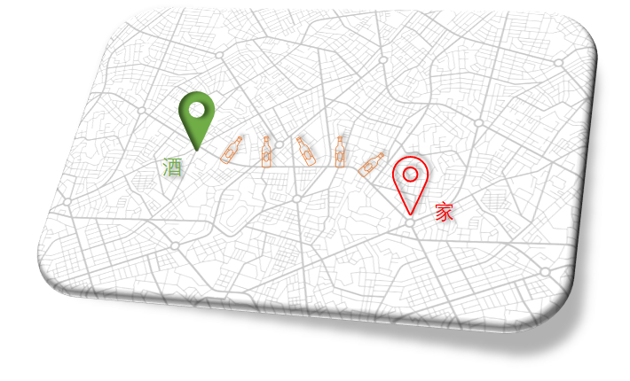
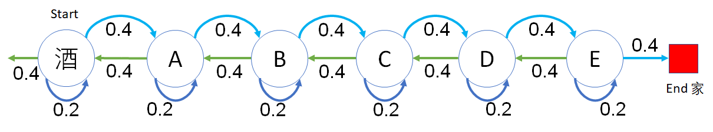

## 4.1 醉汉回家问题

### 4.1.1 提出问题

有一个喜欢喝酒的大叔，下班后经常去酒馆喝酒，家也离酒馆比较近，就在一条街上，走 50 步就能到家。

<center>


图 4.1.1 醉汉回家问题
</center>

但是由于每次都喝醉了酒，酒家不分。在回家的路上步履蹒跚，像是一个东倒西歪的酒瓶子，每个时刻他可能向前走的概率是 0.4，向后走的概率是 0.4，在原地不动发呆的概率是 0.2。

请问，他从酒馆出发能走到家的概率是多少？

### 4.1.2 建立模型

在第 3 章中，我们已经学习了状态转移矩阵的知识，在此，我们试图给醉汉回家的过程用状态及转移概率绘制出来。

<center>


图 4.1.2 醉汉回家问题示意图
</center>

问题描述：

图 4.1.2 是个示意图，并没有画出 50 步来，只画了 6 步。
- 起点为圆形（酒），代表酒馆；
- 终点为红色方框，代表家；
- 中间有 ABCDE 五个节点；
- 每个节点都有向前、向后、原地不动三种选择，概率用数字表示；
- 从酒馆开始允许向相反方向走；
- 到家后就不会再出来。

图 4.1.2 的模型如何使用呢？我们以后再讲，本章的目的是让读者学会使用这种模型来分析问题。

### 4.1.3 代码模拟

从表面上看，醉汉会向前一步又向后一步，然后原地愣一下......，这样的话，他从酒馆出发，永远也回不到家，因为“平均值”就在酒馆附近。

不善于理论推导的话，可以发挥计算机的优势，写一段代码来模拟这个醉汉：

【代码位置：RandomWalker_1_Reverse.py】

```Python
# 从酒馆出发,允许向家的相反方向走
def RandomWalker(distance=50):
    position = 0    # 距离酒馆的位置，为50时表示到家
    counter = 0     # 行走的步数（包括原地不动）
    trajectory = [] # 行走的路径
    while(position < distance): # 判断是否到家
        # 随机选择向前(1)向后(-1)不动(0), 概率是[0.4,0.2,0.4]
        step = np.random.choice([-1,0,1], p=[0.4,0.2,0.4])
        position += step    # 更新位置
        counter += 1        # 更新步数
        trajectory.append(position) # 记录位置

    # 输出最后位置和步数，计算位置平均值
    print(str.format("步数 : {0}\t最远 : {1}\t平均步数 : {2}", counter, np.min(trajectory), np.mean(trajectory)))
 
if __name__ == "__main__":
    for i in range(10):     # 试验10次
        RandomWalker(50)
```

运行上述代码，可以得到 10 次试验结果如下：

```
步数 : 1404     最远 : -11      平均步数 : 13.004985754985755
步数 : 5854     最远 : -40      平均步数 : -4.8963102152374445
步数 : 8312     最远 : -84      平均步数 : -15.017204042348412
步数 : 7645     最远 : -70      平均步数 : -7.099542184434271
步数 : 5420     最远 : -36      平均步数 : 8.072878228782288
步数 : 1419     最远 : -4       平均步数 : 15.985200845665961
步数 : 22170    最远 : -114     平均步数 : -41.33098782138024
步数 : 1699     最远 : -13      平均步数 : 9.114184814596822
步数 : 128704   最远 : -276     平均步数 : -90.89893088015913
步数 : 1034     最远 : -1       平均步数 : 25.192456479690524
```

数据解读：

- 第一次试验结果，走了 1404 步，最远走到了反向 11 步的地方，历史路径的平均位置是 13。
- 第二次试验结果，走了 5854 步，最远走到了反向 40 步的地方，历史路径的平均位置是 -4.89。
......

这个结果说明了醉汉是一定可以到家的，但是步数和平均位置的方差很大。

读者在运行这个程序时，可能会得到不同的试验数据，这是正常的，因为随机过程不同。

