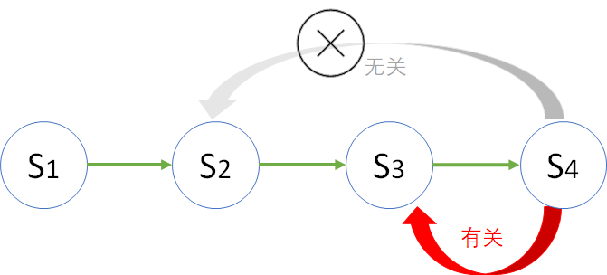

## 4.2 马尔可夫性质（Markov property）

通常中文比英文更能表现出哲理来，但是在这里，我们先记住一句很有哲理的英文：

*The future is independent of the past given the present.*

**将来**只取决于**现在**，与**过去**无关。

当一个随机过程在给定当前状态及所有过去状态情况下，其未来状态的条件概率分布仅依赖于当前状态；换句话说，在给定现在状态时，它与过去状态（即该过程的历史路径）是条件独立的，那么此随机过程即具有**马尔可夫性质**。

图 4.2.1 马尔可夫性质

马尔可夫性质是概率论中的一个概念，因为俄国数学家安德雷·马尔可夫（Andrey Markov, 1856-1922）得名。在大学期间，马尔可夫表现优异，师从了前面提到的俄国数学的重要奠基人契比雪夫，可以说是契比雪夫和他的弟子们的成就让俄国在数学世界中占有了一席之地。马尔可夫的主要工作集中在数论和概率论的研究方面，尤其是概率论方面，圣彼得堡学派对概率论这门学科贡献很大，马尔可夫在概率论领域成果颇多，从一开始对大数定理和中心极限定理的研究，逐渐发展到对随机变量的研究，终于提出了大名鼎鼎的马尔可夫链概率（在稍后讲解）模型。

用公式表示为：

$$
\mathbb P[S_{t+1}|S_t]=\mathbb P[S_{t+1}|S_1,S_2,...,S_t] \tag{4.2.1}
$$

翻译成普通话：给定当前状态 $S_t$ 时，下个状态 $S_{t+1}$ 的发生概率，等于给定以前所有状态下 $S_{t+1}$ 的发生概率。这实际上就是忽略了 $S_1, S_2, S_{t-1}$ 的存在。

在图 4.1.2 中，假设醉汉到了 C 单元，但是它究竟是如何到了 C 单元的，我们并不关心，我们只知道他的下一个状态是 B,C,D 之一。

在前面的租车还车问题的例子中，一辆车出现在 B 门店，我们只关心那么它的下一个出现点在哪里，而不管它从哪个门店转移过来的。

从本节开始，我们把 A,B,C,D 这些门店、单元等等统称为状态，状态之间的过渡成为状态转移。状态转移的概率定义为：

$$
P_{ss'}=\mathbb P[S_{t+1}=s'|S_t=s] \tag{4.2.2}
$$

可以理解为当 $t$ 时刻的状态 $S_t$ 为 $s$ 时（$s$ 可以是上述具体问题中的 A,B,C,D 等），转移到下一个时刻 $t+1$ 时的状态 $S_{t+1}$ 是 $s'$ 的概率（$s'$ 同样可以是上述具体问题中的 A,B,C,D 等）。

举一个具体的例子，在醉汉回家问题中，如果 $s=C, s'=D$，则：

$$
P_{ss'}=P_{CD} =\mathbb P[S_{t+1}=D|S_t=C]=0.4
$$

同理有：

$$
P_{CC} =\mathbb P[S_{t+1}=C|S_t=C]=0.2
\\
\\
P_{CB} =\mathbb P[S_{t+1}=B|S_t=C]=0.4
$$

另外，在前面的租车还车问题中，我们已经学习过了转移概率矩阵，这同样可以应用到马尔可夫性质中的状态转移，所以改名为状态转移矩阵（State Transition Matrix），公式形式相同，如式（4.2.3）。

$$
\qquad \qquad \quad [to]
\\
P = [from]
\begin{pmatrix}
P_{11} & \cdots & P_{1n}
\\
\vdots & \ddots & \vdots
\\
P_{n1} & \cdots & P_{nn}
\end{pmatrix}
\tag{4.2.3}
$$

其中：$\sum_{j=1}^n P_{ij}=1, \ i=1,...,n$，即一行中所有的值相加为 1。

马尔可夫性质对于数学后续的发展起到了基石的作用，后续很多数学家在此基础上发展出了更多的扩散模型和随机过程模型。
