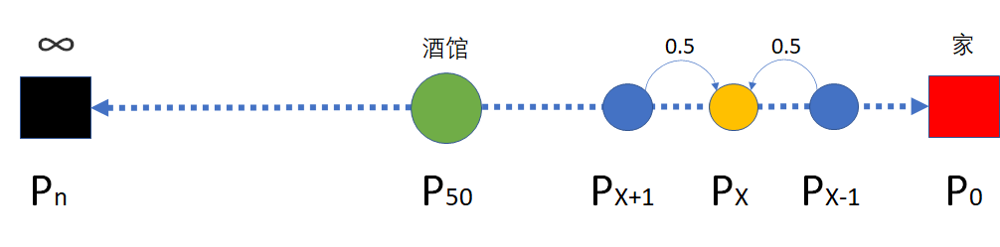
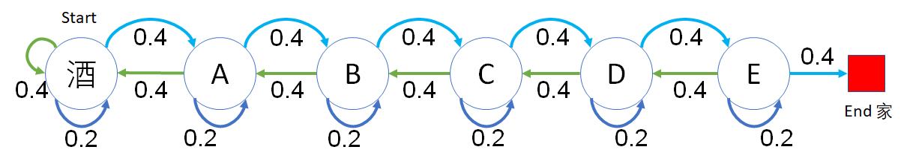

## 4.4 理论分析与试验

### 4.4.1 醉汉回家问题的理论解释

在 4.1.3 节中，通过代码模拟证明了醉汉确实可以回到家，而且概率为 100%。下面我们来一起看看醉汉为什么可以回家。

如图 4.4.1 所示：

- 为了简化问题，我们假设在任意位置都是左右随机游走，各有 0.5 的概率；
- 单边的随机游走没有确定解，所以，不妨在左侧增加一个无穷远状态（黑色）方框，表示醉汉陷入了无尽黑夜之中无法回家，所以回家的概率是 $P_n = 0$；
- 酒馆是绿色圆，距离最右侧的家有 50 步远，从这里可以到家的概率是 $P_{50}$，具体值待求；
- 处于红色方框的位置已经到家了，处于吸收状态（不再移动），所以到家的概率 $P_0=1$；
- 中间有示意性的 3 个位置（可以是任意三个相连的状态），$X+1,X,X-1$，从这三个位置到家的概率分别是 $P_{X+1},P_{X},P_{X-1}$。

<center>


图 4.4.1 醉汉回家问题的理论解释
</center>

由于从 X-1 到 X 位置有 0.5 的概率，从 X+1 到 X 位置也有 0.5 的概率，所以 
$$
P_X = 0.5P_{X+1}+0.5P_{X-1} \tag{4.4.1}
$$

对式（4.4.1）做变形：

$$
P_{X+1} = 2P_{X}-P_{X-1} \tag{4.4.2}
$$

由于 $P_0 = 1$，表示醉汉已经到家了，所以有：

$$
\begin{aligned}
P_{2} &= 2P_{1}-P_{0}=2P_1-1
\\
P_{3} &= 2P_{2}-P_{1}=3P_1-2
\\
P_{4} &= 2P_{3}-P_{2}=4P_1-3
\\
\cdots
\\
P_{n} &= 2P_{n-1}-P_{n-2} = nP_{1}-n+1
\end{aligned}
\tag{4.4.3}
$$

当 $n \to \infty$ 时，由于 $P_n=0$，即 $nP_1-n+1=0$，所以有：

$$
\begin{aligned}
P_1 &= \frac{n-1}{n}
\\
P_2 &= 2P_1-1=\frac{n-2}{n}
\\
\cdots
\\
P_{50} &= \frac{n-50}{n} 
\end{aligned}
\tag{4.4.4}
$$

这里的 $n$ 的含义是什么呢？实际上是表示我们允许醉汉反向走出多远。可以假设距离酒馆反向 100 步就会走到一个野兽出没的地方，醉汉会被吃掉（再也不能回家，$P_n=0$），那么 $n = 100 + 50=150$，则在酒馆时（$X=50$的位置）回家的概率 $P_{50}=\frac{150-50}{150}=\frac{2}{3} \gt 0$，但是不肯定能回家。

从式（4.4.4）可以看出，$n$ 越大，醉汉回家的概率越大，$n \to \infty$ 时，醉汉回家的概率接近于 1，即，当不限制醉汉可以反向走多远时，他总是能回到家，这是我们的问题的原意。


随机（相当于醉汉）游走问题是数学史上的一个著名问题，1905年，英国统计学家 Pearson 在《自然》杂志上公开求解随机游走（Random Walk）问题。1921年，匈牙利数学家波利亚（Polya，1887-1985）在研究随机游走问题后，提出了著名的随机游走定理，证明一维或二维随机游走返回原点的概率为 100%，从而得出了醉汉最终会返回原点的结论。Polya 随机游走定理被《The Math Book》誉为数学史上 250 个里程碑式的重大发现之一，Polya 本人也被人们视为20世纪最具影响力的数学家之一。日本著名数学家角谷静夫通俗形象地将 Polya 随机游走定理表述为：喝醉的醉汉总能找到回家的路。因此，随机游走定理也被称为醉汉回家定理。

随机游走是概率论与随机过程学科中用于描述随机现象的一种基本随机过程。液体中悬浮微粒的布朗运动、空气中的烟雾扩散、光纤陀螺的随机游走误差等动态随机现象均可用随机游走模型进行描述。

波利亚令人吃惊地证明了三维及以上的情况下，醉汉回家的概率大大小于1！比如说，在三维网格中随机游走，最终能回到出发点的概率只有 34%。具体数据如表 4.4.1 所示。

表 4.4.1 空间维度与返回原点概率的关系

|空间维度|返回原点概率|
|:-:|-:|
|1|100%|
|2|100%|
|3|34.05%|
|4|19.32%|
|5|13.52%|
|6|10.47%|
|7|8.58%|
|8|7.29%|

醉汉不可能在空中游走，鸟儿的活动空间才是三维的，因此，日本数学家角谷静夫（Shizuo Kakutani，1911–2004）将波利亚定理用一句通俗又十分风趣的语言来总结：喝醉的醉汉总能找到回家的路，喝醉的小鸟则可能永远也回不了家。

### 4.4.2 更多试验

#### 只允许向家的方向走

【代码位置：RandomWalker_2_Forward.py】

当醉汉向相反方向走时，我们强制他留在原地不动，即有 $0.4+0.2=0.6$ 的概率留在酒馆。如图 4.4.2 所示。

<center>


图 4.4.2 从酒馆出发有 0.6 的概率留在酒馆
</center>

注意图 4.4.2 的最左端，从酒馆出发，如果反向走，还会回到酒馆，这与图 4.1.2 不同。

这种限制下，情况要好很多，因为不能反向走，所以醉汉更容易回到家。10 次试验的运行结果如下：

```
步数 : 1232     平均步数 : 23.3125
步数 : 4199     平均步数 : 16.6799237913789
步数 : 2229     平均步数 : 24.635711081202334
步数 : 954      平均步数 : 23.31970649895178
步数 : 3284     平均步数 : 14.660170523751523
步数 : 1680     平均步数 : 16.552380952380954
步数 : 4645     平均步数 : 16.27491926803014
步数 : 1308     平均步数 : 16.874617737003057
步数 : 414      平均步数 : 26.08937198067633
步数 : 2824     平均步数 : 10.885977337110482
```

步数和平均步数比第一个试验要少很多。

#### 可以反向走，但是有失败的限制

为了理解上一小节的理论推导，可以把图 4.4.1 中的 $n$ 设置为 250（包含正向回家的 50 步），即，反向到达 200 步的地方，就认为是回家失败（醉汉被野兽吃掉了）。

【代码位置：RandomWalker_3_Limitation.py】

```
步数 : 9653     位置 : 50       平均步数 : -2.3523257018543458
步数 : 24152    位置 : 50       平均步数 : -29.24494865849619
步数 : 12230    位置 : -200     平均步数 : -83.99648405560099
步数 : 56444    位置 : -200     平均步数 : -83.09604209481964
步数 : 1740     位置 : 50       平均步数 : 12.133333333333333
步数 : 23286    位置 : 50       平均步数 : -60.63591857768616
步数 : 15289    位置 : -200     平均步数 : -74.86349663156518
步数 : 24192    位置 : 50       平均步数 : -9.22829861111111
步数 : 5952     位置 : 50       平均步数 : -18.80342741935484
步数 : 2043     位置 : 50       平均步数 : 12.900636319138522
```
运行 10 次试验后，可以看到其中有 3 次都失败了，即位置达到了 -200 的地方。


### 思考与练习

1. 如果醉汉向前后向后的概率都是 0.5，这个问题的试验结果有变化吗？
2. 如果醉汉向前（回家方向）的概率是 0.6，反向回酒馆的概率是 0.4，这个问题的试验结果会有变化吗？
3. 关于马尔可夫平稳状态，在很多文献中有公式 $\pi_j=\sum_{i=1}^N \pi_i P_{ij}$，请根据方程组 9 解释其具体含义。
